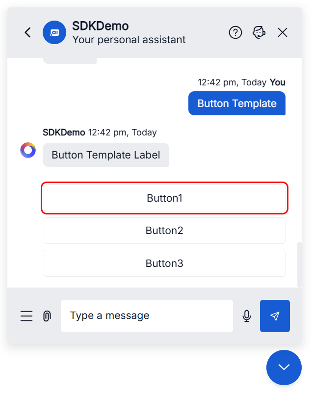
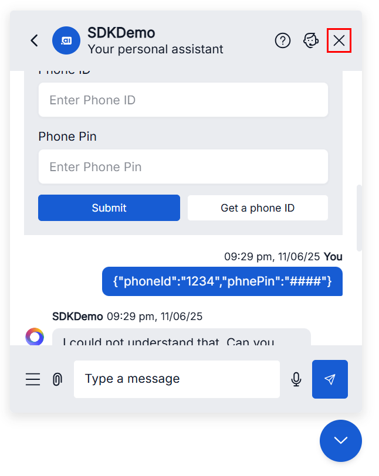
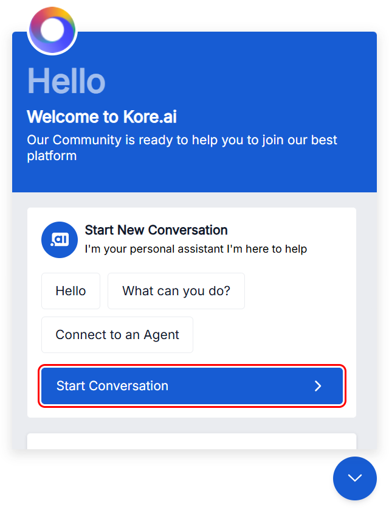
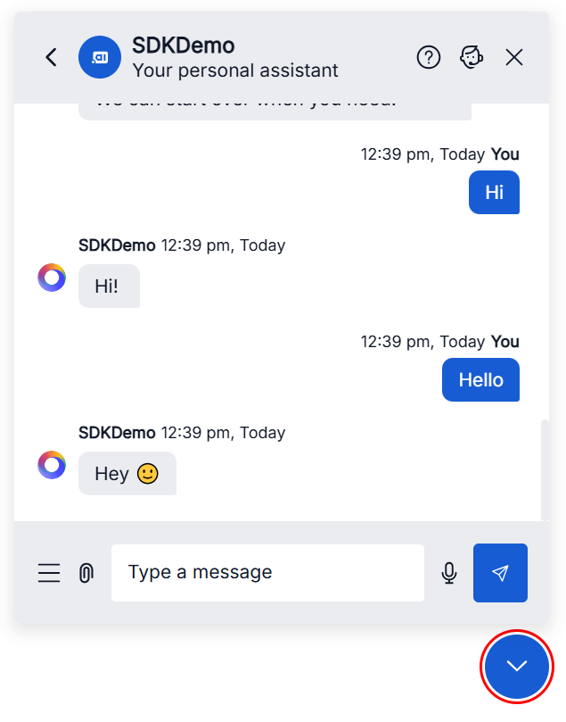
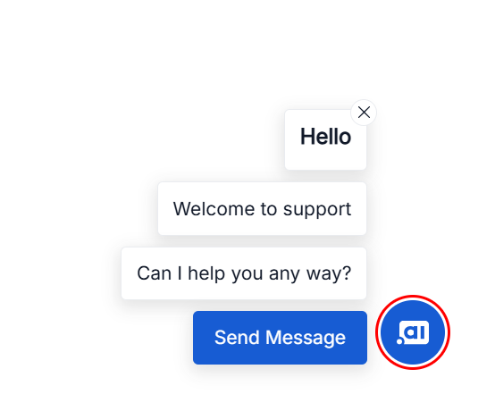
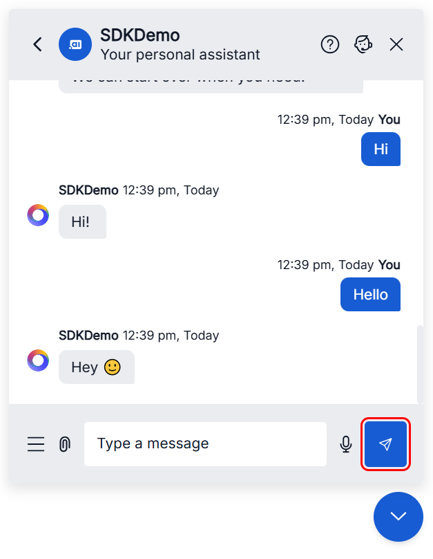

# Web SDK Accessibility

## Overview

The Web SDK is a toolkit for launching chat widgets on websites or within other applications. This is an end-user facing application where the users interact with the virtual assistants. The SDK includes a reference implementation of the web chat widget, designed to meet AA standards of ADA compliance. Please find more details about [Web SDK](how-web-sdk-works.md). 

### WCAG 2.2 Level AA Compliance Status

The Platform ensures that the Web SDK complies with the Web Content Accessibility Guidelines (WCAG) 2.2 Level AA.

For more details, refer to the official [WCAG 2.2 documentation](https://www.w3.org/TR/WCAG22/). You can also review our [Voluntary Product Accessibility Template (VPAT)](./images/koreai-accessibility-conformance-report.pdf) for compliance information.

<table>
  <tr>
   <td><strong>Name</strong>
   </td>
   <td><strong>Compliance Level</strong>
   </td>
  </tr>
  <tr>
   <td>Kore Web SDK
   </td>
   <td>Full compliance
   </td>
  </tr>
</table>

### Accessibility Support by Component

| Component      | Support | Preview                          |
|----------------|---------|----------------------------------|
| Chat Icon      | Yes     |   |
| Chat Window    | Yes     | |
| Welcome Screen | Yes     | |
| Header         | Yes     |      |
| Footer         | Yes     |      |
| Templates      | Yes     |   |

### Screen Reader Support

The Kore.ai Web SDK is designed to be fully compatible with screen readers.

### Theme Creation and Accessibility

The Web SDK provides default light and dark themes that are fully WCAG 2.2 Level AA compliant with color contrast ratios of 4.5:1 or higher. For organizations requiring custom branding or specific accessibility needs, new themes can be created following the [Virtual Assistant Theme & Design guidelines](../channels/add-web-mobile-client.md).

When creating custom themes, ensure that:

* All color combinations maintain the required contrast ratios
* Interactive elements remain clearly distinguishable
* Focus indicators are visible and meet contrast requirements
* Custom themes are tested with assistive technologies before deployment

## Customization and Accessibility

The Web SDK offers extensive customization options. While a base level of accessibility is provided, it's crucial to ensure that any customizations made also adhere to WCAG 2.2 Level AA standards. You can customize the SDK to suit your specific accessibility requirements best.

For detailed information on how to customize the SDK, please refer to our [Customization Documentation](https://github.com/Koredotcom/web-kore-sdk/blob/v3/dev/docs/customizations).

## Guidelines for Maintaining Compliance

To ensure ongoing WCAG 2.2 Level AA compliance with the SDK, developers should adhere to the following best practices when customizing or extending the SDK:

* Semantic HTML: Utilize appropriate HTML5 elements to define the structure and meaning of content within custom templates and components.
* ARIA Attributes: Implement ARIA (Accessible Rich Internet Applications) attributes where necessary to enhance the accessibility of dynamic content and custom controls. Refer to the [WAI-ARIA Authoring Practices](https://www.w3.org/WAI/ARIA/apg/) for guidance.
* Keyboard Navigation: Ensure all interactive elements are focusable and operable via keyboard. Maintain a logical focus order.
* Color Contrast: Verify that text and UI elements meet the minimum color contrast ratios specified by WCAG 2.2 AA (4.5:1 for normal text, 3:1 for large text and graphical objects). All default themes provided by the Web SDK maintain a color contrast ratio of 4.5:1 or higher, ensuring compliance with WCAG 2.2 Level AA standards out of the box.
* Text Alternatives: Provide appropriate alternative text for all non-text content (for example, icons, images).
* Responsive Design: Ensure that the chat widget and its contents are responsive and accessible across various screen sizes and orientations.
* Testing: Regularly test customizations with accessibility evaluation tools and assistive technologies (for example, screen readers like NVDA, JAWS, or VoiceOver).

Organizations can completely customize the SDK to make any necessary changes to meet their accessibility needs. It's the responsibility of the organization to ensure their customizations remain compliant with WCAG 2.2 Level AA standards.

## Support and Feedback

If you experience any accessibility issues with the Web SDK or would like to share feedback, contact us using one of the following options:

- Email: support@kore.com  
- Support portal: https://support.kore.ai
