The Integrations page connects your Platform account to 120+ third-party services. Once connected, integrations are available from the Tool Flow canvas to build AI applications. See the [Integration node](../../ai-agents/tools/tool-flows/types-of-nodes/integration-node.md) for usage details.

| Section                                               | Description                                                                                 |
|-------------------------------------------------------|---------------------------------------------------------------------------------------------|
| [Authentication Types](#auth-types)                   | Overview of supported auth types (API, OAuth2, Bearer, Basic Auth, and others).             |
| [Access Integrations](#access-integrations)           | How to navigate to the Integrations page and use its features.                              |
| [Supported Integrations](#supported-integrations)     | Full list of available third-party integrations with their actions and auth types.          |
| [Add a Connection](#add-a-connection)                 | Steps to configure a new connection, including auth-type-specific setup and error handling. |
| [Manage Connections](#manage-connections)             | How to view, edit, delete, test, and enable or disable existing connections.                |
| [AI-Specific Integrations](#ai-specific-integrations) | Dedicated setup flows for Hugging Face, AWS S3 Bucket, and Weights & Biases.                |

## Auth Types

Each integration uses one of the following authentication types:

| Method         | Description                                                                                                                                                                |
|----------------|----------------------------------------------------------------------------------------------------------------------------------------------------------------------------|
| **API**        | Authenticates via a token in request headers or query parameters. Used for API Key or Access Token integrations.                                                           |
| **OAuth2**     | Industry-standard authorization framework. Uses temporary **access tokens**, permission **scopes**, token expiry, and **refresh tokens** to renew access without re-login. |
| **Bearer**     | Passes a bearer token in the request header, typically within an OAuth2 workflow, to access protected resources.                                                           |
| **Basic Auth** | Authenticates using a username and password sent with each request. Supported for ServiceNow, Freshdesk, Snowflake, Amplitude, and Mixpanel.                               |

<Note>Additional authentication methods for certain integrations include **Basic**, **Basic with JWT**, **OAuth1**, and custom authentication defined by the service provider. Some providers support multiple authentication methods.</Note>

---

## Access Integrations

Got to **Autonomous Agents** > **Settings** > **Integrations**.

The features on the Integration page: 

| Feature                  | Description                                                                                                                                                              |
|--------------------------|--------------------------------------------------------------------------------------------------------------------------------------------------------------------------|
| **All Integrations tab** | Lists all available integrations grouped by category. Once you connect an integration, it moves to the **Connected** tab. Deleting a connection returns it to this list. |
| **Connected tab**        | Shows all configured connections for your account.                                                                                                                       |
| **Search**               | Find integrations by full or partial name.                                                                                                                               |
| **Category filter**      | Filter by category (AI and Machine Learning, Marketing and Social Media, E-commerce, etc.). Select one or more and click **Apply**.                                      |
| **Authorization filter** | Filter by authentication type (API, OAuth2, Bearer, Basic Auth). Select one or more and click **Apply**.                                                                 |
| **List view**            | Displays integrations in a table with **Connection Name**, **Description**, and **Type** columns.                                                                        |
| **Tile view**            | Default view. Displays integrations as individual cards.                                                                                                                 |

## Supported Integrations

The following third-party integrations are available on the Platform:

<Accordion title="List of Supported Integrations">

| Integration       | Description                                                                                                                    | Actions | Authorization          |
|-------------------|--------------------------------------------------------------------------------------------------------------------------------|---------|------------------------|
| Acculynx          | AccuLynx API for seamless data exchange between AccuLynx and other applications.                                               | 8       | API                    |
| Active_campaign   | APIs for marketing automation, CRM, and email marketing.                                                                       | 7       | API                    |
| Affinity          | CRM focused on relationship intelligence; supports data sync, workflow automation, and relationship insights across platforms. | 20      | API                    |
| Agencyzoom        | P&C insurance platform for increasing sales, retention, and agency performance analysis.                                       | 99      | API, Basic with JWT    |
| Ahrefs            | SEO and marketing platform for site audits, keyword research, content analysis, and competitive insights.                      | 40      | API                    |
| Airtable          | Low-code platform for building apps, managing critical data, and reimagining workflows with AI.                                | 17      | OAuth2, Bearer, API    |
| Amplitude         | Digital analytics software for product analytics.                                                                              | 16      | Basic                  |
| Apaleo            | API-first property management platform for hotels and apartment groups.                                                        | 29      | OAuth2                 |
| Apollo            | CRM tool for managing contacts, leads, and opportunities.                                                                      | 17      | API                    |
| Asana             | Tool for teams to organize, track, and manage work.                                                                            | 15      | OAuth2                 |
| Attio             | Fully customizable workspace for team relationships and workflows.                                                             | 56      | OAuth2                 |
| AWS S3 Bucket     | Connect to your AWS S3 bucket.                                                                                                 | 1       | API                    |
| Bamboohr          | HR software as a service.                                                                                                      | 159     | API                    |
| Bill              | Integration with Bill.com API.                                                                                                 | 221     | Billcom Auth           |
| Bitbucket         | Git-based code hosting and collaboration platform with pull requests and integrations.                                         | 15      | OAuth2                 |
| Blackboard        | Insights on Blackboard Learn usage with in-app messages, digital guides, and tooltips.                                         | 314     | OAuth2                 |
| Bolna             | Conversational voice agents to enhance interactions, streamline operations, and automate support.                              | 15      | API                    |
| Borneo            | Data security and privacy platform for sensitive data discovery and remediation.                                               | 154     | API, OAuth2            |
| Box               | Cloud content management and file sharing for businesses.                                                                      | 273     | OAuth2                 |
| Brevo             | Email marketing, SMS campaigns, and marketing automation (formerly Sendinblue).                                                | 221     | API                    |
| Browserbase_tool  | Browsing app that fetches a URL, reads its contents, and returns them.                                                         | 1       | API                    |
| Bugbug            | Browser-based app for quick and reliable test automation.                                                                      | 4       | API                    |
| Cal               | Shareable booking pages, calendar syncing, and availability management.                                                        | 142     | API, Calcom Auth       |
| Calendly          | Appointment scheduling tool that automates invitations, availability checks, and reminders.                                    | 41      | OAuth2                 |
| Canva             | Programmatic access to Canvas LMS features including courses, users, enrollments, and grades.                                  | 32      | OAuth2                 |
| Canvas            | Web-based LMS for managing course materials and communicating learning achievements.                                           | 79      | OAuth2, API            |
| Clickup           | Unified platform for tasks, docs, goals, and chat with customizable workflows.                                                 | 126     | OAuth2, API            |
| codeinterpreter   | Python-based coding environment with integrated data analysis, script execution, and visualization.                            | 4       | API                    |
| Coinbase          | APIs for cryptocurrency trading and management.                                                                                | 6       | API                    |
| Composio          | Enables AI agents and LLMs to authenticate and integrate with various tools via function calling.                              | 12      | API                    |
| Composio_search   | All-in-one tool for searching and scraping the web.                                                                            | 12      | API                    |
| Confluence        | Tool for team collaboration and knowledge management.                                                                          | 190     | OAuth2                 |
| Contentful        | Content platform APIs for managing and delivering content to apps and websites.                                                | 3       | OAuth2, API            |
| Crustdata         | AI-powered platform providing real-time company and people data for B2B sales, AI SDRs, and investors.                         | 14      | API                    |
| Coda              | Collaborative workspace platform for team productivity and project management.                                                 | 97      | API                    |
| Dialpad           | Cloud-based communication platform for voice calls, video meetings, messaging, and collaboration.                              | 192     | OAuth2, API            |
| Discord           | Instant messaging and VoIP social platform.                                                                                    | 169     | OAuth2, Bearer         |
| Discordbot        | Automated Discord programs for moderation, music playback, and user engagement.                                                | 169     | OAuth2, Bearer         |
| Docusign          | eSignature and digital agreement solutions for sending, signing, tracking, and managing documents.                             | 342     | OAuth2                 |
| Dropbox           | File hosting service with cloud storage, file synchronization, and client software.                                            | 9       | OAuth2                 |
| Dynamics365       | Microsoft platform combining CRM, ERP, and productivity apps for sales, marketing, and operations.                             | 16      | OAuth2                 |
| Elevenlabs        | AI voice generation platform supporting any language for video creators, developers, and businesses.                           | 59      | API                    |
| Entelligence      | AI-powered insights, recommendations, and predictive analytics for data-driven decisions.                                      | 2       | API                    |
| Exa               | Search service offering Search, Similarlink, and Answer actions for querying and generating results.                           | 4       | API                    |
| Excel             | Connect to Excel to create and manage spreadsheets.                                                                            | 25      | OAuth2                 |
| Figma             | Collaborative interface design tool.                                                                                           | 44      | OAuth2, API            |
| Firecrawl         | Automates web crawling and data extraction for content gathering, site indexing, and insights.                                 | 7       | API                    |
| Fireflies         | Transcribes, summarizes, searches, and analyzes voice conversations.                                                           | 10      | API                    |
| Flutterwave       | APIs for making and receiving payments in various currencies and countries.                                                    | 2       | API                    |
| Foursquare        | Place search and recommendations from the Foursquare Places database.                                                          | 5       | API                    |
| Freshdesk         | Customer support platform with smart automation for help desk operations.                                                      | 7       | Basic                  |
| Gmail             | Connect to Gmail to send and manage emails.                                                                                    | 21      | OAuth2, Bearer         |
| Gong              | Platform for video meetings, call recording, and team collaboration.                                                           | 54      | API                    |
| Google_maps       | Web mapping platform with satellite imagery, street maps, real-time traffic, and route planning.                               | 4       | OAuth2, API            |
| Googleads         | Connect to Google Ads to manage and create campaigns.                                                                          | 4       | OAuth2                 |
| Googlebigquery    | Connect to BigQuery to query BigData.                                                                                          | 1       | Google Service Account |
| Googlecalendar    | Time-management and scheduling calendar service by Google.                                                                     | 12      | OAuth2, Bearer         |
| Googledocs        | Connect to Google Docs for document-related actions.                                                                           | 5       | OAuth2, Bearer         |
| Googledrive       | Connect to your Google Drive account.                                                                                          | 10      | OAuth2, Bearer         |
| Googlemeet        | Video conferencing tool by Google.                                                                                             | 5       | OAuth2                 |
| Googlephotos      | Photo and video storage service integrated with Google Drive.                                                                  | 12      | OAuth2                 |
| Googlesheets      | Web-based spreadsheet program integrated with Google Drive.                                                                    | 9       | OAuth2                 |
| Googlesuper       | Unified Google platform combining Drive, Calendar, Gmail, Sheets, Analytics, Ads, and more.                                    | 93      | API, OAuth2, Bearer    |
| Googletasks       | Simple to-do list and task management integrated with Gmail and Google Calendar.                                               | 11      | OAuth2                 |
| Gorgias           | Integration for Gorgias with a focus on e-commerce enhancements.                                                               | 32      | OAuth2                 |
| Github            | Code hosting platform for version control, collaboration, repository management, and CI/CD.                                    | 908     | OAuth2                 |
| Hackernews        | Cybersecurity news platform for real-time updates, threat intelligence, and breach reports.                                    | 6       | API                    |
| Heygen            | AI-powered video platform for streamlining video creation.                                                                     | 35      | API                    |
| Hubspot           | Inbound marketing, sales, and customer service platform integrating CRM, email automation, and analytics.                      | 229     | OAuth2, Bearer         |
| Hugging Face      | Connect to your Hugging Face setup for open-source model access.                                                               | 1       | API                    |
| Intercom          | Messaging platform for communicating with customers via app, website, social media, or email.                                  | 43      | OAuth2                 |
| Jira              | Jira API tool for project and issue management.                                                                                | 544     | OAuth2, API            |
| Jungle Scout      | Amazon seller tool for product research, sales estimates, and competitive insights.                                            | 6       | API                    |
| Klaviyo           | Data-driven email and SMS marketing platform for targeted messages and conversion tracking.                                    | 231     | API, OAuth2            |
| Kommo             | CRM integration (formerly amoCRM) for managing customer relationships, sales pipelines, and processes.                         | 15      | OAuth2                 |
| Linear            | Connect to Linear to create and manage issues, projects, teams, and more.                                                      | 15      | OAuth2, API            |
| Linkedin          | Connect to LinkedIn to send and manage emails.                                                                                 | 4       | OAuth2                 |
| Linkhut           | Platform for saving, organizing, and sharing links.                                                                            | 2       | OAuth2                 |
| Linkup            | Search the web for relevant results (RAG use case).                                                                            | 1       | API                    |
| Listennotes       | Podcast search engine.                                                                                                         | 26      | API                    |
| Lmnt              | API for text-to-speech and voice cloning.                                                                                      | 7       | API                    |
| Mailchimp         | Email marketing and automation platform for campaign templates, audience segmentation, and analytics.                          | 271     | OAuth2                 |
| Mem0              | AI-driven note-taking, knowledge recall, and productivity tools.                                                               | 43      | API                    |
| Metaads           | Meta Marketing API for managing ad campaigns, ad sets, ads, custom audiences, and analytics.                                   | 16      | OAuth2, API            |
| Microsoft_clarity | Free tool that captures real user behavior on your site.                                                                       | 1       | Bearer                 |
| Microsoft_teams   | Connect to Microsoft Teams to manage channels.                                                                                 | 13      | OAuth2                 |
| Mixpanel          | Analytics platform for measuring user engagement and retention.                                                                | 19      | Basic                  |
| Monday            | Cloud-based work operating system for building workflow apps and managing projects.                                            | 21      | OAuth2                 |
| Neon              | Serverless Postgres platform for building reliable and scalable applications.                                                  | 69      | API                    |
| Notion            | Unified workspace for notes, docs, wikis, and tasks with custom collaboration workflows.                                       | 23      | OAuth2, API            |
| One_drive         | Microsoft cloud storage for storing, syncing, and sharing files across devices.                                                | 7       | OAuth2                 |
| Onepage           | API for enriching user and company data with token validation and generic search.                                              | 2       | API                    |
| Open_sea          | NFT marketplace for NFTs and crypto collectibles.                                                                              | 22      | API                    |
| Outlook           | Microsoft email and calendaring platform integrating contacts, tasks, and scheduling.                                          | 22      | OAuth2                 |
| Pagerduty         | Manage incidents, schedules, and alerts directly from your application.                                                        | 357     | OAuth2, API            |
| Perplexityai      | AI search service with natural language processing, configurable parameters, and domain filtering.                             | 1       | API                    |
| Peopledatalabs    | B2B data enrichment and identity resolution for enriched user profiles and customer validation.                                | 14      | API                    |
| Pipedrive         | Sales management tool with pipeline visualization, lead tracking, and automation.                                              | 275     | OAuth2, Bearer         |
| Placekey          | APIs for generating unique identifiers for physical places, enabling data matching and entity resolution.                      | 2       | API                    |
| Posthog           | Open-source product analytics platform for tracking user interactions and refining features.                                   | 358     | API                    |
| Quickbooks        | Cloud-based accounting software for managing finances, income, and expenses.                                                   | 13      | OAuth2                 |
| Ramp              | Finance platform for managing finances, tracking income and expenses, and gaining business insights.                           | 8       | OAuth2                 |
| Recallai          | Single API for meeting bots on Zoom, Google Meet, Microsoft Teams, and more.                                                   | 8       | API                    |
| Reddit            | Connect to Reddit to post and comment.                                                                                         | 9       | OAuth2                 |
| Resend            | Connect to Resend to send emails.                                                                                              | 18      | API                    |
| Retellai          | Captures calls and transcripts for conversation analysis, insights, and customer interaction enhancement.                      | 10      | API                    |
| Rocketlane        | Customer onboarding and project delivery with shared workspaces, milestones, and status tracking.                              | 6       | API                    |
| Salesforce        | Leading CRM platform for sales, service, marketing, and analytics.                                                             | 32      | OAuth2                 |
| Search AI         | Connect to your Search AI setup.                                                                                               | 1       | API                    |
| Semanticscholar   | AI-powered academic search engine for discovering and understanding scientific literature.                                     | 14      | API                    |
| Semrush           | SEO tool suite for keyword research, competitor analysis, and Google Ad optimization.                                          | 36      | API                    |
| Sendgrid          | Cloud-based email delivery platform for transactional and marketing email with analytics.                                      | 375     | API                    |
| Sentry            | Error tracking and monitoring management.                                                                                      | 178     | Bearer                 |
| Serpapi           | Real-time API for structured search engine results, scraping, and SERP analysis.                                               | 10      | API                    |
| Servicenow        | IT Service Management platform to boost productivity and maximize ROI.                                                         | 5       | Basic                  |
| Share_point       | Microsoft platform for document management, intranets, and secure team content storage.                                        | 6       | OAuth2                 |
| Shortcut          | Aligns product development work with company objectives for teams with a shared purpose.                                       | 122     | API                    |
| Shopify           | Global commerce platform for selling online and in person.                                                                     | 26      | API, OAuth2            |
| Slack             | Channel-based messaging platform with tool integrations and enterprise-grade security.                                         | 174     | OAuth2, Bearer         |
| slackbot          | Automates Slack responses and reminders for onboarding, FAQs, and notifications.                                               | 174     | OAuth2, Bearer         |
| Snowflake         | Connect to Snowflake to run queries.                                                                                           | 4       | Basic                  |
| Stripe            | Payment processor for accepting online payments.                                                                               | 19      | API                    |
| Supabase          | Open-source backend-as-a-service with Postgres database, authentication, storage, and real-time APIs.                          | 77      | OAuth2, API            |
| Tavily            | Advanced search with image inclusion, raw content, and domain filtering.                                                       | 1       | API                    |
| Textrazor         | Natural language processing tools for advanced text analysis via API.                                                          | 1       | API                    |
| Text_to_pdf       | Convert text to a PDF file.                                                                                                    | 1       | API                    |
| Tinyurl           | APIs for shortening URLs into branded links and tracking link analytics.                                                       | 1       | API                    |
| Todoist           | Productivity app for managing tasks and projects.                                                                              | 4       | OAuth2                 |
| Trello            | Web-based kanban-style list-making application.                                                                                | 323     | OAuth, Bearer          |
| Twitter           | Social media network (now X).                                                                                                  | 72      | OAuth2                 |
| Twitter_media     | Multimedia tools within Twitter for brands to leverage rich content in marketing campaigns.                                    | 1       | OAuth                  |
| Typefully         | AI-powered content creation management.                                                                                        | 5       | API                    |
| Weathermap        | Visual weather data, forecasts, and mappings for understanding climate patterns and severe weather.                            | 1       | API                    |
| Weight & Biases   | Connect to your Weights & Biases setup.                                                                                        | 1       | API                    |
| Whatsapp          | WhatsApp Business API integration for customer messaging and automation.                                                       | 5       | API                    |
| Workiom           | APIs for automating workflows, integrating tools, and building custom applications.                                            | 3       | API                    |
| Yousearch         | Search tool for finding relevant information with filtering or privacy-focused features.                                       | 1       | API                    |
| Youtube           | YouTube actions to interact with the app.                                                                                      | 11      | OAuth2                 |
| Zenrows           | Scrape and extract web data using the ZenRows API.                                                                             | 1       | API                    |
| Zendesk           | Customer service and sales platform for managing customer communication and support.                                           | 11      | OAuth2                 |
| Zoom              | Video conferencing platform with breakout rooms, screen sharing, and enterprise integrations.                                  | 172     | OAuth2                 |
| Zoominfo          | Multi-platform operating system for revenue teams to deliver business growth.                                                  | 14      | Basic with JWT         |
| Zoho              | Zoho CRM actions and interactions.                                                                                             | 6       | OAuth2                 |

</Accordion>

## Add a Connection

<Note>You can also add a connection directly from the **Integration node** on the Tool Flow canvas. [Learn more](../../../ai-agents/tools/tool-flows/types-of-nodes/integration-node/).</Note>

1. [Access](#access-integrations) **Integrations**.
2. Choose one of the following:
   - **New connection**: In the **All Integrations** tab, optionally filter by **Category** and **Authorization**, then click the integration.
   - **Existing connection**: Click the **Connected** tab and select the provider.
3. Click **Add Connection**.

4. In the configuration window, enter:
   - **Connection Name**: A unique name for this integration.
   - **Authorization Details**: Credentials based on the selected auth type. If a provider supports multiple auth types, select one—only one auth type is allowed per connection.

The **Pre-authorize the integration** option is selected by default, requiring authentication credentials to interact with the service. Based on your selected method, the relevant configuration fields appear automatically.

### OAuth2

- Select the configured **Auth Profile** from the **Custom** dropdown. [Learn more](../security-and-control/authorization-profile.md#add-authorization-profile) about adding an auth profile.
- Fields such as **Redirect URL**, **Scopes**, and **Base URL** auto-populate from the selected profile.
- Click **Authorize** to test the integration.
- No re-authentication is required unless the auth profile is deleted. Connecting with a deleted profile results in an error, and deleted profiles no longer appear in the **Custom** dropdown.

### Bearer Token

- Enter the bearer token and related fields such as **Base URL**, **API Key**, **Bot Token**, or other credentials as required by the provider.
- Retrieve values from the provider's Admin console > **Settings**.
- Click **Test** to validate. A success message confirms the connection.

### API

- Enter the **API Key** or **Access Token** for the provider. Additional fields may appear based on the provider's requirements.
- Retrieve values from the provider's Admin console > **Settings**.
- Click **Test** to validate. A success message confirms the connection.

### Basic Auth

- Enter the required credentials. For example, Amplitude requires an **API Key** and **API Secret**.
- Retrieve values from the provider's Admin console > **Settings**.
- Click **Test** to validate. A success message confirms the connection.

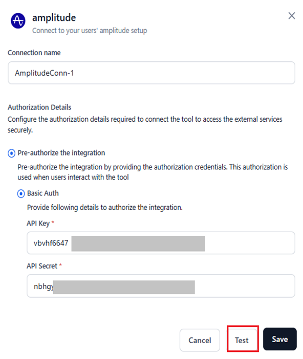

<Note>For OAuth1 and other authentication types, retrieve the required values from the provider's admin console to configure the integration.</Note>

5. Click **Save** after a successful test.

<Note>The **Save** button appears only after all required fields are filled in.</Note>

After saving, you are redirected to the connections list for that provider, where all configured connections are listed.

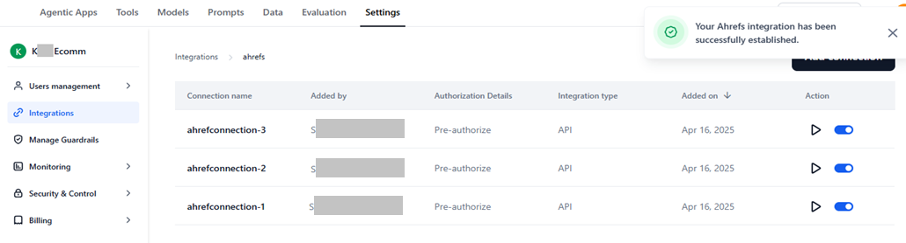

### Manage Connection Errors

Errors may occur during or after setup due to invalid credentials.

**View an error:**

1. Go to **Connected** and select the connection.
2. Click the **Play** icon to test.
3. Hover over the **warning** icon to see the error reason.

Alternatively, click **Edit**, open the configuration window, and click **Test** to view the error.

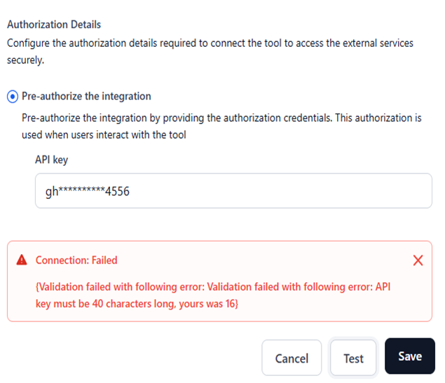

**Resolve an error:**

1. Click **Edit** and update the credentials in the configuration window.
2. Click **Test** to validate.
3. Click **Save**.

---

## Manage Connections

The **Connected** section lists all configured connections. You can view details and perform management actions from here.

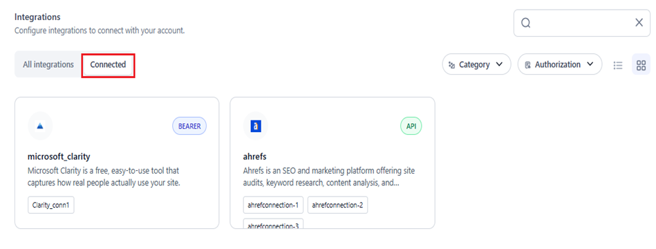

### View Connection Summary

Clicking a connection in **Connected** shows the following details:

| Field                     | Description                                               |
|---------------------------|-----------------------------------------------------------|
| **Connection Name**       | Unique name set during setup.                             |
| **Added By**              | Admin or account user who created the connection.         |
| **Authorization Details** | Displays *Pre-authorize*.                                 |
| **Integration Type**      | Auth method used (API, OAuth2, Bearer, Basic Auth, etc.). |
| **Added on**              | Date the connection was added.                            |
| **Action**                | Test the connection or toggle it on/off.                  |

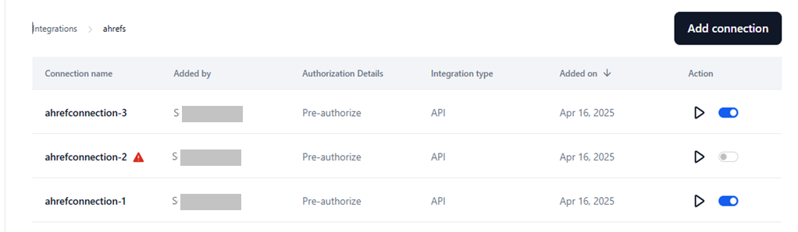

### Edit a Connection

<Note>You cannot modify the connection name.</Note>

1. Go to **Connected** > select the connection.
2. Click the **Ellipses** icon > **Edit**.

    

3. Update the required fields in **Authorization Details**.
4. (Optional) Click **Test** to validate.
5. Click **Save**.

    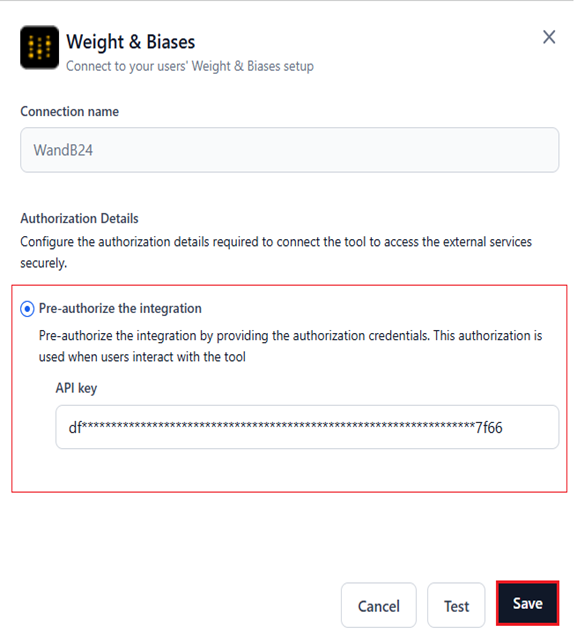

### Delete a Connection

1. Go to **Connected** > select the connection.
2. Click the **Ellipses** icon > **Delete**.

    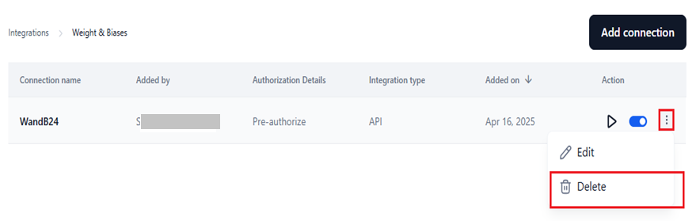

3. Click **Delete** to confirm.

<Warning>This action is irreversible and removes all associations of the connection from the Platform.</Warning>

### Test a Connection

1. Go to **Connected** > select the connection.
2. Click the **Play** icon.

    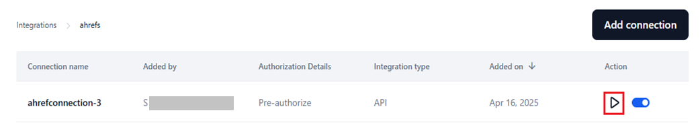

The connection is validated in the background. Errors appear with a **warning** icon. If successful, a confirmation message is displayed.

    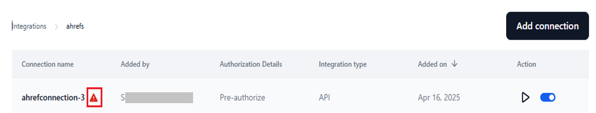

### Enable or Disable a Connection

Enabling a connection makes it available for user authentication and accessible in the **Integration node** on the Tool Flow canvas.

Use the toggle switch to enable (default) or disable the connection.

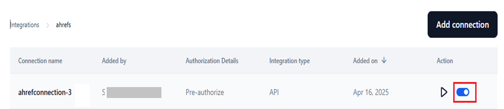

---

## AI-Specific Integrations

The following integrations have dedicated setup flows for AI model management tasks.

### Hugging Face

Integrating with Hugging Face lets you use public and private text generation models on the Platform. Private or exclusive models require a Hugging Face access token.

**To connect:**

1. Go to **Settings** > **Integrations** and select **Hugging Face**.

    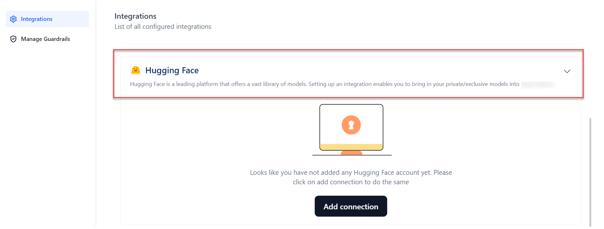

2. Click **Add Connection**.

    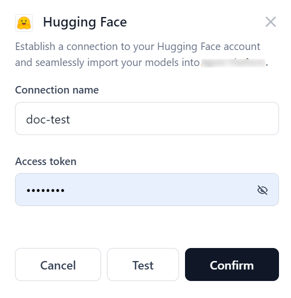

3. Provide Connection Name and Access Token (from your Hugging Face account).

4. (Optional) Click **Test** to validate.

    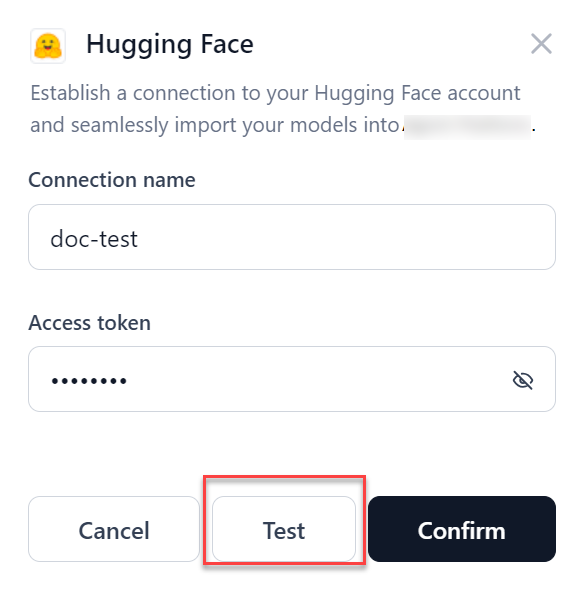

5. Click **Confirm** to create the connection. If the connection fails, verify the access token or cancel and retry.

To edit or delete a connection, hover over the connection name and click the three-dot icon.

<Note>
- After connecting, the connection name appears in the model selection dropdown when deploying an open-source model. See [Select and Deploy an Open-Source Model](../../models/open-source-models/select-and-deploy-an-open-source-model.md).
- If the connection used for a model deployment is deleted, the system prompts you to select a new connection on redeployment.
</Note>

### AWS S3 Bucket

The S3 integration lets you import files from your AWS S3 account and use them in the Tool Flow Builder to develop AI applications.

**To connect:**

1. Go to **Settings** > **Integrations** and select **AWS S3 Bucket**.

    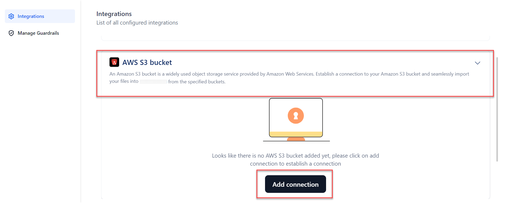

2. Click **Add Connection**.

    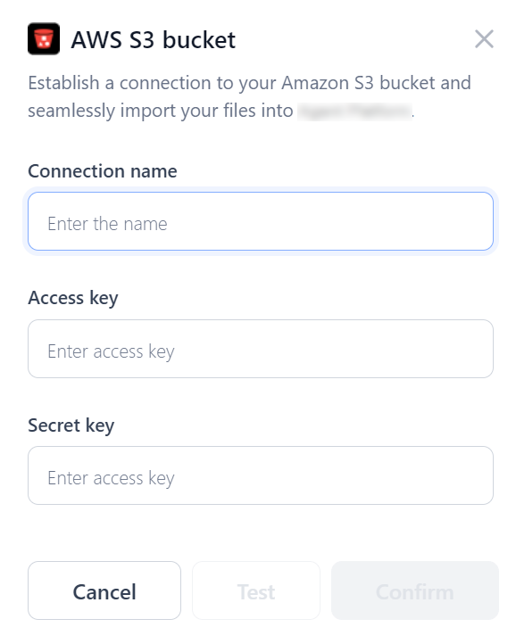

3. Enter:

   - **Connection Name**
   - **Access Key** — unique identifier for your AWS account
   - **Secret Key** — confidential key paired with the Access Key
   - **Bucket Name** — as configured in your S3 console

4. (Optional) Click **Test** to validate. If the connection fails, verify the details or cancel and retry.
5. Click **Confirm** to create the connection.

**To use S3 files in the Tool Flow Builder:**

1. Create an **Input variable** with type **Remote File**.
2. Add an **API node** and reference the remote file in the URL field.

The file content is then available in the context object and can be accessed in any downstream nodes.

### Weights & Biases (WandB)

Connecting with WandB sends fine-tuning data from the Platform to the WandB console for additional analytics and monitoring.

**To connect:**

1. Go to **Settings** > **Integrations** and select **Weights & Biases**.

    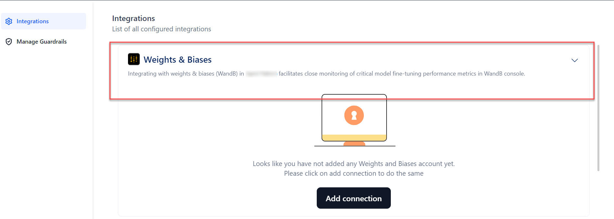

2. Click **Add Connection**.

    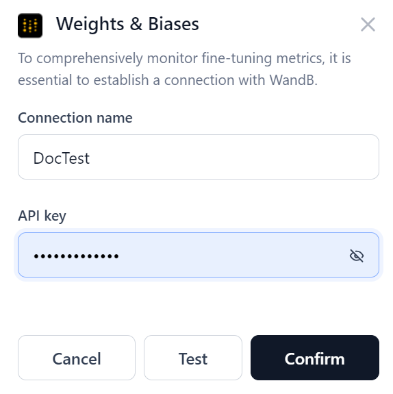

3. Enter:
   - **Connection Name**
   - **API Key** — from your WandB account
4. (Optional) Click **Test** to validate.

    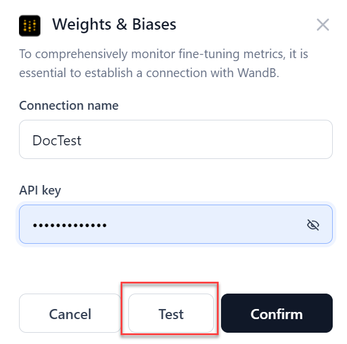

5. Click **Confirm** to create the connection. If the connection fails, verify the API key or cancel and retry.

To edit or delete a connection, hover over the connection name, click the three-dot icon, and select **Edit** or **Delete**.

    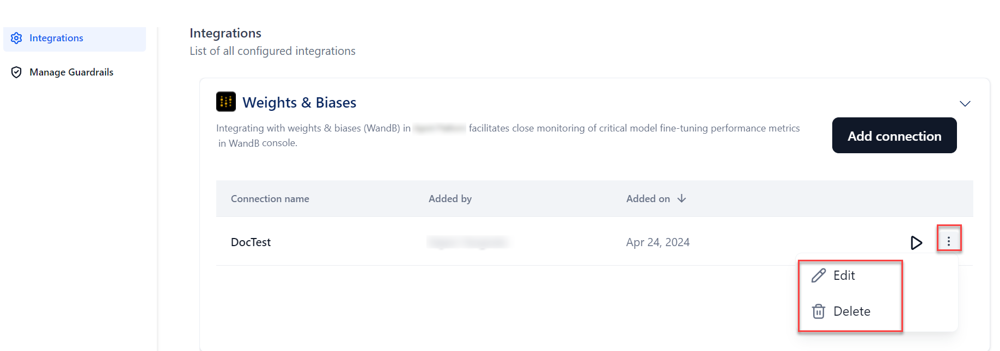

<Note>After connecting, the connection name appears in the **Weights and Biases** section of the fine-tuning wizard. See [Create a Fine-Tuned Model](../../models/fine-tune-models/create-a-fine-tuned-model.md).</Note>
