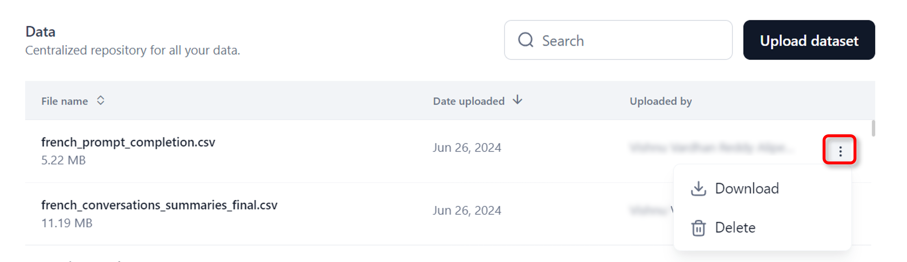

The Data module allows you to store datasets in the application, eliminating the need to upload files repeatedly when testing prompts or fine-tuning models. It supports CSV, JSON, and JSONL file formats without additional formatting requirements.

## Upload a Dataset

You can upload a dataset of your choice in CSV, JSON, or JSONL format.

Steps to upload a dataset:

1. Log in to your account and click **Autonomous Agents** from the list of modules.
2. Click **Data** on the top navigation bar. The **Data** page is displayed.   
3. Click **Upload dataset** and select your file. The uploaded file will appear on the Data page.
    <Note>Files uploaded in Prompts Studio or Models fine-tuning wizard are automatically saved in the Data tab for future use.</Note>

## Download or Delete a Dataset

You can download or delete the dataset if it’s no longer used on the platform. Deleting a dataset used in Playground experiments may cause errors.

* Click the three dots icon in the last column, and choose **Download** or **Delete** as required.  

