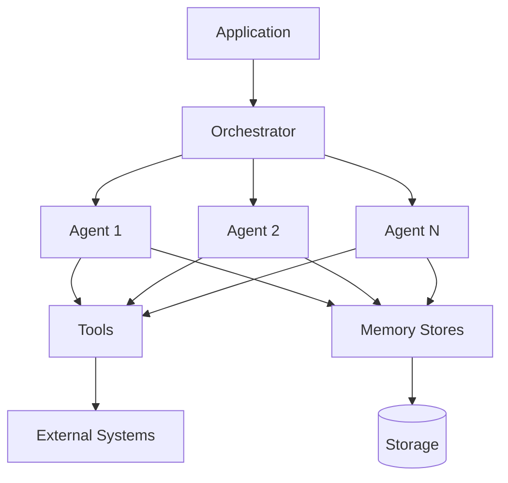

# AgenticAI Core SDK documentation

Welcome to the **AgenticAI Core SDK** documentation! This SDK lets you create sophisticated multi-agent AI applications with ease.

## What is AgenticAI Core

AgenticAI Core is a Python SDK to create, configure, and deploy multi-agent AI applications. It provides:

- 🤖 **Multi-Agent Orchestration** - Coordinate multiple AI agents working together
- 🔧 **Tool Integration** - Connect agents to external systems and APIs
- 💾 **Memory Management** - Persistent storage across conversations
- 🎯 **Custom Orchestration** - Implement your own agent coordination logic
- 🔌 **MCP Support** - Model Context Protocol for seamless integration

## Use Cases of Agents

- **Customer Service** - Build intelligent support agents that handle complex queries
- **Banking & Finance** - Create specialized agents for account management and transactions
- **Workflow Automation** - Orchestrate multiple agents to handle multi-step processes
- **Knowledge Management** - Agents with access to knowledge bases and RAG systems

## Key Features

### Design-Time Models

Define your application structure using intuitive Python models:

```python
from agenticai_core.designtime.models import App, Agent, LlmModel

app = App(
    name="Personal Banker",
    description="Banking assistant application",
    agents=[
        Agent(
            name="FinanceAssist",
            description="Handles account inquiries and transactions",
            llm_model=LlmModel(model="gpt-4o", provider="Open AI")
        )
    ]
)
```

### Runtime Execution

Start your application with custom orchestration:

```python
from agenticai_core.designtime.models.tool import Tool, ToolsRegistry

@Tool.register(name="get_balance", description="Get account balance")
def get_balance(account_id: str):
    return {"balance": 1000, "currency": "USD"}

app.start(
    orchestrator_cls=MyCustomOrchestrator,
    port=8080
)
```

## Quick Links

<div class="grid cards" markdown>

- :material-clock-fast:{ .lg .middle } __Getting Started__

    ---

    New to AgenticAI? Start here!

    [:octicons-arrow-right-24: Installation](getting-started/installation.md)

- :material-book-open-variant:{ .lg .middle } __User Guide__

    ---

    Learn how to build applications

    [:octicons-arrow-right-24: Building Apps](guide/building-apps.md)

- :material-api:{ .lg .middle } __API Reference__

    ---

    Complete API documentation

    [:octicons-arrow-right-24: API Docs](api/index.md)

- :material-code-braces:{ .lg .middle } __Examples__

    ---

    Learn from real-world examples

    [:octicons-arrow-right-24: Examples](examples/banking-assistant.md)

</div>

## Architecture Overview



<hr/>

**Related Resources**

- 📖 [Documentation](getting-started/installation.md)

<!--
- 💬 [GitHub Discussions](https://github.com/agenticai/agentic-core/discussions)
- 🐛 [Issue Tracker](https://github.com/agenticai/agentic-core/issues)
- 📧 [Email Support](mailto:support@agenticai.com)
-->
