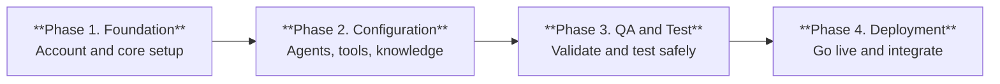
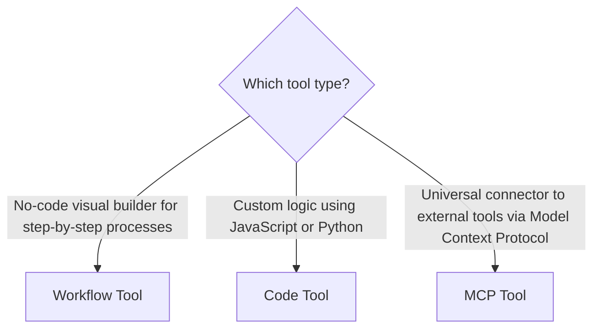

## Platform Availability and Access

The Agent Platform is available on our US Cloud at [https://agent-platform.kore.ai](https://agent-platform.kore.ai). To request access for your customers, partners, or prospects, [contact Support](https://support.kore.ai).

---

## Allowlist IPs

The Platform sends requests to a fixed set of IP addresses. If your systems use IP restrictions, then add the following IPs to your allowlist to permit Platform traffic.

| Region  | URL                                 | IPs                                                                                                          |
|---------|-------------------------------------|--------------------------------------------------------------------------------------------------------------|
| USA     | `https://agent-platform.kore.ai`    | • 54.225.127.87  • 44.216.129.184  • 34.201.194.187  • Lambda IPs for code build: 52.7.57.24  |
| Germany | `https://de-agent-platform.kore.ai` | • 3.75.73.144   • 18.198.171.44   • 63.176.211.25   • Lambda IPs for code build: 52.57.41.155 |
| Japan   | `https://jp-agent-platform.kore.ai` | • 18.180.133.211   • Lambda IP for code build: 18.179.141.6                                             |

---

{/* AG: TBD link updates across this article */}

## Agentic App Setup Guide

Set up your Agentic App in four phases:

### Phase 1: Foundation

Get your workspace and core components ready.

| Step                         | Description                                                                                                                                                                                                                                  |
|------------------------------|----------------------------------------------------------------------------------------------------------------------------------------------------------------------------------------------------------------------------------------------|
| **1. Sign Up**               | Create an account to get a dedicated workspace. Your existing workspaces appear automatically. To use a shared workspace, you need permission from its owner. [Learn more →](/agent-platform/administration/overview#workspaces) |
| **2. Configure an LLM**      | Choose and connect a large language model (LLM) — the intelligence that powers your agents. Supported providers: OpenAI, Azure OpenAI, Anthropic, Gemini. [Learn more →](/agent-platform/models/overview)                                    |
| **3. Create an Agentic App** | Start from scratch, import a pre-built app, or install one from the marketplace. [Learn more →](/agent-platform/agents/agentic-apps/create-an-app)                                                                                           |

### Phase 2: Configuration

Build your app's agents, knowledge, and tools.

| Step                    | Description                                                                                                                                                                                                                                                                                                     |
|-------------------------|-----------------------------------------------------------------------------------------------------------------------------------------------------------------------------------------------------------------------------------------------------------------------------------------------------------------|
| **1. Set Up Agents**    | Define each agent's purpose and assign the tools and resources it needs to complete tasks. [Learn more →](/agent-platform/agents/create-an-agent)                                                                                                                                                               |
| **2. Add Knowledge**    | Connect knowledge sources so agents can retrieve accurate, up-to-date answers. Sources can include FAQs, documents, databases, and external systems. The Platform uses RAG to search them. [Learn more →](/agent-platform/knowledge)                                                            |
| **3. Configure Tools**  | Tools let agents take action — fetching data, running logic, and triggering workflows. See the tool type matrix below to pick the right tool for your use case. Learn more → [Workflow Tools](/agent-platform/tools/workflow), [Code Tools](/agent-platform/tools/code), [MCP Tools](/agent-platform/tools/mcp) |
| **4. Configure Events** | Events mark key moments in a conversation: welcome, agent handoff, end of session. Customize how your app handles each to keep interactions smooth and consistent. [Learn more →](/agent-platform/agents/agentic-apps/settings/events)                                                                          |

Which tool type should you use?

### Phase 3: Quality Assurance

Validate safety, accuracy, and performance before going live.

| Step                        | Description                                                                                                                                                                                                |
|-----------------------------|------------------------------------------------------------------------------------------------------------------------------------------------------------------------------------------------------------|
| **1. Deploy Guardrails**    | Add input and output scanners to control what agents receive and send. This prevents unsafe, off-topic, or unexpected responses. [Learn more →](/agent-platform/guardrails)                                |
| **2. Test the App**         | Use the built-in simulator to submit queries and review responses. Catch errors and edge cases before your users do. [Learn more →](/agent-platform/agents/agentic-apps/simulation-and-testing)            |
| **3. Evaluate Performance** | Run structured evaluations in Evaluation Studio to measure response quality, spot coordination issues, and optimize agent behavior at scale. [Learn more →](/agent-platform/evaluation/agentic-evaluation) |

### Phase 4: Deployment

Go live and connect your app to your products.

| Step                  | Description                                                                                                                                                                                           |
|-----------------------|-------------------------------------------------------------------------------------------------------------------------------------------------------------------------------------------------------|
| **1. Deploy the App** | Promote your tested app version to staging or production. Each deployment is structured and repeatable, ensuring only stable versions reach users.   [Learn more →](/agent-platform/deploy-apps) |
| **2. Integrate**      | Connect your deployed app to your products and channels.   Learn more → [AI for Service](/agent-platform/agents/ai-for-service), [AI for Work](/agent-platform/agents/ai-for-work)               |

## Quick Start Video Tutorials

* [Platform and its core features](https://player.vimeo.com/video/1058969268)
* [Create and configure code tool](https://player.vimeo.com/video/1058954848)
* [Create Your First Agentic App](https://player.vimeo.com/video/1058941749)
* [Test, analyze, and enhance Agentic apps](https://player.vimeo.com/video/1058967989)
* [Integrate models](https://player.vimeo.com/video/1058965339)
* [Prompt Studio](https://player.vimeo.com/video/1058968530)
* [Build a Workflow Tool](https://player.vimeo.com/video/1058869128)
