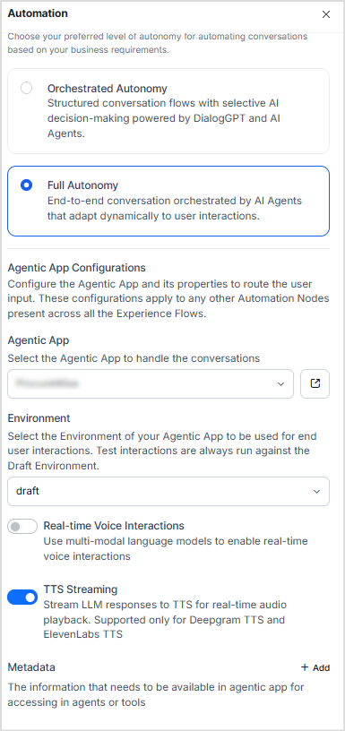

When integrating a voice channel through the Automation Node in AI for Service, two modes are available: **Real-Time Voice** and **TTS Streaming (ASR/TTS)**. These modes determine how user audio is processed and how responses are delivered.

```
Real-Time Voice  →  Multimodal LLM  →  Audio response
TTS Streaming    →  Text LLM  →  AI for Service TTS engine  →  Audio response
```

---

## Real-Time Voice

Real-Time Voice enables natural conversation using multimodal language models that process audio input and generate audio output directly.

**How it works:**

* The Platform uses the configured real-time voice model to process user audio and generate audio responses.
* Real-Time Voice must be enabled in both the AI for Service Automation Node and the Agentic App on the Platform.
* If not enabled on the Platform side, audio requests fail with errors.
* When Real-Time Voice is disabled in the Automation Node, the system defaults to ASR/TTS.

<Note>[Wait Time Experience](/agent-platform/agents/agentic-apps/settings/app-configurations#waiting-experience) is not supported for Real-Time Voice interactions.</Note>

**To configure:**

1. Enable Real-Time Voice in the AI for Service Automation Node. 
2. Enable Real-Time Voice in the Agentic App and configure a model that supports real-time voice. 

---

## TTS Streaming (ASR/TTS)

TTS Streaming is the default when Real-Time Voice is disabled. The Platform uses a text-based LLM to generate responses; AI for Service converts the text to speech using TTS engines (Deepgram, ElevenLabs).

**How it works:**

* The Platform generates a text response and sends it to AI for Service.
* AI for Service converts the text to speech using configured TTS engines.
* When TTS Streaming is **off**, the full audio response is delivered only after the complete output is generated.
* When TTS Streaming is **on**, text is streamed progressively as it is generated, reducing latency.

**Wait-time experience:** When processing is delayed, the Platform sends a filler or system-generated message as configured. AI for Service presents this to the user via TTS as it is received (when streaming is enabled).

**To configure:**

1. Disable Real-Time Voice in the AI for Service Automation Node.
2. To enable streaming, turn on the **TTS Streaming** option. 
3. No additional configuration is required on the Platform side.

---
