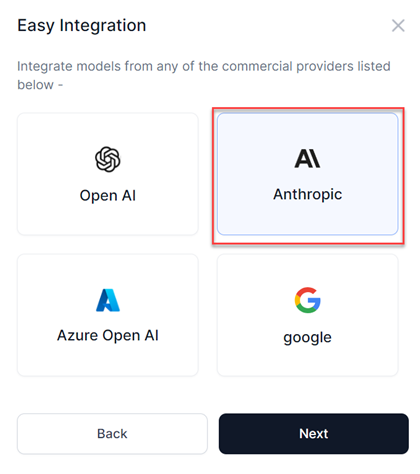
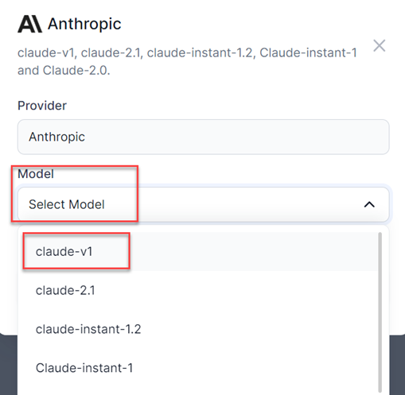
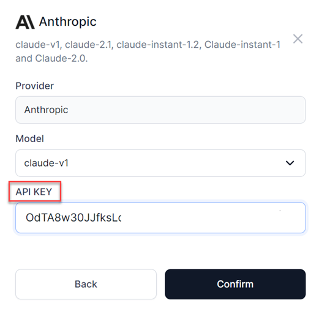
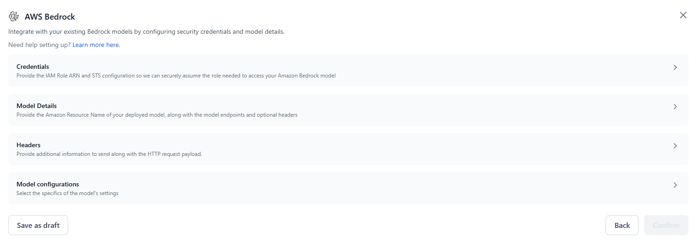
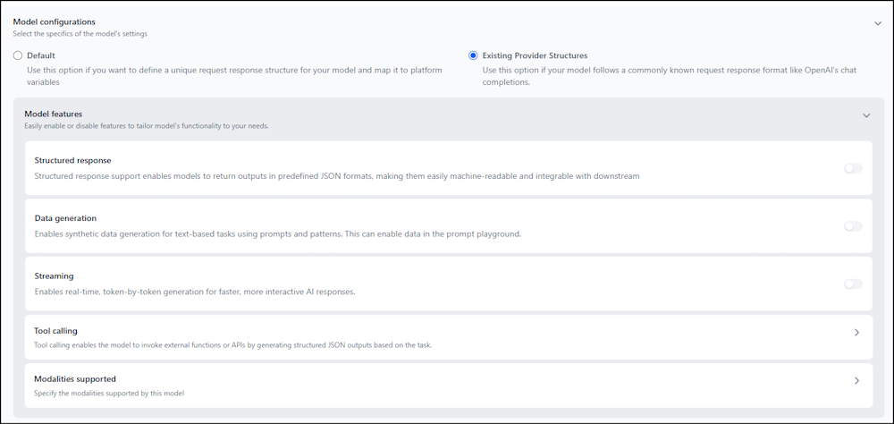
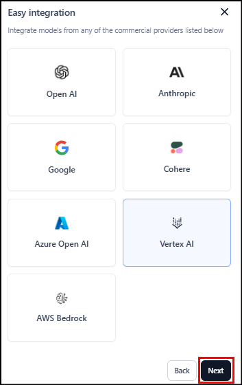
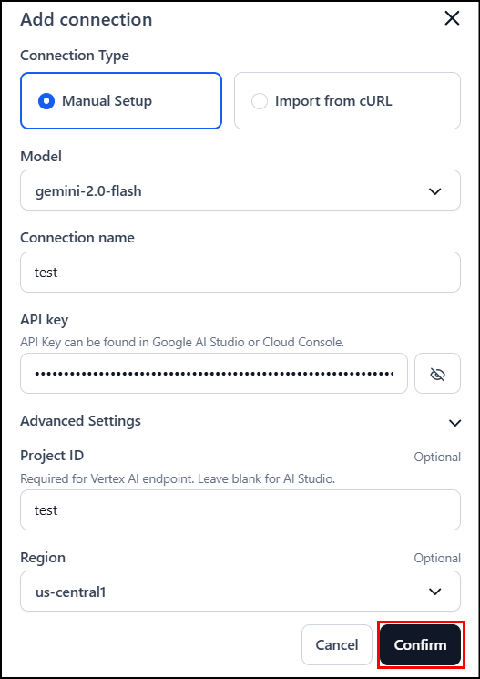
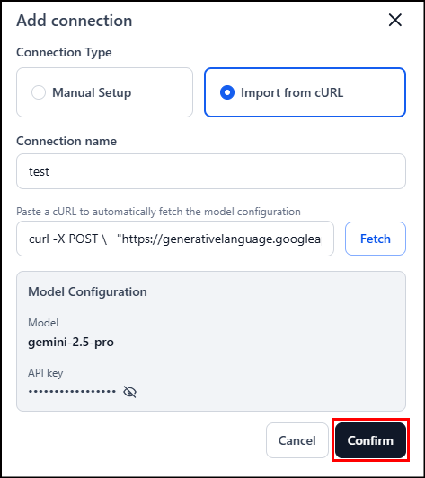

# Add an External Model using Easy Integration

Easily integrate models from popular providers like OpenAI, Anthropic, Google, Cohere, and Amazon Bedrock using the Easy Integration option in the Platform.

## Integrate a Model from Anthropic 

Steps to add the Anthropic Claude-V1 model using easy integration:

1. Click **Models** on the top navigation bar of the application. The **Models** page is displayed.
2. Click the **External models** tab on the **Models** page.

    

3. Click **Add a model** under the **External models** tab. The **Add an external model** dialog is displayed.

    

4. Select the **Easy integration** option to integrate models from Open AI, Anthropic, Google, or Cohere and click **Next**.
5. Select a provider to integrate with and click **Next**.

    

    A pop-up with the list of all the Anthropic models that are supported in the Platform is displayed.
    
    For more information on the list of external models supported, see [Supported models](../supported-models.md).

    

6. Select the required **Model** and enter a **Connection name**.

7. Enter the respective API key you have received from the provider in the **API key** field and click **Confirm** to start the integration.

      </ol>

The model is integrated and is listed in the External models list.

<Note> * You can click the 3 dots icon corresponding to the Model name in the list of external models and edit or delete the model. * You can set the Inference option using the toggle button corresponding to the Model name. If the Inferencing toggle is ON, you can use this model across the Platform. If the toggle button is OFF, it means you cannot infer it anywhere in the Platform. For example, if you turn OFF the toggle button, then in the playground, an error message is displayed that the model is not active even though you have added it in the external models tab. </Note>


## Integrate a Model from Amazon Bedrock

You can easily connect Amazon Bedrock models to the Platform using a guided setup flow. This process enables secure role-based access using your own AWS credentials.

!!! important

    Customers must create an IAM role within their AWS account with the necessary permissions in their AWS account (for example, access to AWS Bedrock APIs). This role must include a trust policy that allows the Platform’s AWS principal (or a designated IAM role in an AWS account) to assume it. For more information, see [Configuring Amazon Bedrock models](./configuring-aws.md).


Steps to add Amazon Bedrock models using easy integration:

<font size="4">**1. Start the Integration**</font> 

1. Click **Models** in the top navigation bar of the application.
2. Go to the **External Models** tab and click **Add a model**.
3. Select **Easy integration** > **AWS Bedrock** and click **Next**.

    


<font size="4">**2. Configure the Integration**</font> 

In the AWS Bedrock dialog, configure the following:

**Credentials**:

  * **Identity Access Management (IAM) Role ARN**: Enter the full ARN of your IAM role that has permission to invoke Amazon Bedrock models. This role allows secure cross-account access following least-privilege principles. For more information, see [Setting Up Credentials and Trust Policy (IAM Role & STS)](../external-models/configuring-aws.md#step-1-setting-up-credentials-and-trust-policy-iam-role-and-sts).
  * **Trusted Principal ARN**: The ARN of the AWS IAM principal (from the Platform) used to assume your IAM role. It’s pre-populated, read-only, and fetched securely — manual input is not required.

**Model Details**:

   * **Model name:** Enter a custom name to identify this model internally within your workflows.
   * **Model ID**: Enter the Model ID or Endpoint ID of the Amazon Bedrock model you want to use. For more information, see [Finding the Right Model ID and Region](./configuring-aws.md#step-2-finding-the-right-model-id-and-region).
   * **Region**: Specify the AWS region where the Bedrock model is deployed.

**Headers** (Optional): Provide any additional information to include with the HTTP request. Use this if your model requires custom headers for configuration or authentication.  
For example: "Content-Type": "application/json"



<font size="4">**3. Configure Model Settings**</font>

In the **Model configurations** section, select one of the following options to define your model’s API behavior:

**Option A: Default**

Use this option to configure all API components and control how requests and responses are structured.

* **Variables**: Define Prompt variables (mandatory) and add Custom variables as needed. These input variables are used within your request payload to bind dynamic input values to your payload structure. For example: `{{prompt}}`, `{{system.prompt}}`.
* **Request Body**: Provide a sample JSON request body for invoking the model. Use the defined variable placeholders `{{variableName}}` (such as `{{prompt}}`) to bind input fields dynamically. For example:

      ```
      {
         "prompt": "{{prompt}}",
         "max_tokens": 200,
         "temperature": 0.7
      }
      ```

    <Note>Ensure the structure of the request body follows the model-specific API schema. Use only supported parameters for the selected Amazon Bedrock model.</Note>

* **Test Response**: Provide sample values for your variables and click Test to invoke the model and preview the response.
* **JSON Path Mapping**: Specify JSON keys to extract relevant output fields from the model response:
    * **Output path**: for example, `choices[0].message.content`
    * **Input tokens**: for example, `usage.prompt_tokens`
    * **Output tokens**: for example, `usage.completion_tokens`

**Option B: Existing Provider Structures**

Use this option to automatically map known API formats for supported providers. This mode simplifies setup by applying pre-defined request/response mappings and enables advanced LLM features without manual configuration.

* **Provider Templates** – Choose a schema such as OpenAI (Chat Completions) or Anthropic (Messages).
* **Model Features** – Enable capabilities like Structured response, Tool calling, Data generation, Streaming, and Modalities support (Text-to-Text, Text-to-Image, etc.).

Each option determines how your model communicates with the platform and how responses are parsed. For more details, see [**Default**](../external-models/add-an-external-model-using-api-integration.md#option-a-default) and [**Existing Provider Structures**](../external-models/add-an-external-model-using-api-integration.md#option-b-existing-model-provider-structures).



<font size="4">**4. Finalize the Configuration**</font> 

* Click **Save as draft** to store the configuration without activating it.
* Or, click **Confirm** to finalize and add the model connection.

Once completed, your model appears in the **External Models** tab. You can now reference this model in your **Prompts** and **Tools** across the platform.

## Integrate a Model from Vertex AI

You can easily connect Google Vertex AI models to the Platform using a guided setup flow. This process enables secure access to Gemini models (2.5 and 3.0 families) using your own Google Cloud credentials.

!!! important

    Customers must create an API key within their Google Cloud account with the necessary permissions to access Vertex AI APIs. For Vertex AI endpoint configuration, you'll need to provide the Project ID and Region where your models are deployed.

**How to get your Google Cloud API Key**

Before you can integrate Vertex AI models, you need to obtain an API key from your Google Cloud account.

**For new users or express mode users**

1. Navigate to the [express mode setup page](https://docs.cloud.google.com/vertex-ai/generative-ai/docs/start/express-mode/overview).
2. Follow the guided setup to automatically generate an API key.
3. View and manage your API keys at **APIs & Services > Credentials** in the Google Cloud Console.

**For existing Google Cloud users**

Prerequisites

* A Google Cloud project with billing enabled.
* Vertex AI API is enabled for your project.
* Organization Policy Administrator role (for policy configuration).

Steps to create an API key

1. Enable Service Account API Key Creation: Navigate to **IAM & Admin** > **Organization policies**, edit `iam.managed.disableServiceAccountApiKeyCreation`, override the parent’s policy, set enforcement to Off, and save.

2. Create a service account: Open **IAM & Admin > Service Accounts**, create a service account named `vertex-ai-runner` with ID `vertexairunner`, assign the **Vertex AI Platform Express User** role, then click continue and done.

3. Create the API key: In **APIs & Services** > **Credentials**, create an API key named `vertexaiapikey`, enable authentication through a service account, link it to `vertex-ai-runner`, click create, and securely store the key.

Steps to add Google Vertex AI models using easy integration:

1. **Start the Integration**:
    1. Click **Models** in the top navigation bar of the app.
    2. Go to the **External Models** tab and click **Add a model**.
    3. Select **Easy integration** > **Vertex AI** and click **Next**.
    
    

2. **Configure the Integration**

In the Add connection dialog, you can choose between two configuration methods:

**Option A: Manual Setup**<br />
In the **Manual Setup** tab, configure the following:

**Connection Details**:

* **Model**: Select the desired Gemini model from the dropdown. For more information on the list of external models supported, see [Supported AI Models](../supported-models.md).
* **Connection name**: Enter a custom name to identify this model connection within your workspace.

**Authentication**:

* **API key**: Enter your API key from your Google Vertex AI Console.

**Note**: API keys are validated during entry. If OAuth 2.0 access tokens or unsupported authentication credentials are detected, an error message displays. For more information, see [ Authentication methods at Google.](https://cloud.google.com/docs/authentication)

**Advanced Settings** (Optional): Configure additional endpoint settings:

* **Project ID**: Enter your Google Cloud project identifier.
* **Region**: The Google Cloud region where your models are deployed.

Click **Confirm** to save the configuration.



**Option B: Import from cURL**

In the **Import from cURL** tab:

1. **Connection name**: Enter a name to identify this model connection within your workspace.
2. Paste a cURL command in the provided text area.
3. Click **Fetch** to extract the configuration, and then click **Confirm** to start the integration.

    

The model is integrated and is listed in the External models list.