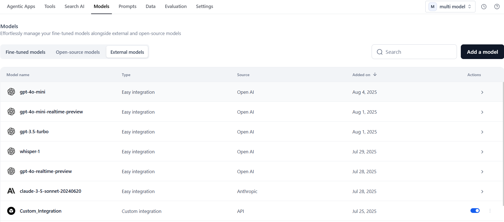
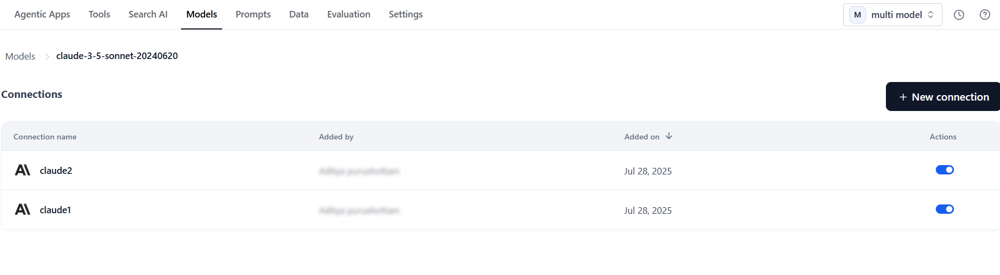
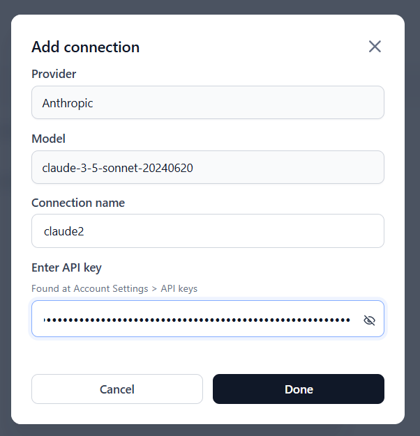

# Managing External Models 

The External Models tab in the Models section allows you to connect and manage models hosted outside the platform. These include provider-hosted models (such as OpenAI, Anthropic, Google, Cohere, and Amazon Bedrock) as well as custom models integrated via API. Once connected, these models can be used within the Platform.

You can connect external models to the platform in two ways:

* [Easy Integration](../external-models/add-an-external-model-using-easy-integration.md) – Use a guided setup to connect with providers like OpenAI, Anthropic, Google, Cohere, or Amazon Bedrock.
* [API Integration](../external-models/add-an-external-model-using-api-integration.md) – Add a custom model by configuring API endpoint details, authentication, and request settings.

## Viewing Connected Models

The External Models tab displays all external models that have been connected to your workspace via Easy Integration or API Integration.

Each row in the list shows:

| Field         | Description |
|---------------|-------------|
| Model Name | Name assigned during integration. |
| Type     | Indicates whether the model was added via Easy Integration or API Integration. |
| Source     | The provider or origin of the model (for example, OpenAI, Hugging Face, Custom). |
| Added On   | Date the model was last added or updated. |

Click a model from the list to view or manage its connections.

## Managing Connections 

Each external model can have one or more associated connections, listed in the Connections page for that model. From this page, you can add new connections or edit and delete existing connections.

| Field               | Description |
|---------------------|-------------|
| Connection Name | Name given during model integration (not editable once saved). |
| Added By      | User who created the connection. |
| Added On        | Date the connection was created. |
| Actions         | - Toggle for Inference – Enable or disable usage of this connection for inference.  - Edit – Update the API key or credentials.  - Delete – Remove the connection from the workspace. |

## Adding Connections

You can create multiple connections for the same external model, each with its own credentials or API key. Each connection is managed separately, and you can track usage, billing, and analytics for each connection.

For example, you can add multiple API key–based connections for the same commercial model (such as multiple GPT-4 keys for OpenAI). Each API key is treated as a separate connection and can be managed individually.

When adding connections:

* Each connection name must be unique.
* Each API key must be unique for the model.

When multiple API keys are configured, each connection appears separately in the Connections list for the model, making it easier to manage access and switch between keys as needed.

Once added, the model name and its connection name appear across the Platform — including in Agentic apps, Prompt Studio, Tools, Evaluation Studio, Model Traces & Analytics, Audit Logs, Billing, and other areas — so wherever you select a model, you can choose from its available connection names if multiple connections are configured. In Agentic apps, you can assign the model connection name at the Agent or Supervisor level for granular control.
