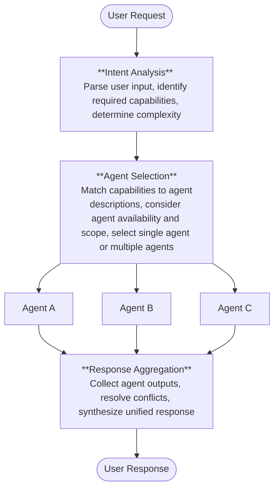

Coordinate how agents work together to handle user requests.

---

The orchestrator is the intelligence layer that manages agent interactions. It:

- Interprets user intent
- Selects the appropriate agent(s)
- Coordinates multi-agent workflows
- Resolves conflicts between outputs
- Delivers unified responses

---

## Orchestration Patterns

Choose a pattern based on your use case complexity.

- [Single Agent](/agent-platform/orchestration/single-agent): One agent handles all requests. Best for focused, well-defined domains.

- [Supervisor](/agent-platform/orchestration/supervisor): Central orchestrator coordinates multiple specialized agents. Best for complex, parallelizable tasks.

- [Adaptive Network](/agent-platform/orchestration/adaptive-network): Agents dynamically hand off to each other. Best for sequential, multi-domain workflows.


## Pattern Comparison

| Aspect | Single Agent | Supervisor | Adaptive Network |
|--------|--------------|------------|------------------|
| Complexity | Low | Medium | Medium-High |
| Agents | 1 | Multiple | Multiple |
| Coordination | None | Centralized | Decentralized |
| Execution | Sequential | Parallel | Sequential |
| Latency | Lowest | Medium | Low |
| Best for | Simple tasks | Complex decomposition | Dynamic hand-offs |


## How Orchestration Works



## Choosing the Right Pattern

**Use Single Agent when:**

- Your app has one primary capability
- Tasks don't require coordination between specialists
- You want minimal orchestration overhead
- Response latency is critical

**Example**: A leave management bot where one agent handles all employee requests.

**Use Supervisor when:**

- Tasks can be broken into independent subtasks
- You need parallel execution for speed
- Multiple specialists should contribute to responses
- You want centralized control and conflict resolution

**Example**: A customer service app where billing, orders, and technical support agents work in parallel.

**Use Adaptive Network when:**

- Tasks flow naturally between domains
- You need dynamic routing based on context
- Agents should autonomously decide when to hand off
- Sequential expertise is required

**Example**: An employee onboarding app where HR, IT, and Finance agents hand off based on the current step.

---

## Orchestrator Responsibilities

### Task Decomposition

Breaking complex requests into manageable subtasks:

```yaml
User: "I need to cancel my order and get a refund"

Decomposition:
├── Subtask 1: Look up order details (Order Agent)
├── Subtask 2: Process cancellation (Order Agent)
└── Subtask 3: Initiate refund (Billing Agent)
```

### Agent Delegation

Routing tasks to appropriate specialists:

```yaml
Request: "What's my order status and can I upgrade my shipping?"

Delegation:
├── Order Agent: Retrieve order status
└── Shipping Agent: Process shipping upgrade
```

### Conflict Resolution

Handling inconsistencies between agent outputs:

```yaml
Conflict:
├── Agent A: "Item is in stock"
└── Agent B: "Item ships in 2 weeks"

Resolution: Check inventory system → Provide accurate status
```

### Context Management

Maintaining conversation state across agents:

```yaml
Context:
├── User ID: 12345
├── Session ID: abcde
└── Previous Turns:
    ├── Turn 1: User provides order number
    ├── Turn 2: Agent A uses order number
    └── Turn 3: Agent B receives context, doesn't ask again

```

---

## Orchestrator Configuration

Navigate to **App** > **Orchestrator**.

For each orchestration pattern, configure the following.

### Default AI Model

AI model to be used for operations across the app. Select any of the configured models. The default settings of the model are shown. Click the **Settings** icon to update the default settings. 

### Voice-to-Voice Interactions

Enable this field to allow users to interact with the app via real-time voice conversations. Once enabled, also provide the AI model that processes speech and generates voice responses. The platform supports various models. See the [list of supported models](/agent-platform/models/supported-models) and [how to add an external model](/agent-platform/models/external-models) to the platform.

<Note>
  Adaptive Network Orchestration does not support Gemini real time models.
</Note>

Click the **Settings** icon to update the voice model settings. 

#### Voice AI Model Settings

| Setting | Description | Key Notes |
|--------|-------------|----------|
| Voice | Voice used for audio responses | Depends on model/provider |
| Input Audio Format | Format of incoming audio | Example: `pcm16`, must match client input |
| Output Audio Format | Format of generated audio | Must match playback capability |
| Speech Speed | Speed of generated speech | `1.0` = default |
| Max Response Output Tokens | Max tokens per response | Controls response length & latency |
| Temperature | Controls randomness/creativity | Lower = deterministic, higher = creative |
| Max Tokens | Max tokens generated | Limits total response size |
| Noise Reduction Type | Filters input audio noise | `Near Field` (close mic), `Far Field` (room audio) |
| VAD Type | Speech detection method | Example: Server VAD |
| Threshold | Sensitivity of detection | Lower = more sensitive |
| Prefix Padding | Audio before speech detection | Prevents clipping |
| Silence Duration | Silence before speech ends | Lower = faster response |
| Create Response | Auto-generate response | True/False |
| Interrupt Response | Allow interruption | True/False |
| Transcription Language | Language for speech-to-text | Default: Auto-detect; improves accuracy if set |
| Transcription Prompt | Context for ASR model | Helps recognize domain-specific terms and improve accuracy. [Learn More](/agent-platform/howto/configure-transcription).|

### Behavioral Instructions

Use this section to set the guidelines for the agent's behavior. These instructions will be added to the orchestrator and the system prompt of each agent. Click **Modify Instructions**, then enter the prompt.

### Response Processor

The Response Processor is an app-level feature that executes a custom script on every agent response before delivering it to the end user. It executes as the final stage in response generation—after the agent produces its output but before that output leaves the platform. Configured on the Orchestrator page, the script applies uniformly across all agents in the app, regardless of which agent handled the request.

**Using the Response Processor to Generate Artifacts**

Use the Response Processor to write artifact payloads directly in code. When the processor runs, it constructs the payload, writes it to the artifacts key, and the platform appends it for delivery. This approach is useful when:

- The artifact must be assembled from multiple tool outputs or session variables.
- The payload structure depends on business logic that is better handled centrally.
- No tool is involved—the processor can generate artifacts independently, using only the input context.


**Using the Response Processor to Transform Existing Artifacts**

When tools have already populated the artifacts array, the Response Processor can enrich or transform it before delivery:

- Reorder elements to control render priority.
- Filter artifacts by channel, user segment, or business logic.
- Transform or enrich the payload before delivery to the client.
- Merge multiple tool outputs into a single consolidated artifact.
- Annotate with metadata, wrapper keys, or channel-specific formatting.

<Note>When a Response Processor is active, streaming is disabled. Artifacts and the text response are delivered as a complete payload after processing. If the processor fails, the original untransformed response is returned, and the error is logged.</Note>

#### Adding a Response Processor

Click **Add Script** to open the script editor. The following are available as input to the script:

1. **Input** — The original user input that triggered this agent run.
2. **Output** — The agent's response generated by the agent.
3. **Artifacts** — An array of tool outputs and structured data returned during the run by different tools.

**Response Processing Script:** Provide the script that updates the output before delivering to the end user. You can use JavaScript or Python for this scripting.

 - Access input, output or artifacts in the script using $ prefix.
 - Access environment variables using env keyword : `env.<variable-name>`.
 - Access content variables as: `content.<variable-name>`.
 - Access [memory stores in the script using these methods](/agent-platform/memory).

**Namespace:** Select namespaces to make their variables available to the script.

Use **Test Response Processor** to validate the script's behavior.

**Sample Script**

```javascript

// Extracts account balance amount from the textual response and only sends back the value, instead of complete textual response.

console.log("[PostProcessor] Input received:", $input); 
console.log("[PostProcessor] Output received:", $output);
console.log("[PostProcessor] Artifacts:", $artifacts);
console.log(env.name) //access environment variable
console.log(content.new) //access content variable

const originalOutput = $output;
let modifiedOutput = originalOutput;

const outputData = $output;

let finalOutput;

// Extract balance amount(number) from text (e.g., "Your balance is 7236")
const match = outputData.match(/\d+/);

if (match) {
    finalOutput = {
      balance: Number(match[0])
    };
} else {
    finalOutput = {
      message: outputData
    };
}

return {
  output: finalOutput
};
```
---

### Single Agent Configuration

In a Single Agent setup, all user requests are routed directly to the agent. Since no supervisor agent is involved, the agent's prompt serves as the primary instruction set for the underlying model.

When processing a request, the platform constructs a single consolidated prompt by combining the following components in order, and sends it to the model:

1. **Agent Prompt** — The core instructions that define the agent's role and behavior.
2. **Behavioral Instructions** — Guidelines that control tone, constraints, and response style.
3. **Tools Assigned to the Agent** — Tool definitions available for the agent to invoke.
4. **Events Enabled in the Application** — Event-related context.

---

### Supervisor Configuration

In addition to the configurations discussed above, configure the following for the Supervisor pattern:

- **Orchestrator Prompt** — A set of instructions for the supervisor of the app. This includes instructions and requirements that guide the orchestrator's decision-making process.
- **Orchestration Prompt for Voice-to-Voice Interactions** — This prompt serves as instructions for the supervisor in case of voice interactions.

---

### Adaptive Network Configuration

In addition to the configurations discussed above, configure the following for the Adaptive Network pattern:

- **Initial Agent** — Select the agent that serves as the first point of contact for each task. This agent receives the user's request, processes the initial requirements, and begins task execution.

For this pattern, configure the agents with the delegation rules.