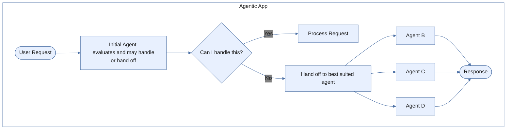

Agents dynamically transfer control to each other based on context.

---

## Overview

The adaptive network pattern enables decentralized orchestration where agents autonomously decide when to hand off tasks to other specialists. Unlike the supervisor pattern, there's no central coordinator—agents evaluate tasks and route them directly to peers.

```
User Request → Agent A → Agent B → Agent C → Response
                  └──────────┴──────────┘
                    Dynamic handoffs
```

---

## When to Use

The adaptive network pattern is ideal when:

- Tasks naturally **flow between domains**.
- You need **dynamic routing** based on conversation context.
- Agents should **autonomously decide** when to hand off.
- **Sequential expertise** is required.
- You want **lower latency** than supervisor aggregation.

### Good Fit Examples

| Use Case | Why Adaptive Network Works |
|----------|----------------------------|
| Employee onboarding | HR → IT → Finance flow based on current step |
| Customer journey | Sales → Support → Success natural progression |
| Incident handling | Triage → Specialist → Resolution escalation |
| Complex troubleshooting | Problem domains emerge during conversation |


## Architecture




## Key Characteristics

### Dynamic Delegation

Agents assess incoming tasks and route them to the most suitable peer when the task falls outside their scope.

```yaml
User: "I can't log into my email"

IT Agent evaluates:
├── Is this an account issue? → Hand off to Identity Agent
├── Is this a device issue? → Handle directly
└── Is this a policy issue? → Hand off to HR Agent
```

### Context Preservation

Conversation history travels with handoffs—users don't repeat information.

```yaml
Turn 1 (HR Agent): "I need to onboard a new employee, John Smith"
Turn 2 (IT Agent receives context): Already knows it's about John Smith
Turn 3 (Finance Agent receives context): Already knows full onboarding context
```

### Decentralized Control

No central supervisor. Each agent is aware of other agents and can directly initiate transfers.

### Sequential Workflows

Tasks typically flow through agents sequentially rather than in parallel.

---

## Execution Flow

```yaml
1. User submits initial query

2. Initial agent evaluates:
   ├── Intent analysis
   ├── Scope check
   └── Capability assessment

3. Agent decision:
   ├── Handle directly → Process and respond
   └── Hand off → Select best agent, transfer control

4. Next agent receives:
   ├── Original request
   ├── Conversation history
   └── Handoff context

5. Process continues until resolution

6. Final agent delivers response to user
```


## Supervisor vs. Adaptive Network

| Aspect | Supervisor | Adaptive Network |
|--------|------------|------------------|
| Control | Centralized | Decentralized |
| Routing | Supervisor decides | Agents decide |
| Latency | Higher (aggregation) | Lower (direct) |
| Complexity | Single coordination point | Distributed logic |
| Best for | Decomposable tasks | Flowing conversations |


## Configuration

```yaml
# app-config.yaml
orchestration:
  pattern: adaptive_network
  initial_agent: welcome_agent

  # Handoff settings
  handoff:
    preserve_context: true
    max_handoffs: 5
    allow_circular: false

agents:
  welcome_agent:
    name: Welcome Agent
    description: Greets users and routes to appropriate specialist
    can_handoff_to:
      - hr_agent
      - it_agent
      - finance_agent

  hr_agent:
    name: HR Agent
    description: Handles HR inquiries, policies, and employee data
    can_handoff_to:
      - it_agent
      - finance_agent
      - welcome_agent

  it_agent:
    name: IT Agent
    description: Manages IT support, access, and technical issues
    can_handoff_to:
      - hr_agent
      - finance_agent

  finance_agent:
    name: Finance Agent
    description: Handles payroll, expenses, and financial queries
    can_handoff_to:
      - hr_agent
```


## Example: Employee Buddy

A "Smart Employee Buddy" where agents handle different domains and hand off as needed.

```yaml
name: Smart Employee Buddy
orchestration:
  pattern: adaptive_network
  initial_agent: welcome_agent

agents:
  - name: Welcome Agent
    description: |
      First point of contact. Greets employees and identifies
      their needs. Routes to HR, IT, or Finance based on query.

    instructions: |
      You are the first contact for employee inquiries.
      Quickly identify the domain and hand off to the right specialist.

      Hand off rules:
      - Benefits, leave, policies → HR Agent
      - Computer, access, software → IT Agent
      - Payroll, expenses, reimbursements → Finance Agent

  - name: HR Agent
    description: |
      Handles leave requests, benefits inquiries, policy questions,
      and employee data updates.

    tools:
      - get_leave_balance
      - submit_leave_request
      - get_benefits_info

    handoff_triggers:
      - "If user mentions IT issues, hand off to IT Agent"
      - "If user asks about payroll, hand off to Finance Agent"

  - name: IT Agent
    description: |
      Manages access requests, password resets, software installation,
      and technical troubleshooting.

    tools:
      - reset_password
      - request_software
      - create_support_ticket

    handoff_triggers:
      - "If issue relates to HR systems, hand off to HR Agent"
      - "If user needs expense report help, hand off to Finance Agent"

  - name: Finance Agent
    description: |
      Handles payroll questions, expense submissions, reimbursements,
      and tax documents.

    tools:
      - get_payslip
      - submit_expense
      - get_tax_documents

    handoff_triggers:
      - "If user has benefits questions, hand off to HR Agent"
```

### Conversation Example

```yaml
User: "Hi, I need some help"

Welcome Agent: "Hello! I'm here to help. What do you need
               assistance with today?"

User: "I want to take vacation next week but I'm not sure
      how much time I have left"

Welcome Agent: [Identifies HR domain, hands off to HR Agent]

HR Agent: "I can help with that! Let me check your leave balance."
          [Calls get_leave_balance]
          "You have 12 vacation days remaining. Would you like
          me to submit a leave request for next week?"

User: "Yes please. Also, I realized I need to expense my
      travel from last month"

HR Agent: [Submits leave request, then hands off to Finance Agent]
          "Your leave request for next week is submitted.
          I'm connecting you with our Finance team for your
          expense report."

Finance Agent: "Hi! I see you need to submit a travel expense.
               I can help with that. What was the trip for
               and what's the total amount?"
```


## Benefits

| Benefit | Description |
|---------|-------------|
| **Low latency** | Direct agent-to-agent communication |
| **Natural flow** | Conversations progress organically |
| **Agent autonomy** | Specialists decide when to engage |
| **Context continuity** | Full history travels with handoffs |
| **Scalability** | Add new agents without central changes |


## Best Practices

### Clear Handoff Rules

Define explicit conditions for when agents should hand off:

```yaml
handoff_triggers:
  - condition: "User mentions billing or payment"
    target: billing_agent

  - condition: "Technical issue beyond my scope"
    target: specialist_agent

  - condition: "User explicitly requests different help"
    target: router_agent
```

### Prevent Circular Handoffs

Set maximum handoff limits and avoid circular routing:

```yaml
handoff:
  max_handoffs: 5
  allow_circular: false
  track_visited: true
```

### Graceful Fallbacks

Handle cases where no agent can help:

```yaml
fallback:
  agent: support_agent
  message: "I'll connect you with a specialist who can help."
```

---
