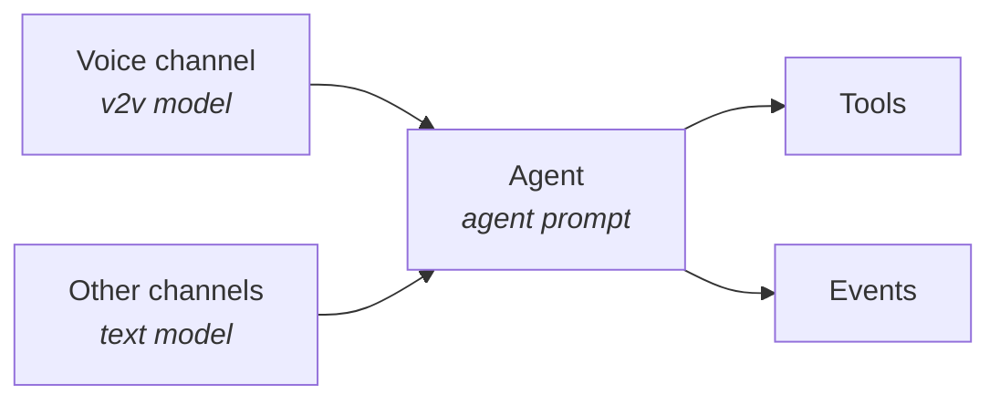
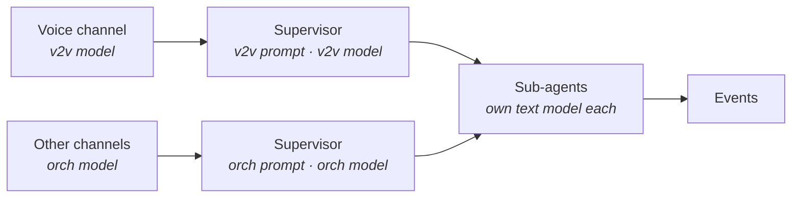
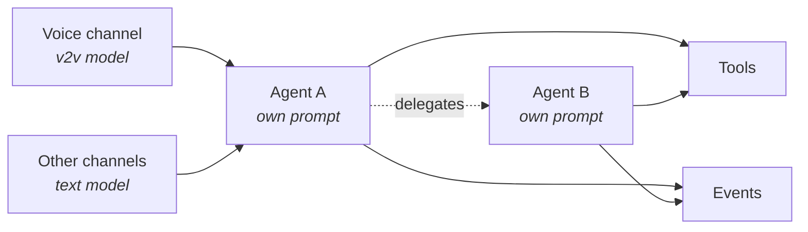

Understand how prompts and models apply across voice-to-voice and other channels in each orchestration pattern.

Each orchestration pattern handles prompts and models differently depending on the interaction channel. Voice-to-voice (V2V) interactions use the configured voice model; all other channels use the text model.

## Key Terms

| Term | Meaning |
| --- | --- |
| **V2V model** | The real-time voice model configured for voice-to-voice interactions. |
| **Text model** | The default AI model configured at the app level for non-voice channels. |
| **Orchestration model** | The text model used by the supervisor for non-voice channels (Supervisor pattern only). |
| **Agent prompt** | The instruction set defined on an individual agent. |
| **Supervisor prompt** | Instructions defined on the supervisor in the Supervisor pattern. Also called the orchestration prompt. |
| **V2V prompt** | An optional voice-specific prompt configured on the supervisor. Available in the Supervisor pattern only. In other patterns, the voice channel uses the agent prompt — there is no separate V2V prompt to configure. |

## Single Agent

One agent handles every request. The same agent prompt is used for all channels. Only the model changes with the channel: the V2V model handles voice, and the text model handles everything else. The agent invokes tools and events directly.

| Mapping | Value |
| --- | --- |
| Voice-channel prompt | Agent prompt |
| Other-channel prompt | Agent prompt |
| V2V model invokes | Tools and events |

## Supervisor

A supervisor routes each request along one of two paths based on the channel:

- **Voice channel** — The V2V model runs with a dedicated V2V prompt. This prompt is optional; if you don't set one, the supervisor uses the orchestration prompt for voice as well.
- **Other channels** — The orchestration model runs with the supervisor (orchestration) prompt.

Sub-agents can be invoked from either path, but they always run on their own assigned text model, regardless of the channel that triggered the request.

| Mapping | Value |
| --- | --- |
| V2V prompt | V2V prompt (optional) |
| Other-channel prompt | Orchestration prompt |
| Sub-agent model | Assigned text model |
| V2V model invokes | Sub-agents and events |

<Note>
Writing a separate V2V prompt is useful when voice interactions need different tone, brevity, or handling rules than text. Leave it empty to reuse the orchestration prompt for voice.
</Note>

## Adaptive Network

Each agent uses its own prompt for every channel — there is no separate V2V prompt. Voice requests run on the V2V model; other channels run on the agent's assigned text model. Delegate agents always run on their own assigned text model, regardless of the channel that triggered the request. From either channel, the agent can invoke tools directly, delegate to another agent, or trigger events.

| Mapping | Value |
| --- | --- |
| Voice-channel prompt | Agent prompt |
| Other-channel prompt | Agent prompt |
| V2V model invokes | Tools, agents, and events |

## Summary

The following table compares how channel prompts and model invocations are configured across the three orchestration patterns.

| | Single Agent | Supervisor | Adaptive Network |
| --- | --- | --- | --- |
| **Voice-channel prompt** | Agent prompt | V2V prompt (optional) | Agent prompt |
| **Other-channel prompt** | Agent prompt | Orchestration prompt | Agent prompt |
| **V2V model invokes** | Tools, events | Sub-agents, events | Tools, agents, events |
| **Sub-agent / delegate model** | Not applicable | Assigned text model | Assigned text model |

<Note>
Behavioral instructions set at the orchestration level are automatically added to all agent prompts and the supervisor prompt in every pattern.
</Note>

---

