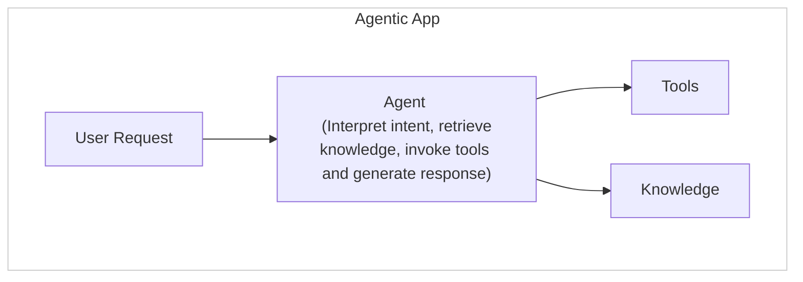

A streamlined orchestration model where one agent handles all requests.

---

## Overview

The single agent pattern routes all user requests directly to one agent without multi-agent coordination. This agent independently manages:

- Intent understanding
- Knowledge retrieval
- Tool invocation
- Response generation

```
User Request → Agent → Tools/Knowledge → Response
```

No delegation, no handoffs, no orchestration overhead.

---

## When to Use

Single agent is the right choice when:

- Your app has **one primary capability** or domain.
- Tasks are **straightforward** and don't require specialists.
- Tasks involve **closely related actions** within one scope.
- **Low latency** is critical.
- You want **minimal complexity**.

### Good Fit Examples

| Use Case               | Why Single Agent Works                                             |
|------------------------|--------------------------------------------------------------------|
| Leave management       | All requests (check balance, apply, cancel) fall within one domain |
| FAQ bot                | Questions map to a single knowledge base                           |
| Order lookup           | All actions relate to order data                                   |
| Appointment scheduling | Booking, rescheduling, cancellation are related tasks              |


## Architecture




## Execution Flow

1. **User submits request** to the application.
2. **Request routes directly** to the single agent (no orchestrator selection).
3. **Agent processes** the request:
   - Parses user intent
   - Determines required actions
   - Retrieves relevant knowledge
   - Selects and invokes tools
   - Generates contextual response
4. **Response returns** to user.

### Example Conversation

```yaml
User: "How many vacation days do I have left?"

Agent Processing:
├── Intent: Check leave balance
├── Knowledge: None needed
├── Tool: get_leave_balance(user_id)
└── Response: Generate balance summary

Agent: "You have 12 vacation days remaining this year.
        You've used 8 days so far, and your anniversary
        reset is on March 15th."
```

---

## Configuration

```yaml
# app-config.yaml
orchestration:
  pattern: single_agent
  agent: leave_assistant

agents:
  leave_assistant:
    name: Leave Assistant
    description: |
      Handles all employee leave-related requests including
      balance checks, applications, cancellations, and policy questions.

    model: gpt-4o
    context_window: 50

    tools:
      - get_leave_balance
      - apply_for_leave
      - cancel_leave_request
      - get_upcoming_holidays

    knowledge:
      - leave_policies
      - company_calendar
```


## Benefits

| Benefit | Description |
|---------|-------------|
| **Simplicity** | No orchestration complexity. One agent, direct execution. |
| **Low Latency** | No agent selection overhead. Requests process immediately. |
| **Easy Maintenance** | Single point of configuration and debugging. |
| **Predictable Behavior** | Clear scope boundaries make testing straightforward. |


## Limitations

| Limitation | Mitigation |
|------------|------------|
| **Single Point of Failure** | Add fallback handling or upgrade to a multi-agent pattern |
| **Scope Creep** | Define clear boundaries; upgrade pattern when scope expands |
| **No Specialization** | Use multi-agent pattern for complex, multi-domain tasks |


## When to Upgrade

Consider moving to multi-agent patterns when:

- Requests frequently fall outside the agent's scope.
- Response quality suffers from broad responsibilities.
- You need parallel execution for complex tasks.
- Different tasks require different model capabilities.
- You want specialized agents for specific domains.


## Example: Leave Management Assistant

```yaml
name: Leave Assistant
description: Complete leave management for employees

scope: |
  ## Responsibilities
  - Check leave balances (vacation, sick, personal)
  - Process leave applications
  - Cancel pending requests
  - Answer policy questions
  - Show team calendar availability

instructions: |
  You help employees manage their leave.

  Guidelines:
  - Always confirm dates before processing requests
  - Check team calendar for conflicts before approving
  - Remind users of blackout dates when relevant
  - Provide remaining balance after any changes

tools:
  - name: get_leave_balance
    description: Get current leave balances for an employee

  - name: apply_for_leave
    description: Submit a new leave request

  - name: cancel_leave
    description: Cancel a pending leave request

  - name: get_team_calendar
    description: Show team availability for date range

knowledge:
  - leave_policies
  - holiday_calendar
```
