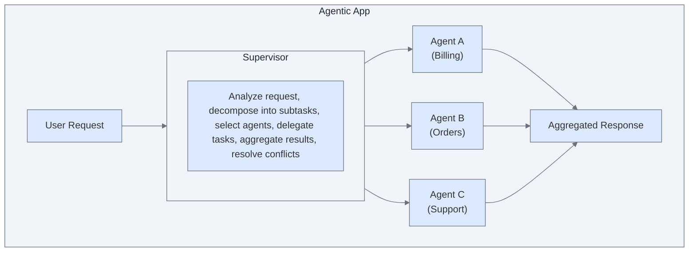
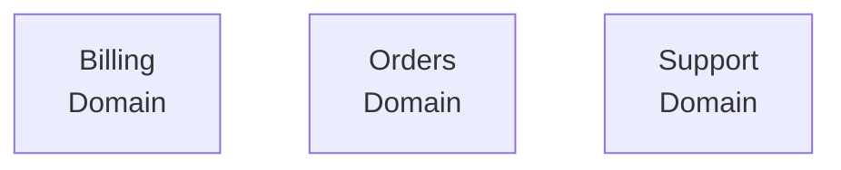

A central orchestrator coordinates multiple specialized agents.

---

## Overview

The supervisor pattern uses a hierarchical structure where a central orchestrator acts as a supervisor, managing and coordinating multiple specialized AI agents. The supervisor:

- Analyzes incoming requests.
- Breaks down complex tasks.
- Delegates to appropriate agents.
- Aggregates and synthesizes results.
- Delivers unified responses.

```
User Request → Supervisor → [Agent A, Agent B, Agent C] → Aggregated Response
```

---

## When to Use

The supervisor pattern is ideal when:

- Requests require **dynamic agent selection** at runtime.
- Tasks can be **decomposed** into independent subtasks.
- Multiple **specialists** should contribute to responses.
- You want **centralized control** over coordination.
- **Conflict resolution** between agents is needed.

### Good Fit Examples

| Use Case | Why Supervisor Works |
|----------|----------------------|
| Customer service | Billing, orders, and tech support agents work independently |
| Research assistant | Multiple agents gather info from different sources |
| Travel booking | Flight, hotel, and car rental agents coordinate |
| Financial planning | Investment, tax, and insurance agents provide comprehensive advice |


## Architecture




## Execution Flow

### The Seven Stages

```
1. User Input
   └─ Request arrives at the application

2. Supervisor Analysis
   └─ Parse intent, identify required capabilities

3. Task Decomposition
   └─ Break complex request into subtasks

4. Agent Selection & Delegation
   └─ Route subtasks to specialized agents

5. Agent Execution
   └─ Agents process as per the assigned tasks

6. Result Aggregation
   └─ Collect outputs from all agents

7. Response Synthesis
   └─ Resolve conflicts, generate unified response
```

### Example Conversation

```
User: "I need to return my order and get a refund. Also,
       can you explain your return policy?"

Supervisor Analysis:
├── Subtask 1: Process return request (Order Agent)
├── Subtask 2: Initiate refund (Billing Agent)
└── Subtask 3: Explain return policy (Support Agent)

Agent Execution:
├── Order Agent: Initiates return for order #12345
├── Billing Agent: Queues refund of $89.99
└── Support Agent: Retrieves return policy

Aggregated Response:
"I've initiated the return for your order #12345.
 A refund of $89.99 will be processed within 3-5
 business days once we receive the item.

 Our return policy: Items can be returned within
 30 days of purchase in original condition. Electronics
 have a 15-day window. Free return shipping is included."
```

---

## Configuration Example

```yaml
orchestration:
  pattern: supervisor
  model: gpt-4o  # Model for supervisor decisions

agents:
  billing_agent:
    name: Billing Agent
    description: Handles payments, refunds, and billing inquiries

  order_agent:
    name: Order Agent
    description: Manages orders, returns, and shipping

  support_agent:
    name: Support Agent
    description: Answers policy questions and general support
```

For details, see [Orchestration Configuration](/agent-platform/orchestrate#orchestrator-configuration).


## Key Capabilities

### Modularity

Each agent focuses on a specific domain, making the system easier to build and maintain.



### Scalability

Distribute complex tasks across multiple specialized agents.

```
Single Request → Supervisor → Agent A → Agent B → Unified Response
```

### Specialization

Each agent can use different models, tools, and knowledge optimized for their domain.

```yaml
billing_agent:
  model: gpt-4o  # Best for financial accuracy
  tools: [process_refund, check_payment_status]

support_agent:
  model: gpt-3.5-turbo  # Faster for simple lookups
  knowledge: [faq_database, policy_docs]
```

### Flexibility

The supervisor dynamically selects agents based on request needs.


### Fault Tolerance

If one agent fails, others can still complete their tasks.

---
{/*

## Conflict Resolution

When agents return conflicting information:

```yaml
Agent A: "Item is in stock"
Agent B: "Ships in 2 weeks"

Resolution Strategy:
├── Option 1: prefer_specialized → Use domain expert's answer
├── Option 2: verify_source → Check authoritative system
├── Option 3: ask_user → Clarify with user
└── Option 4: aggregate → Present both with context
```
*/}

## Benefits

| Benefit | Description |
|---------|-------------|
| **Centralized control** | Single point of coordination |
| **Specialized agents** | Domain experts handle domain tasks |
| **Comprehensive responses** | Multiple perspectives combined |
| **Fault tolerance** | System continues if one agent fails |


## Limitations

| Limitation | Mitigation |
|------------|------------|
| Supervisor overhead | Use efficient models for coordination |
| Latency from aggregation | Set agent timeouts |
| Complexity | Start simple, add agents as needed |
| Potential bottleneck | Optimize supervisor logic |


## Example: Customer Service Assistant

```yaml
name: Customer Service Hub
orchestration:
  pattern: supervisor

agents:
  - name: Billing Agent
    description: |
      Handles billing inquiries, payment processing, refunds,
      and invoice management.
    tools:
      - check_payment_status
      - process_refund
      - generate_invoice
    knowledge:
      - billing_faqs

  - name: Order Agent
    description: |
      Manages order status, shipping updates, modifications,
      and returns.
    tools:
      - get_order_status
      - update_shipping
      - initiate_return
    knowledge:
      - shipping_policies

  - name: Product Agent
    description: |
      Answers product questions, provides recommendations,
      and checks availability.
    tools:
      - search_products
      - check_inventory
      - get_product_details
    knowledge:
      - product_catalog

  - name: Support Agent
    description: |
      Handles general inquiries, policy questions, and
      escalations.
    tools:
      - create_ticket
      - escalate_to_human
    knowledge:
      - company_policies
      - support_faqs
```

---
