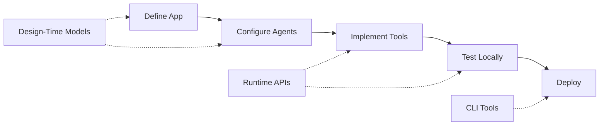
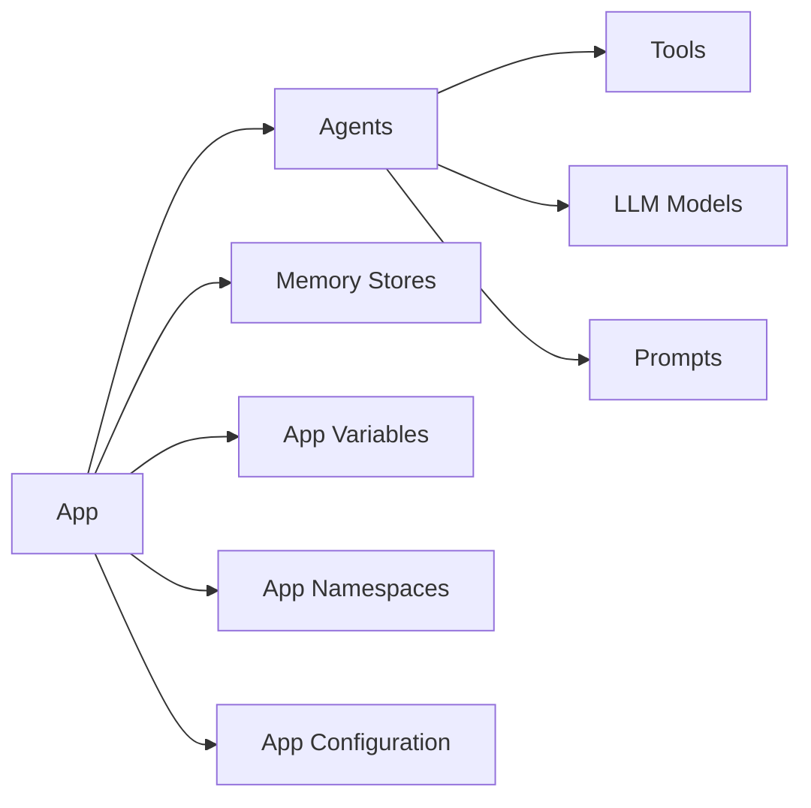
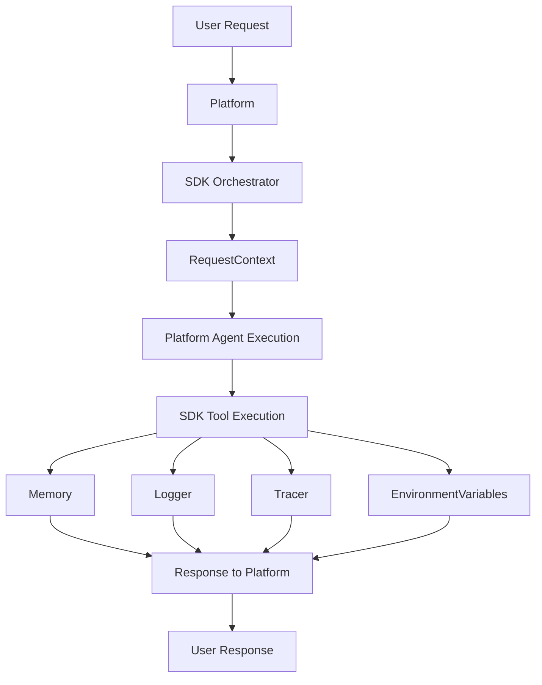

# API Reference

The AgenticAI Core SDK provides two categories of APIs:

- **Design-time models** — Define your app structure, agents, tools, LLM configuration, memory stores, and environment variables before deployment.
- **Runtime APIs** — Access session context, environment variables, memory, logging, and tracing from within your tools and orchestrators during request processing.

The diagram below shows how these API categories map to the development workflow.



## Quick Start

The following examples show a minimal app definition and a tool implementation that uses runtime services.

<AccordionGroup>
  <Accordion title="Define an app">

```python
from agenticai_core.designtime.models.app import App, OrchestratorType
from agenticai_core.designtime.models.agent import Agent
from agenticai_core.designtime.models.llm_model import LlmModel
from agenticai_core.designtime.models.tool import Tool

app = App(
    name="My Assistant",
    orchestrationType=OrchestratorType.CUSTOM_SUPERVISOR,
    agents=[
        Agent(
            name="HelperAgent",
            llm_model=LlmModel(model="gpt-4o-mini", provider="Open AI", connection_name="Default Connection"),
            tools=[Tool(name="MyTool", type="MCP")]
        )
    ]
)
```
  </Accordion>

  <Accordion title="Implement a tool">
```python
from agenticai_core.designtime.models.tool import Tool
from agenticai_core.runtime.sessions.request_context import RequestContext, Logger

@Tool.register(name="MyTool", description="Example tool")
async def my_tool():
    ctx = RequestContext()
    logger = Logger('MyTool')

    await logger.info("Tool executed")
    return {"success": True}
```
  </Accordion>

  <Accordion title="Deploy">
```bash
python run.py package -o my-app
python run.py config -u prod
python run.py deploy -f bin/my-app/application.kar
```
  </Accordion>
</AccordionGroup>

---

## Design-Time APIs

Design-time models are the blueprint of your application. Use them to define app structure, configure agents, and set up tools, memory stores, and environment variables before deployment.

The diagram below shows how the core models relate to each other.



**Core models:**

| Model                       | Purpose                                                                           |
|-----------------------------|-----------------------------------------------------------------------------------|
| [App](#app)                 | Top-level application container. Defines orchestration strategy and holds agents. |
| [Agent](#agent)             | AI agent definition. Configures behavior, tools, and LLM.                         |
| [Tool](#tool)               | Agent capability. Supports MCP, inline, and library tool types.                   |
| [LlmModel](#llmmodel)       | LLM configuration. Specifies provider, model, and generation parameters.          |
| [Prompt](#prompt)           | Agent instructions. Defines system prompt, custom behavior, and rules.            |
| [MemoryStore](#memorystore) | Persistent storage. Configures schemas, scoping, and retention.                   |

**Configuration models:**

| Model                                 | Purpose                                                          |
|---------------------------------------|------------------------------------------------------------------|
| [AppConfiguration](#appconfiguration) | Advanced app features — streaming, attachments, filler messages. |
| [AppNamespace](#appnamespace)         | Logical groupings for scoping app variables.                     |
| [AppVariable](#appvariable)           | Environment variables scoped to namespaces.                      |
| [Icon](#icon)                         | Visual identifiers for apps and agents.                          |

---

### App

`from agenticai_core.designtime.models.app import App, OrchestratorType, AppBuilder`

The top-level container for your application. It holds agents, memory stores, namespaces, variables, and configuration.

**Parameters:**

| Parameter           | Type                 | Required | Description                                        |
|---------------------|----------------------|----------|----------------------------------------------------|
| `name`              | `str`                | Yes      | Application name.                                  |
| `description`       | `str`                | No       | Application description.                           |
| `orchestrationType` | `OrchestratorType`   | No       | Orchestration strategy. Default: platform-managed. |
| `ai_model`          | `LlmModel`           | No       | Default LLM model for the app.                     |
| `agents`            | `list[Agent]`        | No       | Agents in the application.                         |
| `app_icon`          | `Icon`               | No       | App icon.                                          |
| `memory_stores`     | `list[MemoryStore]`  | No       | Persistent memory stores.                          |
| `app_namespaces`    | `list[AppNamespace]` | No       | Logical variable namespaces.                       |
| `app_variables`     | `list[AppVariable]`  | No       | Environment variables.                             |
| `app_configuration` | `AppConfigurations`  | No       | Advanced feature configuration.                    |

**OrchestratorType:**

| Value                                | Description                                                                       |
|--------------------------------------|-----------------------------------------------------------------------------------|
| `OrchestratorType.CUSTOM_SUPERVISOR` | Custom supervisor orchestration using your `AbstractOrchestrator` implementation. |

**AppBuilder methods:**

| Method                         | Description                                      |
|--------------------------------|--------------------------------------------------|
| `.set_name(name)`              | Sets the application name.                       |
| `.set_description(desc)`       | Sets the application description.                |
| `.set_orchestrator_type(type)` | Sets the orchestration type.                     |
| `.set_agents(agents)`          | Sets the list of agents.                         |
| `.set_memory_stores(stores)`   | Sets the list of memory stores.                  |
| `.build()`                     | Returns a `dict` suitable for `App(**app_dict)`. |

<AccordionGroup>
  <Accordion title="Direct instantiation">
```python expandable=true
from agenticai_core.designtime.models.app import App, OrchestratorType
from agenticai_core.designtime.models.llm_model import LlmModel, LlmModelConfig

app = App(
    name="Personal Banker",
    description="Banking assistant application",
    orchestrationType=OrchestratorType.CUSTOM_SUPERVISOR,
    ai_model=LlmModel(
        model="gpt-4o",
        provider="Open AI",
        connection_name="Default Connection",
        modelConfig=LlmModelConfig(temperature=0.7, max_tokens=1600)
    ),
    agents=[agent1, agent2]
)
```
  </Accordion>

  <Accordion title="Builder pattern">
```python
from agenticai_core.designtime.models.app import AppBuilder

app_dict = AppBuilder() \
    .set_name("My Banking App") \
    .set_description("Comprehensive banking services") \
    .set_orchestrator_type(OrchestratorType.CUSTOM_SUPERVISOR) \
    .set_agents([agent1, agent2]) \
    .set_memory_stores([memory_store]) \
    .build()

app = App(**app_dict)
```
  </Accordion>

  <Accordion title="Multi-agent application">
```python
app = App(
    name="Customer Service",
    orchestrationType=OrchestratorType.CUSTOM_SUPERVISOR,
    agents=[
        Agent(name="RoutingAgent", role=AgentRole.SUPERVISOR),
        Agent(name="SupportAgent", role=AgentRole.WORKER),
        Agent(name="BillingAgent", role=AgentRole.WORKER)
    ]
)
```
  </Accordion>
</AccordionGroup>

---

### Agent

`from agenticai_core.designtime.models.agent import Agent, AgentRole, AgentSubType, AgentType, AgentBuilder`

Defines an AI agent's behavior, capabilities, and LLM configuration.

**Parameters:**

| Parameter      | Type           | Required | Description                      |
|----------------|----------------|----------|----------------------------------|
| `name`         | `str`          | Yes      | Agent name.                      |
| `description`  | `str`          | No       | Agent description.               |
| `role`         | `AgentRole`    | No       | Agent role in orchestration.     |
| `sub_type`     | `AgentSubType` | No       | Agent reasoning pattern.         |
| `type`         | `AgentType`    | No       | Agent execution type.            |
| `llm_model`    | `LlmModel`     | No       | LLM configuration for the agent. |
| `prompt`       | `Prompt`       | No       | System and custom instructions.  |
| `tools`        | `list[Tool]`   | No       | Tools available to the agent.    |
| `icon`         | `Icon`         | No       | Visual identifier.               |
| `agent_config` | `AgentConfig`  | No       | Advanced agent prompt overrides. |

**Supporting enumerations:**

| Enum           | Values                 | Description            |
|----------------|------------------------|------------------------|
| `AgentRole`    | `SUPERVISOR`, `WORKER` | Role in orchestration. |
| `AgentSubType` | `REACT`                | Reasoning pattern.     |
| `AgentType`    | `AUTONOMOUS`           | Execution mode.        |

**AgentConfig parameters** (optional overrides for agent prompts):

| Parameter         | Type  | Description                              |
|-------------------|-------|------------------------------------------|
| `react_prompt`    | `str` | Override for the ReAct reasoning prompt. |
| `planner_prompt`  | `str` | Override for the planner prompt.         |
| `executor_prompt` | `str` | Override for the executor prompt.        |

**Key method:** `agent.to_agent_meta()` → `AgentMeta` — Returns a lightweight representation used for orchestrator registration.

<AccordionGroup>
  <Accordion title="Basic agent">
```python
from agenticai_core.designtime.models.agent import Agent, AgentRole, AgentSubType, AgentType
from agenticai_core.designtime.models.llm_model import LlmModel, LlmModelConfig
from agenticai_core.designtime.models.prompt import Prompt
from agenticai_core.designtime.models.tool import Tool

agent = Agent(
    name="FinanceAssist",
    description="Banking assistant for account management",
    role=AgentRole.WORKER,
    sub_type=AgentSubType.REACT,
    type=AgentType.AUTONOMOUS,
    llm_model=LlmModel(
        model="gpt-4o",
        provider="Open AI",
        connection_name="Default Connection",
        modelConfig=LlmModelConfig(temperature=0.7, max_tokens=1600)
    ),
    prompt=Prompt(
        system="You are a helpful banking assistant.",
        custom="Assist with account inquiries and transactions."
    ),
    tools=[Tool(name="Get_Balance", type="MCP")]
)
```
</Accordion>

<Accordion title="Builder pattern">
```python
from agenticai_core.designtime.models.agent import AgentBuilder

agent_dict = AgentBuilder() \
    .set_name("CustomerService") \
    .set_description("Customer service agent") \
    .set_role(AgentRole.WORKER) \
    .set_sub_type(AgentSubType.REACT) \
    .set_type(AgentType.AUTONOMOUS) \
    .set_llm_model(llm_model) \
    .set_prompt(prompt) \
    .set_tools([tool1, tool2]) \
    .build()

agent = Agent(**agent_dict)
```
</Accordion>
</AccordionGroup>

---

### Tool

`from agenticai_core.designtime.models.tool import Tool, ToolBuilder`

Defines a capability available to agents. Supports MCP tools (custom Python functions), inline tools, tool library tools, and more.

**Parameters:**

| Parameter       | Type         | Required | Description                                                               |
|-----------------|--------------|----------|---------------------------------------------------------------------------|
| `name`          | `str`        | Yes      | Tool name. Must match the registered function name for MCP tools.         |
| `description`   | `str`        | No       | Tool description shown to the agent.                                      |
| `type`          | `str`        | Yes      | Tool type. See [Tool types](#tool-types) below.                           |
| `code_type`     | `str`        | No       | Code language for inline tools — `javascript` or `python`.                |
| `func`          | `str`        | No       | Inline tool code body.                                                    |
| `return_direct` | `bool`       | No       | If `True`, returns tool output directly without further agent processing. |
| `properties`    | `list[dict]` | No       | Parameter definitions for `toolLibrary` tools.                            |

**Tool types:**

| Type          | Description                                                                          |
|---------------|--------------------------------------------------------------------------------------|
| `MCP`         | Custom Python function registered with `@Tool.register`. Runs as an MCP server tool. |
| `inlineTool`  | JavaScript or Python code that executes inline within the agent runtime.             |
| `toolLibrary` | Pre-built tool from the platform's tool library.                                     |
| `KNOWLEDGE`   | Knowledge base or RAG tool for semantic search.                                      |
| `customTool`  | User-defined tool with custom logic.                                                 |

Use the `@Tool.register` decorator to register Python functions as MCP tools:

<AccordionGroup>
<Accordion title="Registering MCP tools">
```python
@Tool.register(name="tool_name", description="What this tool does")
async def tool_function(param1: str, param2: int):
    # Implementation
    return result
```
</Accordion>
<Accordion title="MCP tool (custom Python function)">
```python
from agenticai_core.designtime.models.tool import Tool

@Tool.register(name="get_weather", description="Get current weather for a location")
def get_weather(location: str):
    return {"temp": 72, "condition": "sunny"}
```
  </Accordion>

  <Accordion title="Inline tool">
```python
tool = Tool(
    name="Get_AccountInfo",
    description="Gets the account information for the user",
    type="inlineTool",
    code_type="javascript",
    func="""
    const account = await fetchAccount(userId);
    return account;
    """,
    return_direct=False
)
```
  </Accordion>
  <Accordion title="Tool library tool">
```python
tool = Tool(
    name="Transfer_Funds",
    description="Transfers funds between accounts",
    type="toolLibrary",
    properties=[
        {"property": "from_account", "type": "string", "required": True, "description": "Source account ID"},
        {"property": "to_account", "type": "string", "required": True, "description": "Destination account ID"},
        {"property": "amount", "type": "number", "required": True, "description": "Amount to transfer"}
    ]
)
```
  </Accordion>
  <Accordion title="Builder pattern">
```python
from agenticai_core.designtime.models.tool import ToolBuilder

tool_dict = ToolBuilder() \
    .set_name("Get_AccountInfo") \
    .set_description("Gets account information") \
    .set_type("inlineTool") \
    .set_code_type("javascript") \
    .set_func("return await getAccount();") \
    .set_return_direct(False) \
    .build()

tool = Tool(**tool_dict)
```
 </Accordion>
</AccordionGroup>

---

### LlmModel

`from agenticai_core.designtime.models.llm_model import LlmModel, LlmModelConfig, LlmModelBuilder`

Configures the language model for an agent or app.

**LlmModel parameters:**

| Parameter         | Type             | Required | Description                                                             |
|-------------------|------------------|----------|-------------------------------------------------------------------------|
| `model`           | `str`            | Yes      | Model identifier (for example, `gpt-4o`, `claude-3-5-sonnet-20240620`). |
| `provider`        | `str`            | Yes      | Provider name — `Open AI`, `Anthropic`, `Azure OpenAI`.                 |
| `connection_name` | `str`            | Yes      | Platform connection name.                                               |
| `max_timeout`     | `str`            | No       | Request timeout (for example, `"60 Secs"`).                             |
| `max_iterations`  | `str`            | No       | Maximum reasoning iterations (for example, `"25"`).                     |
| `modelConfig`     | `LlmModelConfig` | No       | Generation parameter configuration.                                     |

**LlmModelConfig parameters:**

| Parameter           | Type    | Range   | Description                                               |
|---------------------|---------|---------|-----------------------------------------------------------|
| `temperature`       | `float` | 0.0-2.0 | Response creativity. Lower values are more deterministic. |
| `max_tokens`        | `int`   | —       | Maximum tokens in the response.                           |
| `top_p`             | `float` | 0.0-1.0 | Nucleus sampling parameter.                               |
| `frequency_penalty` | `float` | —       | Penalizes repeated tokens (OpenAI).                       |
| `presence_penalty`  | `float` | —       | Penalizes tokens already present in context (OpenAI).     |
| `top_k`             | `int`   | —       | Top-K sampling (Anthropic-specific).                      |

**Temperature guidance:**

| Range   | Behavior                                            |
|---------|-----------------------------------------------------|
| 0.0-0.3 | Deterministic. Use for factual or structured tasks. |
| 0.4-0.7 | Balanced. Good for most conversational tasks.       |
| 0.8-1.5 | Creative. Use for generative or open-ended tasks.   |
| 1.6-2.0 | Highly random. Experimental only.                   |

<AccordionGroup>
  <Accordion title="OpenAI">

```python
from agenticai_core.designtime.models.llm_model import LlmModel, LlmModelConfig

llm = LlmModel(
    model="gpt-4o",
    provider="Open AI",
    connection_name="OpenAI Connection",
    modelConfig=LlmModelConfig(temperature=0.7, max_tokens=1600, top_p=1.0)
)
```
</Accordion>
<Accordion title="Anthropic">
```python
llm = LlmModel(
    model="claude-3-5-sonnet-20240620",
    provider="Anthropic",
    connection_name="Anthropic Connection",
    modelConfig=LlmModelConfig(temperature=1.0, max_tokens=1024, top_p=0.7, top_k=5)
)
```
</Accordion>
<Accordion title="Azure OpenAI">
```python
llm = LlmModel(
    model="gpt-4",
    provider="Azure OpenAI",
    connection_name="Azure Connection",
    modelConfig=LlmModelConfig(temperature=0.8, max_tokens=2048)
)
```
</Accordion>
<Accordion title="Builder pattern">
```python
from agenticai_core.designtime.models.llm_model import LlmModelBuilder, LlmModelConfigBuilder, LlmModelConfig

config_dict = LlmModelConfigBuilder() \
    .set_temperature(0.7) \
    .set_max_tokens(1600) \
    .set_top_p(0.9) \
    .build()

llm_dict = LlmModelBuilder() \
    .set_model("gpt-4o") \
    .set_provider("Open AI") \
    .set_connection_name("Default Connection") \
    .set_model_config(LlmModelConfig(**config_dict)) \
    .build()

llm = LlmModel(**llm_dict)
```
</Accordion>
</AccordionGroup>

---

### Prompt

`from agenticai_core.designtime.models.prompt import Prompt`

Defines the system instructions and behavioral rules for an agent.

**Parameters:**

| Parameter      | Type        | Description                                                             |
|----------------|-------------|-------------------------------------------------------------------------|
| `system`       | `str`       | Base system prompt (for example, "You are a helpful assistant.").       |
| `custom`       | `str`       | Custom instructions defining the agent's specific role and behavior.    |
| `instructions` | `list[str]` | Additional rules or guidelines rendered as separate instruction blocks. |

**Template variables** — Resolved at runtime in `custom` and `instructions`:

| Variable                      | Description                      |
|-------------------------------|----------------------------------|
| `{{app_name}}`                | Application name.                |
| `{{app_description}}`         | Application description.         |
| `{{agent_name}}`              | Current agent name.              |
| `{{memory.store_name.field}}` | Value from a memory store field. |
| `{{session_id}}`              | Current session identifier.      |

<AccordionGroup>
<Accordion title="Basic prompt">
```python
from agenticai_core.designtime.models.prompt import Prompt

prompt = Prompt(
    system="You are a helpful assistant.",
    custom="You assist users with banking operations."
)
```
</Accordion>
<Accordion title="With instructions">
```python
prompt = Prompt(
    system="You are a banking assistant.",
    custom="You help customers manage accounts and transactions.",
    instructions=[
        "Never ask for passwords or PINs.",
        "Always confirm transaction amounts.",
        "Be professional and courteous."
    ]
)
```
</Accordion>
<Accordion title="With memory context injection">
```python
prompt = Prompt(
    system="You are a helpful assistant.",
    custom="""You are an intelligent banking assistant.

    The customer's account information:
    {{memory.accountInfo.accounts}}

    Use this to answer account queries without invoking tools.
    """,
    instructions=[
        "Never ask for or store passwords, PINs, CVV numbers, or OTPs.",
        "Keep responses concise and provide key information first."
    ]
)
```
</Accordion>
<Accordion title="Orchestrator prompt">
```python
supervisor_prompt = Prompt(
    system="You are a helpful assistant.",
    custom="""You are acting as an AI Supervisor for "{{app_name}}".

    {{app_description}}

    ### Rules:
    1. Small-talk: Respond directly to the user.
    2. Direct routing: Match requests to workers by expertise.
    3. Multi-intent: Break into individual requests and route each.
    """
)
```
</Accordion>
</AccordionGroup>

---

### MemoryStore

`from agenticai_core.designtime.models.memory_store import MemoryStore, Namespace, RetentionPolicy, Scope, RetentionPeriod, NamespaceType`

Configures persistent data storage for your application. You access memory stores at runtime via the [Memory](#memory) runtime API.

**MemoryStore parameters:**

| Parameter           | Type              | Required | Description                                                        |
|---------------------|-------------------|----------|--------------------------------------------------------------------|
| `name`              | `str`             | Yes      | Display name.                                                      |
| `technical_name`    | `str`             | Yes      | Code identifier used to access the store at runtime.               |
| `type`              | `str`             | Yes      | Store type — `hotpath`, `persistent`, `global`.                    |
| `description`       | `str`             | No       | Description of what the store contains.                            |
| `schema_definition` | `dict`            | Yes      | JSON Schema defining the data structure.                           |
| `strict_schema`     | `bool`            | No       | If `True`, enforces schema validation. Recommended for production. |
| `namespaces`        | `list[Namespace]` | No       | Data isolation identifiers.                                        |
| `scope`             | `Scope`           | Yes      | Access control scope.                                              |
| `retention_policy`  | `RetentionPolicy` | Yes      | Data retention configuration.                                      |

**Scope values:**

| Value                    | Description                                              |
|--------------------------|----------------------------------------------------------|
| `Scope.USER_SPECIFIC`    | Data unique to each user. Recommended for personal data. |
| `Scope.APPLICATION_WIDE` | Data shared across all users. Use for global settings.   |
| `Scope.SESSION_LEVEL`    | Temporary data cleared when the session ends.            |

**Namespace parameters:**

| Parameter     | Type            | Description                                                |
|---------------|-----------------|------------------------------------------------------------|
| `name`        | `str`           | Namespace identifier.                                      |
| `type`        | `NamespaceType` | `DYNAMIC` (resolved at runtime) or `STATIC` (fixed value). |
| `value`       | `str`           | Value or template (for example, `"{user_id}"`).            |
| `description` | `str`           | Optional description.                                      |

**RetentionPolicy parameters:**

| Parameter | Type              | Description                                                              |
|-----------|-------------------|--------------------------------------------------------------------------|
| `type`    | `RetentionPeriod` | `SESSION`, `DAY`, `WEEK`, or `MONTH`.                                    |
| `value`   | `int`             | Number of periods to retain data (for example, `7` with `DAY` = 7 days). |

<AccordionGroup>
  <Accordion title="Session-scoped store">
```python 
from agenticai_core.designtime.models.memory_store import (
    MemoryStore, Namespace, NamespaceType,
    RetentionPolicy, RetentionPeriod, Scope
)

memory_store = MemoryStore(
    name="Account Information",
    technical_name="accountInfo",
    type="hotpath",
    description="Stores user account balances and details",
    schema_definition={
        "type": "object",
        "properties": {
            "accounts": {
                "type": "array",
                "items": {
                    "type": "object",
                    "properties": {
                        "account_id": {"type": "string"},
                        "balance": {"type": "number"},
                        "currency": {"type": "string"}
                    }
                }
            }
        }
    },
    strict_schema=False,
    namespaces=[
        Namespace(name="session_id", type=NamespaceType.DYNAMIC, value="{session_id}")
    ],
    scope=Scope.SESSION_LEVEL,
    retention_policy=RetentionPolicy(type=RetentionPeriod.SESSION, value=1)
)
```
  </Accordion>

  <Accordion title="User-specific store">
```python
user_preferences = MemoryStore(
    name="User Preferences",
    technical_name="userPrefs",
    type="persistent",
    description="User preference and settings",
    schema_definition={
        "type": "object",
        "properties": {
            "theme": {"type": "string"},
            "language": {"type": "string"},
            "notifications": {"type": "boolean"}
        }
    },
    strict_schema=True,
    namespaces=[
        Namespace(name="user_id", type=NamespaceType.DYNAMIC, value="{user_id}")
    ],
    scope=Scope.USER_SPECIFIC,
    retention_policy=RetentionPolicy(type=RetentionPeriod.MONTH, value=6)
)
```
  </Accordion>
</AccordionGroup>


- Define clear, focused schemas. Use `strict_schema=True` in production.
- Use `USER_SPECIFIC` for personal data, `APPLICATION_WIDE` for shared resources, and `SESSION_LEVEL` for temporary state.
- Match `technical_name` to how you'll reference the store in runtime code.
- Choose retention policies based on data sensitivity and privacy requirements.
- Use `DYNAMIC` namespaces to isolate data per user or session.

---

### AppConfiguration

`from agenticai_core.designtime.models.app_configuration import AppConfigurations, FillerMessages, FillerMessageMode, StaticConfig, DynamicConfig`

Configures advanced app features such as streaming, file attachments, external agent integration, and filler messages.

**AppConfigurations parameters:**

| Parameter         | Type             | Description                                                                                          |
|-------------------|------------------|------------------------------------------------------------------------------------------------------|
| `streaming`       | `bool`           | Enables token-by-token streaming of LLM responses.                                                   |
| `attachments`     | `dict`           | File upload settings — `enabled`, `maxFileCount`, `maxFileSize` (MB), `maxTokens`, `supportedTypes`. |
| `external_agent`  | `dict`           | External agent integration — `enabled`, `endpoint`, `timeout`.                                       |
| `filler_messages` | `FillerMessages` | Messages shown to users while agents process requests.                                               |

**FillerMessages parameters:**

| Parameter           | Type                | Description                                                     |
|---------------------|---------------------|-----------------------------------------------------------------|
| `enabled`           | `bool`              | Enables filler messages.                                        |
| `initial_delay`     | `int`               | Delay in milliseconds before showing the first message.         |
| `interval_duration` | `int`               | Interval in milliseconds between messages.                      |
| `max_message_count` | `int`               | Maximum number of messages to show.                             |
| `mode`              | `FillerMessageMode` | `STATIC` (pre-defined list) or `DYNAMIC` (AI-generated).        |
| `static_config`     | `StaticConfig`      | Required when `mode=STATIC`. List of `{type, value}` messages.  |
| `dynamic_config`    | `DynamicConfig`     | Required when `mode=DYNAMIC`. Specifies LLM and context window. |

<AccordionGroup>
<Accordion title="Static filler messages">
```python
from agenticai_core.designtime.models.app_configuration import (
    AppConfigurations, FillerMessages, FillerMessageMode, StaticConfig
)

filler = FillerMessages(
    enabled=True,
    initial_delay=1000,
    interval_duration=2000,
    max_message_count=4,
    mode=FillerMessageMode.STATIC,
    static_config=StaticConfig(
        messages=[
            {"type": "text", "value": "Processing your request..."},
            {"type": "text", "value": "Almost there..."}
        ]
    )
)

config = AppConfigurations(streaming=True, filler_messages=filler)
```
</Accordion>
<Accordion title="Dynamic filler messages">
```python
from agenticai_core.designtime.models.app_configuration import (
    FillerMessages, FillerMessageMode, DynamicConfig
)
from agenticai_core.designtime.models.llm_model import LlmModel, LlmModelConfig

filler = FillerMessages(
    enabled=True,
    initial_delay=1000,
    interval_duration=2000,
    max_message_count=4,
    mode=FillerMessageMode.DYNAMIC,
    dynamic_config=DynamicConfig(
        llm_model=LlmModel(
            provider="Anthropic",
            model="claude-3-5-sonnet-20240620",
            connection_name="Default Connection",
            modelConfig=LlmModelConfig(temperature=1.0, top_p=0.7, top_k=5, max_tokens=1024)
        ),
        llm_timeout="1s",
        context_window=50
    )
)
```
</Accordion>
</AccordionGroup>

---

### AppNamespace

`from agenticai_core.designtime.models.app_namespace import AppNamespace`

Defines logical groupings for scoping app variables. Namespaces represent functional areas (for example, `authentication`, `database`), not environments — the platform resolves environment-specific variables automatically based on deployment context.

**Parameters:**

| Parameter     | Type  | Required | Description                                           |
|---------------|-------|----------|-------------------------------------------------------|
| `name`        | `str` | Yes      | Namespace identifier. Use lowercase with underscores. |
| `description` | `str` | No       | Description of the namespace's purpose.               |

<Note>Do not create namespaces for environments (for example, `development`, `production`). Use functional names like `authentication` or `database`. The platform handles environment resolution automatically. </Note>

<AccordionGroup>
  <Accordion title="Usage examples">

```python
from agenticai_core.designtime.models.app_namespace import AppNamespace

namespaces = [
    AppNamespace(name="default", description="Common application variables"),
    AppNamespace(name="authentication", description="User authentication and authorization"),
    AppNamespace(name="database", description="Database connections and queries"),
    AppNamespace(name="api_service", description="External API integrations")
]
```

  </Accordion>
</AccordionGroup>

---

### AppVariable

`from agenticai_core.designtime.models.app_variable import AppVariable`

Defines environment variables accessible in tool code and agent configurations. Variables are scoped to namespaces.

**Parameters:**

| Parameter    | Type        | Required | Description                                                               |
|--------------|-------------|----------|---------------------------------------------------------------------------|
| `name`       | `str`       | Yes      | Variable name (for example, `API_KEY`).                                   |
| `is_secured` | `bool`      | Yes      | If `True`, the value is treated as a secret.                              |
| `value`      | `str`       | Yes      | Literal value or `$env.VAR_NAME` to reference an OS environment variable. |
| `hint`       | `str`       | No       | Description of what this variable is used for.                            |
| `namespaces` | `list[str]` | No       | Namespaces where this variable is available. Empty list means global.     |

**Accessing variables in tool code:**

```python
# In inline tool code (JavaScript)
const apiUrl = $env.API_BASE_URL;
const apiKey = env.API_KEY;
```

```python
from agenticai_core.designtime.models.app_variable import AppVariable

variables = [
    # Global variable
    AppVariable(name="APP_NAME", is_secured=False, value="Banking Assistant", namespaces=[]),

    # Secured credential referencing an OS env var
    AppVariable(
        name="DATABASE_URL",
        is_secured=True,
        hint="Primary database connection",
        value="$env.DATABASE_URL",
        namespaces=["database"]
    ),

    # Non-sensitive configuration
    AppVariable(
        name="API_VERSION",
        is_secured=False,
        value="v2",
        namespaces=["default"]
    )
]
```

- Always set `is_secured=True` for credentials, API keys, tokens, and passwords.
- Use `$env.VAR_NAME` to reference OS environment variables rather than hardcoding secrets.
- Use a `default` namespace for variables that apply broadly.
- Set `namespaces=[]` for truly global variables available everywhere.

---

### Icon

`from agenticai_core.designtime.models.icon import Icon`

Defines visual identifiers for apps, agents, and tools.

**Parameters:**

| Parameter | Type  | Description                                                              |
|-----------|-------|--------------------------------------------------------------------------|
| `name`    | `str` | Icon identifier — for example, `avatar1`, `logo18`, `calendar-check-01`. |
| `color`   | `str` | Hex color (for example, `#B2CCFF`) or CSS gradient.                      |
| `type`    | `str` | `human` (avatar), `logo` (brand logo), or `icon` (action icon).          |

**Common icon names:**

| Type    | Names                                                                  |
|---------|------------------------------------------------------------------------|
| `human` | `avatar1`, `avatar2`, `avatar3`                                        |
| `logo`  | `logo1` through `logo20`                                               |
| `icon`  | `calendar-check-01`, `briefcase-02`, `credit-card-02`, `microphone-01` |

<AccordionGroup>
  <Accordion title="Usage examples">

```python
from agenticai_core.designtime.models.icon import Icon

# Avatar for an agent
agent_icon = Icon(name="avatar1", color="#B2CCFF", type="human")

# Logo with gradient
app_logo = Icon(
    name="logo18",
    color="linear-gradient(45deg, #528BFF 0%, #004EEB 100%)",
    type="logo"
)

# Action icon for a tool
tool_icon = Icon(name="calendar-check-01", color="#32D583", type="icon")
```

  </Accordion>
</AccordionGroup>

---

## Runtime APIs

Runtime APIs provide access to services available during request processing. Use them inside your tool functions and orchestrator methods.

The diagram below shows how runtime services fit into the request flow.



**Message protocol flow:**

1. The user sends a request via the Platform interface.
2. The Platform (MCP Client) calls the SDK Orchestrator (MCP Server).
3. The SDK Orchestrator receives a `MessageItem` and returns a `ToolCall`.
4. The Platform Agent executes based on the orchestrator's routing.
5. The Platform calls back to SDK tools, which use runtime services to process the request.
6. Results flow back through the Platform to the user.

**Available runtime services:**

| Service                | Import                                            | Purpose                                                        |
|------------------------|---------------------------------------------------|----------------------------------------------------------------|
| `RequestContext`       | `agenticai_core.runtime.sessions.request_context` | Access request info and get handles to other runtime services. |
| `EnvironmentVariables` | Accessed via `RequestContext`                     | Read app variables configured at design-time.                  |
| `Memory`               | Accessed via `RequestContext`                     | Read and write persistent memory store data.                   |
| `Logger`               | `agenticai_core.runtime.sessions.request_context` | Structured logging with automatic session context.             |
| `Tracer`               | `agenticai_core.runtime.trace._langfuse_tracer`   | Distributed tracing via Langfuse.                              |

---

### RequestContext

`from agenticai_core.runtime.sessions.request_context import RequestContext`

Provides access to request and session information and returns handles to all other runtime services. Always initialize `RequestContext` **inside** your tool or orchestrator method. Never initialize it at module level — it depends on active HTTP request headers that only exist during request processing.

```python
# Correct
@Tool.register(name="my_tool", description="...")
async def my_tool():
    ctx = RequestContext()  # Inside the function

# Wrong — will crash at import time
ctx = RequestContext()
@Tool.register(name="my_tool", description="...")
async def my_tool():
    user_id = ctx.context.get('userId')  # RuntimeError
```

**Properties and methods:**

| Property/Method                         | Returns                | Description                                                 |
|-----------------------------------------|------------------------|-------------------------------------------------------------|
| `ctx.request_id`                        | `str`                  | Unique identifier for the current request.                  |
| `ctx.context`                           | `dict`                 | Request context data. Keys: `userId`, `sessionId`, `appId`. |
| `ctx.host`                              | `str`                  | Platform host URL.                                          |
| `ctx.get_memory()`                      | `MemoryManager`        | Returns a memory manager for all configured stores.         |
| `ctx.get_memory_store_manager(name)`    | `MemoryStoreManager`   | Returns an async context manager for a specific store.      |
| `await ctx.get_environment_variables()` | `EnvironmentVariables` | Returns an accessor for app variables.                      |

<AccordionGroup>
  <Accordion title="Usage example">

```python
from agenticai_core.runtime.sessions.request_context import RequestContext

@Tool.register(name="demo_tool", description="RequestContext demo")
async def demo_tool():
    ctx = RequestContext()

    user_id = ctx.context.get('userId')
    session_id = ctx.context.get('sessionId')
    app_id = ctx.context.get('appId')

    env = await ctx.get_environment_variables()
    memory = ctx.get_memory()

    return {"user_id": user_id, "session_id": session_id}
```

  </Accordion>
</AccordionGroup>

---

### EnvironmentVariables

Accessed via `await ctx.get_environment_variables()`.

Provides attribute-style access to app variables configured at design-time using `AppVariable`.

**Access patterns:**

| Pattern                        | Description                                                    |
|--------------------------------|----------------------------------------------------------------|
| `env.VAR_NAME`                 | Direct attribute access. Raises `AttributeError` if not found. |
| `env.get('VAR_NAME', default)` | Safe access with a default value.                              |
| `'VAR_NAME' in env`            | Check if a variable exists.                                    |
| `env.keys()`                   | List all available variable names.                             |

<AccordionGroup>
  <Accordion title="Usage examples">

**Basic access:**

```python
@Tool.register(name="config_tool", description="Access environment variables")
async def config_tool():
    ctx = RequestContext()
    env = await ctx.get_environment_variables()

    # Direct access (raises AttributeError if missing)
    api_url = env.API_BASE_URL

    # Safe access with default
    timeout = int(env.get('TIMEOUT', '30'))
    retry_count = int(env.get('RETRY_COUNT', '3'))

    # Existence check
    debug_enabled = env.DEBUG_MODE.lower() == 'true' if 'DEBUG_MODE' in env else False

    return {"api_url": api_url, "timeout": timeout}
```

**Type conversion:**

```python
config = {
    "api_url": env.get('API_URL', 'https://api.example.com'),
    "port": int(env.get('PORT', '8080')),
    "debug": env.get('DEBUG', 'false').lower() == 'true',
    "allowed_hosts": env.get('ALLOWED_HOSTS', 'localhost').split(',')
}
```

  </Accordion>
  <Accordion title="Best practices">

- Call `get_environment_variables()` once per tool invocation and reuse the result.
- Use `env.get(name, default)` for optional variables to avoid `AttributeError`.
- Never log variables that contain `key`, `secret`, `password`, or `token` in their names. Redact them in output. 
</Accordion>
</AccordionGroup>

---

### Memory

Accessed via `ctx.get_memory()` or `ctx.get_memory_store_manager(name)`.

Provides read, write, and delete operations on memory stores configured at design-time with [MemoryStore](#memorystore).

**MemoryManager methods** (from `ctx.get_memory()`):

| Method                                              | Description                                                                                             |
|-----------------------------------------------------|---------------------------------------------------------------------------------------------------------|
| `await memory.get_content(store_name, projections)` | Reads data from a store. `projections` is a dict of `{field: 1}` to include or `{field: 0}` to exclude. |
| `await memory.set_content(store_name, content)`     | Writes data to a store.                                                                                 |
| `await memory.delete_content(store_name)`           | Deletes all data from a store.                                                                          |

**MemoryStoreManager** (from `ctx.get_memory_store_manager(name)`):

An async context manager for operations on a single store.

| Method                         | Description                           |
|--------------------------------|---------------------------------------|
| `await store.get(projections)` | Reads data with optional projections. |
| `await store.set(content)`     | Writes data.                          |
| `await store.delete()`         | Deletes store data.                   |

<AccordionGroup>
  <Accordion title="Usage examples">

**Basic CRUD with MemoryManager:**

```python
@Tool.register(name="UserProfileManager", description="Manage user profile data")
async def manage_user_profile(action: str, data: dict = None):
    ctx = RequestContext()
    memory = ctx.get_memory()

    if action == "get_profile":
        result = await memory.get_content('user_preferences', {
            'firstname': 1, 'lastname': 1, 'email': 1
        })
        return {"profile": result.data} if result.success else {"profile": None}

    elif action == "update_profile":
        result = await memory.set_content('user_preferences', data)
        return {"success": result.success}

    elif action == "delete_profile":
        result = await memory.delete_content('user_preferences')
        return {"success": result.success}
```

**Store-specific operations with MemoryStoreManager:**

```python
@Tool.register(name="UserDataManager", description="Manage user data")
async def user_data_manager(data: dict = None):
    ctx = RequestContext()

    async with ctx.get_memory_store_manager('user_data') as store:
        if data:
            result = await store.set(data)
            return {"success": True}
        else:
            result = await store.get({'profile': 1, 'preferences': 1})
            return {"data": result}
```

**Multi-store operations:**

```python
@Tool.register(name="ShoppingCartManager", description="Manage cart and preferences")
async def manage_shopping_data():
    ctx = RequestContext()

    async with ctx.get_memory_store_manager('user_preferences') as prefs_store, \
               ctx.get_memory_store_manager('shopping_cart') as cart_store:

        prefs = await prefs_store.get({'preferred_currency': 1})
        currency = prefs.get('preferred_currency', 'USD') if prefs else 'USD'

        cart_data = await cart_store.get({'items': 1, 'total': 1})
        if cart_data:
            cart_data['currency'] = currency
            await cart_store.set(cart_data)

    return {"currency": currency}
```

**Projections — include and exclude fields:**

```python
# Include specific fields only
user_basic = await memory.get_content('user_profile', {
    'firstname': 1, 'lastname': 1, 'email': 1
})

# Exclude sensitive fields
user_safe = await memory.get_content('user_profile', {
    'password_hash': 0, 'ssn': 0
})

# Nested fields
user_address = await memory.get_content('user_profile', {
    'address.street': 1, 'address.city': 1
})
```

  </Accordion>
  <Accordion title="Best practices">

- Use projections to fetch only the fields you need. Avoid `{}` projections that return entire documents.
- Always check `result.success` before accessing `result.data`.
- Provide fallback values when memory is unavailable — don't let memory failures break tool responses.
- Use `MemoryStoreManager` as an async context manager for coordinated operations on a single store.

</Accordion>
</AccordionGroup>

---

### Logger

`from agenticai_core.runtime.sessions.request_context import Logger`

Provides structured logging with automatic session context (user ID, session ID) included in every log entry.

**Constructor:**

```python
Logger(name: str, request_context: RequestContext = None)
```

| Parameter         | Description                                                                                                 |
|-------------------|-------------------------------------------------------------------------------------------------------------|
| `name`            | Logger name, typically the tool or component name.                                                          |
| `request_context` | Optional. Pass a shared `RequestContext` instance to correlate logs with memory and environment operations. |

**Log methods:**

| Method                          | Level   | When to use                                                                |
|---------------------------------|---------|----------------------------------------------------------------------------|
| `await logger.debug(message)`   | DEBUG   | Detailed diagnostic info — variable values, entry/exit points.             |
| `await logger.info(message)`    | INFO    | Normal operation tracking — tool start, completion, successful operations. |
| `await logger.warning(message)` | WARNING | Conditions that don't prevent execution but need attention.                |
| `await logger.error(message)`   | ERROR   | Errors that prevent normal operation.                                      |

<AccordionGroup>
  <Accordion title="Usage examples">

**Basic logging:**

```python
from agenticai_core.runtime.sessions.request_context import Logger
from agenticai_core.designtime.models.tool import Tool

@Tool.register(name="my_tool", description="Tool with logging")
async def my_tool(operation: str):
    logger = Logger('MyTool')

    await logger.info(f"Starting operation: {operation}")

    try:
        result = {"success": True, "data": "processed"}
        await logger.info("Operation completed successfully")
        return result
    except Exception as e:
        await logger.error(f"Operation failed: {str(e)}")
        raise
```

**With shared RequestContext:**

```python
from agenticai_core.runtime.sessions.request_context import RequestContext, Logger

@Tool.register(name="integrated_tool", description="Tool with shared context")
async def integrated_tool():
    ctx = RequestContext()
    logger = Logger('IntegratedTool', request_context=ctx)

    env = await ctx.get_environment_variables()
    memory = ctx.get_memory()

    await logger.info("Tool execution completed")
    return {"success": True}
```

  </Accordion>
  <Accordion title="Troubleshooting">

**Logger not capturing session context:**

```python
# Pass a RequestContext instance when creating the logger
ctx = RequestContext()
logger = Logger('MyTool', request_context=ctx)
```

**Missing log output:**

```python
await logger.info("Message")  # Correct — always await
logger.info("Message")        # Wrong — missing await
```

**Performance impact from logging:**

```python
# Avoid expensive operations in log messages
if debug_enabled:
    await logger.debug(expensive_debug_info())
```

  </Accordion>
  <Accordion title="Best practices">

- Use descriptive logger names: `Logger('UserAuthTool')` not `Logger('Tool')`.
- Include relevant context: `f"Processing payment: amount={amount}, user={user_id}"`.
- Never log sensitive data. Sanitize or redact passwords, API keys, and tokens.
- Use DEBUG for diagnostics, INFO for normal operations, WARNING and ERROR for actionable issues.

 </Accordion>
</AccordionGroup>

---

### Tracer

`from agenticai_core.runtime.trace._langfuse_tracer import Tracer`

Provides distributed tracing for tool and orchestrator execution using Langfuse integration. The `@tracer.observe` decorator wraps functions to automatically capture inputs, outputs, timing, and session context.

**Configuration** — Set in your `.env` files:

| Variable              | Description                                                      |
|-----------------------|------------------------------------------------------------------|
| `LANGFUSE_PUBLIC_KEY` | Langfuse public key.                                             |
| `LANGFUSE_SECRET_KEY` | Langfuse secret key.                                             |
| `LANGFUSE_HOST`       | Langfuse server URL (for example, `https://cloud.langfuse.com`). |
| `TRACING_ENABLED`     | Set to `true` to enable tracing.                                 |

**Decorator:**

```python
@tracer.observe(span_name="Type:operation", kind="Tool", metadata={...})
```

| Parameter   | Description                                                                         |
|-------------|-------------------------------------------------------------------------------------|
| `span_name` | Span identifier. Use `Type:operation` convention (for example, `Tool:get_balance`). |
| `kind`      | Span type — `Tool`, `Agent`, `Orchestrator`, or `span`.                             |
| `metadata`  | Optional dict of additional contextual attributes.                                  |

**Span naming convention:**

| Prefix          | Use for                                                       |
|-----------------|---------------------------------------------------------------|
| `Tool:`         | Tool functions (for example, `Tool:get_balance`)              |
| `Agent:`        | Agent handlers (for example, `Agent:banking_assistant`)       |
| `Orchestrator:` | Orchestrator methods (for example, `Orchestrator:supervisor`) |
| `Database:`     | Database operations                                           |
| `API:`          | External API calls                                            |

**Automatically captured context:**

The tracer captures user ID, session ID, app ID, request ID, function arguments, return values, execution time, and exception details — without any additional code.

<AccordionGroup>
  <Accordion title="Usage examples">

**Tracing a tool:**

```python
from agenticai_core.runtime.trace._langfuse_tracer import Tracer
from agenticai_core.designtime.models.tool import Tool

tracer = Tracer()

@Tool.register(name="get_balance", description="Get account balance")
@tracer.observe(span_name="Tool:get_balance", kind="Tool")
async def get_balance(account_id: str) -> dict:
    balance = await fetch_balance_from_db(account_id)
    return {"account_id": account_id, "balance": balance, "currency": "USD"}
```

**Tracing an orchestrator:**

```python
from agenticai_core.runtime.agents.abstract_orchestrator import AbstractOrchestrator

class BankingOrchestrator(AbstractOrchestrator):

    def __init__(self, agents, **kwargs):
        super().__init__(name="BankingOrchestrator", agents=agents, **kwargs)
        self.tracer = Tracer()

    @tracer.observe(span_name="Orchestrator:handle_message", kind="Orchestrator")
    async def _handle_message(self, conversation):
        last_message = conversation[-1]
        response = await self.route_to_agent(last_message)
        return response
```

**With metadata:**

```python
@tracer.observe(
    span_name="Tool:process_payment",
    kind="Tool",
    metadata={"payment_method": "credit_card", "merchant": "acme_corp"}
)
async def process_payment(amount: float):
    ...
```

  </Accordion>
  <Accordion title="Troubleshooting">

**Tracing not working:**

```bash
# Verify environment variables are set
python -c "import os; print(os.getenv('TRACING_ENABLED'), os.getenv('LANGFUSE_HOST'))"
```

**Missing context in spans:**
- Ensure tracing occurs within an MCP request context, not at module level.
- Verify `.env` files are loaded before the tracer initializes.

**Performance issues:**
- Reduce span volume — only trace business-critical operations.
- Avoid large objects in `metadata`.

 </Accordion>
  <Accordion title="Best practices">

- Trace tools, agents, and orchestrators. Skip utility functions.
- Use descriptive `span_name` values — `Tool:validate_credit_card` not `tool1`.
- Add `metadata` that helps diagnose failures — operation type, service name, feature flags.
- Let the tracer capture exceptions automatically by re-raising them rather than swallowing.

 </Accordion>
</AccordionGroup>
