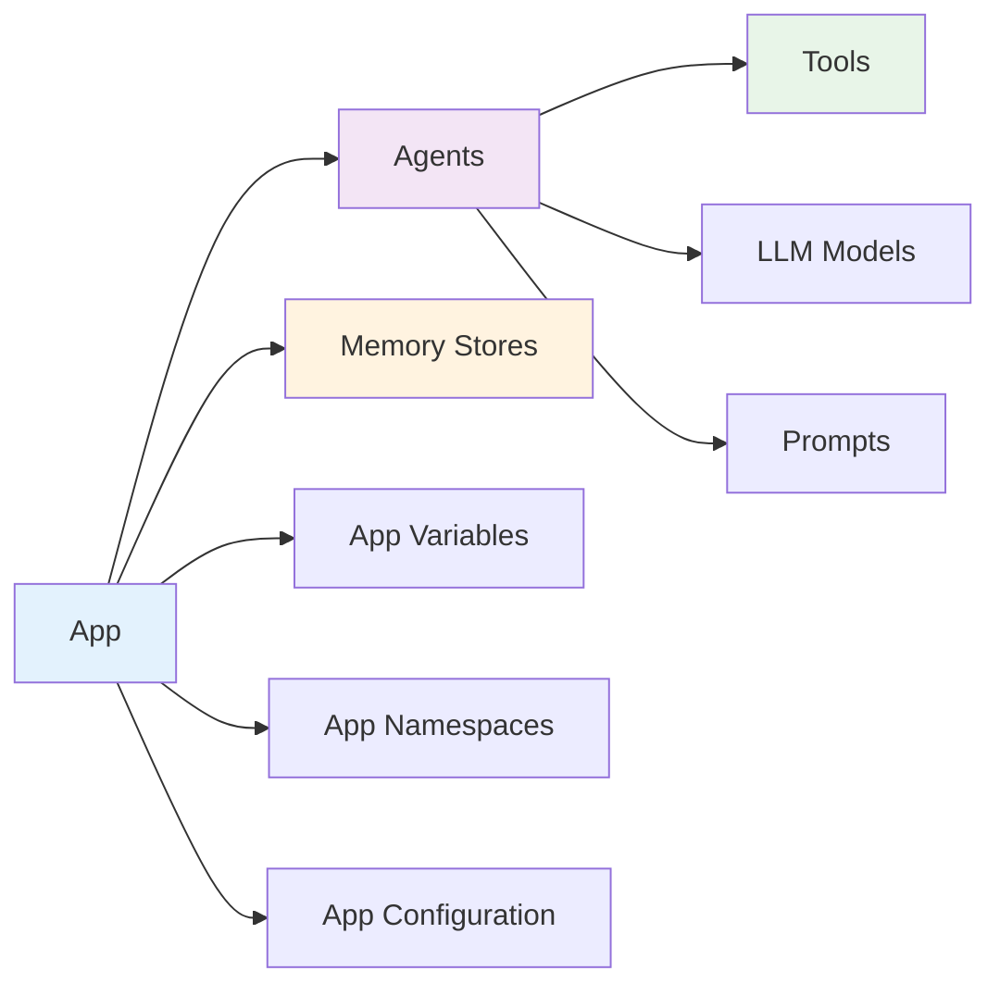

# Design-Time Models

Design-Time models define your AgenticAI application structure and configuration before runtime execution.

## What are Design-Time Models?

Design-Time models are the **blueprint** of your AI application:

- **Define** your app structure, agents, tools, and configuration
- **Configure** LLM models, prompts, memory stores, and environment variables  
- **Package** everything into a deployable application

Think of them as the architectural plans that get built into a running application.

## Application Building Flow



## Core Models

| Model | Purpose | Key Features |
|-------|---------|--------------|
| **[App](app.md)** | Top-level application container | Orchestration, agents, configuration |
| **[Agent](agent.md)** | AI agent definition | Behavior, tools, LLM configuration |
| **[Tool](tool.md)** | Agent capabilities | MCP tools, custom functions |
| **[LlmModel](llm_model.md)** | LLM configuration | Provider, model, parameters |
| **[Prompt](prompt.md)** | Agent instructions | System prompts, custom prompts |
| **[MemoryStore](memory_store.md)** | Persistent storage | Schemas, scoping, retention |

## Configuration Models

| Model | Purpose | Key Features |
|-------|---------|--------------|
| **[AppConfiguration](app_configuration.md)** | Advanced app features | Filler messages, behaviors |
| **[AppNamespace](app_namespace.md)** | Environment organization | Development, staging, production |
| **[AppVariable](app_variable.md)** | Environment variables | Scoped configuration, security |
| **[Icon](icon.md)** | Visual identifiers | App and agent icons |

## Basic Application Structure

```python
from agenticai_core.designtime.models import (
    App, Agent, Tool, LlmModel, Prompt, MemoryStore,
    AppNamespace, AppVariable
)

# 1. Configure LLM
llm_model = LlmModel(
    model="gpt-4o-mini",
    provider="Open AI",
    connection_name="Default Connection"
)

# 2. Define tools
tools = [
    Tool(name="GetBalance", type="MCP"),
    Tool(name="TransferFunds", type="MCP")
]

# 3. Create agent
agent = Agent(
    name="BankingAgent",
    llm_model=llm_model,
    prompt=Prompt(system="You are a banking assistant"),
    tools=tools
)

# 4. Configure memory stores
memory_store = MemoryStore(
    name="user_preferences",
    description="User preferences and settings"
)

# 5. Set up environment variables
app_variables = [
    AppVariable(
        name="API_KEY",
        is_secured=True,
        value="$env.API_KEY"
    )
]

# 6. Create application
app = App(
    name="Banking Assistant",
    agents=[agent],
    memory_stores=[memory_store],
    app_variables=app_variables
)
```

## Model Relationships

### App → Agents → Tools

```python
app = App(
    name="Multi-Agent System",
    agents=[
        Agent(name="SupportAgent", tools=[chat_tool, ticket_tool]),
        Agent(name="BillingAgent", tools=[payment_tool, invoice_tool])
    ]
)
```

### Memory Stores → Scoping

```python
user_store = MemoryStore(
    name="user_data", 
    scope=Scope.USER  # Scoped per user
)

session_store = MemoryStore(
    name="session_data",
    scope=Scope.SESSION  # Scoped per session  
)
```

### Environment → Namespaces

```python
# Production namespace
prod_ns = AppNamespace(name="production")

# Production-specific variables
prod_api = AppVariable(
    name="API_ENDPOINT",
    value="https://api.production.com", 
    namespaces=["production"]
)

app = App(
    app_namespaces=[prod_ns],
    app_variables=[prod_api]
)
```

## Common Patterns

### Multi-Agent Application

```python
app = App(
    name="Customer Service",
    orchestrationType=OrchestratorType.CUSTOM_SUPERVISOR,
    agents=[
        Agent(name="RoutingAgent", role="SUPERVISOR"),
        Agent(name="SupportAgent", role="WORKER"), 
        Agent(name="BillingAgent", role="WORKER")
    ]
)
```

### Environment-Specific Configuration

```python
app = App(
    app_namespaces=[
        AppNamespace(name="development"),
        AppNamespace(name="production")  
    ],
    app_variables=[
        AppVariable(name="API_URL", value="https://dev-api.com", namespaces=["development"]),
        AppVariable(name="API_URL", value="https://api.com", namespaces=["production"])
    ]
)
```

## Next Steps

**Start Building:**

- [App Model](app.md) - Define your application structure
- [Agent Model](agent.md) - Configure AI agents  
- [Tool Model](tool.md) - Define agent capabilities

**Advanced Configuration:**

- [Memory Stores](memory_store.md) - Persistent data storage
- [App Variables](app_variable.md) - Environment configuration
- [App Namespaces](app_namespace.md) - Environment organization

**Integration:**

- [Runtime APIs](../runtime/index.md) - Execution environment
- [Building Apps Guide](../../guide/building-apps.md) - Complete tutorial
- [Quick Start](../../getting-started/quickstart.md) - Get started fast
