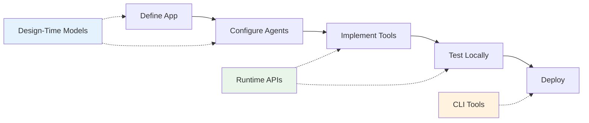

# API Reference

The AgenticAI Core SDK provides comprehensive APIs for building, configuring, and running multi-agent AI applications.

## API Categories

### 📐 Design-Time Models

**Define your application structure and configuration**

Build your app blueprint using declarative models that specify agents, tools, memory stores, and environment configuration.

[:octicons-arrow-right-24: Design-Time Overview](designtime/index.md)

### ⚡ Runtime APIs

**Execute and monitor your applications**

Access runtime services during request processing including session context, logging, memory operations, and tracing.

[:octicons-arrow-right-24: Runtime Overview](runtime/index.md)

### 🔧 CLI Tools

**Deploy and manage applications**

Command-line interface for packaging, deploying, and managing your applications across environments.

[:octicons-arrow-right-24: CLI Reference](../cli/index.md)

## Development Workflow



1. **Design-Time**: Define application structure using models
2. **Runtime**: Implement tools with runtime services  
3. **CLI**: Package and deploy to production

## Quick Start

### Define Your App

```python
from agenticai_core.designtime.models import App, Agent, LlmModel

app = App(
    name="My Assistant", 
    agents=[
        Agent(
            name="HelperAgent",
            llm_model=LlmModel(model="gpt-4o-mini", provider="Open AI"),
            tools=[Tool(name="MyTool", type="MCP")]
        )
    ]
)
```

### Implement Tools

```python
from agenticai_core.designtime.models.tool import Tool
from agenticai_core.runtime.sessions.request_context import RequestContext, Logger

@Tool.register(name="MyTool", description="Example tool")
async def my_tool():
    ctx = RequestContext()
    logger = Logger('MyTool')
    
    await logger.info("Tool executed")
    return {"success": True}
```

### Deploy

```bash
python run.py package -o my-app
python run.py config -u prod
python run.py deploy -f bin/my-app/application.kar
```

## Next Steps

**Start Building:**

- [:material-book-open: User Guide](../guide/building-apps.md) - Step-by-step application development
- [:material-rocket: Quick Start](../getting-started/quickstart.md) - Get up and running fast
- [:material-code-braces: Examples](../examples/banking-assistant.md) - See real applications

**Deep Dive:**  

- [Design-Time Models](designtime/index.md) - Application structure and configuration
- [Runtime APIs](runtime/index.md) - Execution environment and services
- [CLI Tools](../cli/index.md) - Deployment and management commands
