# Runtime APIs

Runtime APIs provide the execution environment and services for your AgenticAI applications, bridging the gap between your application definition and live execution.

## What are Runtime APIs?

Runtime APIs handle the **execution phase** of your AI application lifecycle:

- **Design-Time**: You define your app structure using models (`App`, `Agent`, `Tool`, etc.)
- **Runtime**: Your app comes alive and processes real requests using these APIs

Think of it as the difference between writing a recipe (design-time) and actually cooking the meal (runtime).

## Runtime Architecture

```mermaid
graph TD
    A[User Request] --> B[Platform]
    B --> C[SDK Orchestrator]
    C --> D[RequestContext]
    D --> E[Platform Agent Execution]
    E --> F[SDK Tool Execution]
    F --> G[Memory Store]
    F --> H[Logger]
    F --> I[Tracer] 
    F --> J[EnvironmentVariables]
    G --> K[Response to Platform]
    H --> K
    I --> K
    J --> K
    K --> L[User Response]
    
    style D fill:#e1f5fe
    style F fill:#f3e5f5
    style G fill:#e8f5e8
    style H fill:#fff3e0
    style I fill:#fce4ec
    style J fill:#e8f4fd
```

**Message Protocol Flow:**

1. **User → Platform**: User sends request via Platform interface
2. **Platform → SDK**: Platform (MCP Client) calls SDK Orchestrator (MCP Server) 
3. **SDK Orchestrator**: Receives `MessageItem` (`role='user'` or `role='tool'`), returns `ToolCall`
4. **Platform Agent**: Executes based on orchestrator's `ToolCall` routing
5. **SDK Tool**: Platform calls back to SDK tools for execution with runtime services
6. **Response Chain**: Results flow back through Platform to User

## When Do You Use Runtime APIs?

Runtime APIs are used **inside your tools and orchestrators** during request processing:

- Accessing user session information (`RequestContext`)
- Reading environment variables and configuration
- Storing/retrieving persistent data (`Memory`)  
- Logging operational information (`Logger`)
- Monitoring performance and debugging (`Tracer`)

## Available Runtime Services

| Service | Purpose | Key Features |
|---------|---------|--------------|
| **[RequestContext](request_context.md)** | Access request and session information | User ID, session ID, app ID, runtime services access |
| **[EnvironmentVariables](environment_variables.md)** | Environment configuration access | Attribute-style access, defaults, type conversion |
| **[Memory](memory.md)** | Persistent data storage | Cross-session storage, projections, store management |
| **[Logger](logger.md)** | Structured operational logging | Automatic session context, async logging, JSON format |
| **[Tracer](tracer.md)** | Distributed tracing and monitoring | Performance tracking, error capture, analytics |

## Next Steps

**Implementation:**

- [RequestContext API](request_context.md) - Access session context and runtime services
- [EnvironmentVariables API](environment_variables.md) - Environment configuration access
- [Memory API](memory.md) - Persistent data storage operations  
- [Logger API](logger.md) - Add structured logging to your tools
- [Tracer API](tracer.md) - Monitor performance and debug issues

**Guides & Workflows:**

- [Quick Start Guide](../../getting-started/quickstart.md) - End-to-end development workflow
- [CLI Reference](../../cli/index.md) - Package and deploy applications
- [Working with Tools Guide](../../guide/working-with-tools.md) - Advanced tool patterns
- [Design-Time Models](../index.md) - Application structure and configuration

