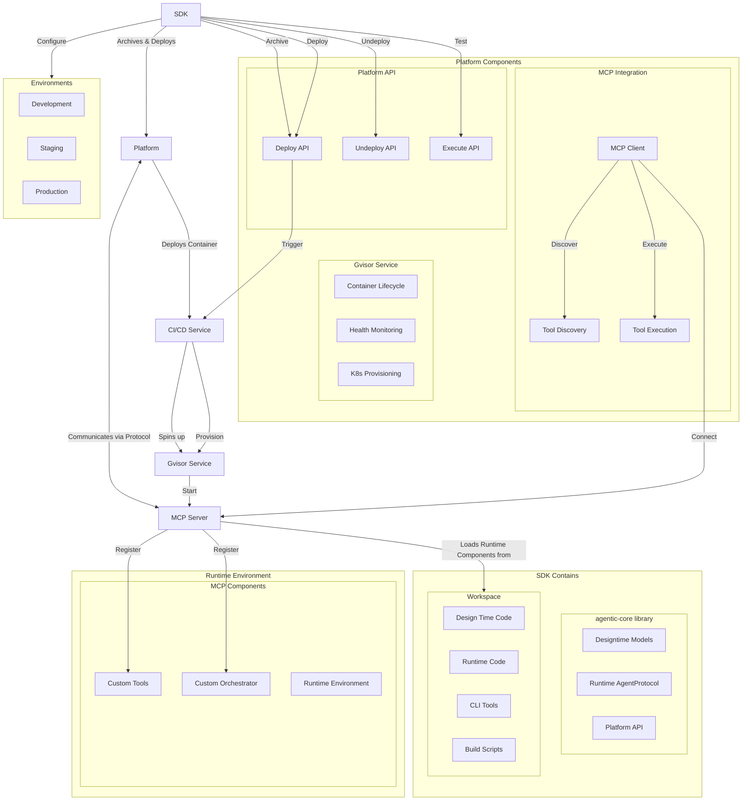
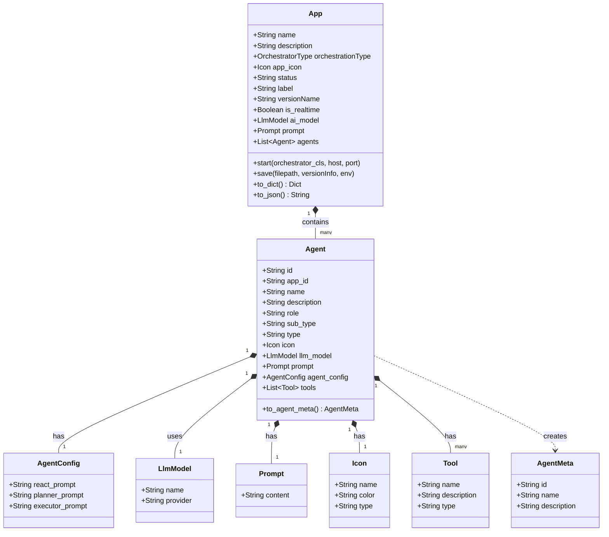
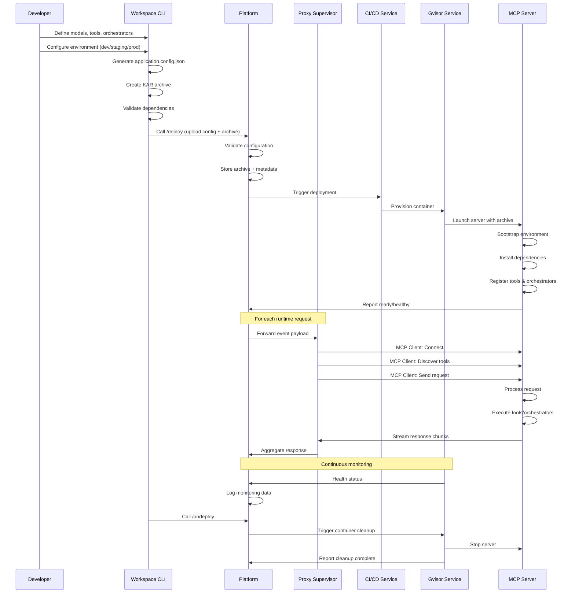

# SDK Architecture

The AgenticAI SDK separates operations into two phases: **design-time** (configuration) and **runtime** (execution). During design-time, you define your app, agents, and tools. At runtime, those definitions execute as a deployed application.

The SDK has two major components:

- **agentic-core** — A Python library that provides design-time configuration models and runtime interfaces.
- **Workspace** — A project scaffold with a CLI for building, packaging, and deploying your app.

## Component Interaction

The diagram below shows how SDK components interact with the platform.




## agentic-core Library

`agentic-core` is the foundational library for both design-time and runtime needs.

### Design-Time Module

`agenticai_core.designtime` provides builder-pattern classes for configuring entities. The builder classes capture entity relationships and offer an autocomplete-friendly API for configuring:

- Apps with custom orchestrators.
- Agents with specific roles and capabilities.
- Tools with various implementations.
- LLM models with configurable parameters.

### Runtime Module

`agenticai_core.runtime` provides:

- **Abstract interfaces** — Base classes (`abstract_agent`, `abstract_orchestrator`) that your custom implementations must extend.
- **Request/response classes** — Classes that parse and encapsulate agentic conversation state across a session.
- **MCP server** — An SSE (Server-Sent Events) transport server for real-time communication. The MCP server lifecycle is tied to the application — calling `app.start()` automatically starts the MCP server.

### Library Structure

```
src/agenticai_core/
├── designtime/
│   └── models/
│       ├── agent.py
│       ├── app.py
│       ├── icon.py
│       ├── llm_model.py
│       ├── prompt.py
│       └── tool.py
└── runtime/
    └── agents/
        ├── abstract_agent.py          # Base class for custom agents
        ├── abstract_orchestrator.py   # Base class for custom orchestrators
        ├── agent_message.py
        ├── agent_request.py
        ├── agent_response.py
        └── agent_runtime.py           # MCP server: registers and invokes agents and tools
```

## Design-Time Model

The following class diagram shows the relationships between design-time entities.




## Runtime Model

At runtime, a separate set of classes manages agent execution and message passing. The following class diagram shows the runtime components and their relationships.


## Workspace

The Workspace is a project scaffold that includes:

- A skeleton project structure to bootstrap new apps.
- Example implementations for custom orchestrators and tools.
- Environment configuration management for dev, staging, and production.
- A CLI (`run.py`) for common development and deployment tasks.

### Workspace Structure

```
├── .env/
│   ├── dev                              # Environment variables for development
│   └── local                            # Environment variables for local
├── bin/
│   ├── application.config.json          # Serialized app configuration
│   └── myproject.kar                    # Packaged source archive
├── lib/                                 # Core dependency wheel files
├── requirements.txt
├── run.py                               # CLI entry point
└── src/
    ├── app.py                           # App configuration
    ├── orchestrator/
    │   └── round_robin_orchestrator.py  # Example custom orchestrator
    └── tools/
        ├── add.py                       # Example tool
        └── greet.py                     # Example tool
```

### CLI Reference

```bash
usage: run.py [-h] {config,package,start,test,deploy,publish,status,undeploy} ...
```

The commands and their purposes are summarized below.

<div class="ascii-art">

┌─────────────────────────────────────────────────────────────────────┐
│                           CLI COMMANDS                              │
├──────────────────────────────┬──────────────────────────────────────┤
│  config -u `<name>`          │  Selects the `.env` config file to   │
│                              │  use as default.                     │
├──────────────────────────────┼──────────────────────────────────────┤
│  package -o `<name>`         │  Generates `application.config.json` │
│                              │  and bundles source code into a      │
│                              │  `.kar` archive.                     │
├──────────────────────────────┼──────────────────────────────────────┤
│  start                       │  Starts the MCP server with          │
│                              │  registered agents and tools.        │
├──────────────────────────────┼──────────────────────────────────────┤
│  test                        │  Tests the deployed app end to end.  │
├──────────────────────────────┼──────────────────────────────────────┤
│  deploy -f `<kar>`           │  Creates resources on the Platform   │
│                              │  and triggers package deployment.    │
├──────────────────────────────┼──────────────────────────────────────┤
│  publish -a `<appId>`        │  Creates an environment for the      │
│         -n `<name>`          │  deployed app.                       │
├──────────────────────────────┼──────────────────────────────────────┤
│  status -a `<appId>`         │  Checks the status of an app         │
│         -n `<name>`          │  environment.                        │
├──────────────────────────────┼──────────────────────────────────────┤
│  undeploy -f `<path>`        │  Undeploys the app environment.      │
└──────────────────────────────┴──────────────────────────────────────┘

</div>

## Deployment Workflow

The following sequence diagram shows the complete lifecycle from development to undeployment.




The workflow has five phases:

| Phase               | Description                                                                                                                  |
|---------------------|------------------------------------------------------------------------------------------------------------------------------|
| 1. **Development**  | Define entity models, implement custom orchestrators and tools, configure environments.                                      |
| 2. **Packaging**    | Run `package` to generate `application.config.json` and bundle source into a `.kar` archive.                                 |
| 3. **Deployment**   | Run `deploy` to upload the package. The platform validates configuration, provisions a container, and starts the MCP server. |
| 4. **Runtime**      | The platform routes user requests to the MCP server, which executes tools and orchestrators and streams responses.           |
| 5. **Undeployment** | Run `undeploy` to stop and clean up the deployed environment.                                                                |

### Platform APIs

| Endpoint          | Purpose                                                                        |
|-------------------|--------------------------------------------------------------------------------|
| `POST /deploy/`   | Uploads the app config and archive, validates, and creates platform resources. |
| `POST /undeploy/` | Undeploys the app.                                                             |
| `POST /execute/`  | Sends requests to the running app.                                             |

## Memory Stores

Memory stores provide persistent data storage scoped to the user, application, or session. You configure them at design-time and access them in your tools at runtime.

### Configuration

Define a memory store using the `MemoryStore` class:

```python expandable=true
from agenticai_core.designtime.models.memory_store import MemoryStore, Scope, RetentionPolicy

user_preferences_store = MemoryStore(
    name="User Preferences",
    technical_name="user_preferences",
    description="Stores user-specific preferences",
    schema_definition={
        "type": "object",
        "properties": {
            "firstname": {"type": "string"},
            "lastname": {"type": "string"},
            "theme": {"type": "string"}
        }
    },
    strict_schema=False,
    scope=Scope.USER_SPECIFIC,
    retention_policy=RetentionPolicy.WEEK
)
```

Add the store to your app configuration:

```python
from agenticai_core.designtime.models.app import AppBuilder

app_config = (AppBuilder()
    .set_name("MyApp")
    .set_description("Example app with memory store")
    .set_memory_store(user_preferences_store)
    .build())
```

Call `.set_memory_store()` for each store to add multiple stores to the same app.

### Scopes

| Scope                    | Description                                                                |
|--------------------------|----------------------------------------------------------------------------|
| `Scope.USER_SPECIFIC`    | Data unique to each user. Recommended for most cases.                      |
| `Scope.APPLICATION_WIDE` | Data shared across all users. Use for global settings or shared resources. |
| `Scope.SESSION_LEVEL`    | Temporary data cleared when the session ends.                              |

### Retention Policies

| Policy                    | Duration                |
|---------------------------|-------------------------|
| `RetentionPolicy.DAY`     | 24 hours.               |
| `RetentionPolicy.WEEK`    | 7 days.                 |
| `RetentionPolicy.MONTH`   | 30 days.                |
| `RetentionPolicy.SESSION` | Until the session ends. |

### Runtime Usage

Access memory stores in your tools through `RequestContext`:

```python expandable=true
from agenticai_core.designtime.models.tool import Tool
from agenticai_core.runtime.sessions.request_context import RequestContext, Logger

@Tool.register(name="GreetUser", description="Greet the user with their name")
async def greet_user():
    logger = Logger('GreetUser')
    context = RequestContext()
    memory = context.get_memory()

    result = await memory.get_content('user_preferences', {
        'firstname': 1,
        'lastname': 1
    })

    if result.success and result.data:
        firstname = result.data.get('firstname', 'Guest')
        lastname = result.data.get('lastname', '')
        return f"Hello {firstname} {lastname}!"

    return "Hello Guest!"
```

The memory manager supports full CRUD operations:

```python
# Read data (use projections to fetch only needed fields)
result = await memory.get_content(store_name, projections)

# Write data
result = await memory.set_content(store_name, content)

# Delete data
result = await memory.delete_content(store_name)
```

### Best Practices

- Define clear, focused schemas. Use `strict_schema=True` in production.
- Use `USER_SPECIFIC` for personal data, `APPLICATION_WIDE` for shared resources, and `SESSION_LEVEL` for temporary state.
- Choose retention policies based on data sensitivity and privacy requirements.
- Use projections in `get_content()` to retrieve only the fields you need.
- Always handle memory access errors and provide fallback values.

## Logging

The SDK provides a structured logging system for tools. Logs are sent to the platform in real-time over SSE.

### Usage in Tools

Import and initialize `Logger` with the name of your tool:

```python
from agenticai_core.runtime.sessions.request_context import Logger

logger = Logger('YourToolName')
```

Log messages at the appropriate severity level:

```python
await logger.debug("Debug message")
await logger.info("Info message")
await logger.warning("Warning message")
await logger.error("Error message")
```

### Log Levels

| Level | When to use |
|---|---|
| `DEBUG` | Detailed diagnostic information — variable values, function entry/exit points. |
| `INFO` | Normal operation tracking — tool start, successful operations, completion. |
| `WARNING` | Situations that don't prevent execution but may need attention. |
| `ERROR` | Errors that prevent normal operation. |

### Log Message Structure

Each log message is automatically structured with these fields:

```json
{
    "timestamp": "ISO-8601 formatted UTC timestamp",
    "sessionId": "Unique session identifier",
    "userId": "User identifier",
    "message": "Your log message content"
}
```

The logger automatically includes the current UTC timestamp, session ID, and user ID from the request context.

### Example

```python
from agenticai_core.designtime.models.tool import Tool
from agenticai_core.runtime.sessions.request_context import Logger

@Tool.register(name="ExampleTool", description="Example tool with logging")
async def example_tool(param1: str):
    logger = Logger('ExampleTool')

    await logger.info(f"ExampleTool called with: {param1}")
    await logger.debug(f"Processing parameter: {param1}")

    # Tool logic here

    await logger.info("Tool execution completed successfully")
    return "Result"
```

### Receiving Logs

Logs are delivered via SSE. Use a raw SSE client or the MCP client to receive them.

**SSE client:**

```typescript
const eventSource = new EventSource(
    'http://your-server:8080/notifications/message',
    { withCredentials: true }
);

eventSource.addEventListener('notification/message', (event) => {
    const log = JSON.parse(event.data);
    console.log(`[${log.logger}] ${log.level}: ${log.message}`);
});

eventSource.onerror = (error) => {
    console.error('SSE connection error:', error);
    eventSource.close();
};
```

**MCP client:**

```typescript
import { ClientSession } from 'mcp';

async function logger(params: LoggingMessageNotificationParams) {
    params.logger = params.logger || 'Server';
    console.log(`[${params.logger}] ${params.level}: ${params.data}`);
}

const session = new ClientSession(streams[0], streams[1], {
    logging_callback: logger
});
```

The MCP client approach provides built-in session management, automatic reconnection handling, and integration with MCP's event system.

### Best Practices

- Use descriptive logger names that identify the tool or component — for example, `'GreetTool'` or `'MultiplyMatricesTool'`.
- Include relevant context (parameters, request IDs) in log messages.
- Log errors with enough detail to diagnose the issue, including stack traces when available.
- Use `DEBUG` for troubleshooting, `INFO` for normal flow, and reserve `WARNING` and `ERROR` for actionable conditions.
