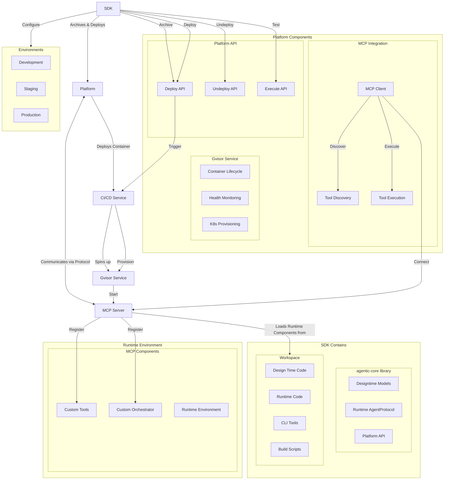
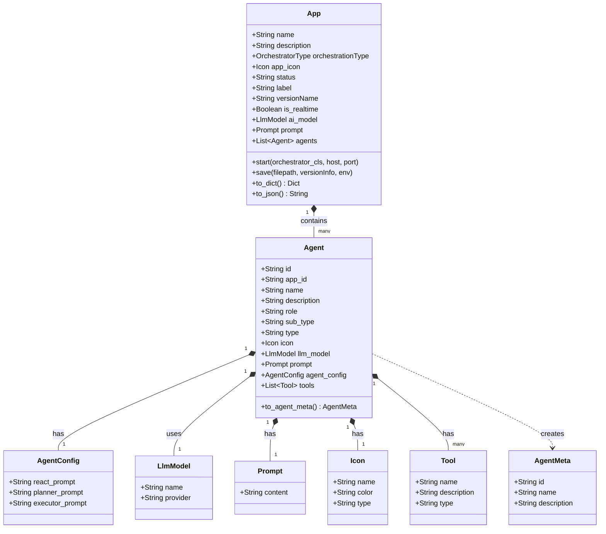
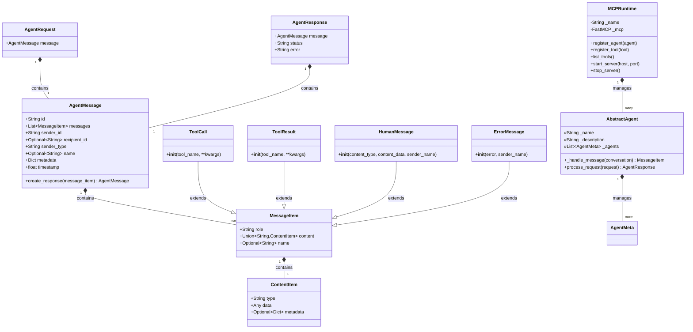
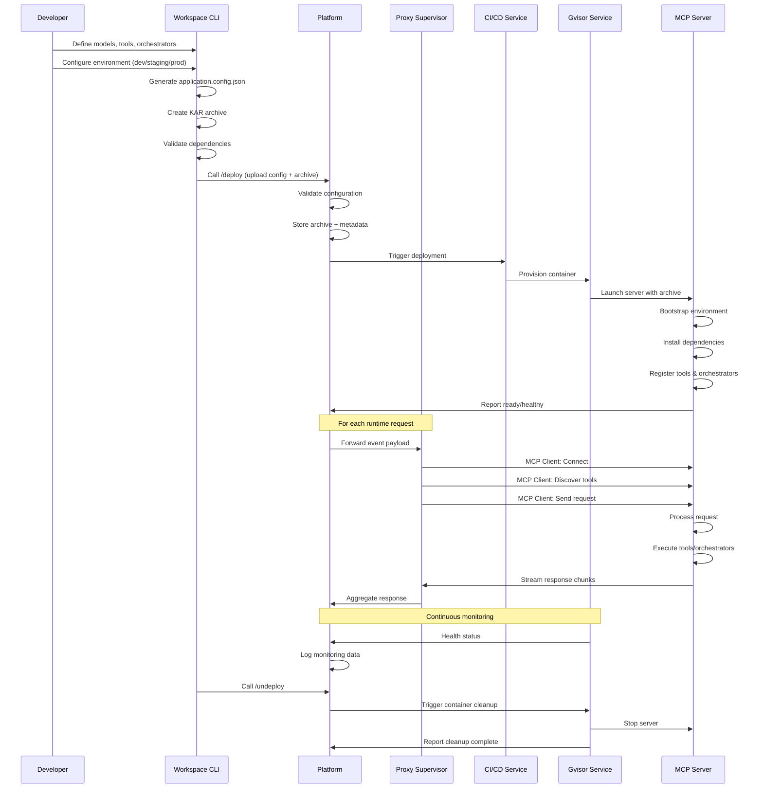

# AgenticAI SDK — Architecture & Developer Reference

The AgenticAI SDK provides a framework for building, packaging, and deploying AI agent applications on the Kore.ai platform. It separates concerns into two phases:

- **Design-time** — Define apps, agents, tools, and models programmatically using builder APIs.
- **Runtime** — Deploy and execute agents in containerized environments with MCP-based communication.

**Target audience:** Core developers, maintainers, and contributors.

---

## System Architecture

The SDK ecosystem consists of four major components:

| Component                   | Role                                                                             |
|-----------------------------|----------------------------------------------------------------------------------|
| **agentic-core**            | Core library for design-time models, runtime interfaces, and platform API client |
| **Workspace**               | Developer project scaffold with CLI, sample code, and build tooling              |
| **Dockerized gVisor Image** | Containerized runtime environment for secure agent execution                     |
| **Platform**                | Manages app deployment, lifecycle, and MCP client integration                    |



---

## agentic-core Library

The `agentic-core` library handles both design-time configuration and runtime execution. It also includes a REST client for platform API operations.

### Library Structure

```
agenticai_core/
├── api/
│   └── kore_client.py              # REST client for platform CI/CD operations
├── designtime/
│   └── models/
│       ├── app.py
│       ├── agent.py
│       ├── tool.py
│       ├── llm_model.py
│       ├── prompt.py
│       └── icon.py
└── runtime/
    ├── agents/
    │   ├── abstract_agent.py       # Base class all agents must implement
    │   ├── abstract_orchestrator.py # Base class for custom orchestrators
    │   ├── agent_runtime.py        # MCP server: registers and dispatches agents & tools
    │   ├── agent_message.py
    │   ├── agent_request.py
    │   └── agent_response.py
    └── message_item.py
```

### Design-Time Class Model

Builder classes capture entity relationships and provide IDE-friendly autocomplete when configuring apps.



### Runtime Class Model

At runtime, `MCPRuntime` registers agents and tools and serves them over MCP. `AbstractAgent` must be implemented for any custom orchestration logic.



---

## Workspace

The Workspace is the developer's project directory. It provides a bootstrap scaffold, example implementations, and a CLI for managing the full app lifecycle.

### Workspace Structure

```
├── bin/
│   ├── application.config.json         # Serialized app configuration
│   └── myproject.kar                   # Deployable archive
├── .env/
│   ├── dev                             # Dev environment variables
│   └── local                           # Local environment variables
├── lib/
│   ├── agenticai_core-0.1.0-py3-none-any.whl
│   └── kore_api-1.0.0-py3-none-any.whl
├── requirements.txt
├── run.py                              # CLI entry point
└── src/
    ├── app.py                          # App configuration and setup
    ├── orchestrator/
    │   └── round_robin_orchestrator.py # Example custom orchestrator
    └── tools/
        ├── add.py                      # Example tool
        └── greet.py                    # Example tool
```

### CLI Reference

| Command                        | Description                                           |
|--------------------------------|-------------------------------------------------------|
| `config -u <name>`             | Set the active `.env` config file                     |
| `package -o <name>`            | Generate `application.config.json` and `.kar` archive |
| `start`                        | Start the MCP server with registered agents and tools |
| `test`                         | Test the deployed app end-to-end                      |
| `deploy -f <kar>`              | Create platform resources and deploy the package      |
| `publish -a <appId> -n <name>` | Create a new app environment                          |
| `status -a <appId> -n <name>`  | Check the status of an app environment                |
| `undeploy -f <path>`           | Undeploy an app environment                           |

---

## Platform Integration

### API Endpoints

| Endpoint          | Description                                                      |
|-------------------|------------------------------------------------------------------|
| `POST /deploy/`   | Unified endpoint: upload, validate, and import app configuration |
| `POST /undeploy/` | Remove a deployed app                                            |
| `POST /execute/`  | Interact with a running app                                      |

The `/deploy/` endpoint performs three operations atomically:

1. **Upload** — accepts `appSpec` (serialized config JSON) and `archiveSpec` (KAR archive)
2. **Validate** — verifies configuration, dependencies, custom tools, and orchestrators
3. **Import** — creates platform resources and configures access controls

### MCP Client

The platform implements an MCP client using the LangGraph framework to connect with the deployed MCP server. It handles tool discovery, tool execution, conversation state, and agent response processing.

### gVisor Service

The gVisor service manages the Kubernetes container lifecycle for each deployed app: provisioning on deploy, health monitoring during runtime, and cleanup on undeploy.

---

## Deployment Workflow



### Phase Summary

| Phase            | What happens                                                                                                        |
|------------------|---------------------------------------------------------------------------------------------------------------------|
| **Development**  | Define entities; implement orchestrators and tools; test locally with MCP client                                    |
| **Packaging**    | `package` generates `application.config.json` and `.kar` archive                                                    |
| **Deployment**   | `deploy` sends config + archive to platform; gVisor provisions a Kubernetes container and bootstraps the MCP server |
| **Runtime**      | Platform connects to MCP server per request; tool discovery and execution via MCP protocol                          |
| **Monitoring**   | gVisor reports health; platform collects logs                                                                       |
| **Undeployment** | `undeploy` triggers container cleanup and stops the MCP server                                                      |

---

## Logging

The logging system sends structured messages from tool code to the platform via SSE.

### Usage in Tools

```python
from agenticai_core.runtime.sessions.request_context import Logger

logger = Logger('YourToolName')

await logger.debug("Debug message")
await logger.info("Info message")
await logger.warning("Warning message")
await logger.error("Error message")
```

Each log message is automatically structured with:

```json
{
    "timestamp": "ISO-8601 UTC",
    "sessionId": "...",
    "userId": "...",
    "message": "..."
}
```

**Example — logging within a registered tool:**

```python
from agenticai_core.designtime.models.tool import Tool
from agenticai_core.runtime.sessions.request_context import Logger

@Tool.register(name="ExampleTool", description="Example tool with logging")
async def example_tool(param1: str):
    logger = Logger('ExampleTool')
    await logger.info(f"ExampleTool called with: {param1}")
    # tool logic here
    await logger.info("Tool execution completed")
    return "Result"
```

### Log Levels

| Level     | Use for                                                  |
|-----------|----------------------------------------------------------|
| `DEBUG`   | Diagnostic detail: variable values, entry/exit points    |
| `INFO`    | Normal flow: tool start/end, successful operations       |
| `WARNING` | Non-fatal issues: deprecated usage, performance concerns |
| `ERROR`   | Failures that prevent normal operation                   |

### Platform Log Integration

**Option 1 — SSE event listener (current implementation):**

```typescript
const eventSource = new EventSource(
    'http://your-server:8080/notifications/message',
    { withCredentials: true }
);

eventSource.addEventListener('notification/message', (event) => {
    const log = JSON.parse(event.data);
    console.log(`[${log.logger}] ${log.level}: ${log.message}`);
});
```

**Option 2 — MCP client logging callback:**

```typescript
import { ClientSession } from 'mcp';

async function logger(params: LoggingMessageNotificationParams) {
    params.logger = params.logger || 'Server';
    console.log(`[${params.logger}] ${params.level}: ${params.data}`);
}

const session = new ClientSession(streams[0], streams[1], {
    logging_callback: logger
});
```

The MCP client approach provides built-in session management, automatic reconnection, and tighter integration with the MCP event system.

---

## Memory Stores

Memory stores provide persistent, scoped data storage across user, session, or application boundaries.

### Quick Start

**Step 1 — Define a memory store:**

```python
from agenticai_core.designtime.models.memory_store import MemoryStore, Scope, RetentionPolicy

user_preferences_store = MemoryStore(
    name="User Preferences",
    technical_name="user_preferences",       # identifier used in tool code
    description="Stores user-specific preferences",
    schema_definition={
        "type": "object",
        "properties": {
            "firstname": {"type": "string"},
            "lastname": {"type": "string"},
            "theme": {"type": "string"}
        }
    },
    strict_schema=False,
    scope=Scope.USER_SPECIFIC,
    retention_policy=RetentionPolicy.WEEK
)
```

**Step 2 — Add to your app:**

```python
from agenticai_core.designtime.models.app import AppBuilder

app_config = (AppBuilder()
    .set_name("MyApp")
    .set_description("Example app")
    .set_memory_store(user_preferences_store)
    .build())
```

**Step 3 — Use in a tool:**

```python
from agenticai_core.designtime.models.tool import Tool
from agenticai_core.runtime.sessions.request_context import RequestContext

@Tool.register(name="GreetUser", description="Greet the user by name")
async def greet_user():
    memory = RequestContext().get_memory()

    result = await memory.get_content('user_preferences', {
        'firstname': 1,
        'lastname': 1
    })

    if result.success and result.data:
        return f"Hello {result.data.get('firstname', 'Guest')} {result.data.get('lastname', '')}!"
    return "Hello Guest!"
```

### Scopes

| Scope              | Description                                  |
|--------------------|----------------------------------------------|
| `USER_SPECIFIC`    | Data isolated per user — recommended default |
| `APPLICATION_WIDE` | Shared across all users                      |
| `SESSION_LEVEL`    | Temporary; cleared when session ends         |

### Retention Policies

| Policy    | Duration           |
|-----------|--------------------|
| `DAY`     | 24 hours           |
| `WEEK`    | 7 days             |
| `MONTH`   | 30 days            |
| `SESSION` | Until session ends |

### Runtime CRUD Operations

Access memory via `RequestContext` in any tool:

```python
from agenticai_core.runtime.sessions.request_context import RequestContext

memory = RequestContext().get_memory()

# Read — use projections to retrieve only needed fields
result = await memory.get_content(store_name, {'field1': 1, 'field2': 1})

# Write
result = await memory.set_content(store_name, {'field1': 'value'})

# Delete
result = await memory.delete_content(store_name)
```

For operations across multiple stores, use the context manager pattern:

```python
async with context.get_memory_store_manager('user_preferences') as prefs, \
           context.get_memory_store_manager('shopping_cart') as cart:

    user_prefs = await prefs.get({'firstname': 1, 'lastname': 1})
    cart_data = await cart.get({'items': 1, 'total': 1})
```

### Best Practices

- Use `strict_schema=True` in production to enforce data contracts.
- Choose `USER_SPECIFIC` unless data is truly shared or temporary.
- Always provide fallback values — memory operations can fail if a store is empty or unavailable.
- Use projections to read only the fields you need.
- Log memory operations to aid debugging.

---

## Local Testing

The SDK includes a Python MCP client for local development and end-to-end testing before deployment.

### Features

- Tool discovery and listing
- Interactive tool call testing
- Real-time response streaming
- Error reporting

### Setup

```bash
# Create virtual environment and install dependencies
uv venv
uv pip install mcp httpx
uv pip install lib/agenticai_core-0.1.0-py3-none-any.whl
```

### Workflow

1. Start the server in one terminal: `python run.py start`
2. Start the MCP client in a separate terminal
3. Verify available tools are discovered
4. Send test requests and inspect responses
5. Use server and client logs to debug issues
