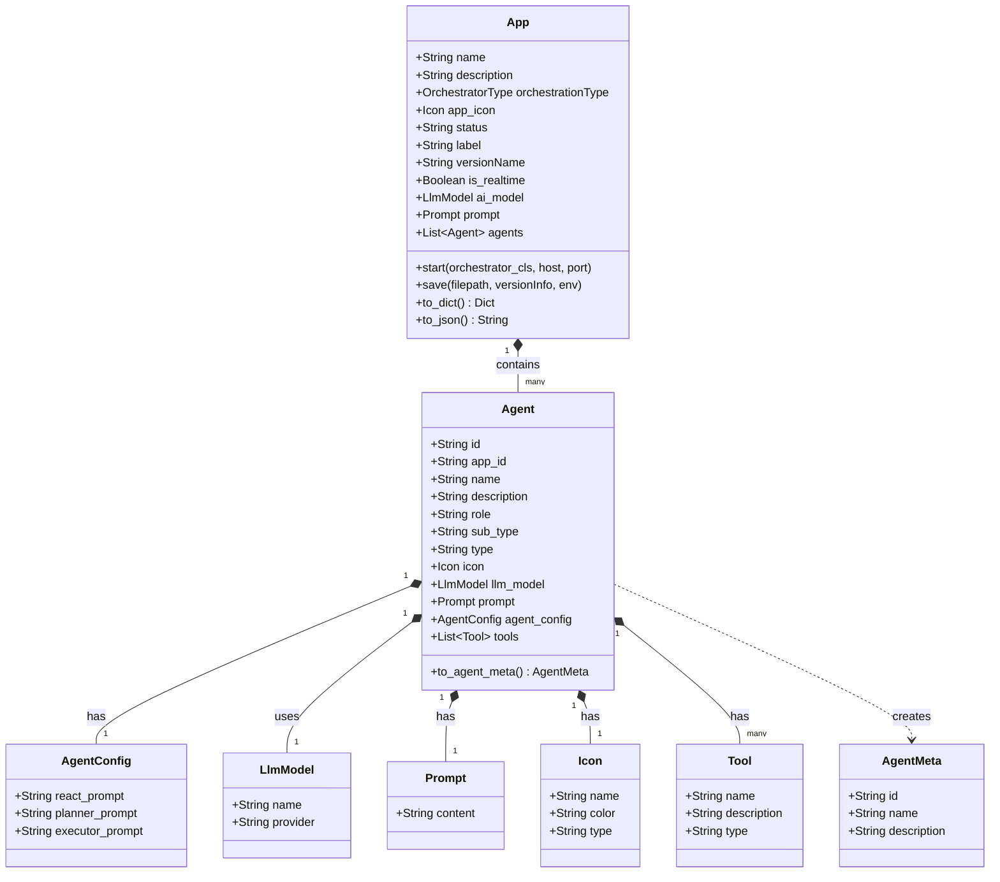

```mermaid
classDiagram
    %% Designtime Package
    class App {
        +String name
        +String description
        +OrchestratorType orchestrationType
        +Icon app_icon
        +String status
        +String label
        +String versionName
        +Boolean is_realtime
        +LlmModel ai_model
        +Prompt prompt
        +List~Agent~ agents
        +start(orchestrator_cls, host, port)
        +save(filepath, versionInfo, env)
        +to_dict() Dict
        +to_json() String
    }

    class Agent {
        +String id
        +String app_id
        +String name
        +String description
        +String role
        +String sub_type
        +String type
        +Icon icon
        +LlmModel llm_model
        +Prompt prompt
        +AgentConfig agent_config
        +List~Tool~ tools
        +to_agent_meta() AgentMeta
    }

    class AgentConfig {
        +String react_prompt
        +String planner_prompt
        +String executor_prompt
    }

    class AgentMeta {
        +String id
        +String name
        +String description
    }

    class Tool {
        +String name
        +String description
        +String type
    }

    class Prompt {
        +String content
    }

    class LlmModel {
        +String name
        +String provider
    }

    class Icon {
        +String name
        +String color
        +String type
    }

    %% Relationships
    App "1" *-- "many" Agent : contains
    Agent "1" *-- "1" AgentConfig : has
    Agent "1" *-- "1" LlmModel : uses
    Agent "1" *-- "1" Prompt : has
    Agent "1" *-- "1" Icon : has
    Agent "1" *-- "many" Tool : has
    Agent ..> AgentMeta : creates
``` 