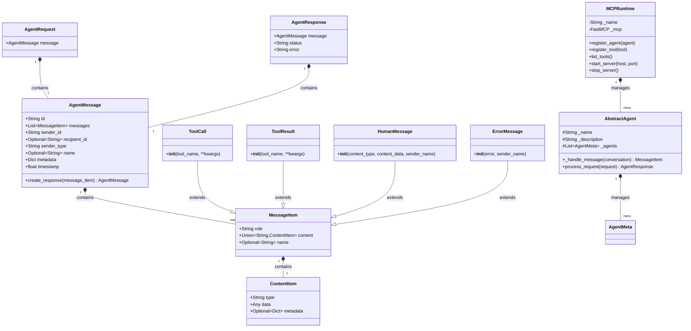

```mermaid
classDiagram
    %% Runtime Package
    class AbstractAgent {
        #String _name
        #String _description
        #List~AgentMeta~ _agents
        +_handle_message(conversation) MessageItem
        +process_request(request) AgentResponse
    }

    class MCPRuntime {
        -String _name
        -FastMCP _mcp
        +register_agent(agent)
        +register_tool(tool)
        +list_tools()
        +start_server(host, port)
        +stop_server()
    }

    class AgentMessage {
        +String id
        +List~MessageItem~ messages
        +String sender_id
        +Optional~String~ recipient_id
        +String sender_type
        +Optional~String~ name
        +Dict metadata
        +float timestamp
        +create_response(message_item) AgentMessage
    }

    class AgentRequest {
        +AgentMessage message
    }

    class AgentResponse {
        +AgentMessage message
        +String status
        +String error
    }

    class MessageItem {
        +String role
        +Union~String,ContentItem~ content
        +Optional~String~ name
    }

    class ContentItem {
        +String type
        +Any data
        +Optional~Dict~ metadata
    }

    class ToolCall {
        +__init__(tool_name, **kwargs)
    }

    class ToolResult {
        +__init__(tool_name, **kwargs)
    }

    class HumanMessage {
        +__init__(content_type, content_data, sender_name)
    }

    class ErrorMessage {
        +__init__(error, sender_name)
    }

    %% Relationships
    AbstractAgent "1" *-- "many" AgentMeta : manages
    MCPRuntime "1" *-- "many" AbstractAgent : manages
    AgentRequest "1" *-- "1" AgentMessage : contains
    AgentResponse "1" *-- "1" AgentMessage : contains
    AgentMessage "1" *-- "many" MessageItem : contains
    MessageItem "1" *-- "1" ContentItem : contains

    ToolCall --|> MessageItem : extends
    ToolResult --|> MessageItem : extends
    HumanMessage --|> MessageItem : extends
    ErrorMessage --|> MessageItem : extends
``` 