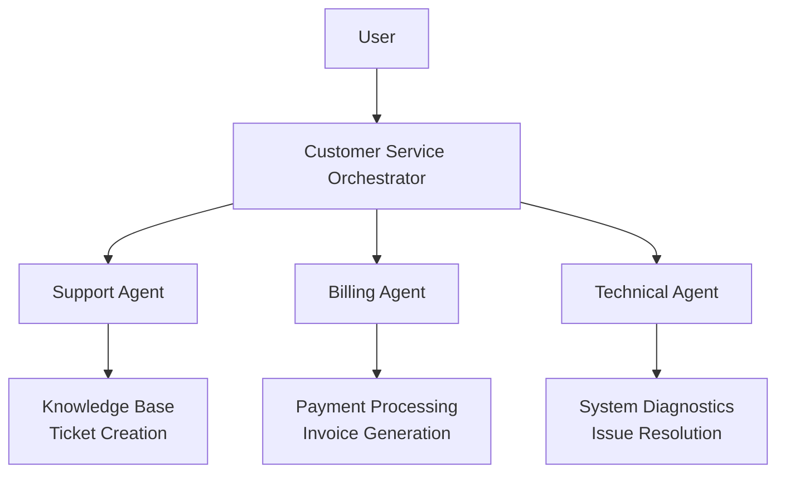

<Badge icon="arrow-left" color="gray">[Back to SDK Overview and resources](/agent-platform/sdk-overview)</Badge>

AgenticAI Core is a Python SDK for building and deploying multi-agent AI applications. You define agents, tools, models, and orchestration in Python (design-time), and a runtime exposes them through an MCP server:

```
Client → MCP Server → Orchestrator → Agent → (LLM ↔ Tools) → Response
```

The five core building blocks are:

| Building block   | Role                                                                             |
|------------------|----------------------------------------------------------------------------------|
| **Tool**         | A Python function registered with `@Tool.register`                               |
| **Agent**        | Performs domain work using an LLM and its assigned tools                         |
| **Memory store** | Persists context (e.g., account data) across interactions                        |
| **Orchestrator** | Subclass of `AbstractOrchestrator` that routes requests between agents           |
| **App**          | Top-level container that wires agents, memory stores, and orchestration together |

For installation, workspace setup, and the full development lifecycle, see the [SDK overview](/agent-platform/sdk-overview). This page walks through two complete examples.

---

## Example 1: Banking Assistant

A single-agent banking assistant with custom Python tools and a session-scoped memory store for account data.

### Overview

The assistant handles three tasks:

- Check account balances
- Transfer funds between accounts
- Answer general banking questions

### Implementation

#### 1. Define Custom Tools

Tools are async Python functions registered with `@Tool.register`. They access session memory and emit structured logs via `RequestContext` and `Logger`.

```python expandable=true
# src/tools/banking_tools.py
from agenticai_core.designtime.models.tool import Tool
from agenticai_core.runtime.sessions.request_context import RequestContext, Logger

@Tool.register(name="Get_Balance", description="Get account balance")
async def get_balance(account_id: str) -> dict:
    """Get the balance for a specific account."""
    logger = Logger('GetBalance')
    context = RequestContext()
    memory = context.get_memory()

    await logger.info(f"Fetching balance for account: {account_id}")

    result = await memory.get_content('accountInfo', {'accounts': 1})

    if result.success and result.data:
        accounts = result.data.get('accounts', [])
        for account in accounts:
            if account.get('account_id') == account_id:
                await logger.info(f"Balance found: {account.get('balance')}")
                return {
                    "account_id": account_id,
                    "balance": account.get('balance'),
                    "currency": account.get('currency', 'USD')
                }

    await logger.warning(f"Account not found: {account_id}")
    return {"error": "Account not found"}


@Tool.register(name="Transfer_Funds", description="Transfer funds between accounts")
async def transfer_funds(from_account: str, to_account: str, amount: float) -> dict:
    """Transfer funds from one account to another."""
    logger = Logger('TransferFunds')

    await logger.info(f"Transfer: {amount} from {from_account} to {to_account}")

    try:
        await logger.info("Transfer completed successfully")
        return {
            "success": True,
            "transaction_id": "TXN123456",
            "amount": amount,
            "from_account": from_account,
            "to_account": to_account
        }
    except Exception as e:
        await logger.error(f"Transfer failed: {str(e)}")
        raise
```

#### 2. Define Memory Store

A session-scoped memory store holds account data and is referenced by the agent prompt using `{{memory.accountInfo.accounts}}`.

```python expandable=true
from agenticai_core.designtime.models.memory_store import (
    MemoryStore, Namespace, NamespaceType,
    RetentionPolicy, RetentionPeriod, Scope
)

account_memory = MemoryStore(
    name="Account Information",
    technical_name="accountInfo",
    type="hotpath",
    description="Stores user account balances and details",
    schema_definition={
        "type": "object",
        "properties": {
            "accounts": {
                "type": "array",
                "items": {
                    "type": "object",
                    "properties": {
                        "account_id": {"type": "string"},
                        "account_type": {"type": "string"},
                        "balance": {"type": "number"},
                        "currency": {"type": "string"}
                    }
                }
            },
            "last_updated": {"type": "string"}
        }
    },
    strict_schema=False,
    namespaces=[
        Namespace(
            name="session_id",
            type=NamespaceType.DYNAMIC,
            value="{session_id}",
            description="Session identifier"
        )
    ],
    scope=Scope.SESSION_LEVEL,
    retention_policy=RetentionPolicy(
        type=RetentionPeriod.SESSION,
        value=1
    )
)
```

#### 3. Define Agent

```python expandable=true
from agenticai_core.designtime.models.agent import Agent
from agenticai_core.designtime.models.llm_model import LlmModel, LlmModelConfig
from agenticai_core.designtime.models.prompt import Prompt
from agenticai_core.designtime.models.tool import Tool

finance_agent = Agent(
    name="FinanceAssist",
    description="Banking assistant for account management and transactions",
    role="WORKER",
    sub_type="REACT",
    type="AUTONOMOUS",
    llm_model=LlmModel(
        model="gpt-4o",
        provider="Open AI",
        connection_name="Default Connection",
        max_timeout="60 Secs",
        max_iterations="25",
        modelConfig=LlmModelConfig(
            temperature=0.7,
            max_tokens=1600,
            top_p=1.0
        )
    ),
    prompt=Prompt(
        system="You are a helpful assistant.",
        custom="""You are an intelligent banking assistant.

        ## Customer Context
        Account Information:
        {{memory.accountInfo.accounts}}

        ## Your Capabilities
        - Check account balances
        - Transfer funds
        - Answer banking questions
        """,
        instructions=[
            """### Security
            - Never ask for passwords or PINs
            - Always confirm transaction amounts""",

            """### Response Style
            - Be professional and courteous
            - Keep responses concise
            - Confirm actions before executing"""
        ]
    ),
    tools=[
        Tool(name="Get_Balance", type="MCP", description="Get account balance"),
        Tool(name="Transfer_Funds", type="MCP", description="Transfer funds")
    ]
)
```

#### 4. Create Custom Orchestrator

```python expandable=true
# src/orchestrator/banking_orchestrator.py
from agenticai_core.runtime.agents.abstract_orchestrator import AbstractOrchestrator
from agenticai_core.runtime.message_item import MessageItem, ToolCall, ErrorMessage
from typing import List

class BankingOrchestrator(AbstractOrchestrator):
    """Orchestrator for banking assistant application."""

    def __init__(self, agents, **kwargs):
        super().__init__(agents=agents, **kwargs)

    async def _handle_message(self, conversation: List[MessageItem]) -> MessageItem:
        """Route messages to the finance agent."""
        last_message = conversation[-1]

        try:
            if last_message.role == 'user':
                content = last_message.content.lower()

                if "balance" in content or "account" in content:
                    return ToolCall(
                        tool_name="FinanceAssist",
                        message=last_message.content,
                        thought="User asking about account information",
                        reason="Keywords match account services"
                    )
                elif "transfer" in content or "send" in content:
                    return ToolCall(
                        tool_name="FinanceAssist",
                        message=last_message.content,
                        thought="User wants to transfer funds",
                        reason="Keywords match transfer services"
                    )
                else:
                    return ToolCall(
                        tool_name="FinanceAssist",
                        message=last_message.content,
                        thought="General banking query"
                    )

            elif last_message.role == 'tool':
                return ToolCall(
                    tool_name="route_to_user",
                    message=last_message.content,
                    thought="Agent completed task"
                )

            return ErrorMessage(error=RuntimeError(f"Unsupported role: {last_message.role}"))

        except Exception as e:
            return ErrorMessage(error=e)
```

#### 5. Build Application

```python
from agenticai_core.designtime.models.app import App, OrchestratorType

app = App(
    name="Personal Banker",
    description="Banking assistant for account management",
    orchestrationType=OrchestratorType.CUSTOM_SUPERVISOR,
    agents=[finance_agent],
    memory_stores=[account_memory],
    ai_model=LlmModel(...)  # Orchestrator model
)
```

#### 6. Start Application

```python
# main.py
from agenticai_core.designtime.models.tool import ToolsRegistry
from src.orchestrator.banking_orchestrator import BankingOrchestrator

if __name__ == "__main__":
    app.start(
        orchestrator_cls=BankingOrchestrator,
        custom_tools=ToolsRegistry,
        host="0.0.0.0",
        port=8080
    )
```

### Testing

```bash
# Start the application
python main.py

# In another terminal, test with MCP client
uv run client.py
```

To deploy and run end-to-end tests:

```bash
python run.py package -o banking-app
python run.py config -u prod
python run.py deploy -f bin/banking-app/application.kar
python run.py publish -a <appId> -n prod
python run.py test
```

### Project Structure

```
banking-app/
├── src/
│   ├── tools/
│   │   └── banking_tools.py
│   ├── orchestrator/
│   │   └── banking_orchestrator.py
│   └── app.py
├── .env/
│   ├── dev
│   ├── staging
│   └── prod
├── requirements.txt
├── main.py
└── run.py
```

### Key Takeaways

1. **Modular design** - Separate tools, agents, and orchestration into distinct files
2. **Memory integration** - Use memory stores to inject account context directly into agent prompts
3. **Comprehensive logging** - Track all operations using `Logger`
4. **Security** - Never request passwords or PINs; always confirm amounts before executing transfers

---

## Example 2: Multi-Agent Customer Service

A customer service application that routes requests across three specialized agents and handles escalation between them.

### Overview

Three agents cover distinct domains:

- **SupportAgent** - Handles general inquiries
- **BillingAgent** - Manages payments and billing
- **TechnicalAgent** - Resolves technical issues

### Application Architecture



### Implementation

#### 1. Define Specialized Agents

Each agent is scoped to a domain and equipped with the MCP tools it needs.

```python expandable=true
from agenticai_core.designtime.models.agent import Agent
from agenticai_core.designtime.models.llm_model import LlmModel, LlmModelConfig
from agenticai_core.designtime.models.prompt import Prompt

# Support Agent
support_agent = Agent(
    name="SupportAgent",
    description="Handles general customer support inquiries",
    role="WORKER",
    sub_type="REACT",
    type="AUTONOMOUS",
    llm_model=LlmModel(
        model="gpt-4o",
        provider="Open AI",
        modelConfig=LlmModelConfig(temperature=0.7, max_tokens=1600)
    ),
    prompt=Prompt(
        system="You are a helpful customer support agent.",
        custom="Assist with general inquiries and create tickets when needed."
    ),
    tools=[
        Tool(name="search_knowledge", type="KNOWLEDGE"),
        Tool(name="create_ticket", type="MCP")
    ]
)

# Billing Agent
billing_agent = Agent(
    name="BillingAgent",
    description="Manages billing, payments, and invoices",
    role="WORKER",
    sub_type="REACT",
    type="AUTONOMOUS",
    llm_model=LlmModel(
        model="gpt-4o",
        provider="Open AI",
        modelConfig=LlmModelConfig(temperature=0.3, max_tokens=1200)
    ),
    prompt=Prompt(
        system="You are a billing specialist.",
        custom="Handle payments, invoices, and billing inquiries.",
        instructions=["Always confirm payment amounts", "Verify account details"]
    ),
    tools=[
        Tool(name="process_payment", type="MCP"),
        Tool(name="generate_invoice", type="MCP")
    ]
)

# Technical Agent
technical_agent = Agent(
    name="TechnicalAgent",
    description="Resolves technical issues and system problems",
    role="WORKER",
    sub_type="REACT",
    type="AUTONOMOUS",
    llm_model=LlmModel(
        model="gpt-4o",
        provider="Open AI",
        modelConfig=LlmModelConfig(temperature=0.5, max_tokens=2000)
    ),
    prompt=Prompt(
        system="You are a technical support specialist.",
        custom="Diagnose and resolve technical issues.",
        instructions=["Gather diagnostic information", "Provide step-by-step solutions"]
    ),
    tools=[
        Tool(name="run_diagnostics", type="MCP"),
        Tool(name="reset_system", type="MCP")
    ]
)
```

#### 2. Create Multi-Agent Orchestrator

The orchestrator uses keyword matching to route requests and detects signals in agent responses to trigger escalation.

```python expandable=true
from agenticai_core.runtime.agents.abstract_orchestrator import AbstractOrchestrator
from agenticai_core.runtime.message_item import MessageItem, ToolCall, ErrorMessage
from typing import List, Optional

class CustomerServiceOrchestrator(AbstractOrchestrator):
    """Orchestrates multiple customer service agents."""

    def __init__(self, agents, **kwargs):
        super().__init__(agents=agents, **kwargs)

        self.routing_map = {
            "billing": ["billing", "payment", "invoice", "charge", "refund"],
            "technical": ["technical", "error", "not working", "broken", "fix"],
            "support": ["help", "question", "how to", "information"]
        }

    async def _handle_message(self, conversation: List[MessageItem]) -> MessageItem:
        """Route messages to appropriate specialized agents."""
        last_message = conversation[-1]

        try:
            if last_message.role == 'user':
                agent = self._route_by_intent(last_message)

                if agent:
                    return ToolCall(
                        tool_name=agent.name,
                        message=last_message.content,
                        thought=f"Routing to {agent.name}",
                        reason=f"Query matches {agent.name} expertise"
                    )
                else:
                    return ToolCall(
                        tool_name="route_to_user",
                        message="I can help with billing, technical issues, or general support. What do you need assistance with?",
                        thought="Unclear intent, requesting clarification"
                    )

            elif last_message.role == 'tool':
                if self._needs_escalation(last_message):
                    next_agent = self._select_escalation_agent(last_message)
                    return ToolCall(
                        tool_name=next_agent.name,
                        message=f"Escalated from previous agent: {last_message.content}",
                        thought="Escalating to specialized agent"
                    )
                else:
                    return ToolCall(
                        tool_name="route_to_user",
                        message=last_message.content,
                        thought="Task completed successfully"
                    )

            return ErrorMessage(error=RuntimeError(f"Unsupported role: {last_message.role}"))

        except Exception as e:
            return ErrorMessage(error=e)

    def _route_by_intent(self, message: MessageItem) -> Optional[object]:
        """Route based on detected intent."""
        content = message.content.lower()

        for category, keywords in self.routing_map.items():
            if any(kw in content for kw in keywords):
                for agent in self._agents:
                    if category in agent.name.lower():
                        return agent

        for agent in self._agents:
            if "support" in agent.name.lower():
                return agent

        return self._agents[0] if self._agents else None

    def _needs_escalation(self, message: MessageItem) -> bool:
        """Check if response needs escalation."""
        content = message.content.lower()
        return any(indicator in content for indicator in [
            "escalate", "complex", "unable to", "need specialist"
        ])

    def _select_escalation_agent(self, message: MessageItem):
        """Select agent for escalation."""
        for agent in self._agents:
            if "technical" in agent.name.lower():
                return agent
        return self._agents[0]
```

#### 3. Build Application

```python expandable=true
from agenticai_core.designtime.models.app import App, OrchestratorType

app = App(
    name="Customer Service Bot",
    description="Multi-agent customer service application",
    orchestrationType=OrchestratorType.CUSTOM_SUPERVISOR,
    agents=[support_agent, billing_agent, technical_agent],
    memory_stores=[account_memory],
    ai_model=LlmModel(
        model="gpt-4o",
        provider="Open AI",
        modelConfig=LlmModelConfig(temperature=0.5)
    ),
    prompt=Prompt(
        system="You are a customer service supervisor.",
        custom="Route requests to specialized agents."
    )
)
```

#### 4. Start Application

```python
# main.py
from agenticai_core.designtime.models.tool import ToolsRegistry
from src.orchestrator.customer_service_orchestrator import CustomerServiceOrchestrator

if __name__ == "__main__":
    app.start(
        orchestrator_cls=CustomerServiceOrchestrator,
        custom_tools=ToolsRegistry,
        host="0.0.0.0",
        port=8080
    )
```

### Workflow Examples

**Billing query:**

```
User: "I need to pay my invoice"
  ↓
Orchestrator: Routes to BillingAgent (keywords: "pay", "invoice")
  ↓
BillingAgent: Processes payment request
  ↓
Orchestrator: Returns result to user
```

**Technical issue with escalation:**

```
User: "The app is not working"
  ↓
Orchestrator: Routes to SupportAgent (general inquiry)
  ↓
SupportAgent: Determines it's complex, requests escalation
  ↓
Orchestrator: Routes to TechnicalAgent
  ↓
TechnicalAgent: Runs diagnostics and provides solution
  ↓
Orchestrator: Returns result to user
```

**Multi-intent query:**

```
User: "What's my balance and pay this invoice"
  ↓
Orchestrator: Identifies two intents
  ↓
First: Routes to FinanceAssist for balance
  ↓
Then: Routes to BillingAgent for payment
  ↓
Orchestrator: Combines results and returns to user
```

### Testing

```bash
# Start locally
python run.py start

# Test with MCP client
uv run client.py

# Deploy and test
python run.py package -o customer-service
python run.py config -u prod
python run.py deploy -f bin/customer-service/application.kar
python run.py publish -a <appId> -n prod
python run.py test
```

### Best Practices

1. **Agent specialization** - Keep each agent focused on a single domain.
2. **Clear routing** - Implement routing logic with sensible fallbacks for unmatched queries.
3. **Escalation paths** - Define explicit signals (e.g., `"unable to"`, `"need specialist"`) for inter-agent escalation.
4. **Memory usage** - Share data across agents via memory stores rather than passing it in messages.
5. **Error handling** - Handle failures gracefully at each level of the orchestration chain.
