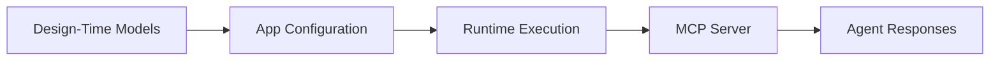
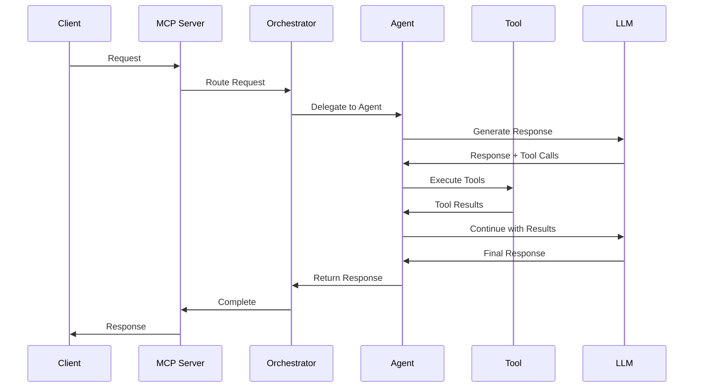

# Core Concepts

Understanding the key concepts of the AgenticAI Core SDK.

## Architecture Overview

AgenticAI Core follows a **design-time** and **runtime** separation:

- **Design-Time**: Define your application structure using Python models
- **Runtime**: Execute agents and handle requests via MCP server



## Key Components

### 1. Application (App)

The top-level container for your multi-agent system.

- Coordinates multiple agents
- Manages shared resources (LLM configs, prompts)
- Configures orchestration strategy

```python
app = App(
    name="My App",
    agents=[...],
    memory_stores=[...],
    configurations=...
)
```

### 2. Agents

AI agents that handle specific tasks or domains.

**Types:**

- **AUTONOMOUS**: AI-powered agents with LLM decision-making
- **PROXY**: Delegates to external systems

**Sub-types:**

- **REACT**: ReAct pattern (Reasoning + Acting)
- **PROXY**: External agent integration

```python
agent = Agent(
    name="CustomerService",
    role="WORKER",
    sub_type="REACT",
    type="AUTONOMOUS",
    llm_model=...,
    tools=[...]
)
```

### 3. Tools

Capabilities that agents can use to perform actions.

**Types:**

- **inlineTool**: Custom code (JavaScript/Python)
- **toolLibrary**: Pre-built platform tools
- **KNOWLEDGE**: RAG/knowledge base access
- **MCP**: Python functions via `@Tool.register`

```python
@Tool.register(name="get_data", description="Fetch data")
def get_data(query: str):
    return fetch_from_api(query)
```

### 4. LLM Models

Configuration for Large Language Models.

```python
llm = LlmModel(
    model="gpt-4o",
    provider="Open AI",
    modelConfig=LlmModelConfig(
        temperature=0.7,
        max_tokens=1600
    )
)
```

### 5. Prompts

Define agent behavior through system and custom prompts.

```python
prompt = Prompt(
    system="You are a helpful assistant.",
    custom="You help with banking operations.",
    instructions=[
        "Never ask for passwords",
        "Always confirm amounts"
    ]
)
```

### 6. Memory Stores

Persistent storage for data across conversations.

**Scopes:**

- **SESSION_LEVEL**: Session-specific data
- **USER_SPECIFIC**: User-specific data
- **APPLICATION_WIDE**: Shared across all users

```python
memory_store = MemoryStore(
    name="User Preferences",
    scope=Scope.USER_SPECIFIC,
    retention_policy=RetentionPolicy(
        type=RetentionPeriod.MONTH,
        value=6
    )
)
```

### 7. Orchestration

Coordinates multiple agents to handle complex workflows.

**Types:**

- **SUPERVISOR**: Built-in orchestration
- **CUSTOM_SUPERVISOR**: Your custom logic

```python
class MyOrchestrator(AbstractOrchestrator):
    def route(self, request):
        # Your routing logic
        return selected_agent
```

## Workflow

### 1. Design Phase

Define your application structure:

```python
# 1. Define tools
@Tool.register(...)
def my_tool(): ...

# 2. Create agents
agent = Agent(name="...", tools=[...])

# 3. Build application
app = App(name="...", agents=[agent])
```

### 2. Runtime Phase

Start and execute:

```python
# Start MCP server
app.start(
    orchestrator_cls=MyOrchestrator
)

# Server handles incoming requests
# Orchestrator routes to appropriate agents
# Agents execute using tools and LLMs
# Responses returned to client
```

## Request Flow



## Best Practices

### 1. Agent Design

- Keep agents focused on specific domains
- Use clear, descriptive names and descriptions
- Provide comprehensive prompts

### 2. Tool Design

- Make tools atomic and single-purpose
- Provide detailed descriptions for LLM understanding
- Handle errors gracefully

### 3. Orchestration

- Route based on agent expertise
- Handle edge cases (no match, errors)
- Maintain conversation context

### 4. Memory Management

- Use appropriate scopes for data
- Set sensible retention policies
- Define clear schemas

### 5. LLM Configuration

- Match temperature to task (low for factual, high for creative)
- Set appropriate token limits
- Consider cost vs. quality tradeoffs

## Next Steps

- [:octicons-arrow-right-24: Building Apps](../guide/building-apps.md) - Detailed guide
- [:octicons-arrow-right-24: API Reference](../api/index.md) - Complete API docs
- [:octicons-arrow-right-24: Examples](../examples/banking-assistant.md) - Real examples

