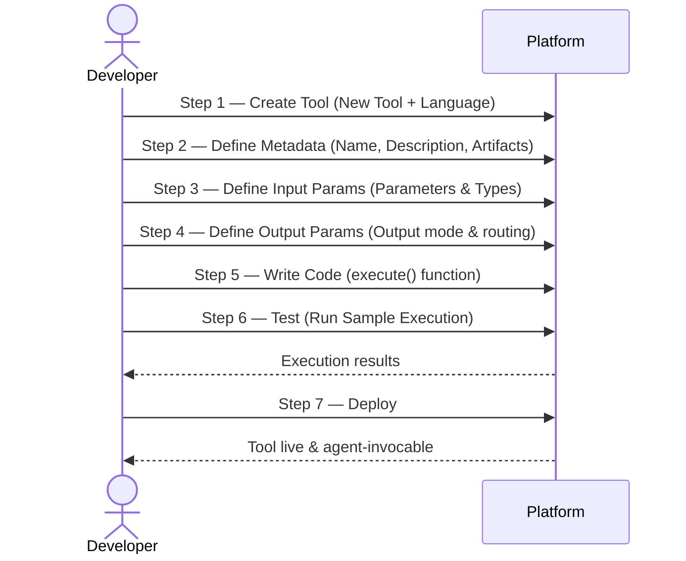

Build tools with custom JavaScript or Python code.

---

## Overview

Code tools execute custom scripts to perform tasks that require:

- Complex business logic
- Dynamic data processing
- Custom calculations
- Conditional operations beyond visual flows
- Integration with systems requiring custom protocols

**Supported languages**: JavaScript (Node.js) and Python (Python 3.x)

---

## When to Use

Code tools are ideal when:

- Logic is **dynamic or conditional**
- You need **fine-grained control** over data handling
- Visual workflows become **too complex**
- External services require **custom integration**
- You need **computational operations**

### Good Fit Examples

| Use Case | Why Code Works |
|----------|----------------|
| SQL query processor | Dynamic query construction based on user input |
| Custom validators | Complex validation rules with multiple conditions |
| Data transformers | Parse and reshape data from various formats |
| Algorithm execution | Mathematical calculations, sorting, filtering |

---

## Creating a Code Tool

<div class="ascii-art">

┌─────────────────────────────────────────────────────────────────────────────────────────┐
│                                  Creating a Code Tool                                   │
└─────────────────────────────────────────────────────────────────────────────────────────┘
│
│   Step 1            Step 2            Step 3            Step 4            Step 5
│ ┌──────────┐       ┌──────────┐      ┌──────────┐      ┌──────────┐      ┌──────────┐
│ │  Create  │       │  Define  │      │  Define  │      │  Define  │      │  Write   │
│ │  Tool    │─────▶ │ Metadata │─────▶│  Input   │────▶ │  Output  │─────▶│  Code    │
│ │          │       │          │      │  Params  │      │  Params  │      │          │
│ └──────────┘       └──────────┘      └──────────┘      └──────────┘      └──────────┘
│      │                 │                  │                  │                 │
│  New Tool           Name,            Parameters         Output mode        execute()
│  + Language      Description,        & Types           & routing           function
│                   Artifacts
│
│                                                                                 │
│                                          ┌──────────────────────────────────────┘
│                                          ▼
│                                     Step 6            Step 7
│                                   ┌──────────┐      ┌──────────┐
│                                   │   Test   │────▶│  Deploy  │
│                                   │          │      │          │
│                                   │          │      │          │
│                                   └──────────┘      └──────────┘
│                                        │                 │
│                                   Run Sample        Tool live &
│                                   Execution       agent-invocable

</div>

---



### Step 1: Create the Tool

1. Navigate to **Tools** → **+ New Tool**.
2. Select **Code Tool**.
3. Choose language (JavaScript or Python).

### Step 2: Define Metadata

| Field | Description | Example |
|-------|-------------|---------|
| **Name** | A unique and descriptive name that identifies the tool's purpose. Only alphabets, numbers, and underscores are allowed—no spaces or special characters. | `SQL_Query_Processor` |
| **Description** | A clear description of the tool's functionality, covering what it does, when to use it, and how to use it. The agent uses this description to determine when to invoke the tool. | `This tool will execute an SQL query and return the result.` |

### Step 3: Define Input Parameters

Define the parameters the tool needs to perform its task. For each parameter, specify:

| Field | Description |
|-------|-------------|
| **Name** | A unique identifier for the parameter.  |
| **Description** | Explains the parameter's purpose; helps the agent extract relevant data from user input |
| **Type** | The expected data type (see below) |
| **isMandatory** | Whether the parameter is required |
| **Default Value** | A fallback value used when the parameter isn't found in the input; must match the parameter's data type |

**Supported types**:

| Type | Description |
|------|-------------|
| `string` | Sequence of characters |
| `number` | An integer value |
| `boolean` | `true` or `false` |
| `list of values` | A restricted set of predefined options (enum). Add all values the parameter can accept. Example: `low`, `medium`, `high` for a `priority` field. |
| `object` | A structured type with one or more nested parameters. Use when multiple related values must be grouped. Example: location object containing building name, city and zip code. |

#### Defining an Object Parameter

Use an object parameter when the tool requires structured input that groups multiple related fields. Object parameters enable structured, nested inputs and allow the agent to validate and construct accurate tool requests before execution. Adhere to the **Sample Schema** for detailed structure and formatting guidelines. 

When defining an object-type parameter:

- Use the `properties` field to list all fields inside the object (mandatory for object types)
- For each field in `properties`, specify:
  - `type`: string, number, boolean, enum, or object
  - `description` (optional): A brief explanation of the field's purpose
  - `required` (optional): Whether the field is mandatory
- Use the `required` array to list mandatory fields of the object
- Nested objects must define their own `properties` and `required` fields.  Set type as object.

**Example**: An employee object with `id` and `email` (mandatory), and a nested `location` object containing `city`, `state`, and `country` (where `city` and `state` are mandatory):

```json
{
    "type": "object",
    "properties": {
        "id": {
            "type": "string",
            "description": "Unique user identifier"
        },
        "email": {
            "type": "string",
            "description": "User email address"
        },
        "location": {
            "type": "object",
            "properties": {
                "city": {
                    "type": "string",
                    "description": "City where user resides"
                },
                "state": {
                    "type": "string",
                    "description": "State where user resides"
                },
                "country": {
                    "type": "string",
                    "description": "Country where user resides"
                }
            },
            "required": ["city", "state"]
        }
    },
    "required": ["id", "email"]
}
```

### Step 4: Define Output Parameters

Output parameters define how the tool's response is processed and made available to the application. Choose one of the following modes:

**Use Complete Tool Output** — Returns the entire tool response without modification. This is the default and is recommended when the tool already returns data in the required format.

- **Include Tool Response in Artifacts** — When enabled, the tool's response is included in the `artifacts` field of the Execute API response payload. This only affects the API response and does not change tool execution behavior, playground simulations, or other agent and tool functionalities.

**Define Custom Parameters** — Extracts specific values from the tool's response and maps them as structured outputs. Use this when you need control over which parts of the response are passed to the agent or stored as artifacts.

When selected, configure one or more output parameters:

| Field | Description |
| --- | --- |
| **Name** | A unique identifier for the output parameter, used to reference the extracted value. |
| **Type** | The data type of the extracted value. |
| **Path** | The path to the value in the response payload. The platform uses this to locate and extract the data. |

Click **+ Add** to define multiple output parameters if the response contains several values needed by the agent.

**Example:** To extract a status message from the response, set **Name** to `Status`, **Type** to `string`, and **Path** to `tool.output.status.message`.

For each output parameter, configure **Output Routing** to define where the extracted value is sent:

| Option | Description |
| --- | --- |
| **Agent** | Routes the extracted value to the agent for use in reasoning, decision-making, or subsequent steps. |
| **Artifacts** | Stores the extracted value in the `artifacts` section of the Execute API response for programmatic access. |  
|**Both**| Available for agent reasoning as well as added to the response payload. simultaneously|


### Step 5: Write Code

This is the core logic of the tool. This is the custom code that gets executed when the tool is invoked. This can be written in either JavaScript or Python. 

**Using Input Parameters in the script**

In JavaScript, parameters are injected directly as `$ParameterName` variables. Assign them to local variables at the top of your script before using them. 

**Example**: ` myinput = $value; (input variable = value)

In Python, parameters are passed as it is. 

**Example**: containerId = value  (input variable = value)


**Returning a Response**

Use `return` to pass the result back to the agent. 


**Error Handling**

If your script throws an unhandled exception, the error message is passed to the agent for further investigation. This means the agent may attempt to recover or respond to the user based on the error, so write clear, descriptive error messages rather than generic ones. Use try/catch in JavaScript or try/except in Python to control exactly what the agent receives when something goes wrong.


**Working With Memory**

To read from or write to the memory store inside your script, refer to the Memory in Code Tools page.

**Working with Context Object**

Refer to [this](/agent-platform/tools/context-object) to learn **context object structure**. Context object can be accessed as:

`context.<variables>`

**Logging in scripts**

* Use console.log() method for log messages in javascript. 
* For Python, use:  print("This is a log message")
* Design time logs during tool testing can be viewed in the Execution Logs section during testing of the tool.
* Execution logs from the tool can be viewed in the Traces.

<Note>Script execution has a time limit of 180 seconds. </Note> 

Examples:

**JavaScript Example**:

```javascript
const customerId = $CustomerId; //Read the input parameters
const pin = $Pin;

async function storeCustomerCredentials(customerId, pin) {
    await memory.set_content("CustomerData", { CustomerId: customerId, Pin: pin }); //Update memory store
    return { status: "stored", CustomerId: customerId };
}
```


**Python Example**:

```Python

def execute(input: dict, context: dict) -> dict:
    customer_id = CustomerId
    pin = Pin

    try:
        memory.set_content("CustomerData", {
            "CustomerId": customer_id,
            "Pin": pin
        })
        return { "success": True, "CustomerId": customer_id }
    except Exception as e:
        return { "success": False, "error": str(e) }
```


### Step 5: Test

1. Click **Run Sample Execution**
2. Provide sample input values for each parameter
3. Review the output and execution logs
4. Debug any issues

Execution logs include timestamps, log levels, messages, and execution context—useful for troubleshooting.

### Step 6: Deploy

This tool is available with the app deployment. Once the app is deployed, the agent automatically invokes the tool when a matching intent is detected.

---

## Code Structure

### Access environment variables

```javascript
context.env.<field name> = "sample value";
```

### Input Parameter

Contains the parameters defined in your tool spec:

```javascript
const input = $input;
```

### Return Value

Return a JSON-serializable object:

```javascript
return {
  status: "success",
  data: [...],
  metadata: {
    processed_at: new Date().toISOString()
  }
};
```

---

## Environment Variables

Access secrets and configuration:

**JavaScript**:
```javascript
const apiKey = context.env.API_KEY;
const dbUrl = context.env.DATABASE_URL;
```

**Python**:
```python
api_key = context["env"]["API_KEY"]
db_url = context["env"]["DATABASE_URL"]
```

**Setting variables**:
1. Navigate to tool settings → Environment.
2. Add key-value pairs.
3. Mark sensitive values as secrets.

---

## Error Handling

Always handle errors gracefully:

**JavaScript**:
```javascript
async function execute(input, context) {
  try {
    const result = await riskyOperation(input);
    return { success: true, data: result };
  } catch (error) {
    console.error('Operation failed:', error);
    return {
      success: false,
      error: error.message,
      error_code: error.code || 'UNKNOWN'
    };
  }
}
```

**Python**:
```python
def execute(input: dict, context: dict) -> dict:
    try:
        result = risky_operation(input)
        return {"success": True, "data": result}
    except Exception as e:
        print(f"Operation failed: {e}")
        return {
            "success": False,
            "error": str(e),
            "error_code": getattr(e, 'code', 'UNKNOWN')
        }
```


## Examples

### Data Validator

```javascript
async function execute(input, context) {
  const { email, phone, date_of_birth } = input;
  const errors = [];

  // Validate email
  const emailRegex = /^[^\s@]+@[^\s@]+\.[^\s@]+$/;
  if (!emailRegex.test(email)) {
    errors.push({ field: 'email', message: 'Invalid email format' });
  }

  // Validate phone
  const phoneRegex = /^\+?[\d\s-]{10,}$/;
  if (!phoneRegex.test(phone)) {
    errors.push({ field: 'phone', message: 'Invalid phone format' });
  }

  // Validate age
  const dob = new Date(date_of_birth);
  const age = Math.floor((Date.now() - dob) / (365.25 * 24 * 60 * 60 * 1000));
  if (age < 18) {
    errors.push({ field: 'date_of_birth', message: 'Must be 18 or older' });
  }

  return {
    valid: errors.length === 0,
    errors
  };
}
```

### Price Calculator

```python
def execute(input: dict, context: dict) -> dict:
    items = input.get("items", [])
    discount_code = input.get("discount_code")
    shipping_country = input.get("shipping_country", "US")

    # Calculate subtotal
    subtotal = sum(item["price"] * item["quantity"] for item in items)

    # Apply discount
    discount = 0
    if discount_code:
        discount = get_discount(discount_code, subtotal)

    # Calculate tax
    tax_rate = get_tax_rate(shipping_country)
    tax = (subtotal - discount) * tax_rate

    # Calculate shipping
    shipping = calculate_shipping(items, shipping_country)

    total = subtotal - discount + tax + shipping

    return {
        "subtotal": round(subtotal, 2),
        "discount": round(discount, 2),
        "tax": round(tax, 2),
        "shipping": round(shipping, 2),
        "total": round(total, 2)
    }
```

## Debugging

### Console Logging

**JavaScript**:
```javascript
console.log('Input received:', input);
console.log('Processing step 1...');
console.error('Error occurred:', error);
```

**Python**:
```python
print(f"Input received: {input}")
print("Processing step 1...")
print(f"Error occurred: {error}", file=sys.stderr)
```

### Execution Logs

View logs in the traces.
- Timestamp
- Log level
- Message content
- Execution context

---

## Best Practices

### Keep Functions Focused

One tool = one capability. Don't combine unrelated logic.

### Validate Input Early

```javascript
if (!input.required_field) {
  return { error: 'required_field is required' };
}
```

### Use Type Checking

```python
def execute(input: dict, context: dict) -> dict:
    if not isinstance(input.get("amount"), (int, float)):
        return {"error": "amount must be a number"}
```

### Handle Edge Cases

- Empty inputs
- Null values
- Invalid formats
- API failures

### Document Your Code

Add comments for complex logic and business rules.

---