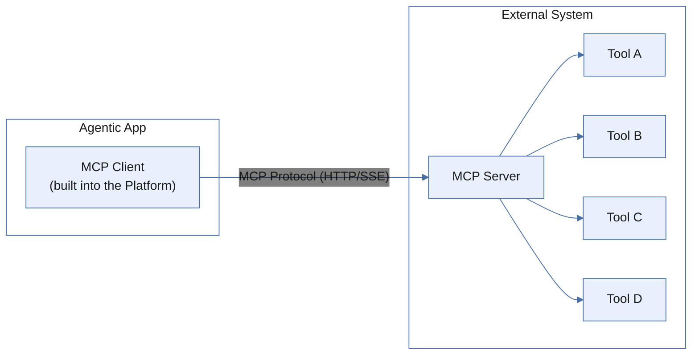
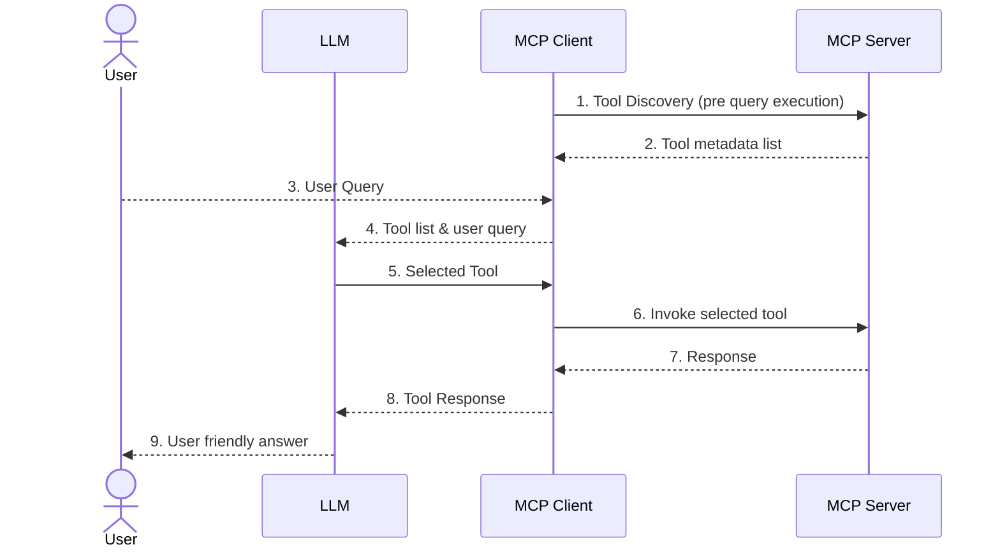

Connect agents to external tools and services using the Model Context Protocol.

---

## Overview

Model Context Protocol (MCP) is an open standard that enables AI agents to interact with external tools, data, and services through a single, consistent interface. Rather than building custom integrations for each tool, agents connect to MCP servers and access all the tools they expose through one standardized protocol. [Learn more](https://modelcontextprotocol.io/docs/getting-started/intro).

**Without MCP:** Connecting to multiple external services requires a separate integration with custom logic for each one.

**With MCP:** The agent communicates with all services through a single interface, dramatically reducing development complexity.

### Key Capabilities

- **Open Standard** - Universal protocol for AI and tool integration
- **Simplified Development** - One interface to communicate with all tools on a server
- **Scalable Architecture** - Add new tools without building custom integrations
- **Universal Compatibility** - Any MCP-compatible client works with any MCP server

---

## When to Use

MCP tools work best when:

- Tools are hosted on **external servers**
- You need **shared toolsets** across teams or multiple apps
- Tools require **enterprise integrations**
- You want to use **third-party tool providers**
- You need **separation** between tool logic and agent logic

| Use Case             | Why MCP Works                      |
|----------------------|------------------------------------|
| CRM integration      | Connect to a Salesforce MCP server |
| Enterprise tools     | Share tools across multiple apps   |
| Third-party services | Use pre-built MCP tool providers   |
| Microservices        | Each service exposes tools via MCP |


## How MCP Works

MCP uses a client-server architecture with three components:

| Component        | Role                                                                     |
|------------------|--------------------------------------------------------------------------|
| **MCP Server**   | Hosts and exposes tools to clients                                       |
| **MCP Client**   | The Platform—discovers available tools and invokes them                  |
| **MCP Protocol** | Standardized communication layer (HTTP or SSE) between client and server |




### Interaction Workflow

1. **Tool Discovery** - The MCP Client connects to the server and retrieves the list of available tools.
2. **Intent Detection** - The LLM receives the user query and the tool list, then identifies the appropriate tool.
3. **Tool Invocation** - The client sends a structured request with the tool name and required parameters.
4. **Execution** - The server runs the tool and returns results to the client.
5. **Response Generation** - The agent uses the tool output to formulate a natural language response.



### Example

```
User: "What's the weather in Dubai today?"

1. MCP Client connects to the MCP server and discovers available tools during configuration.
2. Agent identifies need for weather data and selects: `getWeatherForecast`.
3. Invokes with: { "location": "Dubai" }
4. Server returns: "36°C, Partly cloudy, Wind: 15 km/h"
5. Agent responds: "The weather in Dubai today is partly cloudy
   with a temperature of 36°C and light winds."
```
<Note>
  - The Platform supports **tool discovery** and **tool invocation** from MCP servers.
  - Tool definitions are fetched at configuration time and are not automatically synced. Manually reconfigure or refresh the MCP server to apply updates.
  - Both **HTTP** and **SSE** transport types are supported for MCP server connections.
</Note>

---

## Configure MCP Tools

### Step 1: Add an MCP Server

1. Navigate to **Tools** → **+ New Tool** → **MCP Tool**.
2. Enter a **Name** and a **Description** for the MCP server.
3. Under **Request Definition**, click **Configure** and provide:
   - **Type** - Select `HTTP` or `SSE`.
   - **URL** - The endpoint that returns tool definitions.
   - **Auth Profiles**: - Authorization profile used to authenticate requests to the MCP server. Select **None** if the server requires no authentication. For OAuth, configure the OAuth settings in an Auth Profile and select it here — the platform will handle obtaining and including the access token automatically.
   - **Headers(Optional)** - Use for add header-based authentication or custom headers required by the MCP server. 
   - **Body** - Define the request payload if the server requires additional parameters.
   - **Response** - View the response payload sent by server. 

### Step 2: Discover Tools

Click **Test** to connect to the server and retrieve its available tools. On a successful connection, the Platform displays all tools the server exposes.

### Step 3: Select Tools

Choose the tools to enable and click **Add Selected**.

### Step 4: Link to Agent

Add the selected MCP tools to your agent's tool list.

---

## Manage MCP Tools

### Tool Preview

The Tool Preview lets you inspect and test any MCP tool configured for your app.

1. Navigate to **Tools** within the app.
2. Open the **MCP** tab to see all configured tools, grouped by server.
3. Click any tool to view its description, input and output parameters, and sample responses.

The preview displays the following information:

- **Tool Metadata** - The name and description of the tool.
- **Input Parameters** - The input fields along with their data types.
- **Output Parameters** - Defines how the response from the tool is processed and made available to the application. Choose one of the following modes:
  - **Use Complete Tool Output(Default)** - Returns the entire tool response without modification. When enabled, you can include the response in the `artifacts` field of the Execute API payload using the *Include Tool Response in Artifacts* setting. This setting only affects the API response and does not change tool execution behavior, playground simulations, or other agent functionality.
  - **Define Custom Parameters** - Extracts specific values from the tool response and maps them as structured outputs. When selected, configure one or more output parameters by providing a name, selecting a data type, and specifying the path to the value in the response payload. Click **+ Add** to define additional output parameters. 

  For each output parameter, use **Output Routing** to define how the extracted value is used:
  - **Agent** - Routes the value to the agent for use in subsequent processing.
  - **Artifacts** - Stores the value in the `artifacts` section of the Execute API response for programmatic access.

**Include Tool Response in Artifacts** - Enable this flag to include the tool's output in the `artifacts` field of the Execute API response.

### Tool Naming

Tools imported from an MCP server follow this naming behavior:

- **By default**, the tool retains the original name exposed by the MCP server.
- **If a conflict arises** — that is, a tool with the same name already exists in the Agentic app — the system automatically prefixes the MCP server name to the tool name.

Format: `<MCP server name>__<tool name>`. 

For example, a tool named `GMAIL_DELETE_DRAFT` imported from a server named `GoogleMCP` is named as `GoogleMCP__GMAIL_DELETE_DRAFT`, if there is an existing tool by the name `GMAIL_DELETE_DRAFT`.

### Testing Tools

Test tools after configuration to confirm they work correctly before using them in an agent.

1. Open the tool in **Preview** mode.
2. Click **Run Sample Execution**.
3. Enter sample values for the input parameters and click **Execute**.
4. Review the output in the **Sample Response** section.

### Updating Tools

When tools on the MCP server change, manually reconfigure or refresh the server to pick up the updates. The platform does not automatically sync tool changes.

#### Refreshing the MCP Server

Click the **refresh** icon on the MCP server card to fetch the latest tool definitions from the server. The platform compares tools by name and updates the configuration accordingly:

- If all agent-linked tools are still available on the server, the update is applied automatically without affecting the agent configuration.
- If any agent-linked tools are no longer available, the platform displays a message listing the removed/updated tools. On confirmation, the unavailable tools are unlinked from the agent and the configuration is updated with the latest available tools.

#### Reconfiguring the MCP Server

To edit an existing MCP server configuration:

1. Navigate to **Tools** within the app.
2. Locate the MCP server card you want to update.
3. Click the **More options** menu on the server card and select **Edit Server**.
4. Update the required fields and click **Save**.

When key values such as the server name or URL are changed, the platform automatically fetches the latest tool definitions and compares them with the tools configured in the app:

- If all app-linked tools are still available on the server, the update is applied automatically without affecting the existing tool configuration.
- If some app-linked tools are no longer available, the platform displays a message listing the affected tools. On confirmation, the affected tools are unlinked from the app.
---

## Reference

### Server Types

**HTTP** - Standard request/response over HTTP.

```yaml
server:
  transport: http
  url: https://mcp.example.com/v1
```

**SSE (Server-Sent Events)** - Streaming responses for real-time updates.

```yaml
server:
  transport: sse
  url: https://mcp.example.com/stream
```

### Authentication

<CodeGroup>

```yaml Bearer Token
auth:
  type: bearer
  token: "{{env.MCP_TOKEN}}"
```

```yaml API Key Header
auth:
  type: api_key
  header: X-API-Key
  key: "{{env.MCP_API_KEY}}"
```


```yaml OAuth 2.0

Use auth profiles.

```

</CodeGroup>

{/* Commenting it out  - Platform users don't construct this request manually — the platform handles it automatically

### Tool Invocation

<CodeGroup>

```json Request
{
  "method": "tools/call",
  "params": {
    "name": "get_current_weather",
    "arguments": {
      "location": "Tokyo",
      "units": "celsius"
    }
  }
}
```

```json Response
{
  "content": [
    {
      "type": "text",
      "text": "{\"temp\": 22, \"condition\": \"Partly cloudy\", \"humidity\": 65}"
    }
  ]
}
```

</CodeGroup>
*/}

### Configuration Example

```yaml
name: enterprise_tools
description: Enterprise CRM and ticketing tools

server:
  url: https://mcp.enterprise.internal
  transport: http

auth:
  type: bearer
  token: "{{env.ENTERPRISE_MCP_TOKEN}}"

tools:
  - name: crm_lookup
    description: Look up customer information by ID or email
    enabled: true

  - name: create_ticket
    description: Create a support ticket in the ticketing system
    enabled: true

  - name: get_order_history
    description: Retrieve customer order history
    enabled: true

  - name: update_customer
    description: Update customer profile information
    enabled: false  # Disabled for safety
```

---
{/*
## Limitations

- **Static discovery** - Tool lists are fetched at configuration time. If the server adds, removes, or updates tools, manually reconfigure the server in the Platform to apply the changes.
- **No automatic sync** - Dynamic updates from the MCP server are not automatically reflected in the platform.
- **Supported operations** - The Platform supports tool discovery, invocation, and result processing. It does not support MCP resource endpoints, MCP prompt templates, or dynamic tool updates.

---*/}

## Best Practices

### Use Descriptive Tool Names

```
# Good
crm_customer_lookup
inventory_check_availability
order_create_new

# Avoid
tool1
getData
do_thing
```

### Write Clear Tool Descriptions

The LLM uses tool descriptions to select the right tool for a given request. Be explicit about what the tool returns and when to use it.

```
Retrieves detailed customer information from the CRM.
Returns contact info, account status, and recent interactions.
Use when the user asks about customer details or account status.
```

{/* Commenting this for now as retry mech for these failures is not supported yet.

### Handle Server Failures

Configure timeouts and fallbacks to prevent agent failures when an MCP server is unavailable.

```yaml
server:
  timeout_ms: 30000
  retry:
    attempts: 3
    delay_ms: 1000

fallback:
  message: "Unable to reach external service. Please try again."
```
*/}

### Monitor Performance

Track these metrics to maintain tool reliability:

- Response times
- Error rates
- Availability
- Token usage

---

{/*  Commenting as AP platform only gives the option to invoke MCP tools in Agentic Apps but does not allow publishing native tools via MCP server.
## Building an MCP Server

To expose your own tools via MCP, implement a server using the MCP SDK:

```javascript
import { MCPServer } from '@modelcontextprotocol/server';

const server = new MCPServer({
  name: 'my-tools',
  version: '1.0.0'
});

server.addTool({
  name: 'get_inventory',
  description: 'Check product inventory levels',
  parameters: {
    product_id: { type: 'string', required: true }
  },
  handler: async (params) => {
    const inventory = await checkInventory(params.product_id);
    return { stock: inventory.quantity, location: inventory.warehouse };
  }
});

server.listen(3000);
```

### Deployment Options

| Option           | Best For                           |
|------------------|------------------------------------|
| Cloud function   | Simple, serverless tools           |
| Container        | Complex tools with dependencies    |
| Internal service | Enterprise tools behind a firewall |

---
*/}

## Security

If the MCP server exposes pre-authorized tools that access Personally Identifiable Information (PII), avoid sharing the Agentic App that uses those tools. Sharing the app may grant others access to sensitive data on the connected servers.

---

## FAQs

**What are MCP tools in the context of the Agent Platform?**

MCP tools are the tools exposed by MCP servers and made available to agents through the platform.

**Can I connect multiple MCP servers to one app?**

Yes. An app can connect to one or more MCP servers, each exposing its own set of tools.

**Does the Platform automatically sync tool changes from the MCP server?**

No. If tools are added, removed, or updated on the server, manually reconfigure the MCP server in the Platform to apply those changes.
