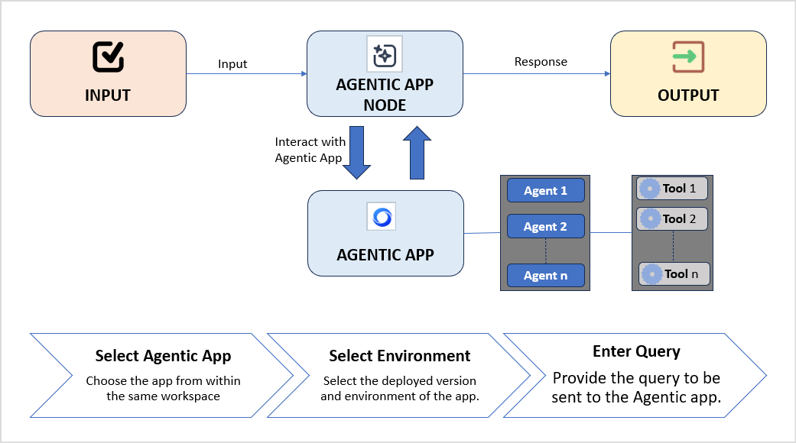

# Agentic Node 

Agentic Node enables seamless integration of the Agentic App into the workflow. This allows you to trigger agent-driven actions and automate decision-making through the capabilities of an Agentic App. It helps combine the structured control of workflow design with the autonomous decision-making power of agentic apps.

By leveraging existing Agentic Apps, it:

* Encourages reusability of existing Agentic Apps.
* Reduces redundant logic across workflows.
* Improves maintainability and scalability of automation workflows.
* Enhances collaboration among different AI agents.

**Key Capabilities**

* Integrate Agentic Apps Natively: Connect workflows to any Agentic App within the same workspace for unified automation and intelligence.
* Contextual Data Exchange: Pass workflow inputs to the Agentic App and retrieve responses or generated outputs dynamically.


## Common Use Cases

Agentic App Node is most useful at a point in a workflow that involves decisions based on unstructured data or context. Some example use cases are listed below.

* Incident Triage: In an incident workflow, the Agentic App Node can evaluate a newly created critical incident by receiving details such as the summary, category, impact, affected services, and similar past incidents. The Agentic App analyzes this input, identifies the probable root cause, and returns a structured response with recommended remediation steps.
* Invoice Processing: In invoice automation workflows, the Agentic App Node can review invoice details, such as vendor, description, line items, total amount, and cost center, to automatically determine the appropriate expense category or approval path. It can also detect duplicates or identify stale invoices, returning a structured response that the workflow can use to trigger approvals, apply exceptions, or route the invoice for review


## How It Works

The Agentic App node enables seamless integration with the agentic apps to perform complex tasks within a workflow. In a workflow, the Agentic App Node acts as a bridge between the workflow and the agentic app, analyzing the task at hand, determining the optimal tools, and autonomously executing the next steps in the process. 

When the workflow reaches the Agentic App Node, the input is passed to the Agentic app, which interprets it, decomposes the task if needed, performs the necessary processing, and returns the output for the following nodes in the workflow to use. This enables the workflow to handle complex tasks with greater intelligence and flexibility.

Note that the Agentic App Node performs only one turn of communication per execution. For multi-step interactions, include additional Agentic App Nodes at the required points in the workflow.





## Prerequisites

* The Agentic App must be deployed.
* The Agentic App must belong to the same workspace as the workflow. 
* The user account used to configure the Agentic app in AI for Process must have access to the Agentic app. 


## Add and Configure Agentic Node

Setting up an API node in a workflow involves adding it to the appropriate location in the workflow and configuring its properties.

Under Settings, provide the following details:

* Node Name: Provide a unique identifier for the node. 
* Click Add Agentic App, then select the Agentic app with which it should be linked.  All existing apps in the same workspace are automatically listed. 
* Select the app and its deployment environment. 
* Enter the inputs to be sent to the agentic app as a query. Learn more. 

Under Connections, add the connections to the subsequent nodes after this node executes.

* On Success > Go to Node: After the current node is successfully executed, go to the selected node in the flow to execute next. For example, you can further process the response from the Agentic App using a Function node. 
* On Failure > Go to Node: Select the next node to which execution should be transferred in case the current node fails.


## Passing input to the Agentic App

You can pass input as text to the Agentic App. The text can include custom data or dynamic variables from the context object. Developers can also use both system variables and user-defined variables from the context object as input to the Agentic App. 

For example, you can include a variable such as {{context.inputKey}} in the text prompt to pass its value directly to the Agentic App.


## Handling Response from the Agentic App

The output from the Agentic App is stored in the workflow’s context object, under the steps field, which tracks the execution state of each node by its unique name or ID. 

For example, if the Agentic App Node is named IncidentTriageApp, its response can be accessed at:

```
{{context.steps.IncidentTriageApp.output}}.
```

**Note**

* The response from the agentic app is async and may take time to appear in the context object, depending on how long the agent takes to complete the task. The workflow receives the output only after the Agentic App has fully finished execution.