# Add an External Model using API Integration

You can connect an external model to AI for Process using API integration. This feature extends AI for Process's functionality by allowing you to bring in models from external sources.

## Add an External Model

The steps to add an external model using API integration are given below:

1. Click **Models** on the top navigation bar. The **Models** page is displayed.

2. Click the **External models** tab.  

3. Click **Add a model**. The **Add an external model** dialog is displayed.  
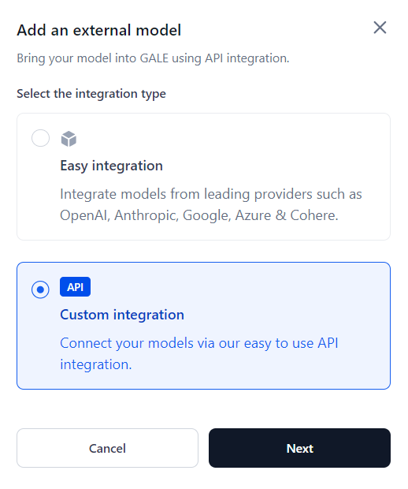

4. Select the **Custom integration** option to connect models via API integration, and click **Next**. The **Custom API integration** dialog is displayed.

5. Enter a **Model name** and **Model endpoint URL** in the respective fields.  
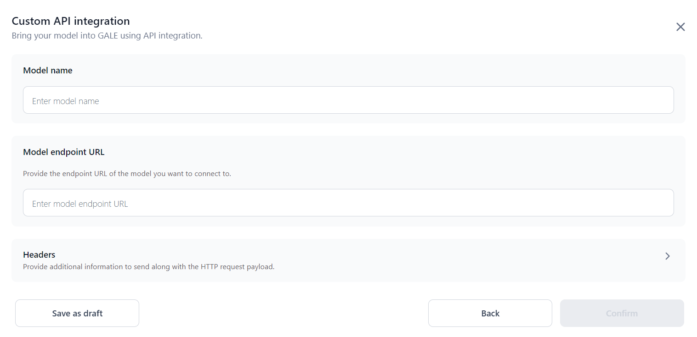

6. Select the **Authorization profile** you want to use with the request payload from the configured options on the **Settings** console. [Learn more](../../settings/security-and-control/authorization-profile.md) about Auth Profiles. To proceed without authentication, choose ***None*** which is the default selection.
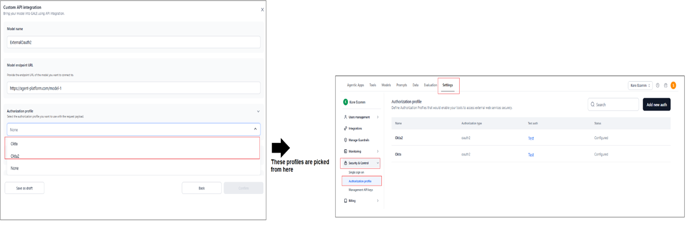

7. In the **Headers** section, specify the headers such as **Key** and **Value** that need to be sent along with the request payload. 
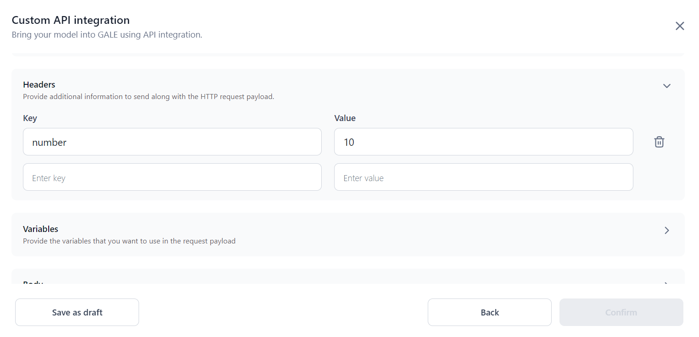

8. In the **Model configurations** section, select one of the following options to define the model’s API settings:

    **Option A: Default**
      
      By selecting this option, you can define the variables, request body code, and a test response from the model. 
      
      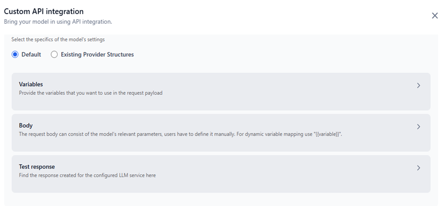

      <ul><li><b>Variables</b>: Provide the variables that you want to use in the request payload, including:</li>
    <ul><li><b>Prompt variables</b>: The Prompt variable is set to mandatory by default. You can Turn ON the toggle for the System prompt and examples if required.       
    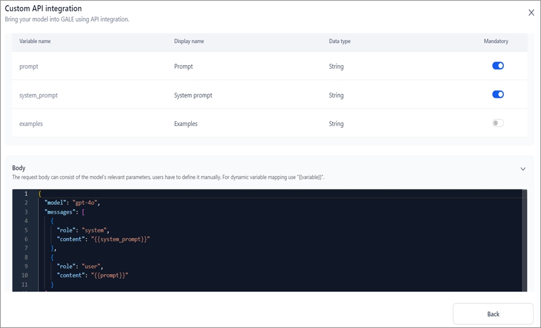</li>
    <li><b>Custom variables</b>: (Optional) To add, follow the steps below:</li>
      <ul><li>Click the <b>Custom variables</b> tab under the <b>Variables</b> section and click the <b>+Custom variables</b>.</li> 
      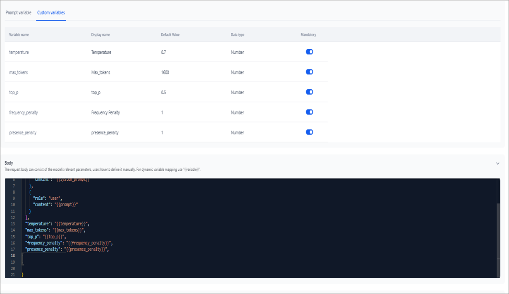</ul>
       <ul><li>The <b>Add Custom Variable</b> dialog is displayed. Enter the <b>Variable name</b> and <b>Display name</b>, and select the <b>Data type</b>.</li>
       </li></ul></ul>         
     <li><b>Body</b>: The request body must include the model’s relevant parameters, which you must define manually. For dynamic variable mapping, use <code>{{variable}}</code>. Ensure the body is in the correct format, as shown in the screenshot below; otherwise, the API testing won't work.</li>
       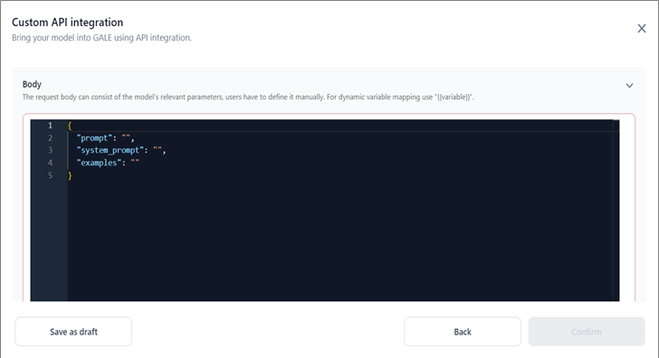</ul>
     <ul><li><b>Test Response</b>: The response created for the configured LLM service appears here. To provide a test response from the model, follow the steps below:</li>
      <ul><li> Click <b>Test</b>.
      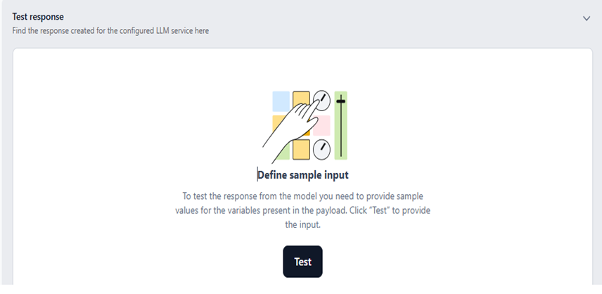</li>
       <li>In the <b>Sample Input</b> dialog, enter the <b>Prompt</b>, <b>System prompt</b>, and <b>Examples</b> in the respective fields, and click <b>Confirm</b>.</li>
       </ul></ul> 

These inputs are used to test the connection and receive a response from the model. Once the response is generated, you must configure the **JSON path** to capture the Output path, Input tokens, and Output tokens, as follows:

   * **Output Path**: When you interact with the model, you send a request in a specific format and receive a response in a corresponding format, often as a large JSON object. As a user, you are mainly interested in extracting the model’s answer from this response. The *output path* refers to the location or key within the JSON where the model’s main output is stored. Knowing this path is essential, especially in the prompt playground, as it tells you exactly which key to map to populate the response in the playground box. For example, in the sample response below, the output path is `choices[0].message.content.` 
   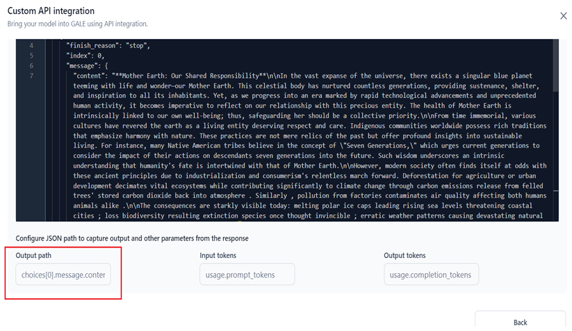

   * **Tokens**: Tokens are the units of text data provided to or generated by an LLM. Depending on the tokenization method, a token may be as short as a single character or as long as a word. Across the product—in the playground, agents, and other areas—token usage is displayed for every model. For commercial models, this information is supplied by the provider. For open-source and fine-tuned models, ML calculates and displays them in the UI. For custom API integration models, where token calculation is'nt known, users can define which key in the response JSON corresponds to this information.
     * **Input Tokens**: Input tokens are fed into the LLM for processing. For example, `usage.prompt_tokens` indicates the input tokens in the sample response below. 

          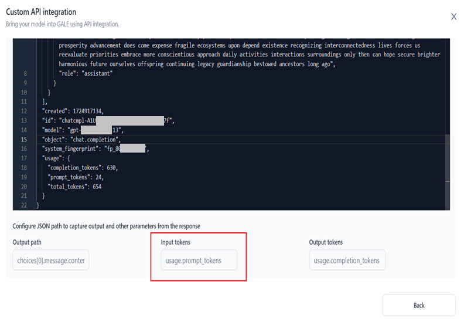

     * **Output Tokens**: Output tokens represent the text generated by the LLM after processing a prompt. Like input tokens, they can range from a single character to an entire word, depending on the tokenization method. For example, `usage.completion_tokens` indicates the output tokens in the sample response below. 

          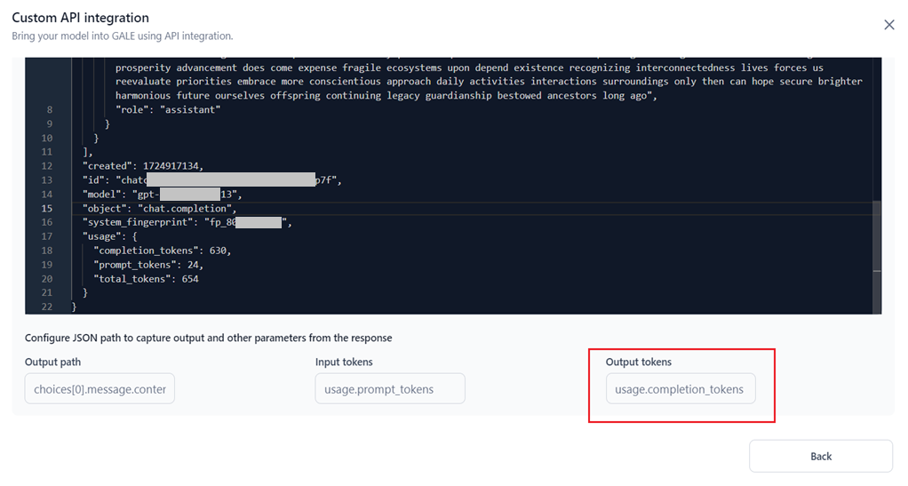

   **Option B: Existing Model Provider Structures**

   Currently, external models added through custom API integration are limited to basic text generation because only minimal request/response structures are supported. 

   This prevents customers from utilizing these models for advanced scenarios, such as structured outputs, and multimodal use cases. Without a comprehensive way to define request/response mappings, these models can't be fully integrated across the platform.

   This feature removes that limitation by:

  * Allowing users to provide complete request/response definitions through the UI or OpenAPI specifications. 

  * Supporting commonly known request/response schemas (for example, OpenAI Completions, Anthropic Messages).

   With the **Default** option, you must manually define the request payload variables, including the model’s static and dynamic body parameters, and generate the response for the configured LLM. In this section, however, you can enable the required features and choose an LLM provider to automatically map the request and response schemas to their standard API format.

* **Model Features**: Easily enable or disable one or more of the following features to make the relevant model available within the modules that use the feature(s).

     
 
     
Important

     
<ul><li>This configuration requires at least one feature to be enabled.</li>
     <li>Users can enable any feature, but the model must support it. Otherwise, you may see unexpected behavior.</li></ul>

    * **Structured response**: Specifies that the model supports the generation of a structured response. Enabling this flag allows the model to be used for generating a structured output within [Prompts](../../prompts/using-prompt-studio.md#add-prompts) and [Workflows](../../workflows/workflow-builder/flows-overview.md).
    * **Data generation**: Specifies that the model can be used for synthetic data generation for text-based tasks. Turning this flag on allows the model to be used for prompt generation in [Prompts Studio](../../prompts/using-prompt-studio.md#add-prompts).
    * **Streaming**: Specifies that the model supports real-time, token-by-token generation for faster AI responses. Turning this flag on allows the model to be used for generating streaming responses within Agentic Apps. (coming soon) 
    * **Modalities Support**: Specifies the modalities supported by the model. Enabling this flag allows the model to run Text-to-Text, Text-to-Image, Image-to-Text, and Audio-to-Text tasks for seamless downstream integration within the [Workflows](../../workflows/workflow-builder/flows-overview.md).
     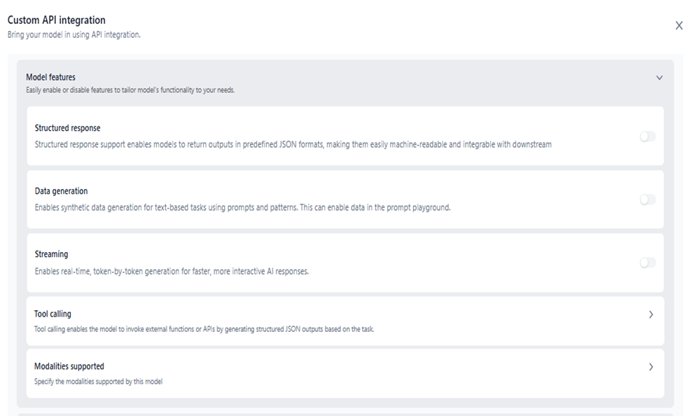
 
 * **Body**: In this section, choose a provider to set the API reference. The platform uses this mapping to resolve your model’s request-response structure. The available options include:

     * **Anthropic (Messages)**:  Specifies that the selected model follows the request-response structure similar to [Anthropic’s Messages API](https://docs.anthropic.com/en/api/messages).
     * **OpenAI (Chat Completions)**: Specifies that the selected model follows the request-response structure similar to [OpenAI’s Chat Completions API](https://platform.openai.com/docs/api-reference/chat).
   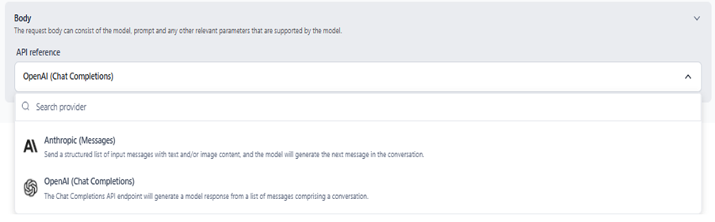

     

     
Note

     
Click <b>Save as Draft</b> to save the model. The status will be updated to *Draft*.

</ol>

<ol start="9"><li>Click <b>Confirm</b> to save the details and add the external model to the list.</li></ol>

## Manage Custom API Integrations

Once the integration is successful and the inference toggle is ON, you can use the model across AI for Process. You can also turn inferencing OFF if needed.

To manage an integration, click the three-dot icon corresponding to its name and choose from the following options:  

 * **View**: View the integration details.
 * **Copy**: Make an editable copy of the integration details.
 * **Delete**: Remove the integration.

