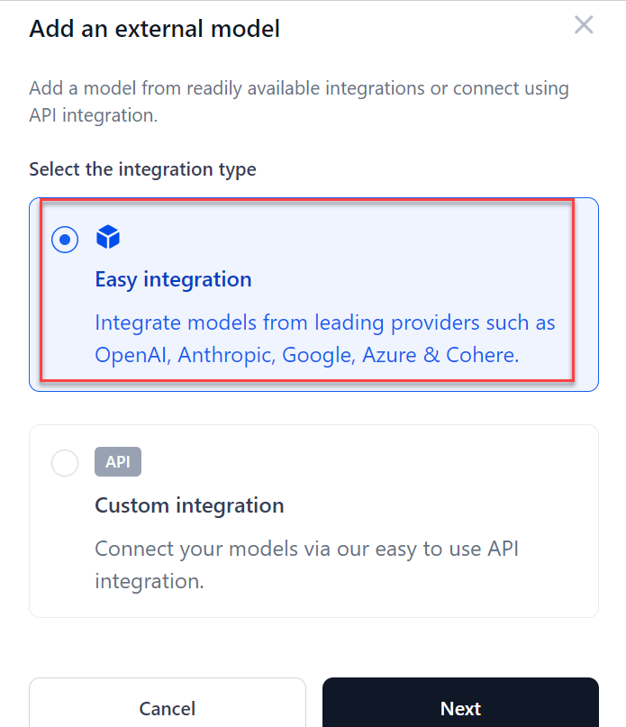
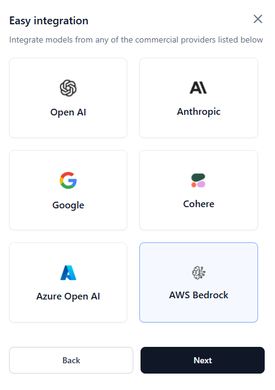
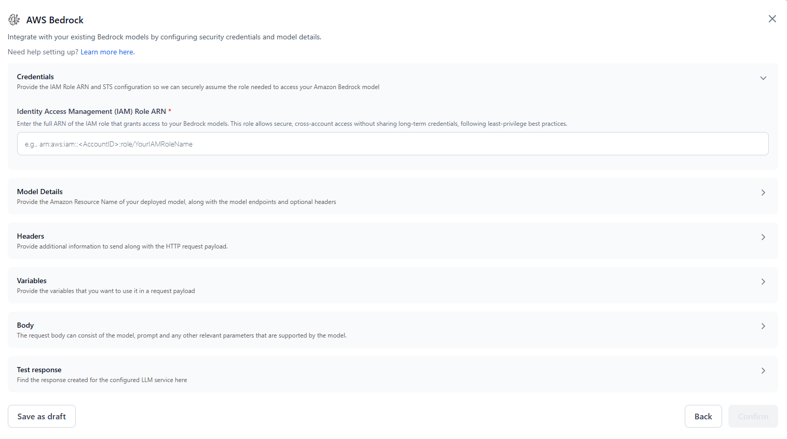

# Add an External Model using Easy Integration

Easily integrate models from popular providers like OpenAI, Anthropic, Google, Cohere, and Amazon Bedrock using the Easy Integration option in AI for Process.

## Integrate a Model from Anthropic 

Steps to add the Anthropic Claude-V1 model using easy integration:

1. Click **Models** on the top navigation bar of the application. The **Models** page is displayed.
2. Click the **External models** tab on the **Models** page.

    

3. Click **Add a model** under the **External models** tab. The **Add an external model** dialog is displayed.

    

4. Select the **Easy integration** option to integrate models from Open AI, Anthropic, Google, or Cohere and click **Next**.
5. Select a provider to integrate with and click **Next**.

    

    A pop-up with the list of all the Anthropic models that are supported in AI for Process is displayed.
    
    For more information on the list of external models supported, see [Supported models](../supported-models.md).

    

6. Select the required **Model** from the options listed and click **Next**.

7. Enter the respective API key you have received from the provider in the **API key** field and click **Confirm** to start the integration.

      </ol>

The model is integrated and is listed in the External models list.

!!! note

    * You can click the 3 dots icon corresponding to the Model name in the list of external models and edit or delete the model.
    * You can set the Inference option using the toggle button corresponding to the Model name. If the Inferencing toggle is ON, you can use this model across AI for Process. If the toggle button is OFF, it means you cannot infer it anywhere in AI for Process. For example, if you turn OFF the toggle button, then in the playground, an error message is displayed that the model is not active even though you have added it in the external models tab.


## Integrate a Model from Amazon Bedrock

You can easily connect Amazon Bedrock models to the AI for Process using a guided setup flow. This process enables secure role-based access using your own AWS credentials.

!!! important

    Customers must create an IAM role within their AWS account with the necessary permissions in their AWS account (e.g., access to AWS Bedrock APIs). This role must include a trust policy that allows the AI for Process’s AWS principal (or a designated IAM role in an AWS account) to assume it. For more information, see [Configuring Amazon Bedrock models](./configuring-aws.md).


Steps to add Amazon Bedrock models using easy integration:

<font size="4">**1. Start the Integration**</font> 

1. Click **Models** in the top navigation bar of the application.
2. Go to the **External Models** tab and click **Add a model**.
3. Select **Easy integration** > **AWS Bedrock** and click **Next**.

      


<font size="4">**2. Configure the Integration**</font> 

In the AWS Bedrock dialog, configure the following:

   

* **Credentials**: 
    * **Identity Access Management (IAM) Role ARN**: Enter the full ARN of your IAM role that has permission to invoke Amazon Bedrock models. This role allows secure cross-account access following least-privilege principles.  
    For more information, see [Setting Up Credentials and Trust Policy (IAM Role & STS)](../external-models/configuring-aws.md#step-1-setting-up-credentials-and-trust-policy-iam-role-and-sts).
    * **Trusted Principal ARN**: The ARN of the AWS IAM principal (from the AI for Process) used to assume your IAM role. It’s pre-populated, read-only, and fetched securely — manual input is not required.

* **Model Details**: 
    * **Model name:** Enter a custom name to identify this model internally within your workflows.
    * **Model ID**: Enter the Model ID or Endpoint ID of the Amazon Bedrock model you want to use. For more information, see [Finding the Right Model ID and Region](./configuring-aws.md#step-2-finding-the-right-model-id-and-region).
    * **Region**: Specify the AWS region where the Bedrock model is deployed.

* **Headers (Optional)**: Provide any additional information to include with the HTTP request. Use this if your model requires custom headers for configuration or authentication.  
For example: "Content-Type": "application/json"

* **Variables:** In the Prompt Variables section, define any input variables that will be used within your request payload. These are used to bind dynamic input values to your payload structure.  
For example: `{{prompt}}`, `{{system.prompt}}`

* **Body**: Provide a sample JSON request body for invoking the model. Use the defined variable placeholders `{{variableName}}` (such as `{{prompt}}`)  to bind input fields dynamically.
For example:

      ```
      {
         "prompt": "{{prompt}}",
         "max_tokens": 200,
         "temperature": 0.7
      }
      ```

    **Note**: The structure of the request body should follow the model-specific API schema. Use only supported parameters for the selected Amazon Bedrock model.

<font size="4">**3. Test the Configuration**</font> 

* **Test Response**: Provide sample values for your variables and click **Test** to invoke the model and preview the response.
* **Configure JSON Path**: Define JSON paths to extract relevant output fields (for example, response text, token usage) from the model response.

<font size="4">**4. Finalize the Configuration**</font> 

* Click **Save as draft** to store the configuration without activating it.
* Or, click **Confirm** to finalize and add the model connection.

Once completed, your model appears in the **External Models** tab. You can now reference this model in your **Prompts** and **Workflow** across the AI for Process.