# Create a Fine-Tuned Model

You can fine-tune a Platform-hosted model or import one from Hugging Face. The fine-tuning process involves the following steps:

1. General details
2. Selecting a base model
3. Fine-tuning configuration
4. Adding the training and evaluation datasets
5. Adding the test dataset (optional)
6. Selecting a hardware
7. Integrating with Weights & Biases (optional)

Steps to fine-tune a model:

1. Log in to your account and click **Model Hub** under AI for Process.

2. On the **Fine-tuned models** tab, click **Start fine-tuning**.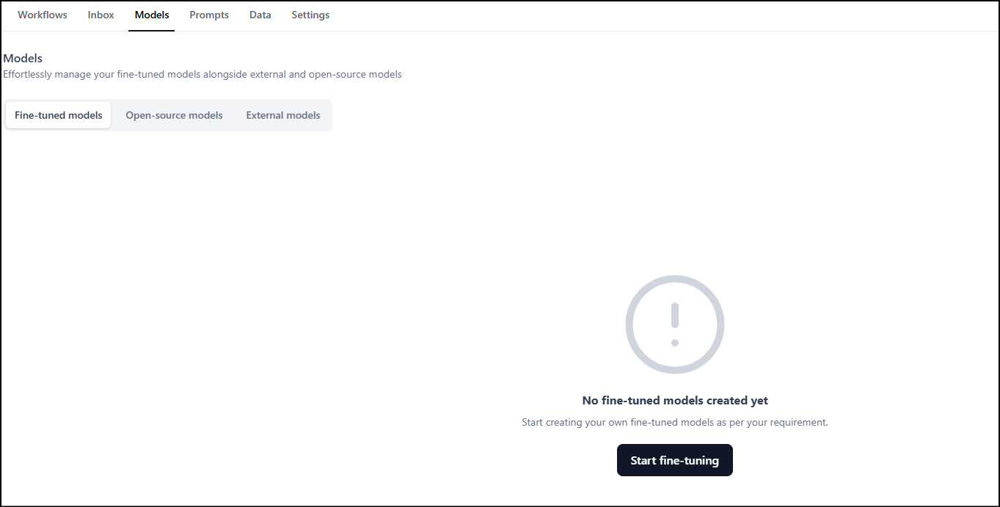

3.  The **Create a fine-tuned model** dialog is displayed. In the **General details** section:
    * Enter a **Model name** and **Description** for the fine-tuned model.  
    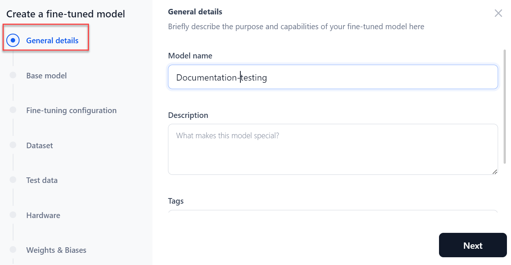

    * Provide tags to ease the search for the model and click **Next**.

4. In the **Base** **model** section, choose the model to be fine-tuned.
    * If you choose hosted models, select the **model** from the dropdown list and click **Next**.  
    **Note**: Imported models are also included in the list of models.  
    

    * If you choose to **Import from Hugging Face**, select the **Hugging Face connection** type from the dropdown, and paste the **model name**. Click **Next**. For more information about how to connect to your Hugging Face account, see[ How to Connect to your Hugging Face Account](../../settings/integrations/enable-hugging-face.md).
    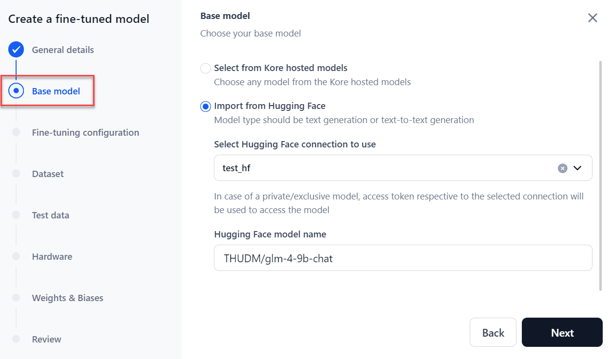 

5. In the **Fine-tuning configuration** section:
    * Select a **Fine-tuning type** to apply to the model: Full fine-tune, LoRA (Low-Rank Adaptation), or QLoRA (Quantized LoRA).

        The supported fine-tuning types vary based on the size of the base model:

        | Base model parameters            | Supported fine-tuning types                         |
        |----------------------------------|-----------------------------------------------------|
        | **< 1B**                         | Full fine-tune, LoRA, QLoRA                         |
        | **≥ 1B and < 5B**                | LoRA, QLoRA                                         |
        | **≥ 5B and ≤ 8B**                | QLoRA                                               |

    * Enter the **Number of Epochs**, which indicates how many times the model processes the entire dataset during training.
    * Enter a number for **Batch size**, which implies the number of training examples used in one training iteration.
    * Enter a value for the **Learning rate**, which implies the size of the steps taken during the optimization of a model.
    * Click **Next**.  
    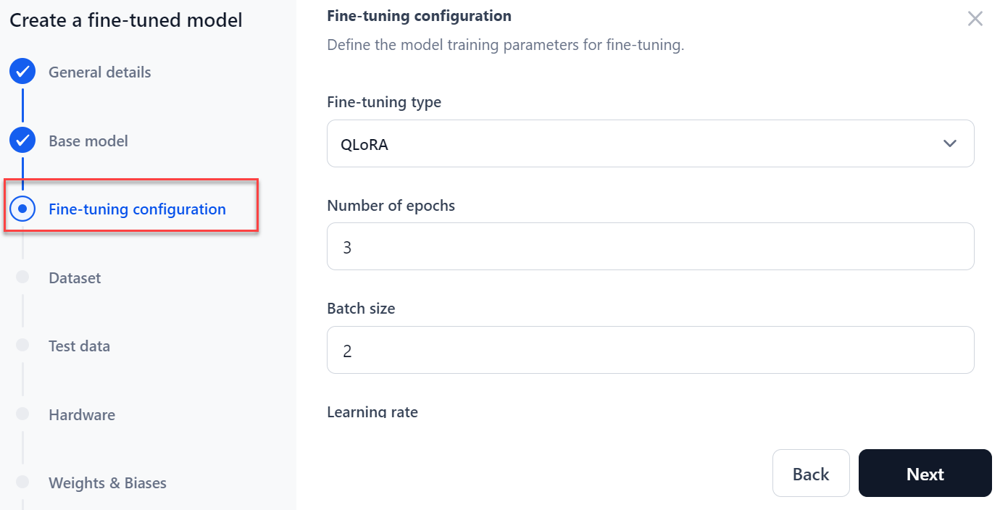

6. In the **Dataset** section:
    * Select or upload the **Training dataset** from the dropdown to train the base model. It acts as the foundation for the model's learning.
    
        !!! note

            The system accepts JSONL, CSV, and JSON files. The training, evaluation, and test files must follow a specific format with at least two columns: one for the prompt and one for the completion. You can download a sample file. 
        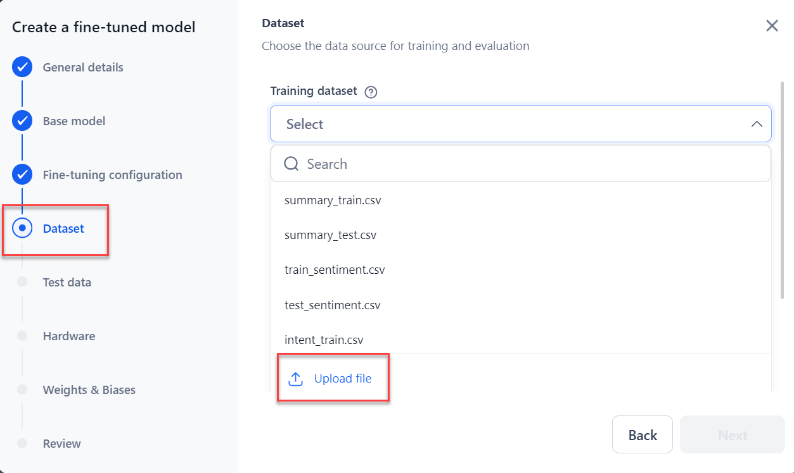

    * **Evaluation dataset**: Select the **dataset** for the model evaluation and then click **Next**.
        1. **Use from training dataset (default)**: This enables you to allocate a percentage of the training dataset for model evaluation. By default, 15% of the training dataset is allocated for model evaluation.
        2. **Upload evaluation dataset**: Select or upload another dataset from the dropdown.
        3. **Skip the evaluation**: It will skip the model evaluation process.
        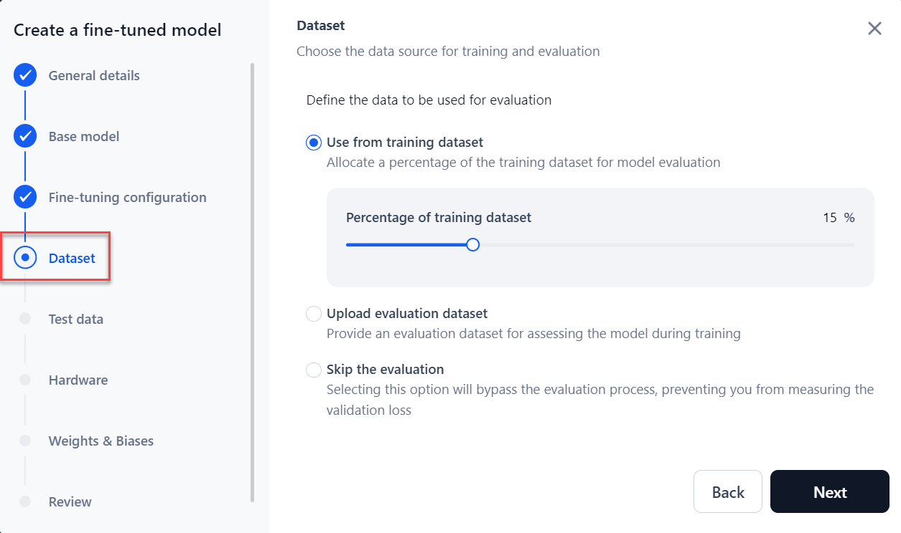

7. Select or upload the test dataset to test the fine-tuned model. Click **Next**.
    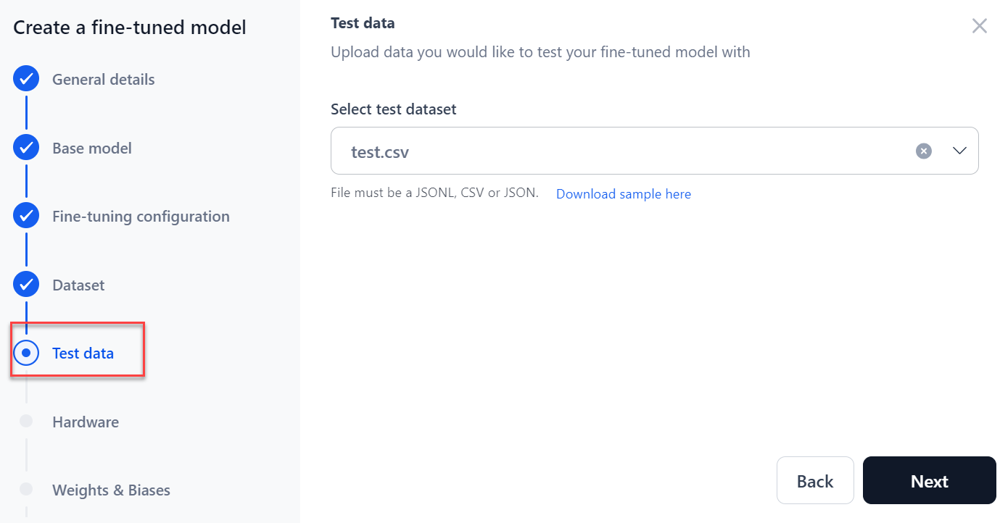

    !!! note

        The system accepts JSONL, CSV, and JSON files. 
        

8. Select the required hardware for fine-tuning from the dropdown menu and click **Next**.  
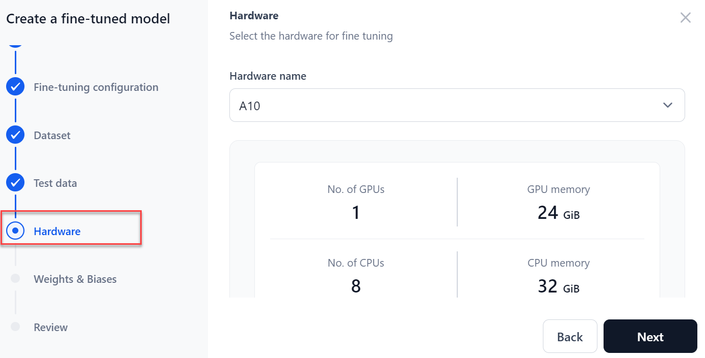

9. In the **Weights & Biases** section, select your **WandB connection** from the drop-down list and click **Next**. 
To create a Weight & Biases connection, click **+ New connection**. For more information about how to create the WandB account, see[ How to Integrate with WandB](../../settings/integrations/integrate-with-wandb.md). 

    !!! note

        You need an account with Weights and Biases. Enabling the integration with an API token will share your real-time fine-tuning status with the platform, allowing you to monitor your model's fine-tuning metrics comprehensively. Use the provided API token to create an integration, sending all fine-tuning process data to the associated account.

    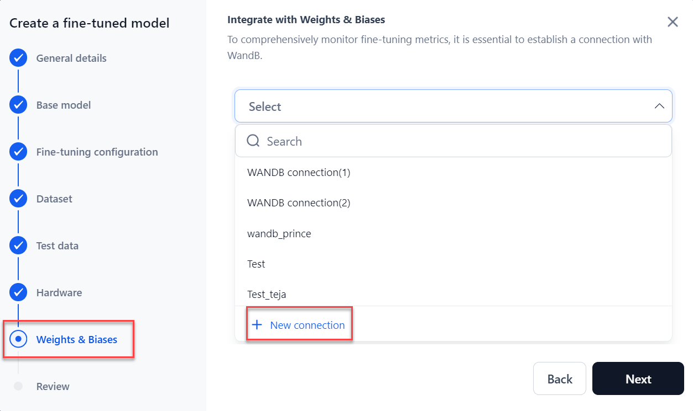      

10. In the **Review** step, verify all the details before starting the fine-tuning. To modify previous steps, click **Back**. 
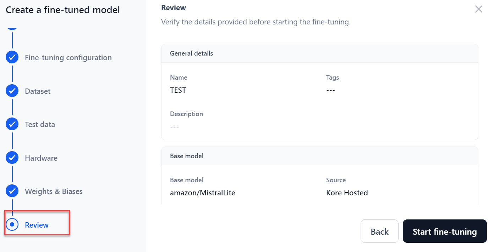

11. Click **Start fine-tuning**.  
The model **Overview** page displays real-time progress. You can also view the model’s overview page by clicking the model on the **Fine-tuned models** page. [Learn more](../fine-tune-models/model-settings-overview.md).  
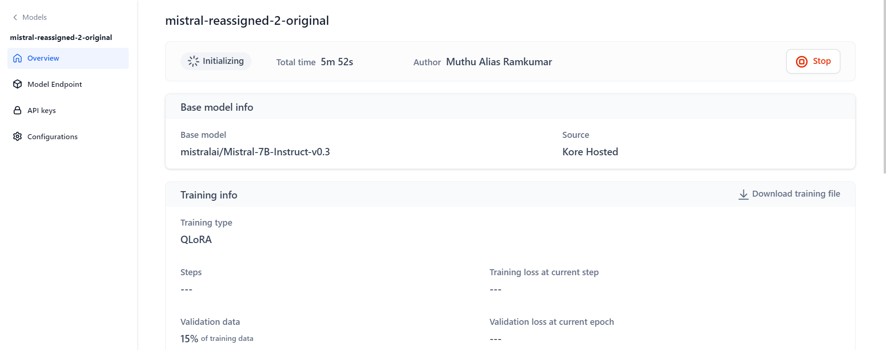

Once testing is completed, you can download the training file, test results, and test data for your reference.

After fine-tuning, deploy the model in AI for Process or externally via the generated API endpoint. You can also create another fine-tuned model on top of this one.

