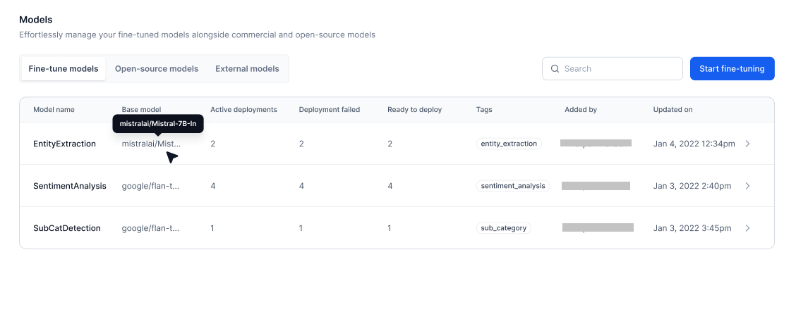
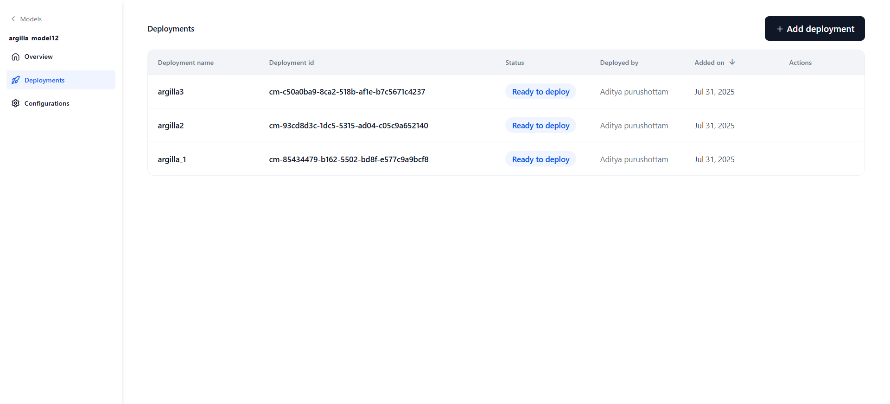
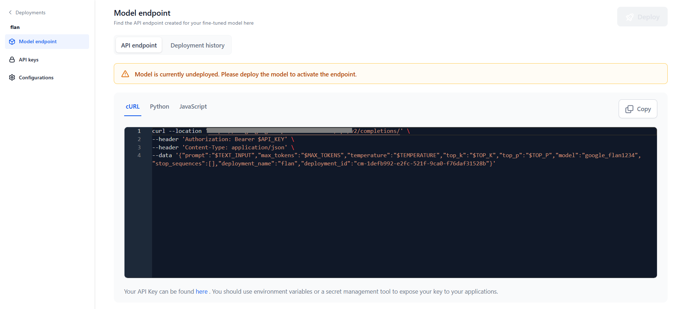

# Managing Fine-Tuned Models 

The Fine-Tuned Models tab in the Models section allows you to create, customize, and manage models fine-tuned to your specific use cases.

* **[Create a Model](./create-a-fine-tuned-model.md)**: Fine-tune a Platform-hosted model or import one from Hugging Face. Configure training parameters, datasets, and hardware resources as needed.
* **[Deploy a Model](./deploy-a-fine-tuned-model.md)**: Once fine-tuning is complete, deploy the model within the AI for Process or externally using the generated API endpoint. You can also fine-tune further on top of an already fine-tuned model.

Once deployed, the model is listed on the Fine-tuned models page, showing its deployment count and other details.

## Viewing the Model List

The Fine-Tuned Models listing page displays all available models along with the following details:

| Field               | Description |
|---------------------|-------------|
| **Model Name**      | Name of the fine-tuned model. |
| **Base model**      | The model used as the base for fine-tuning. |
| **Active Deployments** | Number of deployments that are currently active. |
| **Deployment Failed** | Number of deployments that failed. |
| **Ready to Deploy** | Number of deployments that are ready to be deployed. |
| **Tags**            | Labels associated with the deployment. |
| **Added by**        | User who created or imported the model. |
| **Updated on**      | Date of the deployment. |

Select a model in the list to open the model’s detail view. By default, this opens the Overview page. The left navigation pane includes the following sections:

* [Overview](./model-settings-overview.md)– View general information, training progress, and test information.
* [Deployments](./managing-fine-tuned-models.md#managing-model-deployments) – Manage all deployments of the selected model.
* [Configurations](./configure-your-fine-tuned-model.md)– Edit model name and description, add tags, adjust the model endpoint timeout duration, or delete the model.

## Managing Model Deployments

Each model can have multiple deployments, which are tracked independently. 

Click the Deployments tab to see all deployments for the selected model, along with the following details:

<table>
  <thead>
    <tr>
      <th style="width: 150px;" />Field</th>
      <th style="width: 500px;" />Description</th>
    </tr>
  </thead>
  <tbody>
    <tr>
      <td><b>Deployment Name</b></td>
      <td>Name given by the user during deployment.</td>
    </tr>
    <tr>
      <td><b>Deployment ID</b></td>
      <td>System-generated ID (not editable).</td>
    </tr>
    <tr>
    <td><b>Status</b></td>
    <td>
    The status of deployment: Deploying, Optimizing, Failed, Ready to Deploy, or Deployed.
  </td>
</td>
    </tr>
          <td><b>Deployed By</b></td>
      <td>User who performed the deployment.</td>
    </tr>
    <tr>
      <td><b>Added On</b></td>
      <td>Date of deployment.</td>
    </tr>
    <tr>
      <td><b>Actions</b></td>
      <td>
        <b>Copy cURL</b> – Copies the cURL command for invoking this deployment.
        <b>Manage API Keys</b> – Opens the API key management tab.
        <b>Re-trigger</b> – Restarts the deployment (Option available only if it has failed or stopped).
      </td>
    </tr>
  </tbody>
</table>

## Managing Deployment Details

Selecting a specific deployment on the Deployment page opens its detail view, where you can view and manage the configuration, endpoint, and API keys for that deployment.

- **[Model Endpoint](./view-the-generated-api-endpoint.md)** – View or manage the live endpoint; re-deploy the model if needed (specific to this deployment).
- **[API Keys](./generate-an-api-key.md)** – Generate and manage keys scoped to this deployment. API keys are isolated per deployment for secure access control.
- **[Configurations](./configure-your-fine-tuned-model.md)** – Edit the description and tags, or undeploy/delete the model.

