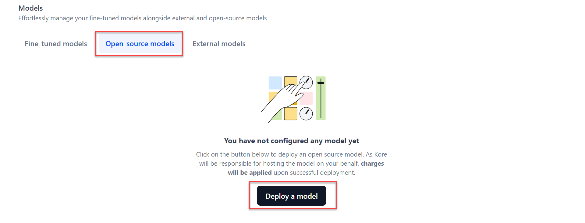
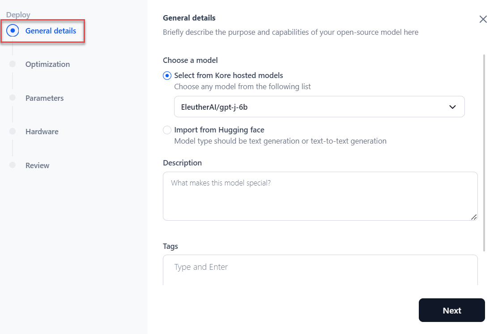
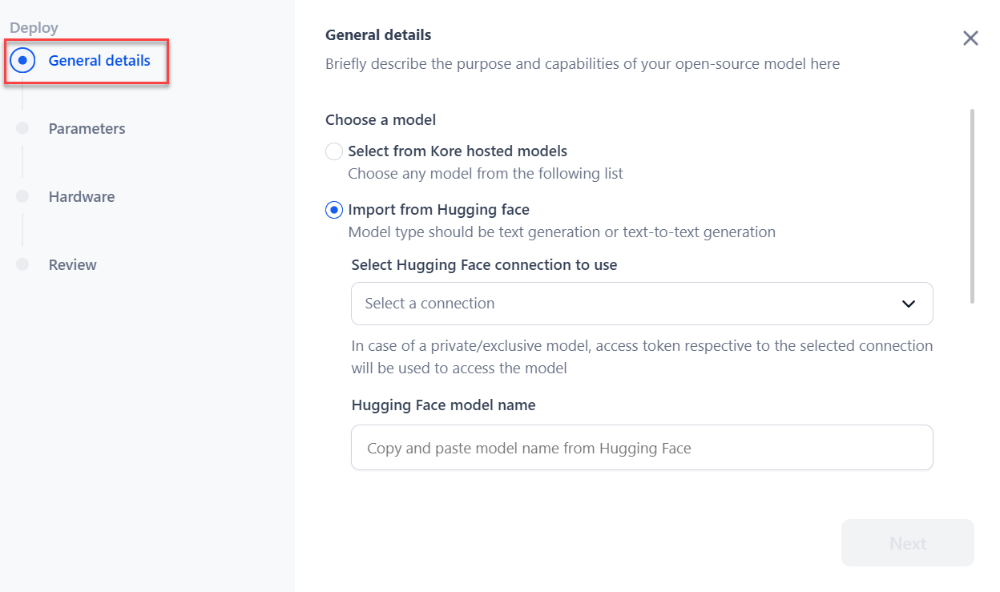
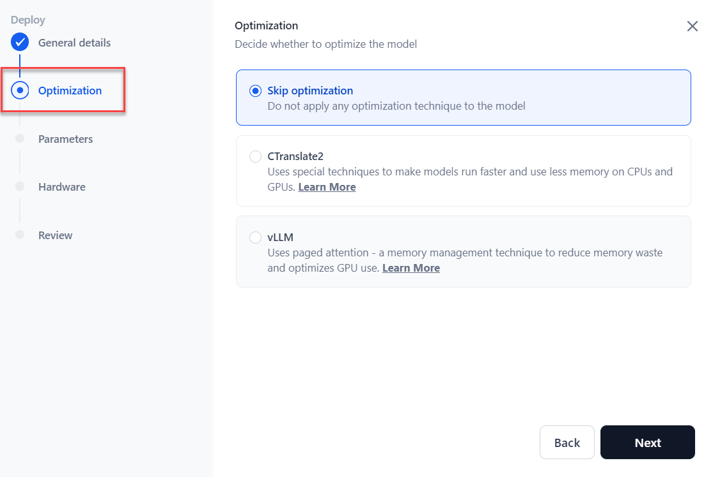
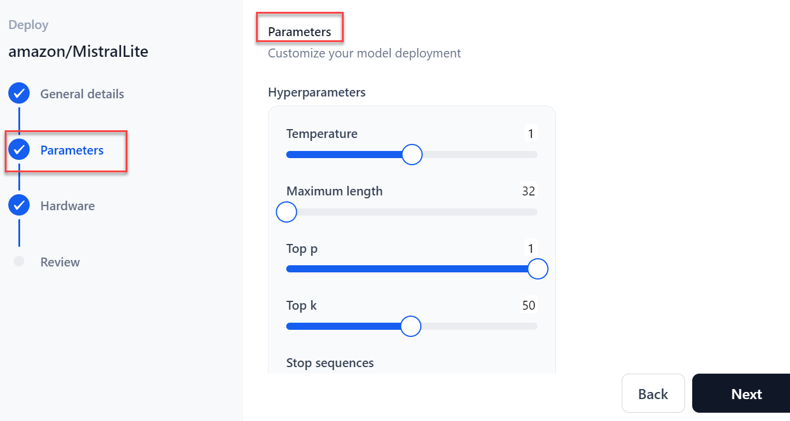
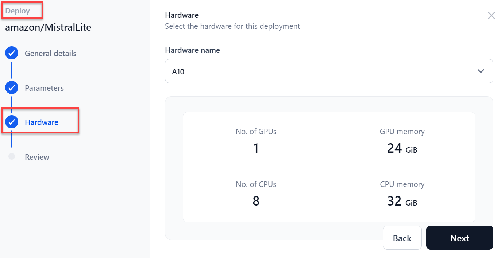
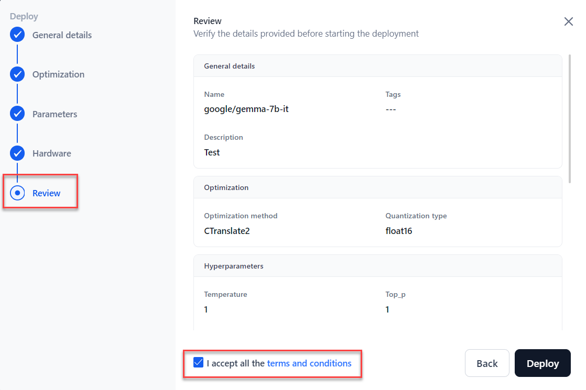
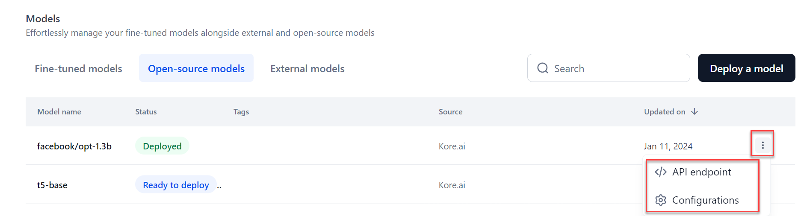

# Select and Deploy an Open-Source Model

AI for Process supports thirty-plus open-source models and provides them as a service. If you select the Platform-hosted model, you can optimize it before deployment.  
   For more information on the list of models supported, see [Supported models](../supported-models.md#supported-open-source-models).

To select and deploy a model, follow these steps:

1. Go to **Models** > **Open-source models** and click **Deploy a model**.

    

2. The **Deploy** dialog is displayed. In the **General details** section:

    * If you choose hosted models:

       * Select the **model** from the dropdown menu.
       * Add a **Description**.
       * Provide **tags** to ease the search for the model.
       * Click **Next**.

       

     For more information on the list of models supported, see [Supported models](../supported-models.md#supported-open-source-models).

   * If you choose to **Import from Hugging Face**:

       * Select the **Hugging Face connection** type from the dropdown.
       * Paste the **model name**.

     For more information about connecting to your Hugging Face account, see [How to Connect to your Hugging Face Account](../../settings/integrations/enable-hugging-face.md).

     <Note> In the case of public mode, selecting a connection is not necessary. </Note>

     

3. Based on the selected Platform-hosted model, the **Optimization** section is displayed. Choose the optimization option as required and then click **Next**. [Learn more](../open-source-models/model-optimization.md).

    * **Skip optimization**: Skips the model optimization.
    * **CTranslate2**: Select Quantization from the dropdown menu if applicable. [Learn more](model-optimization.md#ctranslate2).
    * **vLLM**: Select Quantization from the dropdown menu if applicable. [Learn more](model-optimization.md#vllm).

    

4. In the **Parameters** section:

    * Select the Sampling **Temperature** to use for deployment.
    * Select the **Maximum length**, which implies the maximum number of tokens to generate.
    * Select **Top p**, an alternative to sampling with the temperature where the model considers the results of the tokens with top_p probability mass.
    * Select the **Top k** value, the highest probability vocabulary tokens to keep for top-k filtering.
    * Enter the **Stop sequences**, which tells the model when to stop generating further tokens.
    * Enter the **Inference batch size**, which is used to batch concurrent requests at the time of model inferencing.
    * Select **Min replicas**, which indicates the minimum number of model replicas to be deployed.
    * Select **Max replicas**, which indicates the maximum number of model replicas to auto-scale.
    * Select **Scale-up delay (in seconds)**, which indicates how long to wait before scaling up replicas.
    * Select **Scale down replicas (in seconds)**, which indicates how long to wait before scaling down replicas.

    

5. Click **Next**.

6. In the **Hardware** section, select the required hardware for deployment from the dropdown menu and click **Next**.

    

7. In the **Review** section, verify all the details before starting the fine-tuning.

    * To modify previous steps, click **Back**.
    * Go through the terms and conditions and select **I accept all the Terms and Conditions**.

    

8. Click **Deploy**.

If you have selected optimization, the model optimization starts, and the status changes to “Optimization”. If not, the model is deployed. After deployment, the status changes to "Deployed." You can now use this model across AI for Process and externally.

Hover over the deployed model to view **more** icons (three dots) which provide access to the model **API endpoint** and **Configurations**. Selecting the API endpoint option shows the API endpoint, deployment history, API keys, and other details. Selecting the Configuration option allows you to add a description, tags, and deploy or delete the model.

#### Re-deploy a Deployed Model

After the initial deployment, if you wish to update the model’s parameters, hardware, or both, you must redeploy the updated model.

To re-deploy a deployed model, follow these steps:

1. Go to **Models** > **Open-source models** and select a **model** to redeploy.
2. Click the **Deploy model**. The **Model Configuration** page is displayed.
3. Modify the required fields and click the **Deploy**. Once deployed, the status changes to “Deployed”.

