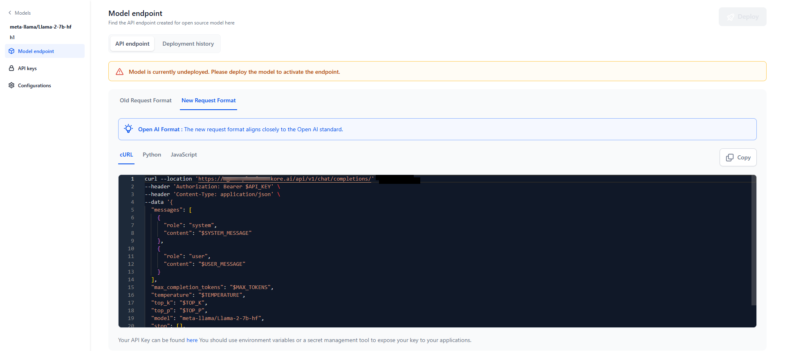
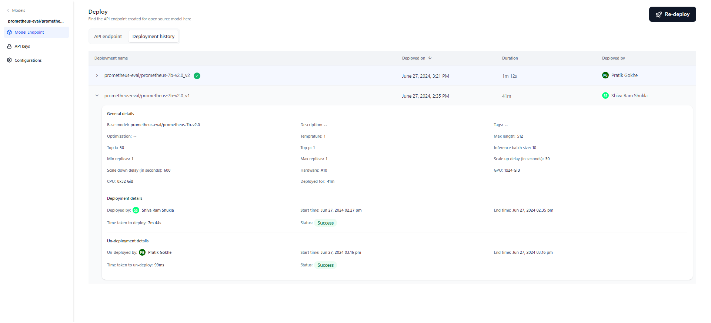

# View API Endpoint & Deployment History

## API Endpoint

After the open-source model is deployed, the API endpoint is generated which implies that your model is ready for inferencing externally and across the other sections in AI for Process. 

The API endpoint is available in 3 formats.

!!! note

    You will receive an email notification after your model deployment is completed and an API is generated, and it is ready to use.

To view the API Endpoint, follow these steps:

1. Click the required model from the models listing. Click the **Model Endpoint** tab in the left panel on the **Models** page of your open-source model. The API endpoint created for this open-source model is displayed.

1. To use this model as a service, the generated code is helpful. Click the **Copy** icon to copy and share the API Endpoint.

    

!!! note

    Click the **Deployment history** tab on the Deploy page to view the history. This can be particularly useful for auditing and accountability purpose.

You can either embed the curl or the code that is generated into your own applications or use it externally. 

### Structured Output Support

Open-source models can return responses in a structured JSON format using the `response_format` parameter, aligned with OpenAI schema style.

You can use this capability in two ways:

* Through API calls: Add the response_format parameter to the model endpoint when calling the deployed model externally.
* Within the Workflow builder canvas: Define the schema directly in the builder. The AI for Process automatically attaches it as the response_format parameter for structured output.

This capability is supported on v2/chat/completions endpoints for selected open-source models. Older endpoints (v1/completions) don't support structured output. For the list of models that support structured output, see [Supported Models for Structured Output](../supported-models.md#supported-models-for-structured-output).

Supported schema data types include: string, number, boolean, integer, object, array, enum, and anyOf.

**How it works**:

* Add a `response_format` field to your request body.
* If provided, the model attempts to return a response in JSON object matching the defined schema.
* If not provided, the model responds with standard text output.

!!! note

    If a model supports both tool calls and JSON Schema, tool calls take precedence, and the schema will be ignored.

## Deployment History

After deploying a model, you can modify its parameters and redeploy the updated version. The deployment history table tracks the complete life cycle of the model, offering detailed information for each version. This includes the deployment name, the timestamp when it was deployed, the deployment duration, the individual who performed the deployment, and other relevant details. 

Additionally, the system automatically appends a version number to the deployment name and increments it with each subsequent redeployment, ensuring a clear and organized record of all model versions and their respective changes.

For example, if a model named "Flan T5" is deployed for the first time, it will be named as "Flan T5_v1". Subsequent deployments will be named as "Flan T5_v2", "Flan T5_v3", and so on, incrementing the version number with each redeployment.

The most recent deployment is marked with a green ticket next to the model name. Click on any deployment version to view the details.

 

**General details**: This section displays the model's basic information, such as its name, description, tags, optimization technique, parameters, the hardware used, and deployment duration.

**Deployment details**: This section includes who deployed the model, the start and end timestamps of deployment, the deployment duration, and its status (Success, Failed, or Deploying). In case of a failed deployment, hover over “Status” to view the reason for the failure.

**Un-deployment details**: This section appears only if the model is undeployed either automatically by the system or manually. In the case of manual un-deployment, the person who initiated the un-deployment, along with the start and end timestamps of the process, is displayed.
