# Manage Account Billing and Usage

The Billing section helps you monitor and analyze your AI for Process expenses through detailed usage metrics and cost breakdowns. You can track computational costs across workflows, models, guardrails, OCR models, and custom script deployments to make data-driven decisions about your resource utilization.

## Accessing Usage Information

Steps to access the Usage page:

1. Log in to AI for Process and click **Settings**.
2. On the left navigation pane, click **Billing** > **Usage**.  
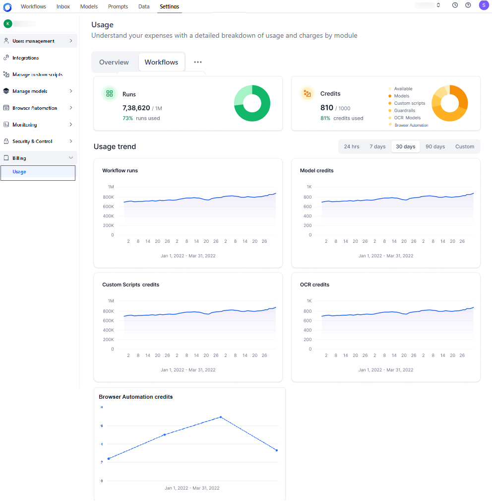

The Usage page displays the following tabs:

* **Overview**: Provides a high-level summary of your resource consumption including:
    * **Workflow runs**: Shows current workflow run usage against your total allocation.
    * **Credits**: Displays the number of credits consumed out of the total available credits, along with the corresponding percentage. A dynamic pie chart visually represents this data, showing the distribution of total credits, including usage by models, guardrails, OCR models, and custom script deployments. Each metric is color-coded and identified through a legend for easy reference. Hover over the chart to view the actual values for each usage type.
    * **Usage trend**: Visual representation of workflow runs, model credits, custom scripts, and OCR credits consumption over time.

Click the "*three-dots*" icon to view and select from the following options:

* **Workflows**: Shows all workflow activities and their operational status.
* **Models**: Shows the computational costs linked to specific models.
* **Guardrails**: Shows overall guardrail statistics and credit consumption costs.
* **Custom Scripts**: Gives a comprehensive view of all the deployed custom scripts’ statistics, including the credits usage trends.
* **OCR**: Displays OCR model deployments and their credit consumption, helping you track document-processing usage.
* **Browser Automation**: Shows the credits consumption and usage trend for browser automation experiment pod deployments.
    
    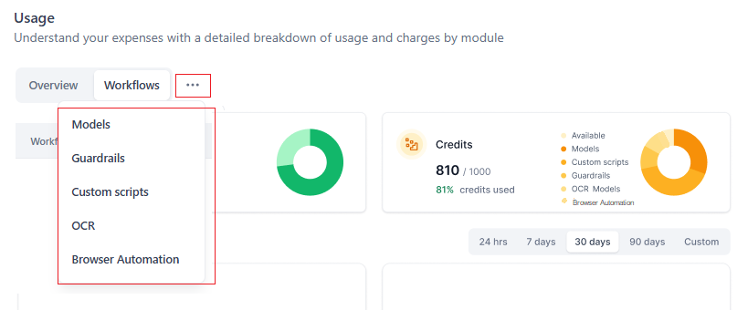

## Best Practices

* Regularly monitor your usage trends to optimize resource allocation.
* Review workflows, models, guardrails, OCR, and custom scripts to identify cost-saving opportunities.
* Refer to the hardware profile and the credits consumption chart [here](../manage-custom-scripts/custom-scripts.md#step-3-resource-allocation) before deploying custom scripts.
* Track guardrail deployment duration to manage hardware costs effectively.

!!! note

    Use the Calendar bar on all the tabs to search by the number of days using pre-defined date filters—24 hours, 7 days, 30 days, or 90 days. You can also use the Custom option to specify your preferred date range.

## Usage Overview

The **Overview** tab summarizes expenses and usage patterns across your workflows, models, guardrails, OCR, and custom scripts. The following usage information is displayed on the tab:

* **Runs**: This field indicates the usage of workflow runs, showing the proportion of capacity consumed compared to the total available runs. For example, if 45 out of 10,000 available workflow runs have been utilized, indicating that 0.45% of the total capacity has been consumed.
* **Credits**: This field displays the total credit usage, showing the proportion of credits used across models, guardrails, OCR, and custom scripts compared to the total available credits. It also includes the credits used to host guardrails. For example, if 212 credits have been used out of a total allocation of 300 credits, indicating that 70.72% of your available model credits have been utilized.
* **Usage trend**: This visual representation shows workflow runs, models, guardrails, OCR, and custom script credits consumed over time. Use the calendar feature to view changes over a defined timeline, such as daily, weekly, monthly, or any custom date range.

## Workflows Usage

The **Workflows** tab displays a comprehensive list of workflows associated with the account. It includes only those workflows that have been deployed at least once; it does not include ‘In development’ workflows.  

The following usage information is displayed on the tab:

* **Total workflows**: The total number of workflows in the account.
* **Total runs**: The total number of runs by all the workflows.
* **Workflow name**: The name assigned to the workflow.
* **Runs**: The number of times the workflow was inferred. 
* **Owner Name**: The name of the user who created the workflow.
* **Last active on**: The date when the workflow was last active.
* **Status**: The workflow's status - Deployed, Undeployed, or Deleted.

    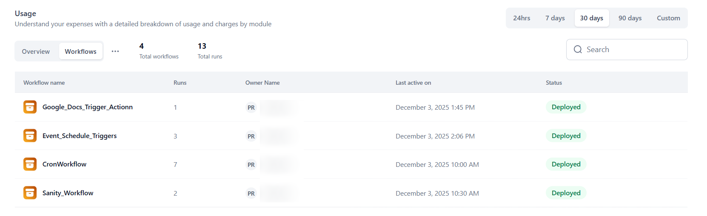

## Models Usage

The **Models** tab displays a comprehensive list of open-source and fine-tuning models in the account and the computational cost of storing, fine-tuning, and hosting each model.

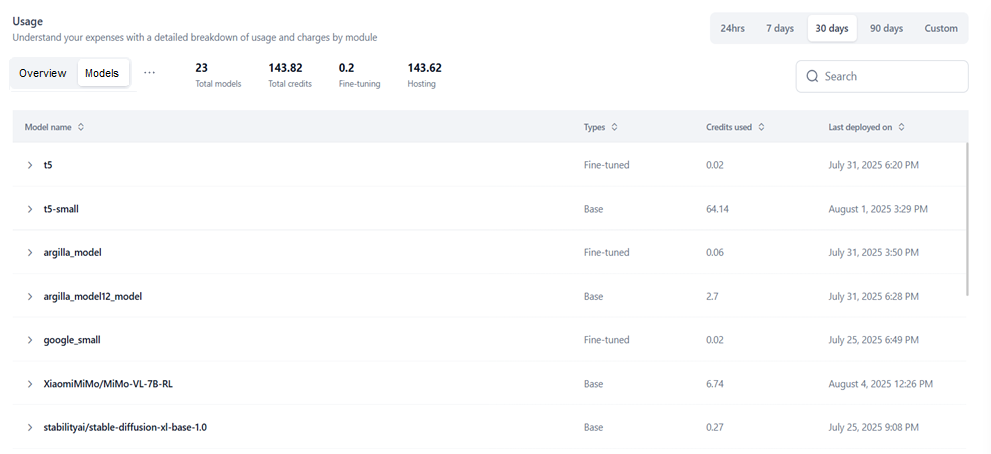

If there are multiple deployments of the same model, the usage data is displayed for each deployment in the drill-down view. [Learn more](./billing-and-usage.md#viewing-deployment-level-information).

The following usage metrics summarize data for all the deployments:

* **Total models**: The total number of models in the account.
* **Total credits**: The total credits used by all the models (including all the deployments).
* **Fine-tuning credits**: The number of credits used for fine-tuning the models. The number of credits are based on factors like the size of the training data, the model complexity, the number of training epochs, the type of hardware used, and other parameters.
* **Hosting credits**: The total number of credits used to cover the cost of deploying and hosting models on GPUs.
When you deploy a model on powerful GPUs, each GPU instance is considered a "replica", which requires the allocation of hosting credits. For example, if your model runs on one A100 GPU, that counts as one replica and consumes a specific amount of hosting credits. If demand increases and you need to deploy a second A100 GPU to handle additional user requests, you will now have two replicas and be charged for both, requiring twice the number of hosting credits.

The following information is displayed for each model record:

* **Model name**: The name of the model.
* **Type**: The type of model used: Fine-tuned or Base.
* **Credits used**: The credits consumed by the deployment.
* **Last deployed on**: The date when the model was last deployed.

### Viewing Deployment-level Information

Click each Model record to view a detailed record of all its deployments with the following information:

The following information is displayed:

* **Name**: The name given to the deployment.
* **Type**: The type of deployment.
* **Credits used**: The credits consumed by the deployment.
* **Last updated on**: The date when the deployment was last done.
* **Status**: The current deployment status: *Deployed*, *Undeployed*, or *Deleted*.

    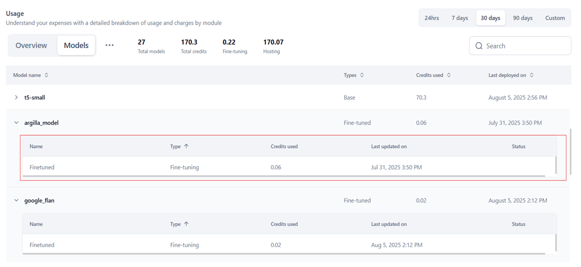

## Guardrails Usage

The **Guardrails** tab displays the list of guardrails used and the charges related to their usage. Each guardrail includes details about the hardware it was deployed on and the associated costs. The guardrails are charged based on the hardware used.

The guardrail usage is deducted from the Model credits shown in the Overview tab, indicating that the available credits for the model will decrease based on the cost of using the guardrails.

 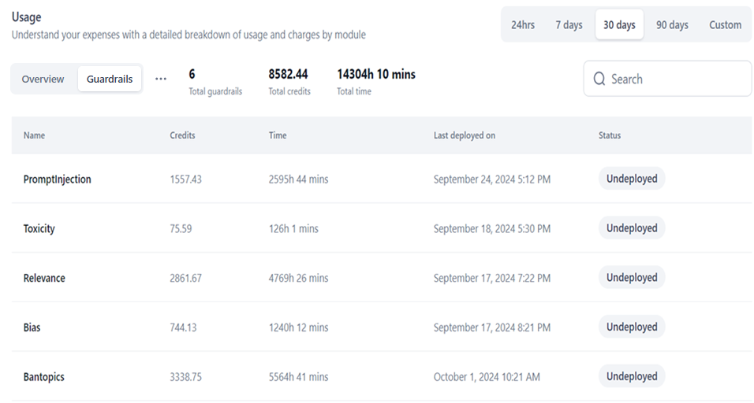

The following usage information is displayed on the Guardrails tab:

* **Total guardrails**: The total number of guardrails used in the account.
* **Total credits**: The total credits used by the guardrails.
* **Time**: The total duration for which all the guardrails were deployed.
* **Name**: The name of the guardrail/scanner.
* **Credits**: The credits used to deploy the guardrail.
* **Time**: The duration for which the guardrail was deployed.
* **Last deployed on**: The date the guardrail was last deployed.
* **Status**: The status of the guardrail: Deployed or Undeployed.

### Viewing Detailed Guardrail Information

Clicking each row on the Guardrail tab opens a panel on the right that displays detailed information about the hardware on which it was deployed and the charges for each guardrail deployment.

* Credits for the guardrails consumption will be deducted from the allocated credits.
* If the account credits fall below the lowest threshold, new deployments for guardrail models are disabled.
* If the low credit limit is reached during an active deployment, the deployment will continue and proceed into negative credits. 
* However, once the negative credit limit is crossed, the deployment will stop and display the following failure message: "*You've used all your available credits. Please add more credits to your account to continue.*"
* The credits are continually deducted from the account, while the negative credits are adjusted in the next billing cycle.
* If no credits exist, the following happens:
     * Further deployments are disabled. 
     * All ongoing deployments are disrupted once the negative credit limit is reached, and the message “*You've used all your available credits. Please add more credits to your account to continue.*” appears.

      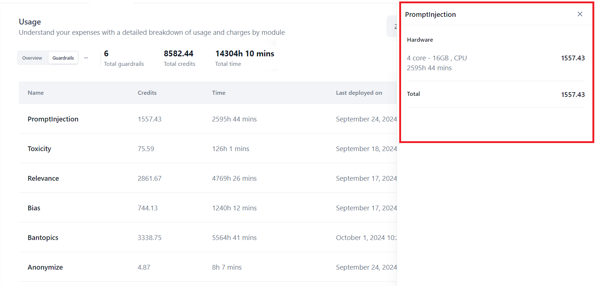

The following information is displayed:

* The name of the guardrail
* **Hardware**: The type of CPUs used, the number of CPUs used, the duration for which the CPUs are being used, and the number of credits used.
* **Total**: The total number of credits used for the hardware.

### Email Notifications

Billing and credit calculation data for Guardrails is sent via email, notifying users about credit usage, negative threshold breaches, and potential deployment interruptions.

## Custom Scripts Usage

The **Custom Scripts** tab displays the list of custom scripts added to your account, along with the credits consumed for their deployment. Each custom script entry displays the language and version of the script, the credits used, the latest date of script usage (when it was active), and its [status](../manage-custom-scripts//custom-scripts.md#information-on-script-deployment-statuses). The **Total Scripts** and the **Hosting Credits** available in the account are also displayed as key metrics on the page. The custom scripts are charged for each deployment and hardware profile used.

* Credits for script consumption are deducted from the allocated credits (**Overview** tab) based on the table mentioned [here](../manage-custom-scripts/custom-scripts.md#step-3-resource-allocation).
* If account credits are insufficient, new deployments are disabled via the script wizard.
* If the low credit limit is reached during an active deployment, the deployment will continue and proceed into negative credit.

    * However, once the negative credit limit is crossed, the deployment will stop and display the following failure message: "*You've used all your available credits. Please add more credits to your account to continue.*"
    * The credits are continually deducted from the account, while the negative credits are adjusted in the next billing cycle.

* If no credits exist, the following happens:

    * Projects can only be imported as drafts.
    *  Users will not be able to deploy imported projects. Deployment actions get disabled for the scripts.
    *  If the negative credit limit is crossed during deployment, the process will be stopped, and a failure message will be displayed.

       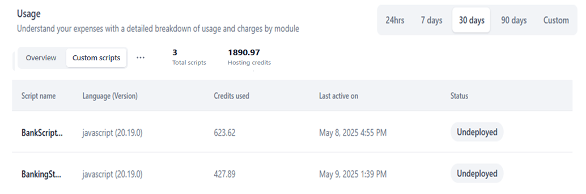

The following usage information is displayed:

* **Total Scripts**: The total number of scripts added and managed in the account.
* **Hosting Credits**: The total number of credits used by the scripts.
* **Script name**: The name of the script.
* **Language(Version)**: The language and version of the script.
* **Credits used**: The credits consumed by the script for hardware and other resources.
* **Last active on**: The latest date when the script was actively used.
* **Status**: The deployment status of the script. [Learn more](../manage-custom-scripts/custom-scripts.md#information-on-script-deployment-statuses).

### Viewing Detailed Script Information

Clicking each row on the **Custom scripts** tab opens a panel on the right that displays detailed information about the script’s hosting parameters, including:

* **Hosting infrastructure**: The hardware configurations (vCPUs and memory) used by the script.
* Hosting time in hours and minutes.
* Credits consumed by the components. Refer to the table [here](../manage-custom-scripts/custom-scripts.md#step-3-resource-allocation) for pricing.
* **Total** which represents the aggregate of all the credit components (when multiple components are involved).

    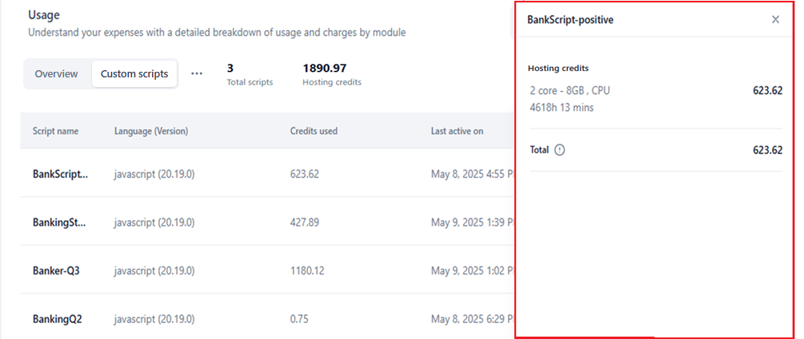

### Email Notifications

Billing and credit calculation emails for custom scripts notify users about credit usage, negative credits threshold breaches, and deployment or undeployment events. Deployment notifications also include the API endpoint access details.

## OCR Usage

The **OCR** tab provides a unified view of all OCR-related credit usage across your workspace, allowing you to do the following:

* Review a list of OCR model deployments
* See how many credits each deployment consumed
* Check deployment status and usage history

   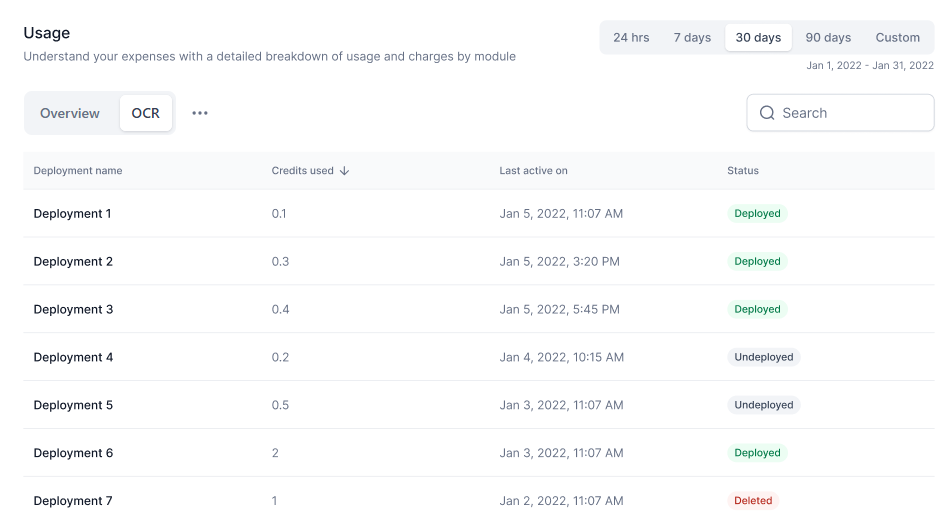

### Viewing Detailed OCR Information

Clicking a row in the **OCR** tab opens a panel on the right that provides detailed information about the selected OCR deployment, including:

* **Hosting infrastructure:** The compute resources used by the deployment (for example, model configuration or allocated hardware).
* **Hosting time:** Total time the deployment has been active, shown in hours and minutes.
* **Credits consumed:** The number of OCR credits used by the deployment.
* **Total:** The aggregated credit usage across all contributing components for that deployment.

    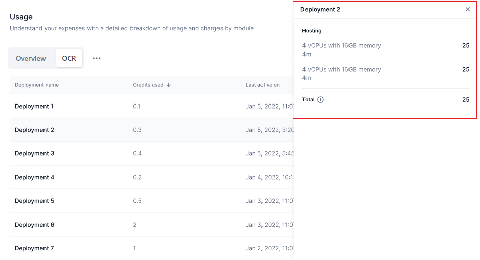

## Browser Automation Usage

The **Browser Automation** tab provides a unified view of browser-automation credit usage across your workspace, allowing you to do the following:

* Review a list of pod deployments for browser automation scripts
* See deployment-level credits consumption
* Check deployment status and usage history

    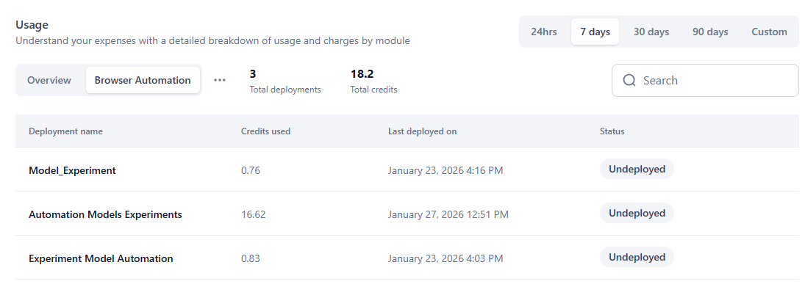

### Viewing Detailed Browser Automation Information

Clicking a row in the **Browser Automation** tab opens a right-side panel that displays detailed information about the selected OCR deployment, including:

* **Hosting infrastructure:** The compute resources or allocated hardware used by the deployment.
* **Hosting time:** Total time the deployment has been active, shown in hours and minutes.
* **Credits consumed:** The number of browser automation credits used by the deployment.
* **Total:** The aggregated credit usage across all contributing components for that deployment.

    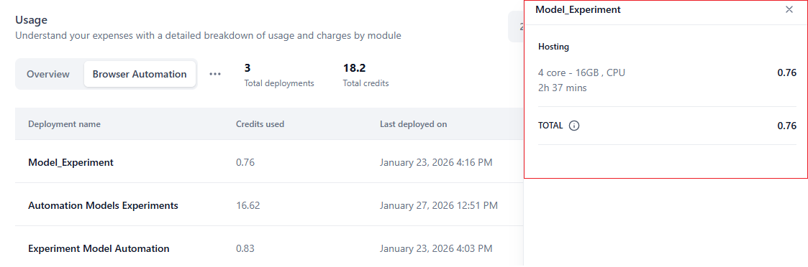