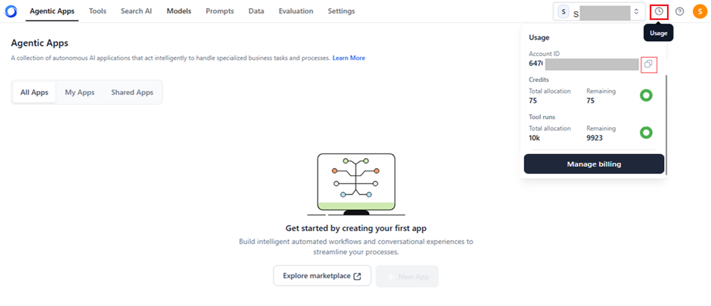

# Account Limits and Notifications

When users create an account with AI for Process, they receive free credits - 75 model credits and 10,000 workflow runs by default. The model credits are used for model inference and setting guardrails, while workflow runs are consumed when inferring workflows. Once the free credits are fully exhausted, users will no longer be able to perform these actions. To continue using AI for Process’s services after the free credits are exhausted, users must add credits to their account by contacting AI for Process support.

## Exhaustion alerts for Model Credits and workflow Runs

AI for Process provides multiple alerts and warning notifications to inform users when their credits are running low or have expired. These notifications are crucial for:

* Helping users monitor their credit usage.
* Allowing proactive management to prevent service disruptions.
* Reminding users to add credits in advance to ensure uninterrupted access to AI for Process' features.

### Notification Methods

**Banner Alerts:** A banner appears at the top of the page to inform users of their usage status. The alert banners are displayed at 20%, 50%, 70%, 80%, and 90% exhaustion of model credits and workflow runs, giving users ample notice to take action. These banners ensure users are aware of low credits/runs in real time.

Banners will appear at the top of the page in the following cases:  

* Free credits expired: Users will see a fixed top banner prompting them to upgrade their plan.
* Model credits/workflow runs expired: Users will see a fixed top banner prompting them to upgrade or top up their current plan.  
* Model credits/workflow runs low: Users will see a removable banner encouraging them to top up or upgrade their plan.

For example, *“Your model credits and workflow runs are low, and fine-tuning is disabled. Please contact AI for Process Support for uninterrupted service.”*

**Email Notifications:** The system automatically sends email notifications to users when their credit levels fall below a specified threshold, including warnings for both model credits and workflow runs. Emails will be sent at 50%, 70%, 80%, and 90% exhaustion of model credits and workflow runs, giving users ample notice to take action. These emails include instructions on the next steps to resolve the issue, such as adding more credits by contacting AI for Process support.

For example, *“This is to inform you that your model credits are getting low. You cannot start a new model fine-tuning job unless you have more than 25 model credits. To ensure uninterrupted service, kindly top up your plan with more model credits or contact AI for Process Support.”*

!!! note

    Billing usage is tracked and displayed on the Billing Usage page. This page displays workflow runs and model credit consumption, allowing users to easily track and adjust their usage as necessary.
    
## Credit Usage Summary

Users can easily track their usage and know when to take action. A **Clock** icon on the top right of the page visually represents credit usage. Click to view the following usage summary information:

* The unique **Account ID** for the user or account. Click the **Copy** icon to copy and share this ID with the backend team for further debugging an issue in the account.
* **Credits**: The *Total allocation* and *remaining credits* available in the account for the usage of models, guardrails, and custom scripts.
* **workflow Runs**: The *Total allocation* and *remaining workflow runs* available in the account for the usage of the workflows automation flow.
  

To view detailed information on billing and usage, click **Manage billing**. [Learn more](../billing/billing-and-usage.md). 

As credits are consumed, the dynamic pie chart indicates how much of the available credits have been used. The icon's color dynamically changes based on your credit usage, providing a clear visual indicator of your remaining balance.

* **Green (Good Balance)**: The icon is mostly or fully green, indicating that more than 75% of credits are available and the user has a healthy credit balance.
* **Yellow/Orange (Moderate Usage)**: As credits are used, the icon turns yellow or orange, indicating that 25% - 75% of credits remain and that the user is using a moderate amount of credits.
* **Red (Low Credits)**: The icon turns red when less than 25% of credits remain, warning the user to add credits soon to avoid disruption.
* **Triangle Icon (Credits Exhausted)**: When credits are fully depleted, the icon changes to a triangle (associated with a warning), indicating that no credits are left. Users must add credits to resume services like model deployments or workflow runs.

For help with adding credits or managing your account, [contact](https://kore.ai/support/) AI for Process Support.
