# Deploy, Execute, and Manage Custom Scripts for workflow Automation

The AI for Process now allows admins to import, deploy, and manage custom scripts directly from the **Settings** console. 

A powerful script deployment wizard enables users to easily upload, configure, and deploy custom scripts in isolated containers. By leveraging container isolation, this feature enhances security while providing flexibility in configuring runtime and scaling settings.

Once deployed, these scripts can be run via the [API node’s](../../workflows/workflow-builder/types-of-nodes/api-node.md) endpoint when building the workflow. Additionally, the custom scripts can be embedded in the [Function node]() of the workflow automation flow and executed when the node flow is run.

On the **Manage Custom Scripts** page, admins can upload a complete script project file, including all definitions and logic, without writing any code in the function node. This allows them to seamlessly port their code or project from a local system into the product and start using it immediately.

You can import a custom script with reusable functions and invoke it from anywhere within the platform using a secure API key at the endpoint. This adds flexibility and offers the following benefits to the workflows' automation flow:

* **Task Automation**: Automate repetitive or complex tasks that would otherwise require manual intervention. 

* **Secure API Integration**: Integrate custom scripts into the apps using API endpoints and secure authentication. 

* **Customization**: Implement custom logic or workflows tailored to unique business needs. 

* **Data Processing**: Transform, filter, or validate data in a way that aligns with specific operational requirements. 

* **Error Handling**: Create tailored error-checking and fallback mechanisms beyond standard system behavior. 

You can import a script by uploading the file in one of the supported formats, validating it, configuring runtime settings and system resources, and deploying scripts after reviewing errors. 

The key steps in managing custom scripts are:

1. [Access the script deployment wizard](../manage-custom-scripts/custom-scripts.md#access-script-deployment-wizard).
2. [Import and Configure a script](../manage-custom-scripts/custom-scripts.md#import-and-deploy-a-custom-script) by following these steps:

    * [Step 1: Add general details, upload the script file, and validate the script file for errors](../manage-custom-scripts/custom-scripts.md#step-1-general-details).
    * [Step 2: Configure the runtime settings for the script to execute successfully.](../manage-custom-scripts/custom-scripts.md#step-2-runtime-settings).
    * [Step 3: Define resource allocations, including the limitations for hardware, memory, and scaling parameters.](../manage-custom-scripts/custom-scripts.md#step-3-resource-allocation).
    * [Step 4: Review configuration details and deploy the script.](../manage-custom-scripts/custom-scripts.md#step-4-review-the-provided-details).

3. [View deployed scripts and their statuses](../manage-custom-scripts/custom-scripts.md#view-deployed-scripts-and-their-statuses).
4. Manage script deployment [overview](../manage-custom-scripts/custom-scripts.md#script-overview), [history](../manage-custom-scripts/custom-scripts.md#deployment-history),  [endpoint](../manage-custom-scripts/custom-scripts.md#endpoint), and [API](../manage-custom-scripts/custom-scripts.md#api-keys).

## Access Script Deployment Wizard

To access the custom scripts wizard, follow the steps below:

1. Log in → In AI for Process Modules top menu → Click **Settings**.
   

2. Click **Manage Custom Scripts** on the left menu.
   
## Import and Deploy a Custom Script

To import and add a custom script, follow the steps below:

1. [Access](../manage-custom-scripts/custom-scripts.md#access-script-deployment-wizard) the script deployment wizard.
2. Click **+ Import** or **+ Import new**.
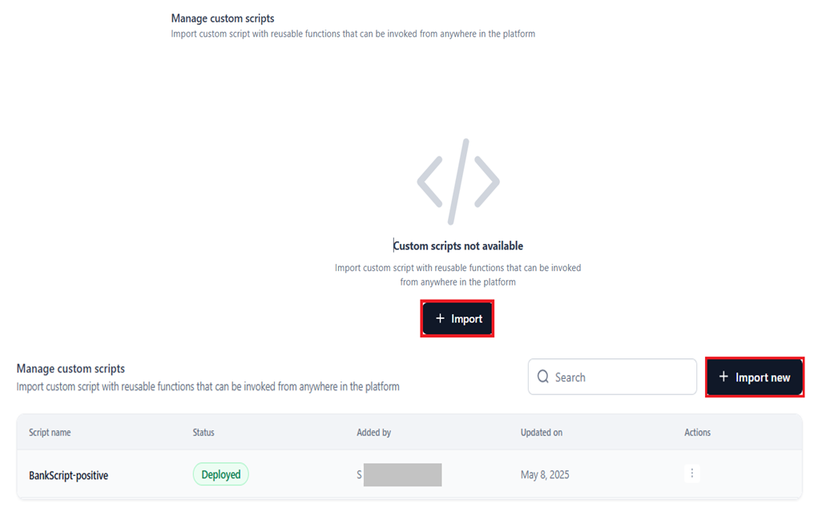
 

Note

To complete the configuration, perform each step in order without skipping any.

### Step 1: General Details

In the **General Details** window, follow these steps:

1. Add a **Script name**.
2. Add a **Description** to define the purpose and capabilities of your custom script.
3. Select **Base Language** (the language in which the script is imported and executed) and **Language Version**. The available options are **JavaScript 20.19.0** and **Python 3.10.15**. More versions will be supported soon.

Note

The default version is auto-selected when you select the language.

<ol start="4"><li>To upload the script, click <b>Choose File</b> under <b>Project File</b>, then select the file from your local system.</li></ol>

Important Considerations

<ul><li>Supported file formats include <code>.zip</code>, <code>.gz</code>, and <code>.tar</code>.</li>
<li>The max file size is 1 GB. Larger files will result in a validation error.</li>
<li>Click <b>Validate</b> to check the file for errors.</li>
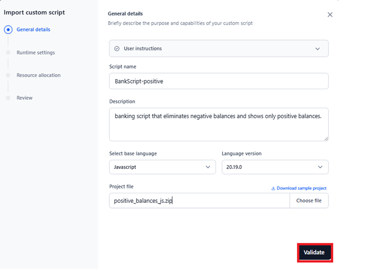</ul>

Important

<ul><li>The uploaded file must match the recommended project structure. Click <b>Download sample project</b> to access the <i>.zip</i> folder of the script definitions and follow its structure when uploading your file.</li>
<li>The structure is different for different base languages. Ensure that the correct file structure is followed for the chosen language.</li>
<li>The file naming convention should be followed to avoid any errors.</li>
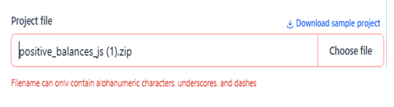</ul>

**Key Considerations for File Validations**:

* Validation checks confirm if the file matches the sample project structure.
* Errors during validation are displayed via messages.
* The list of validations includes the following:
      
    * Adherence to the sample file’s structure and the allowed file format.
    * The main file shouldn’t be empty
    * 1 GB is the limit for the project file upload

If there are no errors, the system proceeds to the next page, **Runtime Settings**. If errors or warnings are present, you must resolve them before proceeding.

**Custom Script Requirements and Guidelines**

To ensure your custom script runs correctly within the platform, follow these guidelines:

**Main Entry Point Required**

Your project must include a `main.py` (for Python) or `main.js` (for JavaScript) at the root directory of the archive file. This file serves as the main entrypoint for the service. Only the functions defined in this file will be exposed for execution via API endpoints or workflow integrations.

**Support for Modular Code**

You can organize your code across multiple files for better structure and maintainability. However, keep in mind that only functions in `main.py`/`main.js` will be exposed. Additional files can be used for helper functions or reusable logic, which can be imported into the main file.

**Custom Dependencies (Optional)**

If your code depends on specific packages, include a `requirements.txt` (for Python) or `package.json` (for JavaScript) file at the root directory in your project. These are optional, only include them if your code has external dependencies.

**Use Relative Imports**

When importing between files in your project, make sure to use relative imports. Refer to the provided sample files for examples.

**Use of Environment Variables**

Access environment variables in your scripts as follows:

**Python**: 
<code>import os</code>

             
<code>os.getenv('<key_name>')</code>

**JavaScript**: 

`process.env.<key_name>`

### Step 2: Runtime Settings

Configure **Runtime variables** (environment variables and execution timeout) to control how your script runs, stores configuration data, and stops executing. The key steps include:

1. Enter the **Key** and the **Value** to declare **environment variables** as key-value pairs that are accessible from your function.
2. (Optional) Click **+ Add** to add additional key-value pairs, and the **Delete** icon to remove.
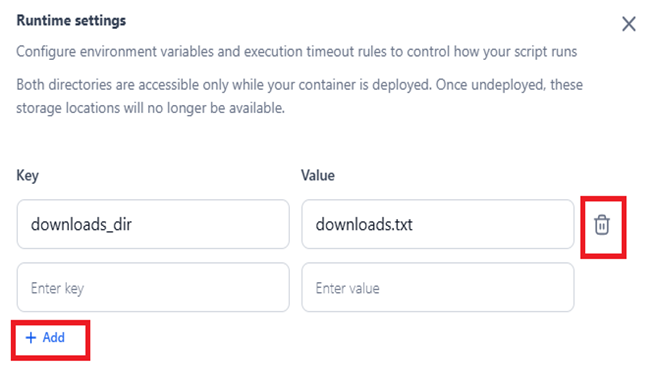 

Note

The following default environment variables are available:
<ul><li><b>UPLOADS_DIR</b>: Read-only access to all files uploaded via the Public APIs. Use this to access data that was submitted to your account.</li>
<li><b>WORKSPACE_DIR</b>: Read-write directory for your function's file operations. Any data your function needs to store or modify will be saved here.</li>
<li>Both directories are accessible only while your container is deployed. Once undeployed, these storage locations will no longer be available.</li></ul>

<ol start="3"><li>Define the <b>Execution timeout</b> in seconds. The allowed range is <b>30 to 600 seconds</b>.</li>

<b>Why Script Timeout?</b>

<ul><li><b>Prevents resource overuse</b>: Stops long-running or infinite-loop scripts from consuming excessive memory or CPU.</li>
<li><b>Ensures responsiveness</b>: Keeps systems responsive by limiting how long a task can delay other operations.</li>
<li><b>Supports fail-safe mechanisms</b>: If a script fails to complete in time, the timeout can trigger error handling or retries.</li></ul>
<li>Click <b>Next</b>.</li>
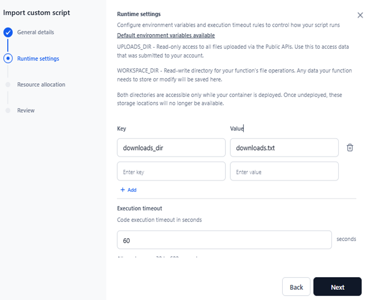</ol>

### Step 3: Resource Allocation

On this page, you define scaling parameters (minimum and maximum replicas) and hardware requirements to ensure the script performs optimally under varying loads and to customize the deployment. The key steps include:

1. Set limits for auto-scaling to ensure optimal performance by defining the following **Scaling parameters**:
    * **Min and Max Replicas**: Defines the minimum and maximum number of pods per service that can be created for the service to handle increased load. 

       

       
Note

       
<ul><li>The allowed range for both parameters is between 1 and 10.</li>
       <li>The default value is 1.</li></ul>

       

     * **Min replica** should be lower than or equal to the **Max Replica**.
     * **Average Compute Utilization**: A metric based on which scaling of the service happens. Indicates average compute utilization in percentage per pod. The **default value is 75**, and the **allowed range is between 1 and 100**. This metric is disabled when **Min replica** and **Max replica** are the same.
     * Select the required **hardware** for the deployment. The unit is **No. of vCPUs with memory**. The profiles are virtualized for standardization. The available profiles are listed below:

         <table>

  <tr>
   <td><strong>Hardware configuration</strong>
   </td>
   <td><strong>Actual CPU Core and Memory Available</strong>
   </td>
   <td><strong>Credits per Hour</strong>
   </td>
  </tr>
  <tr>
   <td>2 vCPUs with 8GB memory
   </td>
   <td>1.5 vCPUs with 6.5GB memory
   </td>
      <td>0.144
   </td>
  </tr>
  <tr>
   <td>4 vCPUs with 16GB memory
   </td>
   <td>3.5 vCPUs with 13.5GB memory
   </td>
      <td>0.288
   </td>
  </tr>
  <tr>
   <td>1 vCPU with 2GB memory
   </td>
   <td>0.7 vCPUs with 1.1GB memory
   </td>
      <td>0.07698
   </td>
  </tr>
  <tr>
   <td>2 vCPUs with 4GB memory
   </td>
   <td>1.5 vCPUs with 2.5GB memory
   </td>
      <td>0.15396
   </td>
  </tr>
  <tr>
   <td>4 vCPUs with 8GB memory
   </td>
   <td>3.5 vCPUs with 6GB memory
   </td>
      <td>0.30792
   </td>
  </tr>
</table>

<ol start="2"><li>Click <b>Next</b>.</li>
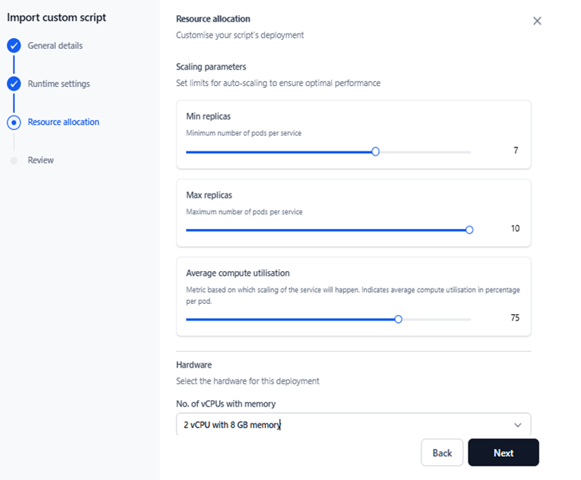</ol>

### Step 4: Review the Provided Details

The next step is to review all the configuration details before deploying the script. 

1. Review each section- [General Details](../manage-custom-scripts/custom-scripts.md#step-1-general-details), [Runtime Settings](../manage-custom-scripts/custom-scripts.md#step-2-runtime-settings), and  [Resource Allocation](../manage-custom-scripts/custom-scripts.md#step-3-resource-allocation) to ensure all information is accurate. You can return to any section to modify the configured values if needed.
2. Read all the **Terms and Conditions**, and select **Accept** to enable deployment.
3. (Optional) Click **Save as Draft** to save a copy and deploy it later. A success message is displayed, and the label “*Draft*” is displayed for the script. 
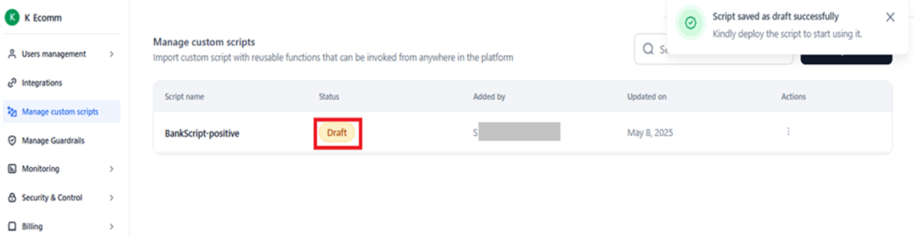

4. Click **Deploy**.
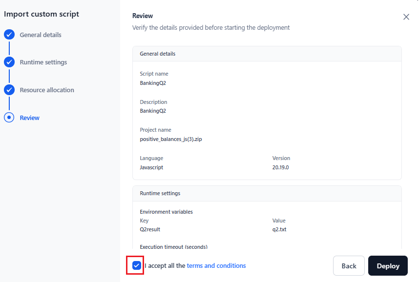

The following message is displayed when the script deployment progresses, and the status changes to “*Deploying*”.
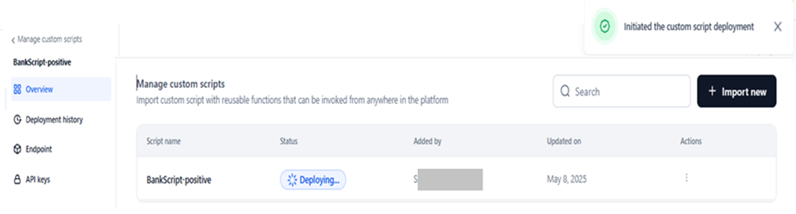
 
Once the script is deployed successfully, a success message is displayed, and the status changes to “*Deployed*”. 

**Email Notification**

After a custom script is deployed, a confirmation email with the subject line "*Custom script deployed successfully - API Endpoint Available*" is sent to the admin. The following information  for the account is also displayed:

* Credits remaining for the account 

* Total allocation

   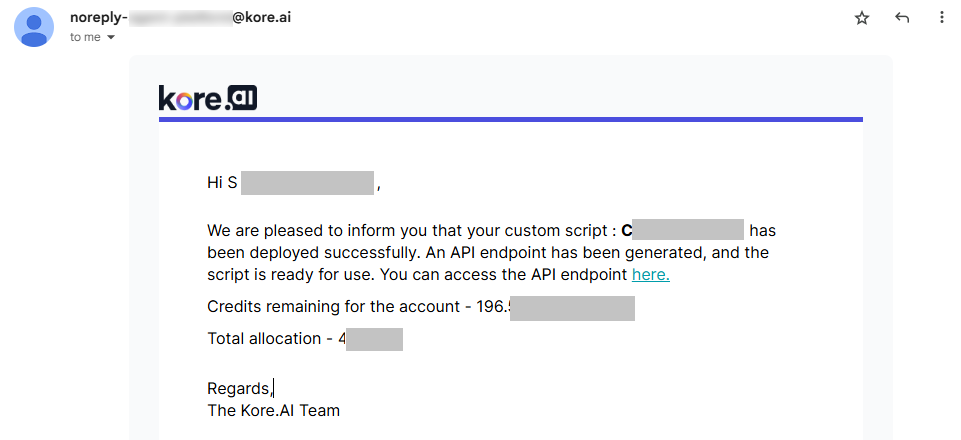

## View Deployed Scripts and their Statuses

Once a script is deployed or saved as a draft, a table listing all scripts and their statuses becomes available on the **Manage Custom Scripts** page. This allows users to monitor deployment progress and take necessary actions as follows:

**Search Script**

Enter the script name in the **search field** to retrieve a matching entry from the list.
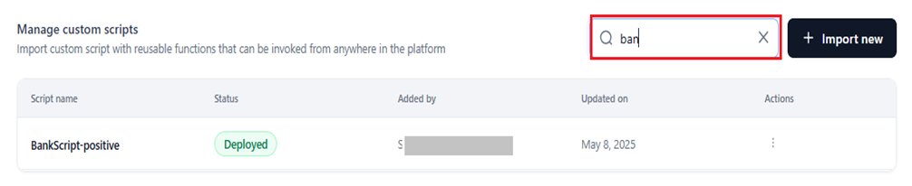

**View Summary**

The summary table displays the following fields:

* **Script Name**: The name provided by the user.
* **Status**: The current deployment status of the script.
   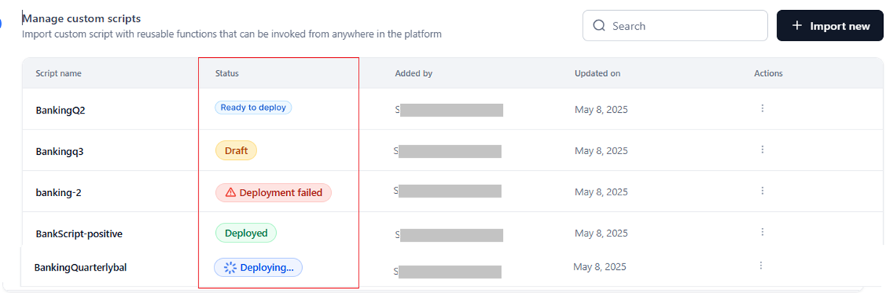

* **Added by**: The user who added the custom script.
* **Updated on**: The timestamp when an action (deployment, re-deployment, or undeployment) was done on the script.
* **Action**: Perform actions on the script like undeploy, delete, or export. Refer [here](../manage-custom-scripts/custom-scripts.md#actions) for more information.

### Information on Script Deployment Statuses

The following table illustrates the various statuses and the actions that can be performed from the Overview, Deployment History, Endpoint, and API Keys pages.

<table>
  <tr>
   <td rowspan="2" >
    <strong>Status</strong>

   </td>
   <td rowspan="2" >
    <strong>Description</strong>
   </td>
   <td colspan="5" >
    <strong>Actions you can perform </strong>
   </td>
  </tr>
  <tr>
   <td>
<strong>Overview</strong>
   </td>
   <td><strong>Deployment history</strong>
   </td>
   <td><strong>Endpoint</strong>
   </td>
   <td><strong>API</strong>

<strong>keys</strong>
   </td>
   <td><strong>Re-deployment</strong>
   </td>
  </tr>
  <tr>
   <td><strong>Draft</strong>
   </td>
   <td>The draft copy of the custom script that you can modify and deploy later.
   </td>
   <td>
<ul>

<li>Export</li>

<li>Delete</li>

<li>Deploy</li>
</ul>
   </td>
   <td>Deploy Custom Script
   </td>
   <td>Deploy Custom Script
   </td>
   <td>Create a New API Key
   </td>
   <td>No
   </td>
  </tr>
  <tr>
   <td><strong>Deploying</strong>
   </td>
   <td>The script is being deployed. A success message is displayed once the deployment completes successfully. If the deployment fails, a failure message is shown.
   </td>
   <td>
<ul>

<li>Export</li>

<li>Delete</li>
</ul>
   </td>
   <td>Rename deployment version
   </td>
   <td>Endpoint not activated
   </td>
   <td>
    ·    Create API keys

 
   </td>
   <td>No
   </td>
  </tr>
  <tr>
   <td><strong>Ready to Deploy</strong>
   </td>
   <td>The script is set up and ready to deploy.
   </td>
   <td>
<ul>

<li>Export</li>

<li>Delete</li>

<li>Deploy</li>
</ul>
   </td>
   <td>Rename deployment version
   </td>
   <td>Endpoint not activated
   </td>
   <td>
    ·   Create API keys

   </td>
   <td>Yes
   </td>
  </tr>
  <tr>
   <td><strong>Deployed</strong>
   </td>
   <td>The deployed custom script.
   </td>
   <td>
<ul>

<li>Redeploy</li>

<li>Undeploy</li>

<li>Export</li>
</ul>
   </td>
   <td>
<ul>

<li>View configuration and deployment details.</li>

<li>Rename deployment version</li>
</ul>
   </td>
   <td>
<ul>

<li>Redeploy script</li>

<li>View dedicated endpoint code (CURL, JS, and Python).</li>

<li>Copy script code.</li>
</ul>
   </td>
   <td>
<ul>

<li>Create API keys</li>

<li>Manage API keys</li>
</ul>
   </td>
   <td>Yes
   </td>
  </tr>
  <tr>
   <td><strong>Deployment failed</strong>
   </td>
   <td>The script deployment failed
   </td>
   <td>
<ul>

<li>Deploy</li>

<li>Delete</li>

<li>Export</li>
</ul>
   </td>
   <td>
<ul>

<li>View configuration and deployment details except duration.</li>

<li>Rename deployment version.</li>
</ul>
   </td>
   <td>The endpoint is not activated since the script is not deployed.
   </td>
   <td>
    Create API keys

   
   </td>
   <td>Yes
   </td>
  </tr>
</table>

**Key Considerations**

* Every time an action is taken for a script, the **Updated on** field captures the latest timestamp.
* Hover over a "*Deployment failed*" status to view the error tooltip explaining the reason for failure.
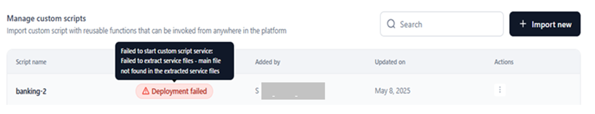 

### Actions

In addition to deploy, the following actions can be performed on a custom script based on its deployment status.

#### Export

Downloads the *.Zip* folder of the project to the user’s local system. To export, follow the steps below on the **Manage Custom Scripts** page:

1. Click the **Ellipses** icon under **Actions**. Then, click **Export**.
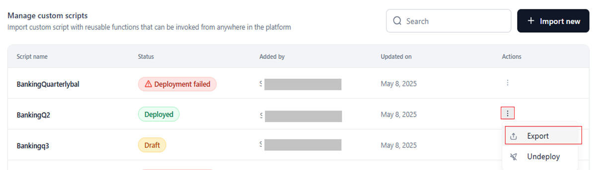

   Alternatively, click the deployed script entry and select **Export** on the **Overview** page.
   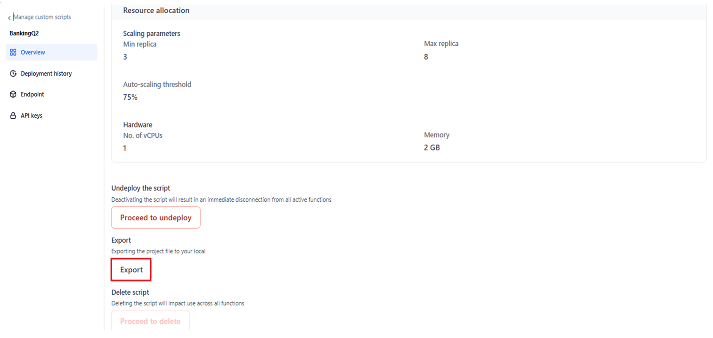

To see when **Export** is available, please refer to the table [here](../manage-custom-scripts/custom-scripts.md#information-on-script-deployment-statuses).

Note

<ul><li>You can view the status of the export while it is in progress, upon completion, or if it fails.</li>
<li>You can cancel an export in progress.</li></ul>

#### Undeploy the Script

This action lets you undeploy the script from all its deployed locations on the platform.

Key Considerations

<ul><li>An undeployed script can be redeployed. <a href="#redeploy-script" >Learn more</a>.</li>
<li>Once a script is redeployed, its data and configurations are restored. You can edit the script name and other parameters in the <a href="#import-and-deploy-a-custom-script" >deployment flow</a>.</li>
<li>The message “<i>No custom scripts deployed yet</i>” is displayed for the <b>Function</b> node if there are no deployed scripts.</li>
<li>A script does not appear in the <b>Script</b> dropdown list for the <b>Function</b> node if it is not deployed.</li>
</ul>

To undeploy, follow the steps below on the **Manage Custom Scripts** page:

1. Click the **Ellipses** icon under **Actions**. Then, click **Undeploy**.
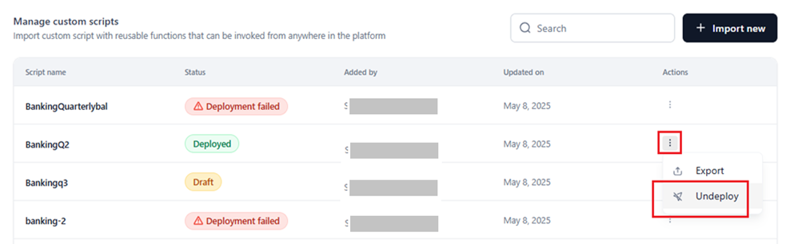

   You can also select a script entry and click **Proceed to Undeploy** on its **Overview** page. 

   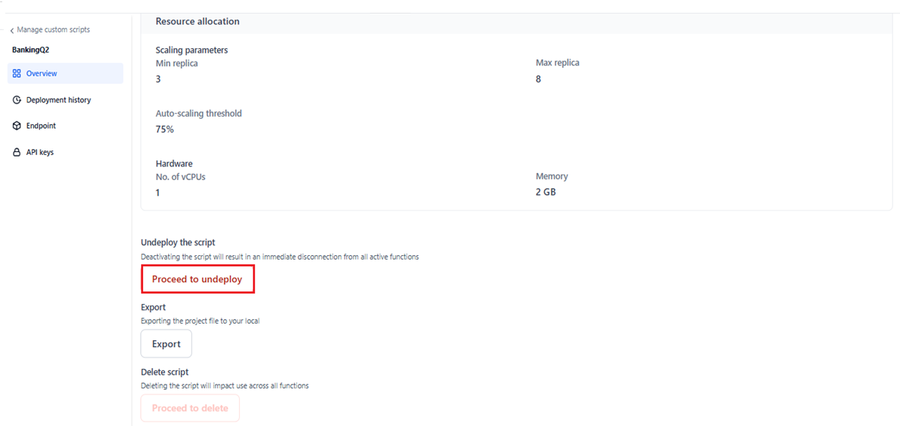

<ol start="2"><li>Click <b>Undeploy</b> in the confirmation window.</li>
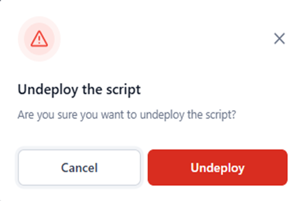</ol>

A success message is displayed, and the script’s status changes to <b>Ready to Deploy</b>.</li>
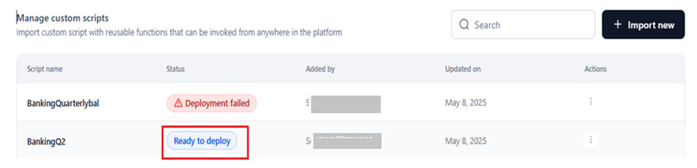

To see when **undeploy** is available, please refer to the table [here](../manage-custom-scripts/custom-scripts.md#information-on-script-deployment-statuses). 

**Email Notification**

After a custom script is undeployed, a confirmation email with the subject line "*Your custom script has been undeployed successfully*" is sent to the admin. The following information  for the account is also displayed:

* Credits remaining for the account 

* Total allocation

   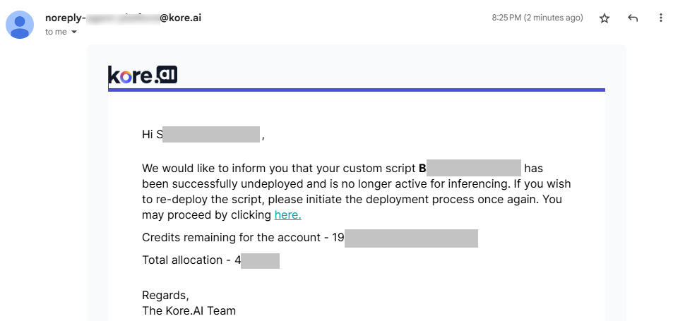

#### Delete Script

This action permanently deletes a deployed script, including its configurations and definitions, from the system.

Important

<ul><li>You cannot delete a deployed script.</li>
<li>Once a script is deleted, its data and configurations cannot be restored.</li></ul>

To delete, follow the steps below on the **Manage Custom Scripts** page:

1. Click the **Ellipses** icon under **Actions**. Then, click **Delete**.
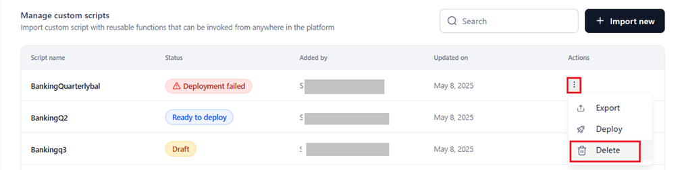  

   Alternatively, select a script entry and click **Proceed to Delete** on its **Overview** page.
   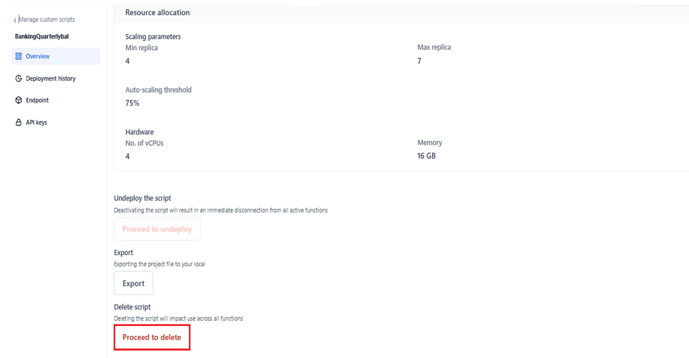  

<ol start="2"><li>Click <b>Delete</b> in the confirmation window.</li> 
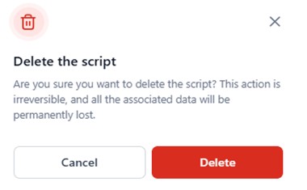</ol>

A success message is displayed, and the script is permanently removed. 

To see when **delete** is available, please refer to the table [here](../manage-custom-scripts/custom-scripts.md#information-on-script-deployment-statuses).

#### Redeploy Script

This action lets you redeploy a script by editing the description, project file, runtime settings, and resource allocation (except name, base language, and version number) in the **Import Custom Script** flow mentioned [here](../manage-custom-scripts/custom-scripts.md#import-and-deploy-a-custom-script). Redeploy is only available for the “**Deployed**” status.

To re-deploy, select the script with the “**Deployed**” status, and click **Re-deploy** in the **Overview** page. 
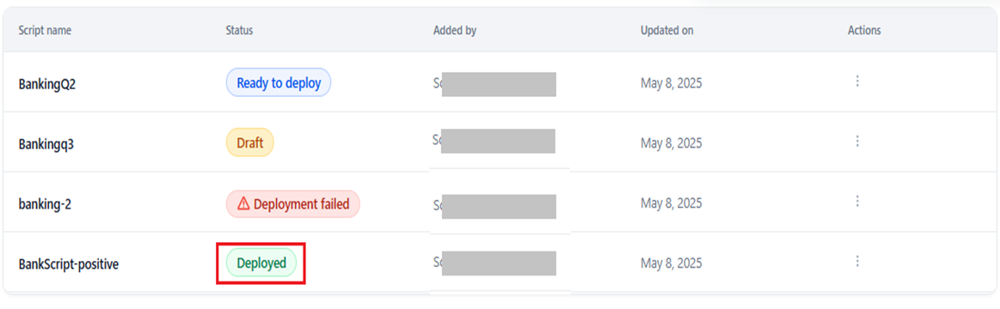  

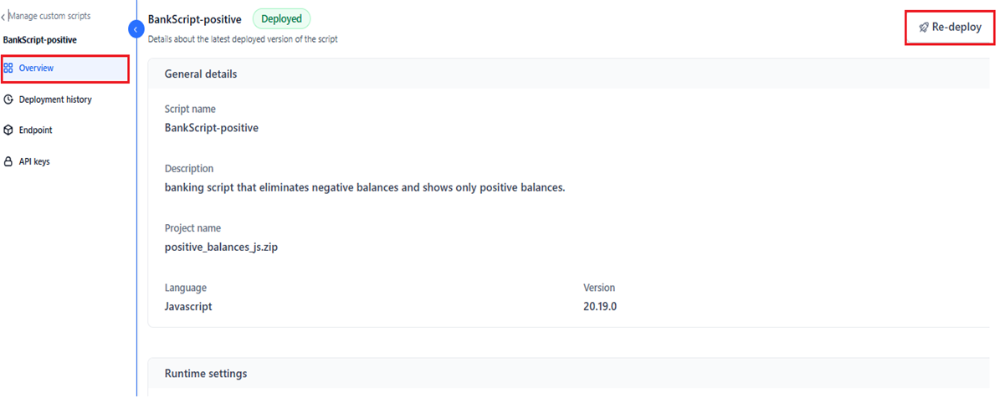  

The system redirects to the following page.

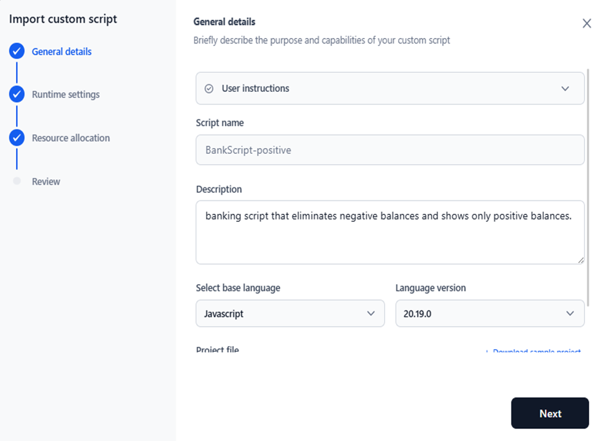  
 
After redeployment, the **Overview** page is updated with the latest deployment information. 

## Script Overview

The configuration details of the latest deployed version of a script can be viewed on the **Overview** page. To view this page, click the required script on the **Manage Custom Scripts** page. 

Note

You can view this page for all the statuses of a deployed script.

The information available on this page includes the configurations you have set for the following:

* Script name and the assigned status
* [General Details](../manage-custom-scripts/custom-scripts.md#step-1-general-details) 
* [Runtime Settings](../manage-custom-scripts/custom-scripts.md#step-2-runtime-settings) 
* [Resource Allocation](../manage-custom-scripts/custom-scripts.md#step-3-resource-allocation) 

The [actions](../manage-custom-scripts/custom-scripts.md#actions) you can perform on the script on the **Overview** page depend on the assigned status. See the table [here](../manage-custom-scripts/custom-scripts.md#information-on-script-deployment-statuses) for more details.

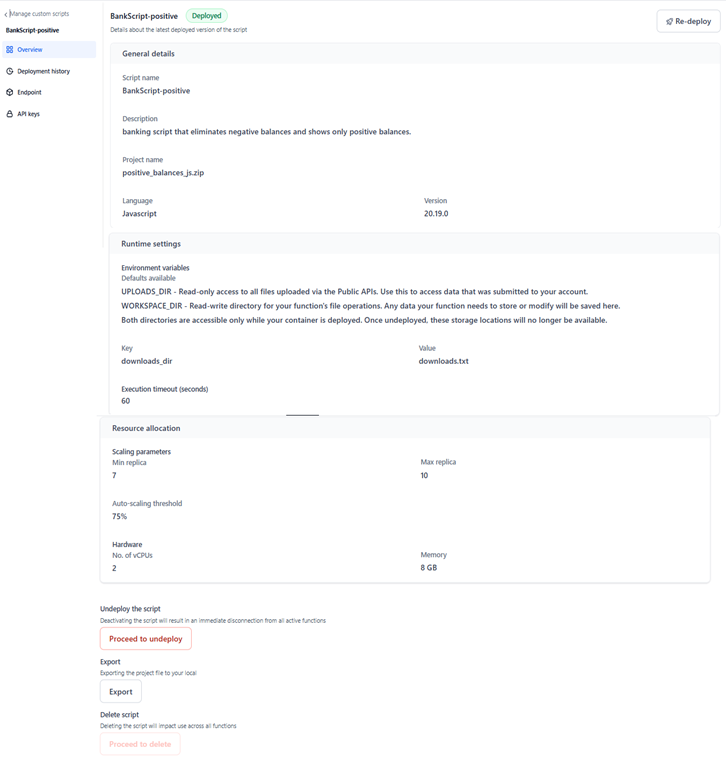  

Refer [here](../manage-custom-scripts/custom-scripts.md#import-and-deploy-a-custom-script) to import and deploy a custom script.

## Deployment History

The **Deployment History** page helps view key information about the script’s previous and current deployments or undeployments. It helps track actions performed on the script, its version history, and deployment statuses.

**Key Considerations**

* Deployment history information is only available for the statuses “**Deployed**,” “**Deployment Failed**,” “**Deploying**,” and “**Ready to Deploy**.”  
* For the “**Draft**” status, the following window is displayed.

     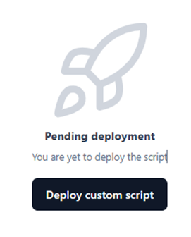  

Click **Deploy custom script** and follow the steps for 
[import and deploy](../manage-custom-scripts/custom-scripts.md#import-and-deploy-a-custom-script).

* Information about un-deployment is displayed only when the status is '**Ready to Deploy**', indicating that the script is currently undeployed.
* Hover over a failed status to view the reason.
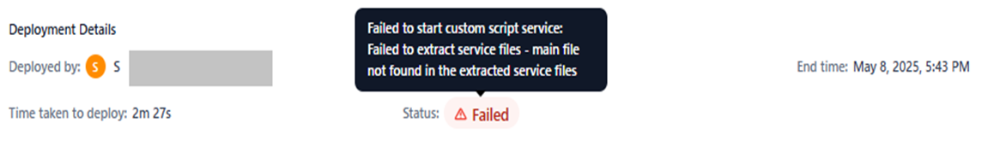 

The following script deployment or un-deployment details are displayed:

* Deployment name and version (the first version starts with v1). The version is auto-generated and appended to the script name. You can edit this name if required.
* A green **Check** icon for the latest running deployment. This icon does not appear for failed deployments or undeployed scripts.
* An **Edit** icon to edit the script name.
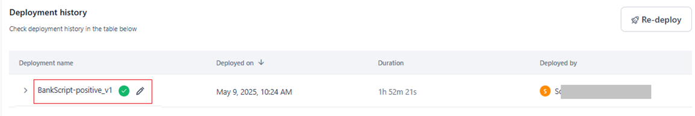 

To edit the deployed/undeployed script’s name, click the **Edit** icon. In the following window, enter the new name and click **Confirm**.

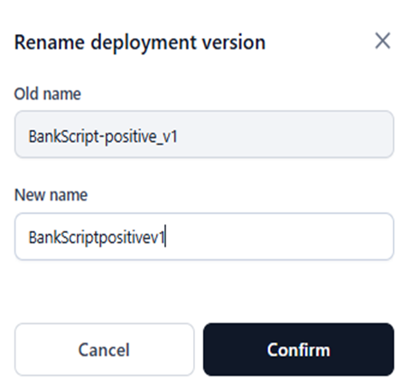 

Note

Please follow the suggested naming convention to avoid errors.

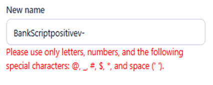 

A success message is displayed, and the deployment name is changed. 

* **Deployed on**: The timestamp of the latest deployment/un-deployment.
* **Duration**: The duration of the deployment. Shows “-” for all statuses except “**Deployed**.”
* **Deployed by**: The system user who deployed/undeployed the version.

To view the detailed deployment/undeployment summary, click the **Expand** arrow. 

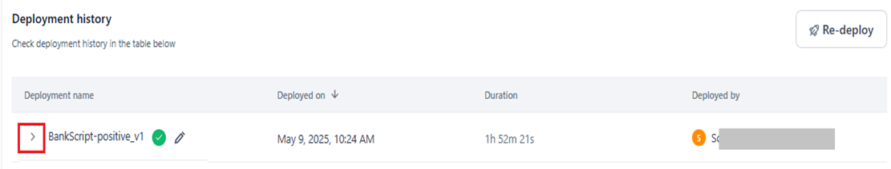 

The following information, configured by the user during the [import and deploy ](../manage-custom-scripts/custom-scripts.md#import-and-deploy-a-custom-script) or [un-deploy](../manage-custom-scripts/custom-scripts.md#undeploy-the-script) step, is displayed:

* [General Details](../manage-custom-scripts/custom-scripts.md#step-1-general-details) 
* [Runtime Settings](../manage-custom-scripts/custom-scripts.md#step-2-runtime-settings) 
* [Resource Allocation](../manage-custom-scripts/custom-scripts.md#step-3-resource-allocation) 

Additionally, the following details are available:

* **Deployed by**: Name of the user who deployed/undeployed the script. 

* **Start Time**: Date and time when the deployment or un-deployment started. 

* **End Time**: Date and time when the deployment or un-deployment ended. 

* **Time Taken to Deploy**: Total duration between the start and end times. 

* **Status**: Final status of the deployment/un-deployment (Success or Failed).
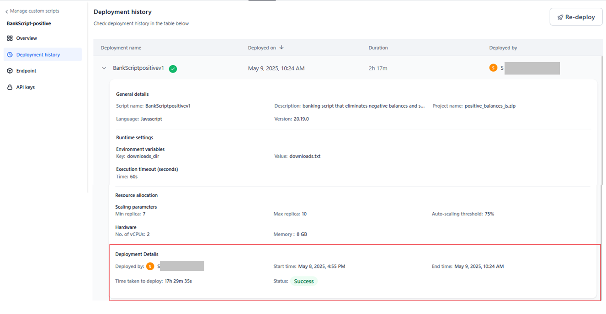  

### Statuses and Deployment Details

Deployment history information is displayed based on the status as follows:

**Deployed**

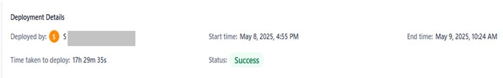  

**Deployment Failed**

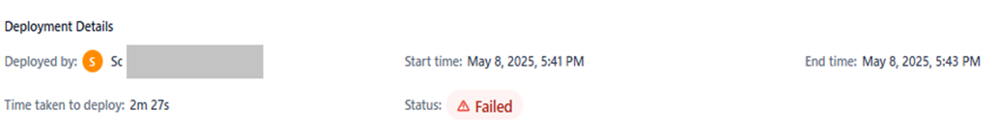 

**Ready to Deploy**

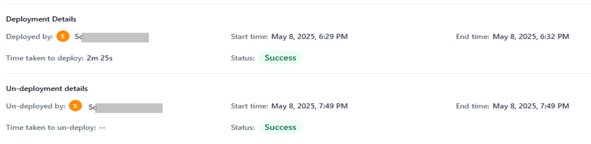  

**Deploying**

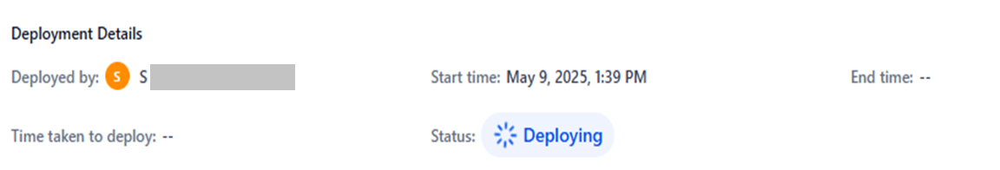  

## Endpoint

The **Endpoint** page displays code viewers of the activated endpoint for the deployed script in different formats. This allows users to easily copy the code in their preferred format and integrate it into their applications. 

Note

The code is view-only and cannot be edited.

The available formats include:

* **cURL**: Displays the API endpoint information for the script.
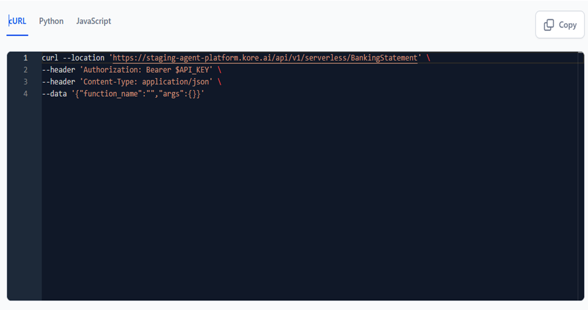  
 
* **JavaScript**: Displays the payload JSON code in JS format.
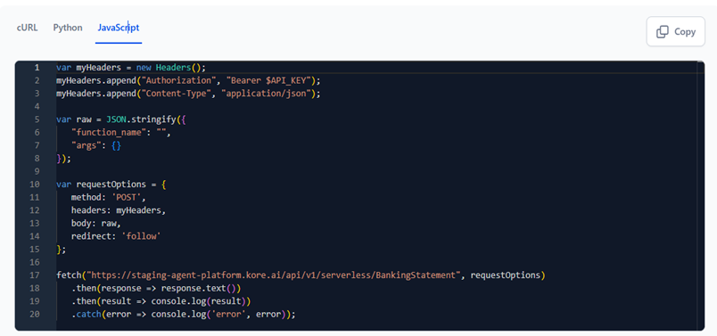   

* **Python**: Displays the payload JSON code in Python format.
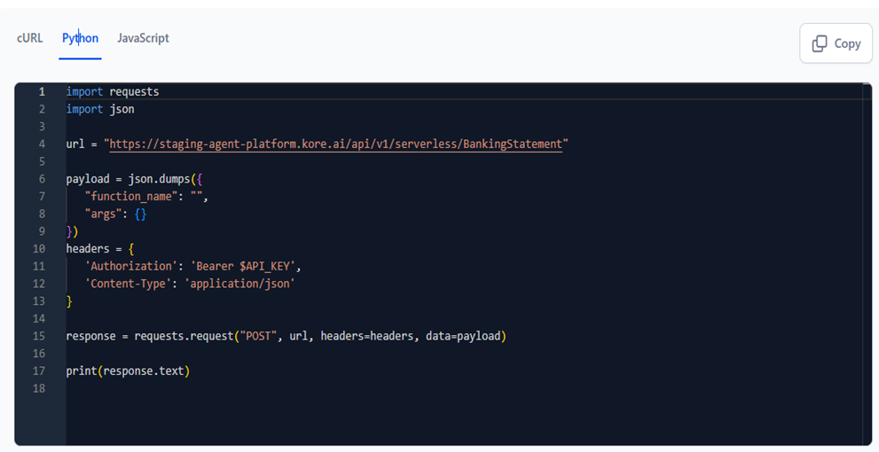   

Clicking **Copy** copies the selected endpoint format to the clipboard, allowing you to paste it into your applications or code editors. A success message confirms the copy action. 

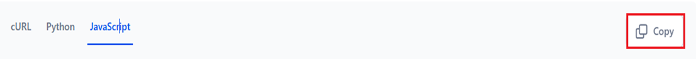   

For the statuses '*Deploying*,' '*Deployment Failed*,' and '*Ready to Deploy*,' the page displays the following message along with an option to **deploy** the script. 

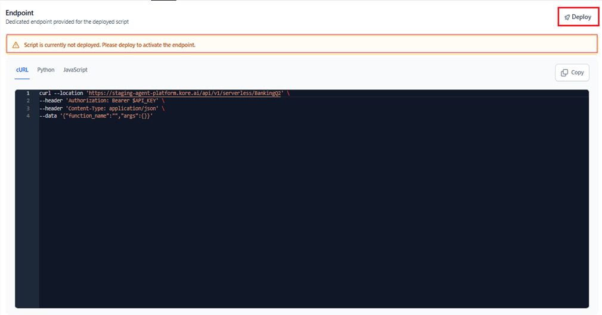   
 
To [deploy the script](../manage-custom-scripts/custom-scripts.md#import-and-deploy-a-custom-script) and activate the endpoint (obtain the code), click **Deploy**. 

## API Keys

AI for Process provides secure access to deployed scripts through authenticated requests. You must create an API key to manage access to a deployed script’s endpoint across the platform. 
 

Note

You can create API keys for a script regardless of its <a href="#view-deployed-scripts-and-their-statuses" >deployment status</a>. The keys can be used once the script is successfully deployed.

### Create an API Key

To add an API secret key, follow these steps: 

1. Navigate to the **API Keys** page.
2. Click **Create a New API Key** or **Create New Key**.
   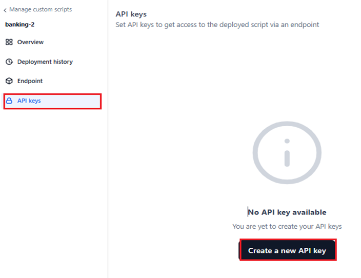  
   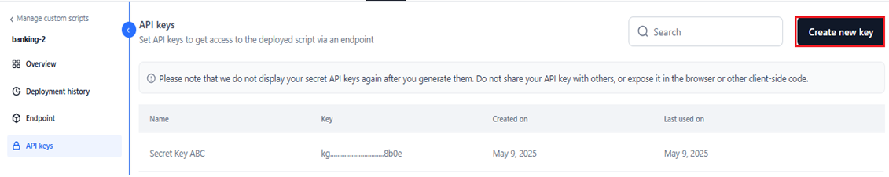  
 
3. Enter a unique name for the key. By default, “**Secret Key**” is displayed, which you can change.
4. Click **Generate Key**.
   
   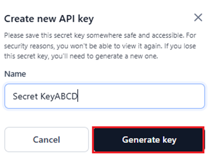

<ol start="5"><li>Click <b>Copy and Close</b>.</li>   
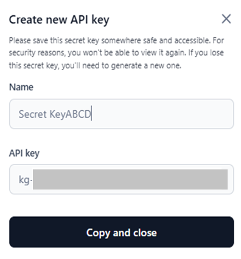</ol>  
 

Important

<ul><li>Your secret API key is shown only once when generated. Save the key in a safe location. Do not share it or expose it in browsers or other client-side code.</li>
<li>If you lose a secret key, a new one must be generated.</li></ul>

A success message is displayed once the API key is generated. The added API Key is listed on the page.

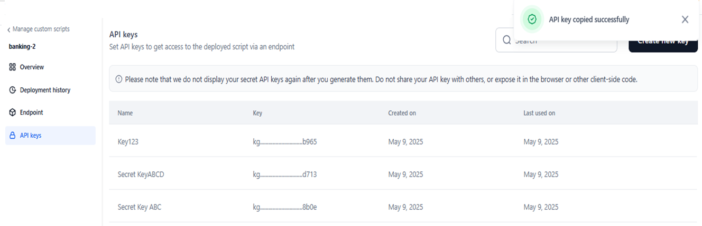  

### Delete an API Key

To delete an API key, follow the steps below:

1. On the **API Keys** page, hover over the required key.
2. Click the **Delete** icon.
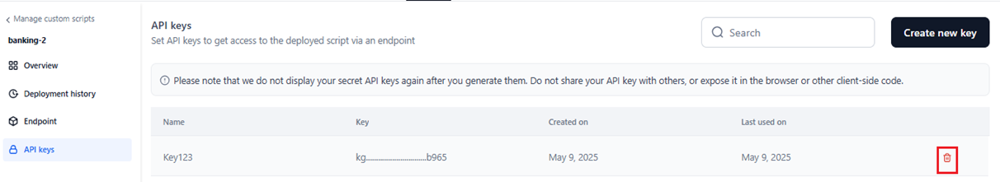  

3. Click **Delete** in the confirmation window.

       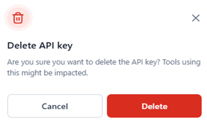  

A success message is displayed, and the API key is removed from the list. 

Note

A deleted API key becomes invalid and can no longer be used to access the script on the platform.

### Search API Key

To look up a specific API key, type the name (partial or full) in the **Search** field.
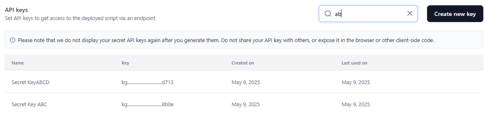  

## Example: Use Custom Script via the API Node Endpoint

To add a deployed custom script via the endpoint into the API node, follow the steps below:

1. Click **Define Request** in the API node configuration window.
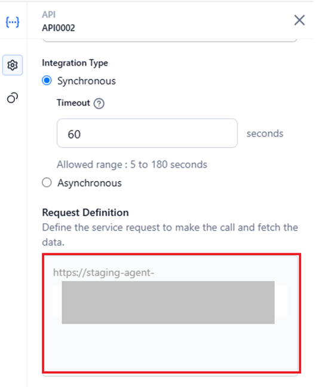  

2. Enter or select the following details in the **Edit Request** dialog box: 

    * Select the request type from the list.
    * Copy the cURL from the [Endpoint section](../manage-custom-scripts/custom-scripts.md#endpoint) of the custom script wizard.
    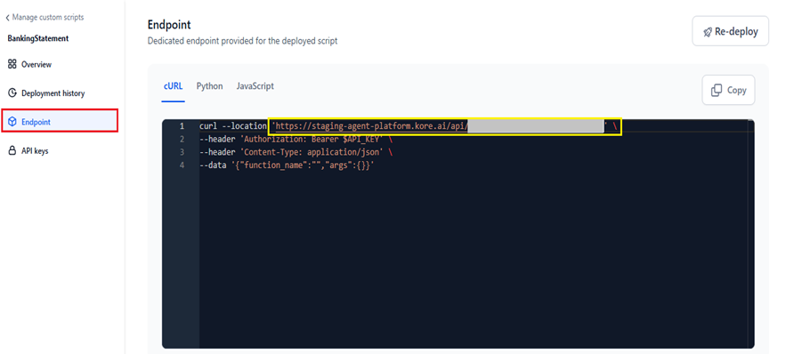 

    * Paste it in the text field of the **Edit Request** page.
    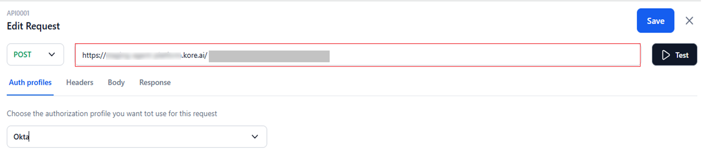 

    * In the **Auth Profiles** section, select the required option from the list of configured profiles to enable user authentication for the node. [Learn more](../security-and-control/authorization-profile.md) about Auth Profiles. 
    
    If authentication isn't required, select **None** (the default option).

    * In the **Headers** tab, specify the Key and Value pair details. For example, **Key**: *Content-Type* **Value**: *application/json*.
    * The **Body** tab is displayed for all request types except GET. Select the body content type from the drop-down list:
        * **application/x-www-form-urlencoded**: Allows file uploads through HTTP POST requests. Add key/value pairs encoded by the platform.
        * **application/json**: Transmits data between servers and web applications using JSON format without processing.
        * **application/xml**: Sends XML payload for SOAP services using POST methods, with the option to include node values.
        * **Custom**: Allows sending request payload in non-standard formats, such as for handling blogs or custom variables.
    * Click the **Test** button at the top-right corner of the dialog. The API response is displayed on the **Response** tab.
    * Click **Save** at the top-right corner of the dialog.

    Please refer to the [API node](../../workflows/workflow-builder/types-of-nodes/api-node.md) for more information.

    ## Related Links
    
    * **Settings Console** - [Learn more](../../settings/overview.md) about other AI for Process admin features.
    * **API Node** - [Learn more](../../workflows/workflow-builder/types-of-nodes/api-node.md) about configuring the API node via endpoint.

