# Audit Logs - Track Account-level User Actions and Events

AI for Process' comprehensive **Audit Logs** on the **Settings** console provides full visibility into user actions and system interactions, tracking logins, role changes, and model updates through dynamic time-stamped logs and tracking capabilities.

This empowers admins to ensure compliance with internal policies and regulations, while proactively mitigating risks like data privacy breaches and algorithmic bias. 

Each log entry includes the following to provide actionable insights on account and workflow-level activities:

- Event name and category.
- The user who performed the action.
- Date and time of the event.
- Detailed description of the action.

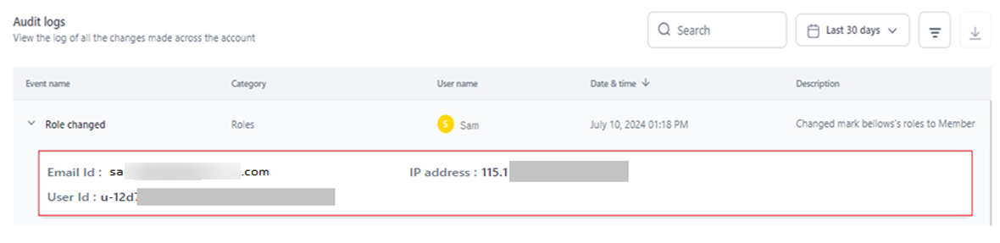

The event metadata provides business users with actionable insights, helping them in efficiently identifying patterns in user activities within their accounts. It also aids in detecting anomalies, spotting unauthorized usage, and enhancing overall account security.

You can specify a **current** or **past period** to view the logs and have complete visibility into the activities and modifications in your account. [Learn more](./audit-logs.md#steps-to-set-time-range-for-audit-logs).

Additionally, you can set **custom filters** based on a specific category, event, or user value to view only the required audit logs. [Learn more](./audit-logs.md#steps-to-add-a-custom-filter).

Note

<ul><li>The <b>IP Address</b> is fetched from the user’s current network.</li>
<li><b>User ID</b>, <b>Role ID</b>, <b>Model ID</b>, <b>Workflow ID</b>, <b>Guardrail ID</b>, <b>Integration ID</b>, and <b>Experiment ID</b> pertain to the unique identifier associated with the module’s entity in the system.</li></ul>

## Account-Level Audit Logs

Universal Metadata

The <b>User ID</b> and <b>IP Address</b> are shown for audit log entries across all modules, in addition to module and category-specific metadata listed in the table below.

<table>
    <tr>
   <td colspan="3" align="center"><strong>Category</strong>: Login/Logout
   </td>
  </tr>
  <tr>
   <td colspan="3" ><b>Metadata</b>: <strong><i>Email ID</i></strong> is displayed for all the category events below.
   </td>
  </tr>
    <tr>
   <td><strong>Event</strong>
   </td>
   <td><strong>Description</strong>
   </td>
   <td><strong>Additional Metadata</strong>
   </td>
  </tr>
  <tr>
   <td>Login
   </td>
   <td>Tracks the account login activity.
   </td>
   <td>
<ul>
<li>Login method
</li>
</ul>
   </td>
  </tr>
  <tr>
   <td>Logout
   </td>
   <td>Tracks the account logout activity.
   </td>
   <td align="center">
    -
   </td>
  </tr>
  </table>

  <table>
  <tr>
     <td colspan="3" align="center"><strong>Category</strong>: Roles
   </td>
   </tr>
  <tr>
   <td colspan="3"><b>Metadata</b>: <strong><i>Role ID</i></strong> is displayed for all the category events below, except <em>Role Changed</em>.
   </td>
  </tr>
      <tr>
   <td><strong>Event</strong>
   </td>
   <td><strong>Description</strong>
   </td>
   <td><strong>Additional Metadata</strong>
   </td>
  </tr>
  <tr>
          <td>Role edited
   </td>
   <td>Tracks the edits done to a custom role.
   </td>
   <td align="center">
    -
   </td>
  </tr>
  <tr>
   <td>Role created
   </td>
   <td>Tracks the creation of custom roles.
   </td>
   <td rowspan="2" >
<ul>
<li>Role Type
</li>
</ul>
   </td>
  </tr>
  <tr>
   <td>Role deleted
   </td>
   <td>Tracks the deletion of custom roles.
   </td>
  </tr>
  <tr>
   <td>Role changed
   </td>
   <td>Tracks the role changes made for member users. This also includes role  changes for multiple users (bulk change).
   </td>
   <td align="center">
    -
   </td>
  </tr>
  </table>

  <table>
  <tr>
     <td colspan="3" align="center"><strong>Category</strong>: App API Key
   </td>
   </tr>
  <tr>
   <td colspan="3"><b>Metadata</b>: <b>IP address</b> and <b>User Id</b> are displayed for all the events.
   </td>
  </tr>
      <tr>
   <td><strong>Event</strong>
   </td>
   <td><strong>Description</strong>
   </td>
   <td><strong>Additional Metadata</strong>
   </td>
  </tr>
  <tr>
          <td>App API Key created
   </td>
   <td>Tracks the creation of an App API key.
   </td>
   <td rowspan="2" align="center">
    -
   </td>
  </tr>
  <tr>
   <td>App API key deleted
   </td>
   <td>Tracks the deletion of an App API key.
   </td>
  </tr>
  </table>

  <table>
  <tr>
     <td colspan="3" align="center"><strong>Category</strong>: API App
   </td>
   </tr>
  <tr>
   <td colspan="3"><b>Metadata</b>: <b>App id</b>, <b>IP address</b> and <b>User Id</b> are displayed for all the events.
   </td>
  </tr>
      <tr>
   <td><strong>Event</strong>
   </td>
   <td><strong>Description</strong>
   </td>
   <td><strong>Additional Metadata</strong>
   </td>
  </tr>
  <tr>
   <td>API App created
   </td>
   <td>Tracks the creation of an API app.
   </td>
   <td rowspan="3" align="center">
    -
   </td>
  </tr>
  <tr>
   <td>API App deleted
   </td>
   <td>Tracks the deletion of an API app.
   </td>
  </tr>
    <tr>
   <td>API App updated
   </td>
   <td>Tracks the updates/changes of an API app.
   </td>
  </tr>
  </table>

  <table>
  <tr>
     <td colspan="3" align="center"><strong>Category</strong>: Integrations
   </td>
   </tr>
  <tr>
  <td colspan="3"><b>Metadata</b>: <b><i>IP Address</i></b>, <b><i>Integration Name</i></b>, <b><i>Integration ID</i></b>, <b><i>Integration Type</i></b>, and <b><i>User ID</i></b> are displayed for all the category events below.</td></tr>
        <tr>
   <td><strong>Event</strong>
   </td>
   <td><strong>Description</strong>
   </td>
   <td><strong>Additional Metadata</strong>
   </td>
  </tr>
  <tr>
   <td>Integration added
   </td>
   <td>Tracks integrations added to the account.
   </td>
   <td rowspan="4" align="center">-</td>
   </tr>
  <tr>
   <td>Integration deleted
   </td>
   <td>Tracks integration deletions in the account.
   </td>
  </tr>
    <tr>
   <td>Integration disabled
   </td>
   <td>Tracks the disabling of an integration in the account.
   </td>
  </tr>
      <tr>
   <td>Integration edited
   </td>
   <td>Tracks the modification of an integration’s configuration data in the account.</td>
  </tr>
  </table>

  <table>
  <tr>
     <td colspan="3" align="center"><strong>Category</strong>: Models
   </td>
   </tr>
  <tr>
   <td colspan="3">
   
<b>Metadata</b>:

<ul>
<li><b><i>IP Address</i></b>, <b><i>User ID</i></b>, <strong><i>Model ID</i></strong> and <strong><i>Model Name</i></strong> are displayed for all the <em>Model</em> category events.
<li><strong><i>Model Type</i></strong> is displayed for <i>Model Added</i>, <em>Model Deleted</em>, <em>API Key created</em>, <em>API Key deleted</em>, <em>Model Fine-tuning</em>, <em>Model Deployed</em>, and <em>Model Undeployed </em>events.
<li><strong><i>Hardware Type</i></strong> is displayed for <em>Model fine-tuning</em>, <em>Model Deployed</em>, and <em>Model Undeployed</em> events.
</li>
</ul>
   </td>
  </tr>
   <tr>
   <td><strong>Event</strong>
   </td>
   <td><strong>Description</strong>
   </td>
   <td><strong>Additional Metadata</strong>
   </td>
  </tr>
  <tr>
   <td>Model added</td>
   <td>Tracks the addition of models to the account.
   </td>
   <td rowspan="2">
   <ul><li>For open-source and fine-tuned models, the <i>Deployment Name</i> is displayed.</li>
   <li>For commercial models, the <i>Connection Name</i> is displayed.</li></ul>
   </td>
  </tr>
  <tr>
   <td>Model deleted
   </td>
   <td>Tracks the deletion of models from the account.
   </td>
  </tr>
  <tr>
   <td>API Key created
   </td>
   <td>Tracks the creation of an API key for a model in the account.
   </td>
   <td rowspan="2" align="center">
   -
   </td>
  </tr>
  <tr>
   <td>API Key deleted
   </td>
   <td>Tracks the deletion of an API key for a model.
   </td>
  </tr>
  <tr>
   <td>Model fine-tuning
   </td>
   <td>Tracks the fine-tuning process for models done.
   </td>
   <td>
<ul>
<li>Training method

<li>No. of epochs

<li>Batch size

<li>Learning rate

<li>Training dataset

<li>Test dataset

<li>Weights and Biases.
</li>
</ul>
   </td>
  </tr>
  <tr>
   <td>Model deployed
   </td>
   <td>Tracks the open-source model deployments in the account.
   </td>
   <td>
<ul>

<li>Temperature

<li>Max length

<li>Top p

<li>Top k

<li>Stop Sequence

<li>Inference batch size

<li>Min Replicas

<li>Max Replicas

<li>Scale up Delay

<li>Scale down Delay
</li>
</ul>
   </td>
  </tr>
  <tr>
   <td>Model undeployed
   </td>
   <td>Tracks the open-source model undeployments in the account.
   </td>
   <td>
<ul>

<li> Hours of usage

<li> Temperature

<li>Max length

<li>Top p

<li>Top k

<li> Stop sequence

<li>Inference batch size

<li>Min replicas

<li>Max replicas

<li>Scale up delay

<li>Scale down delay

</li>
</ul>
   </td>
  </tr>
  </table>

  <table>
  <tr>
     <td colspan="3" align="center"><strong>Category</strong>: Workflows
   </td>
   </tr>
  <tr>
   <td colspan="3"><b>Metadata</b>: <strong><i>Workflow ID</i></strong> and <strong><i>Workflow Name</i></strong> are displayed for all the category events below.
   </td>
  </tr>
     <tr>
   <td><strong>Event</strong>
   </td>
   <td><strong>Description</strong>
   </td>
   <td><strong>Additional Metadata</strong>
   </td>
  </tr>
  <tr>
   <td>Workflow created
   </td>
   <td>Tracks the creation of a workflow in the account.
   </td>
   <td align="center">
   -
   </td>
  </tr>
  <tr>
   <td>Workflow deleted
   </td>
   <td>Tracks the deletion of a workflow in the account.
   </td>
   <td>
<ul>

<li>Model ID

<li>Model Name

<li>Model Type
</li>
</ul>
   </td>
  </tr>
  </table>
<table>
  <tr>
     <td colspan="3" align="center"><strong>Category</strong>: Workflows Flow Management: Integration Node</td>
   </tr>
  <tr>
   <td colspan="3"><b>Metadata</b>: <b>User ID</b>, <b>IP Address</b>, <b>Agent ID</b>, <b>Node name</b>, <b>Node ID</b>, and <b>Node Type</b> are displayed for all the category events below.
   </td>
  </tr>
     <tr>
   <td><strong>Event</strong>
   </td>
   <td><strong>Description</strong>
   </td>
   <td><strong>Additional Metadata</strong>
   </td>
  </tr>
  <tr>
   <td>Connection added
   </td>
   <td>Tracks the creation of a connection for an integration node.</td>
   <td align="center" rowspan="5">
   -
   </td>
  </tr>
  <tr>
   <td>Connection Modified
   </td>
   <td>Tracks the change of the selected connection for an integration node.</td>
  </tr>
    <tr>
   <td>Action Added
   </td>
   <td>Tracks the addition of an action for the selected connection and its configuration.</td>
  </tr>
      <tr>
   <td>Action Changed
   </td>
   <td>Tracks the change of the selected action.</td>
  </tr>
   <tr>
   <td>Action Edited
   </td>
   <td>Tracks the modification of action parameters for the defined action.</td>
  </tr>
  </table>
  <table>
    <tr>
     <td colspan="3" align="center"><strong>Category</strong>: Users Management
   </td>
   </tr>
      <tr>
   <td><strong>Event</strong>
   </td>
   <td><strong>Description</strong>
   </td>
   <td><strong>Additional Metadata</strong>
   </td>
  </tr>
  <tr>
   <td>User invited
   </td>
   <td>Tracks the invitation of new users to the account.
   </td>
   <td>
<ul>
<li>Added User IDs
<li>Role Name

<li>Role ID
</li>
</ul>
   </td>
  </tr>
  <tr>
   <td>User deleted
   </td>
   <td>Tracks the deletion of existing users from the account.
   </td>
   <td>
<ul>
<li>Removed User IDs
</li>
</ul>
   </td>
  </tr>
  </table>

  <table>
      <tr>
     <td colspan="3" align="center"><strong>Category</strong>: Prompts
   </td>
   </tr>
  <tr>
   <td colspan="3">
   
<b>Metadata</b>:

<ul>
<li><strong><i>Prompt ID</i></strong> is displayed for all the <em>Prompts </em>category events.
<li><strong><i>Prompt Name</i></strong> is displayed for <em>Prompt created</em>, <em>Versions Committed</em>, <em>Versions Restored</em>, <em>Prompt Shared</em>, <em>Endpoint Copied</em>, and <em>API Key Created </em>category events.
</li>
</ul>
   </td>
  </tr>
   <tr>
   <td><strong>Event</strong>
   </td>
   <td><strong>Description</strong>
   </td>
   <td><strong>Additional Metadata</strong>
   </td>
  </tr>
  <tr>
   <td>Prompt created
   </td>
   <td>Tracks the creation of a prompt.
   </td>
   <td rowspan="2" align="center">
   -
   </td>
  </tr>
  <tr>
   <td>Prompt deleted
   </td>
   <td>Tracks the deletion of a prompt.
   </td>
  </tr>
  <tr>
   <td>Versions committed
   </td>
   <td>Tracks the prompt versions committed.
   </td>
   <td rowspan="2">
<ul>
<li>Version Name
</li>
</ul>
   </td>
  </tr>
  <tr>
   <td>Version Restored
   </td>
   <td>Tracks the prompt version restored.
   </td>
  </tr>
  <tr>
   <td>Prompt Shared
   </td>
   <td>Tracks the prompts shared with other users.
   </td>
   <td rowspan="4" align="center">
   -
   </td>
  </tr>
  <tr>
   <td>Endpoint Copied
   </td>
   <td>Tracks the prompt endpoint copy done.
   </td>
  </tr>
    <tr>
   <td>Endpoint Consumed
   </td>
   <td>Tracks the prompt endpoint that was consumed externally.
   </td>
  </tr>
  <tr>
   <td>API Key Created
   </td>
   <td>Tracks the API key creation for the prompt endpoint.
   </td>
  </tr>
  <tr>
   <td>Generated Test Data
   </td>
   <td>Tracks the generation of test data.
   </td>
   <td rowspan="2" >
<ul>

<li>Model name

<li>Model ID

<li>Tokens Consumed
</li>
</ul>
   </td>
  </tr>
  <tr>
   <td>Generated Prompt
   </td>
   <td>Tracks the prompt generation done by the account user.
   </td>
  </tr>
  </table>

  <table>
      <tr>
     <td colspan="3" align="center"><strong>Category</strong>: Dataset
   </td>
   </tr>
   <tr>
   <td><strong>Event</strong>
   </td>
   <td><strong>Description</strong>
   </td>
   <td><strong>Additional Metadata</strong>
   </td>
  </tr>
  <tr>
   <td>Dataset uploaded
   </td>
   <td>Tracks the dataset uploads in the account.
   </td>
   <td>
<ul>
<li>File type(extension)
</li>
</ul>
   </td>
  </tr>
  </table>

   <table>
   <tr>
   <td colspan="3" align="center"><strong>Category</strong>: Manage Custom Scripts
   </td>
   </tr>
   <tr>
   <td colspan="3">
   <b>Metadata</b>: <b><i>user ID</i></b>, <b><i>user name</i></b>, <b><i>IP Address</i></b>, and <b><i>custom script name</i></b> are displayed for all the category events below.
   </td>
  </tr>
  <tr>
   <td><strong>Event</strong>
   </td>
   <td><strong>Description</strong>
   </td>
   <td><strong>Additional Metadata</strong>
   </td>
  </tr>
  <tr>
   <td>Custom script saved as draft
   </td>
   <td>Tracks the custom script saved as a draft.
   </td>
   <td align="center">
    -
   </td>
  </tr>
  <tr>
   <td>Custom script deployed
   </td>
   <td>Tracks the custom script deployment.
   </td>
   <td align="center"> -
   </td>
  </tr>
    <tr>
   <td>Custom script undeployed
   </td>
   <td>Tracks the custom script undeployment.
   </td>
   <td align="center"> -
   </td>
  </tr>
      <tr>
   <td>Custom script re-deployed
   </td>
   <td>Tracks the custom script redeployment.
   </td>
   <td align="center"> -
   </td>
  </tr>
   <tr>
   <td>Custom script deleted
   </td>
   <td>Tracks the custom script deletion.
   </td>
   <td align="center"> -
   </td>
  </tr>
     <tr>
   <td>Custom script exported
   </td>
   <td>Tracks the custom script export.
   </td>
   <td align="center"> -
   </td>
  </tr>
  </table>

  <table>
     <tr>
     <td colspan="3" align="center"><strong>Category</strong>: Guardrails
   </td>
   </tr>
   <tr>
   <td colspan="3">
   <b>Metadata</b>: <strong><i>Guardrail Name</i></strong>, <strong><i>Guardrail ID</i></strong>, and <strong><i>Hardware Type</i></strong> are displayed for all the category events below.
   </td>
  </tr>
  <tr>
   <td><strong>Event</strong>
   </td>
   <td><strong>Description</strong>
   </td>
   <td><strong>Additional Metadata</strong>
   </td>
  </tr>
  <tr>
   <td>Guardrails deployed
   </td>
   <td>Tracks the guardrails deployment in the account.
   </td>
   <td align="center">
    -
   </td>
  </tr>
  <tr>
   <td>Guardrails undeployed
   </td>
   <td>Tracks the guardrails undeployment in the account.
   </td>
   <td>
<ul>

<li>Time of Usage
</li>
</ul>
   </td>
  </tr>
</table>

<table>
     <tr>
     <td colspan="3" align="center"><strong>Category</strong>: Script
   </td>
   </tr>
   <tr>
   <td colspan="3">
   <b>Metadata</b>: <b><i>user ID</i></b>, <b><i>user name</i></b>, <b><i>IP address</i></b>,<b><i> Agent ID</b></i>, <b><i>node name</b></i>, <b><i>node ID</i></b>, and <b><i>node type</b></i> are displayed for all the category events below.
   </td>
  </tr>
  <tr>
   <td><strong>Event</strong>
   </td>
   <td><strong>Description</strong>
   </td>
   <td><strong>Additional Metadata</strong>
   </td>
  </tr>
  <tr>
   <td>Write Code
   </td>
   <td>Tracks the user's selection to write a custom script.
   </td>
   <td align="center">
    -
   </td>
  </tr>
  <tr>
   <td>Custom Function</td>
   <td>Tracks the user's selection to execute a custom function.</td>
   <td align="center">-
   </td>
  </tr>
</table>

<table>
     <tr>
     <td colspan="3" align="center"><strong>Category</strong>: OCR
   </td>
   </tr>
   <tr>
   <td colspan="3">
   <b>Metadata</b>: All events record relevant user and system metadata, including user ID, user name (where applicable), IP address, connection name, connection ID, deployment name, and hardware type.
   </td>
  </tr>
  <tr>
   <td><strong>Event</strong>
   </td>
   <td><strong>Description</strong>
   </td>
   <td><strong>Additional Metadata</strong>
   </td>
  </tr>
  <tr>
   <td>OCR deployed
   </td>
   <td>Tracks the deployment of OCR models.
   </td>
   <td align="center">
    -
   </td>
  </tr>
  <tr>
   <td>OCR undeployed</td>
   <td>Tracks the undeployment of OCR models.</td>
   <td align="center">-
   </td>
  </tr>
    </tr>
  <tr>
   <td>OCR saved as draft</td>
   <td>Tracks when an OCR deployment is saved as a draft.</td>
   <td align="center">-
   </td>
  </tr>
    </tr>
  <tr>
   <td>Azure Doc Intelligence account added</td>
   <td>Tracks the addition of an Azure Doc Intelligence account.</td>
   <td align="center">-
   </td>
  </tr>
    </tr>
  <tr>
   <td>Azure Doc Intelligence account deleted</td>
   <td>Tracks the deletion of an Azure Doc Intelligence account.</td>
   <td align="center">-
   </td>
  </tr>

</table>

## Workflow-Level Audit Logs

Universal Metadata

The <b>User ID</b>, <b>IP Address</b>, and <b>Workflow ID</b> are shown for audit log entries across all modules, in addition to module and category-specific metadata listed in the table below.

<table>
  <tr>
   <td colspan="3" align="center"><strong>Category</strong>: User Management
   </td>
  </tr>
  <tr>
   <td><strong>Event</strong>
   </td>
   <td><strong>Description</strong>
   </td>
   <td><strong>Additional Metadata</strong>
   </td>
  </tr>
  <tr>
   <td>Role Changed
   </td>
   <td>Tracks the change of a workflow role for an account user by a user.
   </td>
   <td rowspan="3" align="center">-
   </td>
  </tr>
  <tr>
   <td>Invited users
   </td>
   <td>Tracks the invitation of one or more users to the account at the workflow level.
   </td>
  </tr>
  <tr>
   <td>Removed Users
   </td>
   <td>Tracks the removal of one or more users from the account at the workflow level.
   </td>
  </tr>
  </table>
  <table>
  <tr>
   <td colspan="4" align="center"><strong>Category</strong>: Workflow Management
   </td>
  </tr>
  <tr>
   <td colspan="4" ><strong>workflow version</strong>,<strong> API mode</strong>,<strong> sync/async</strong>, and<strong> URL </strong>are displayed for all the category events below.

<strong> </strong>
   </td>
  </tr>
  <tr>
   <td><strong>Event</strong>
   </td>
   <td><strong>Description</strong>
   </td>
   <td colspan="3"><strong>Additional Metadata</strong>
   </td>
  </tr>
  <tr>
   <td>Workflow Deployed</td>
   <td>Tracks the workflow deployments in the account.</td>
   <td rowspan="2" align="center">-</td>
  </tr>
  <tr>
   <td>Workflow Undeployed
   </td>
   <td>Tracks the workflow undeployments in the account.
   </td>
  </tr>
  <tr>
   <td colspan="4" ><strong>Version ID</strong> is displayed for all the category events below.
   </td>
  </tr>
  <tr>
   <td><strong>Event</strong>
   </td>
   <td><strong>Description</strong>
   </td>
   <td colspan="2" ><strong>Additional Metadata</strong>
   </td>
  </tr>
  <tr>
   <td>Version Created
   </td>
   <td>Tracks the workflow version creation.
   </td>
   <td rowspan="8" colspan="2" align="center">-
   </td>
  </tr>
  <tr>
   <td>Version Deleted
   </td>
   <td>Tracks the workflow version deletion.
   </td>
  </tr>
  <tr>
   <td>API Key created

 
   </td>
   <td>Tracks the workflow API Key creation.
   </td>
  </tr>
  <tr>
   <td>API Key deleted
   </td>
   <td>Tracks the workflow API Key deletion.
   </td>
  </tr>
  <tr>
   <td>workflow description updated

 
   </td>
   <td>Tracks the workflow description update done.
   </td>
  </tr>
  <tr>
   <td>workflow name updated

 
   </td>
   <td>Tracks the workflow name update done.
   </td>
  </tr>
  <tr>
   <td>workflow exported

 
   </td>
   <td>Tracks the workflow export done.
   </td>
  </tr>
  <tr>
   <td>API sync timeout updated
   </td>
   <td>Tracks the synchronous time update.
   </td>
  </tr>
  <tr>
  </tr>
  <tr>
   <td><strong>Event</strong>
   </td>
   <td><strong>Description</strong>
   </td>
   <td><strong>Additional Metadata</strong>
   </td>
   </tr>
  <tr>
   <td>API async enabled

 
   </td>
   <td>Tracks the enabling of the asynchronous mode.
   </td>
   <td rowspan="2" colspan="2" align="center"> <ul><li>URL</li> <li>Access token</li> <li>timeout: yes/no</li>
   <li>timeout value (if yes)</li></ul>
   </td>
  </tr>
  <tr>
   <td>API async updated

    </td>
   <td>Tracks the update of the asynchronous mode configurations.
   </td>
     </tr>
  <tr>
   <td>API async disabled

    </td>
   <td>Tracks the disabling of the asynchronous mode.
   </td>
      <td rowspan="4" colspan="2" align="center">-
   </td>
  </tr>
  <tr>
   <td>Environment variable added

 
   </td>
   <td>Tracks the addition of an environment variable.
   </td>
  </tr>
  <tr>
   <td>Environment variable deleted

 
   </td>
   <td>Tracks the deletion of an environment variable.
   </td>
  </tr>
  <tr>
   <td>Environment variable edited
   </td>
   <td>Tracks the modification of an environment variable.
   </td>
  </tr>
  </table>
  <table>
  <tr>
   <td colspan="4" align="center"><strong>Category</strong>: Guardrails
   </td>
  </tr>
  <tr>
   <td><strong>Event</strong>
   </td>
   <td><strong>Description</strong>
   </td>
   <td><strong>Additional Metadata</strong>
   </td>
  </tr>
  <tr>
   <td>Input scanner added
   </td>
   <td>Tracks the addition of an input scanner.
   </td>
   <td rowspan="6" colspan="2" align="center">-
   </td>
  </tr>
  <tr>
   <td>Input scanner edited
   </td>
   <td>Tracks the modification of an input scanner.
   </td>
  </tr>
  <tr>
   <td>Input scanner removed
   </td>
   <td>Tracks the deletion of an input scanner.
   </td>
  </tr>
  <tr>
   <td>Output scanner added
   </td>
   <td>Tracks the addition of an output scanner.
   </td>
  </tr>
  <tr>
   <td>Output scanner edited
   </td>
   <td>Tracks the modification of an output scanner.
   </td>
  </tr>
  <tr>
   <td>Output scanner removed</td>
   <td>Tracks the deletion of an output scanner.
   </td>
  </tr>
  </table>

<table>
     <tr>
     <td colspan="3" align="center"><strong>Category</strong>: OCR
   </td>
   </tr>
   <tr>
   <td colspan="3">
   <b>Metadata</b>: All workflow node events record relevant user and system metadata, including user ID, IP address, Agent ID, node name, node ID, and node type.
   </td>
  </tr>
  <tr>
   <td><strong>Event</strong>
   </td>
   <td><strong>Description</strong>
   </td>
   <td><strong>Additional Metadata</strong>
   </td>
  </tr>
  <tr>
   <td>Node name edited
   </td>
   <td>Tracks when a node’s name is edited.
   </td>
   <td align="center">
    -
   </td>
  </tr>
  <tr>
   <td>Node deleted</td>
   <td>Tracks  when a node is deleted.</td>
   <td align="center">-
   </td>
  </tr>
    </tr>
  <tr>
   <td>Description added</td>
   <td>Tracks when a description is added to a node.</td>
   <td align="center">-
   </td>
  </tr>
    </tr>
  <tr>
   <td>Description edited</td>
   <td>Tracks when a node’s description is modified.</td>
   <td align="center">-
   </td>
  </tr>
    </tr>
  <tr>
   <td>Engine added</td>
   <td>Tracks when an engine is added to a node.</td>
   <td align="center">-
   </td>
  </tr>
  <tr>
   <td>Engine edited</td>
   <td>Tracks when a node's engine is modified.</td>
   <td align="center">-
   </td>
  </tr>
    <tr>
   <td>Connection added</td>
   <td>Tracks when a connection is added to a node.</td>
   <td align="center">-
   </td>
  </tr>
    <tr>
   <td>Connection modified</td>
   <td>Tracks when a node’s connection is modified.</td>
   <td align="center">-
   </td>
  </tr>
    <tr>
   <td>Base URL edited</td>
   <td>Tracks  when the Base URL of a node is modified.</td>
   <td align="center">-
   </td>
  </tr>
</table>

## Access Audit Logs

To access and view audit logs, follow the steps below:

1. Log in → In AI for Process Modules top menu → Click **Settings**.
   

2. Click **Monitoring** > **Audit Logs** on the left menu.
   
## Dashboard Information

The **Audit Logs** dashboard displays the following information to collectively provide a comprehensive overview of activities within your AI for Process account:

* **Event Name:** Describes the specific event or action that occurred.
* **Category:** Identifies the module or entity affected by the event.
* **User Name:** Specifies the name of the user who performed the action or triggered the event.
* **Date and Time:** Represents when the event occurred.
* **Description:** Provides detailed information about what was done.
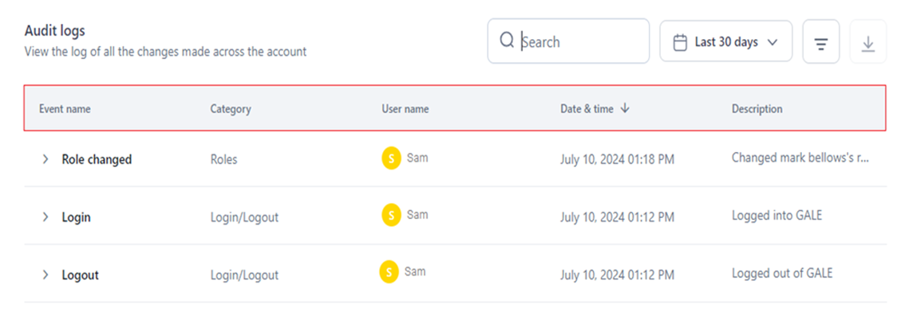

## Filter Audit Logs

You can narrow down the information displayed in your account's audit logs by applying custom filters. 

These filters allow you to select specific categories, events, or users and then apply operators like **Is** **Equal To** or **Is Not Equal To** to specify the desired value. 

This customization helps you focus on relevant audit logs, making it easier to track or investigate specific actions or users within your account.

### Steps to Add a Custom Filter

1. [Navigate](./audit-logs.md#access-audit-logs) to **Audit Logs**.
2. Click the **Filter** icon.
3. Click **+Add Filter**.
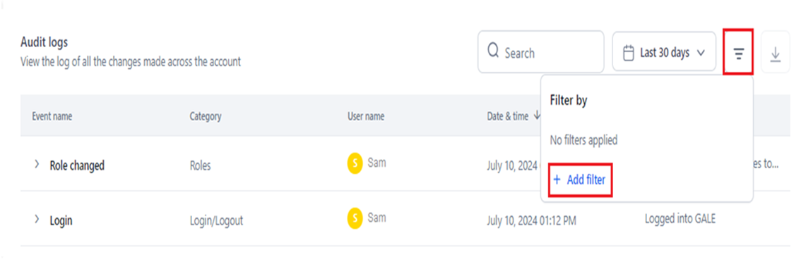

4. In the **Filter By** window, select the required option from the dropdown list for **Select Column**, **Select Operator**, and **Enter Value**.
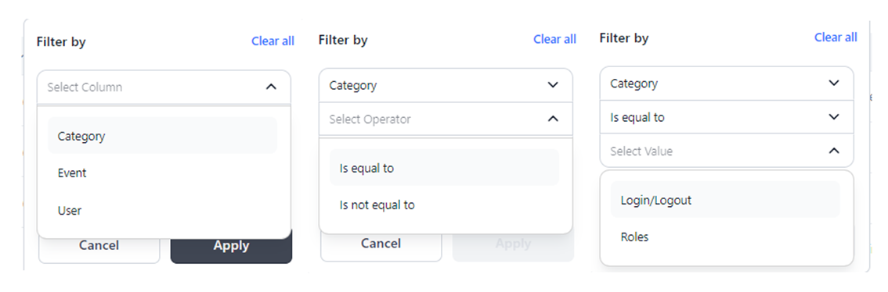

Note

When you use "<b>Is Equal To</b>," the audit logs only show entries that match the specified value. Conversely, when you use "<b>Is Not Equal To</b>," the logs display all entries except those that match the specified value.

For example, applying the filter <b>Event Is Equal To Role Created</b>, as shown below, displays only the logs for the role creation event.

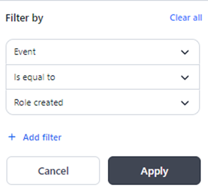

To view the logs for all the events except role creation, you must set the filter as follows:

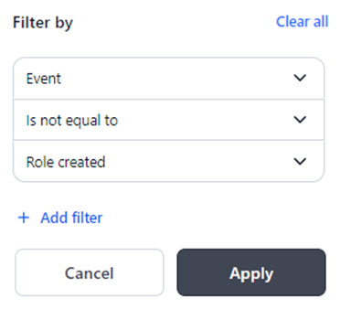

<ol start="5"><li>Click <b>Apply</b>.</li></ol>

All the log entries relevant to the applied filter(s) are displayed, as shown below.
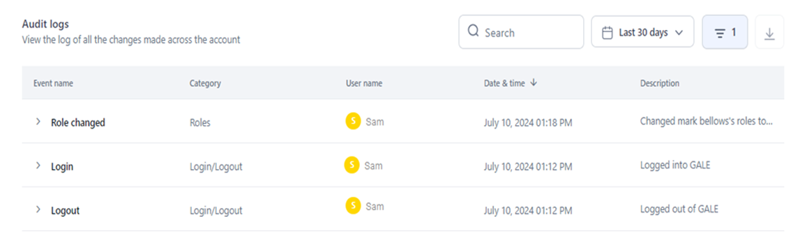

To clear the filter settings, click **Clear All**.

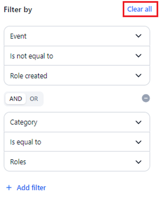

The number of filters you have applied is displayed on the **Filter** icon.
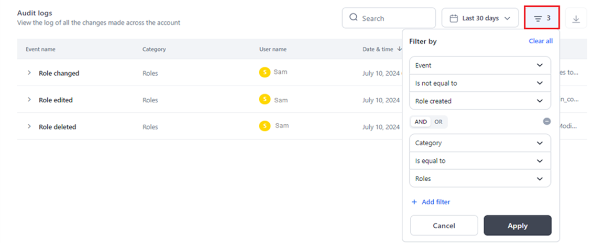

### Add Multiple Filters

You can enhance your audit log visibility by adding multiple filters. This capability allows you to specify detailed criteria such as specific categories, events, or users, enabling you to obtain fine-grained results. 

By combining filters, you can precisely focus on and analyze the audit log entries that are most relevant to your requirements.

When adding multiple filters to refine your audit log queries, you can use the **AND** or **OR** operators in multiple filtering steps effectively. 

Note

Consistency in operator usage is required for each filtering step. This means you need to use either the AND operator or the OR operator throughout all criteria.

Both operators can't be used together.

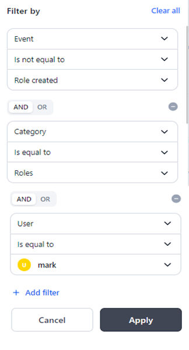

Using the AND operator ensures that all specified conditions must be met for an entry to be included in the results. 

On the other hand, using the OR operator broadens the criteria, allowing entries that meet any of the specified conditions to be included. These operators provide flexibility in tailoring your audit log views.

#### Steps to Add Multiple Filters

1. Follow **Steps 1 to 3** mentioned [here](./audit-logs.md#steps-to-add-a-custom-filter).
2. Select the **AND/OR** operator tab in the **Filter by** window.

    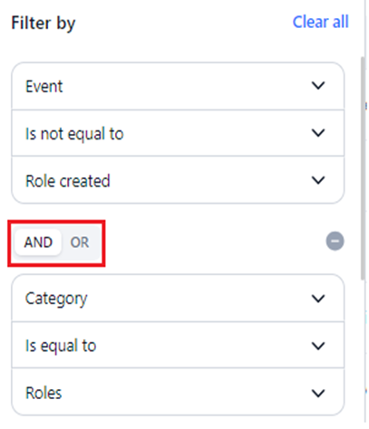

3. Follow **Steps 4 to 5** mentioned [here](./audit-logs.md#steps-to-add-a-custom-filter).

The matched log entries are displayed in the dashboard. 

## Time-based Audit Logs

You can view and monitor audit logs within a specific period with the time selection feature. This capability allows you to focus on audit log entries that occurred within a defined time-frame, and track changes.

Time selection is available for past and current time periods, including the ones listed below:

Note

<b>Last 30 Days</b> is the default selection, which displays logs for the past 30 days from the current date.

* **All Time**: Displays logs since the time the account was created.
* **Today**: Includes audit logs generated on the current day.
* **Yesterday**:  Includes audit logs generated on the previous day.
* **This Week**: Displays logs for all the days in the current week.
* **This Month**: Displays logs for all the days in the current month.
* **Last Month**: Displays logs for all the days in the previous month.
* **Last 30 Days**: Displays logs for the past 30 days from the current date, if events’ data exists.
* **Last 90 Days**: Displays logs for the past 90 days from the current date.
* **This Year**: Displays logs for all the days in the current year.
* **Last Year**: Displays logs for all the days in the past year.

### Steps to Set Time Range for Audit Logs

1. [Navigate](./audit-logs.md#access-audit-logs) to the **Audit Logs** dashboard.
2. Click the time selection button (displays **Last 30 Days**).
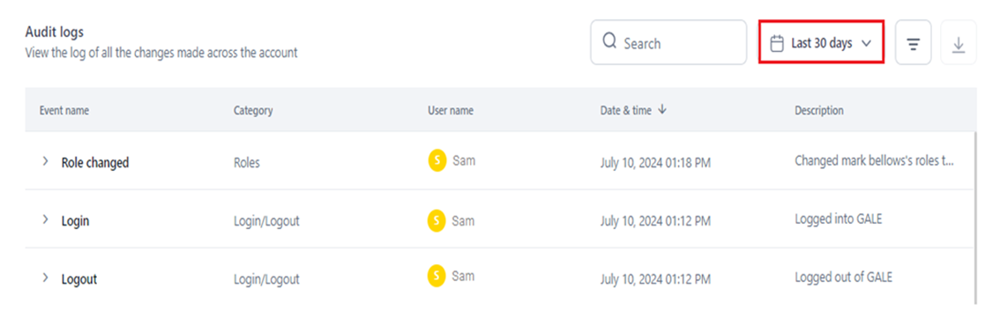

3. Select the required period on the left panel, or select a specific date, month or year on the calendar widget (the current day is the default selection).
4. Click **Apply**.
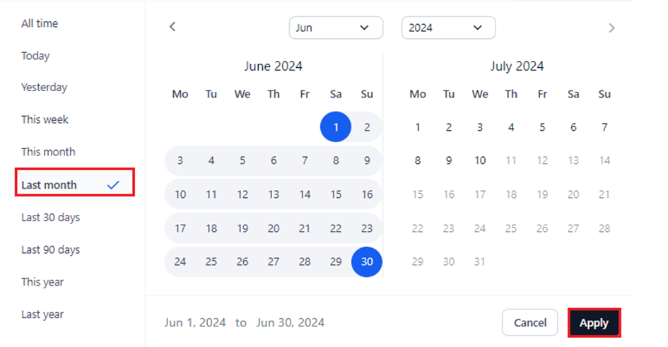

The audit logs for events that occurred within the selected time period are displayed. 

### Key Considerations and Tips

The time range is automatically selected on the calendar widget once you select the period. Also, the date range is displayed at the bottom of the widget.

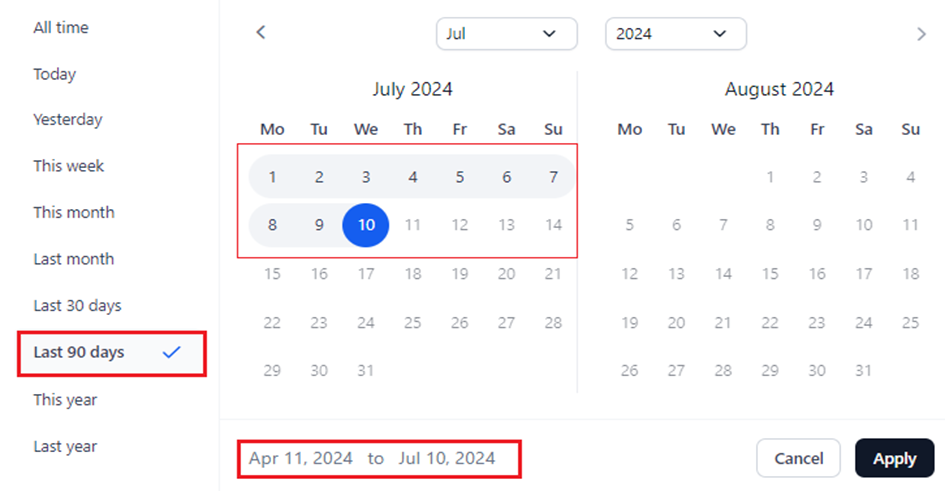

You can select a specific month or year from the relevant dropdown list and switch to different months by clicking the **forward/backward** arrows.

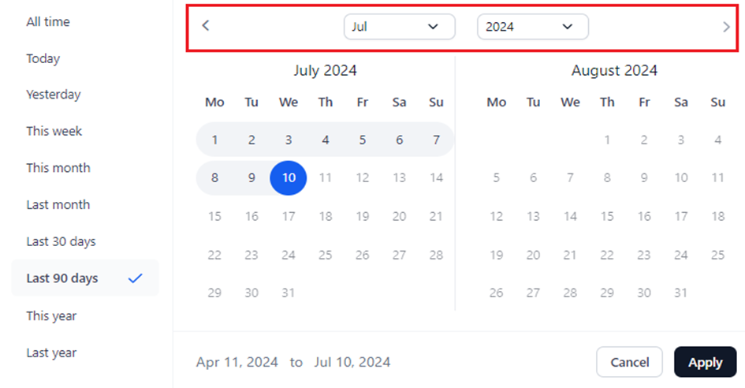

To set a specific date as the start date for viewing audit logs, click on the desired date in the widget. 

By default, the current day will be set as the end date. This feature allows you to easily customize the period for which you want to monitor and analyze audit logs.

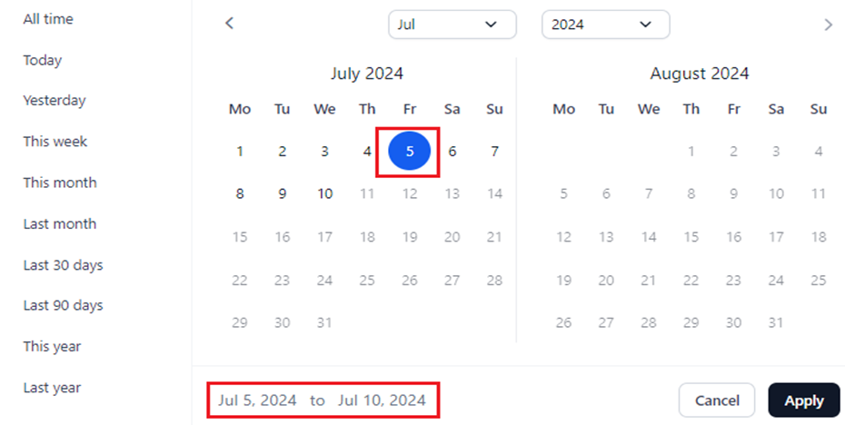

## Export Audit Logs

The **Export** feature helps prepare and export [account-level audit logs](./audit-logs.md#account-level-audit-logs) into a *.csv* file. The audit logs data for the following columns is downloaded. [Learn more](./audit-logs.md#dashboard-information).

* Date and Time
* Event Name
* Event Category
* Description
* User/App Name
* **IP Address**: The user's network IP address linked to the specific event.

Exporting audit logs offers the following benefits:

* **Detailed Analysis**: CSV format allows you to perform in-depth analysis of log data to identify patterns or anomalies over time, while supporting transparency and accountability.
* **Easy Sharing and Reporting**: CSV files of audit logs are easy to share with other stakeholders or integrate them into reporting workflows.
* **Compliance and Record-Keeping**: Having a documented trail in a standardized format is useful for compliance and regulatory audits, ensuring data is readily available when needed.
* **Automation and Integration**: CSVs can be imported into other workflows or systems, enabling automation and integration into workflows for continuous monitoring and alerts.

To export audit logs, follow the steps below:

1. [Navigate](./audit-logs.md#access-audit-logs) to the **Audit Logs** dashboard.
2. Click the **Export** icon next to the **Filter By** icon.
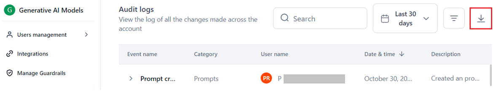

A success message is displayed once the file is downloaded. The file can be found in the configured location in your system.

The downloaded *.CSV* file is automatically named as <code><em>Account_Audit_Logs</em></code>. The schema of the output file is shown below.

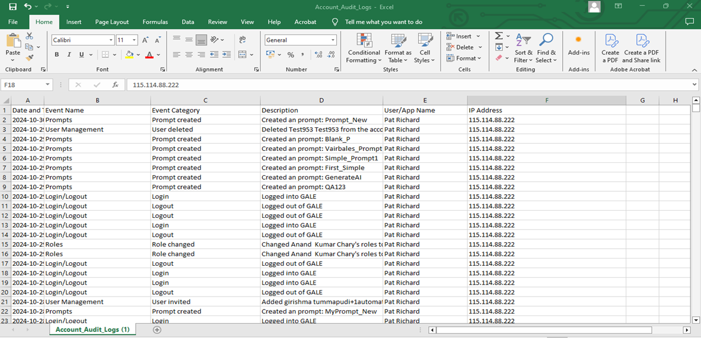

AI for Process’ Audit Logs promotes transparency and accountability in AI operations, helping build trust internally and externally. 

You can confidently scale AI initiatives with event-based user activity logs to manage compliance and ensure responsible use of generative AI.

## Related Information

* [Settings Console](../overview.md)- Learn more about other AI for Process admin features.
* [Users Management](../user-management/overview.md)- Manage users linked to your account.
* [Role Management](../user-management/role-management.md)- View and manage system and custom roles for your account.
* [Workflow Flow Change Logs](../../workflows/workflow-builder/workflow-canvas-change-log.md)- Track, audit, and review changes made to a workflow.

