# Manage Scopes and Keys for API Apps

AI for Process introduces **API scopes** in the **Settings** console, moving from unrestricted management API keys to more secure, scoped API key-based application management.

Users can select specific scopes for managing workflows, models, and guardrails. This allows for the creation of internal applications with restricted access to only the necessary API endpoints. By limiting API access, this feature reduces security risks, allowing administrators to generate multiple API keys and ensure secure, controlled access for authorized personnel.

**Important Considerations for API Keys**

* **Scope-restricted access**: API keys grant access exclusively to their assigned scopes.
* **Unauthorized access**: Any attempt to access unassigned scopes is automatically rejected.
* **Multiple keys per app**: You can generate multiple API keys for a single app.
* **One key per app**: An API key cannot be shared across multiple apps.
* **Immutable keys**: API keys can be deleted, but cannot be modified after they are created.
* **Copy-once policy**: For security reasons, each API key can only be copied once.

Users can rename an app, modify its selected scopes, or delete the app as needed. Once the admin defines or updates the API scopes, the changes are applied platform-wide, ensuring consistent and controlled access to the APIs wherever they are used. 

For more information on roles and permissions for API-scoped apps, please refer [here](../user-management/role-management.md#module-wise-permissions-and-access-levels).

## Use Case: Scoped API Access for Banking Departments

A bank automates workflows and integrates various internal systems across different departments, including **Risk & Compliance**, **Customer Support**, and **Marketing**. This requires access to APIs with different scopes.

* **Risk & Compliance Department**: This team requires access only to models and workflows for generating reports from transaction logs and audit trails. The admin creates a scoped app that grants access to workflows and models. This prevents the team from accidentally accessing unrelated customer information available for guardrails. 

* **Customer Support Department**: Support agents require access to monitoring AI customer interactions, but should not have access to risk and compliance workflows or model management. A scoped app ensures support teams stay within their operational boundaries.

By using API-scoped apps and API keys, the bank minimizes the risk of data exposure while maintaining security, ensuring compliance, and strictly regulating access to authorized system users.

## Supported API Scopes

The following API scopes are available for this feature.

<table>
  <tr>
   <td><strong>API Scope</strong>
   </td>
   <td><strong>Description</strong>
   </td>
  </tr>
  <tr>
   <td>Deploy workflow
   </td>
   <td>Deploy a specific workflow into an environment. It allows the user to control the deployment process either synchronously or asynchronously. [Learn more](../../workflows/deploy-a-workflow.md).
   </td>
  </tr>
  <tr>
   <td>Undeploy workflow
   </td>
   <td>Undeploy a workflow that is deployed in an environment.
   </td>
  </tr>
  <tr>
   <td>Deploy Model
   </td>
   <td>Deploy an open-source or fine-tuned model in the <strong><em>Ready to Deploy</em></strong> state.
   </td>
  </tr>
  <tr>
   <td>Undeploy Model
   </td>
   <td>Undeploy a model from the environment.
   </td>
  </tr>
  <tr>
   <td>Import Model
   </td>
   <td> Import a model in chunks into the AI for Process environment.
   </td>
  </tr>
  <tr>
   <td>Import workflow
   </td>
   <td>Import a new workflow into the system.
   </td>
  </tr>
  <tr>
   <td>Export Model
   </td>
   <td>Export a trained AI model from the system.
   </td>
  </tr>
  <tr>
   <td>Export workflow
   </td>
   <td>Export a workflow's configuration and associated data.
   </td>
  </tr>
  <tr>
   <td>Deploy Guardrails
   </td>
   <td>Deploy pre-defined <strong>guardrails</strong> to enhance security, compliance, and content moderation in AI interactions.
   </td>
  </tr>
  <tr>
   <td>Undeploy Guardrails
   </td>
   <td>Remove the previously deployed guardrails that regulate AI interactions.
   </td>
  </tr>
</table>

## Access API Scopes

To access this feature, follow the steps below:

1. Log in → In AI for Process Modules top menu → Click **Settings**.
   

2. Click **Security & Control** > **API Scopes** on the left navigation menu.

## Implement API Scoping

The key steps to implement API scoping include:

1. [Create an API app and assign scopes](../security-and-control/api-scopes.md#create-an-api-application): API-scoped apps have limited and specific permissions tied only to the API endpoints they need. Creating an API-scoped app enables you to restrict permissions, enhance security, better control and monitor access, and tailor the app specifically to meet the integration’s needs.
2. [Create one or more API Keys to access the app](../security-and-control/api-scopes.md#create-an-api-key): API keys for scoped apps provide secure, manageable, and auditable access control tailored to the app’s needs, making access and usage safer and easier to track.

### Create an API Application

To create an app, follow the steps below:

1. [Access](../security-and-control/api-scopes.md#access-api-scopes) **API Scopes**.
2. Click **Create an API App** or **Create an App**.
   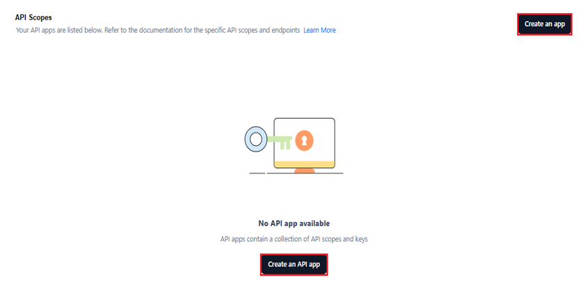

3. Click **Untitled app** and provide the app name.
    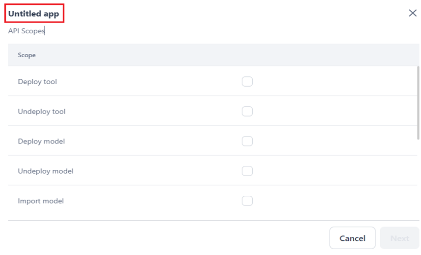

4. Select the required scopes from the list.
    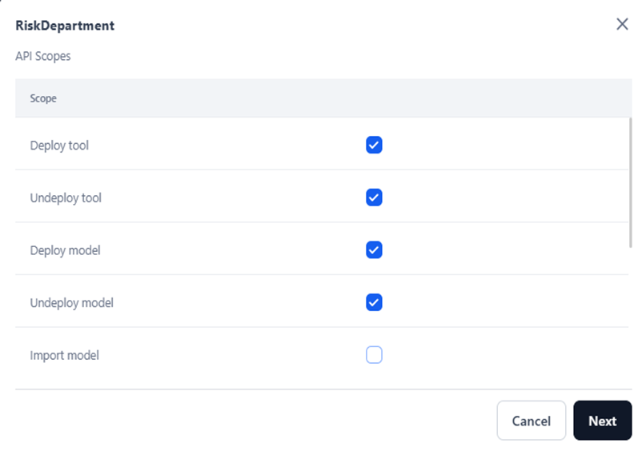
 
5. Click **Next**. 

    A success message is displayed, and the following window is displayed. Follow the steps in the [next section](../security-and-control/api-scopes.md#create-an-api-key) to complete the process.

     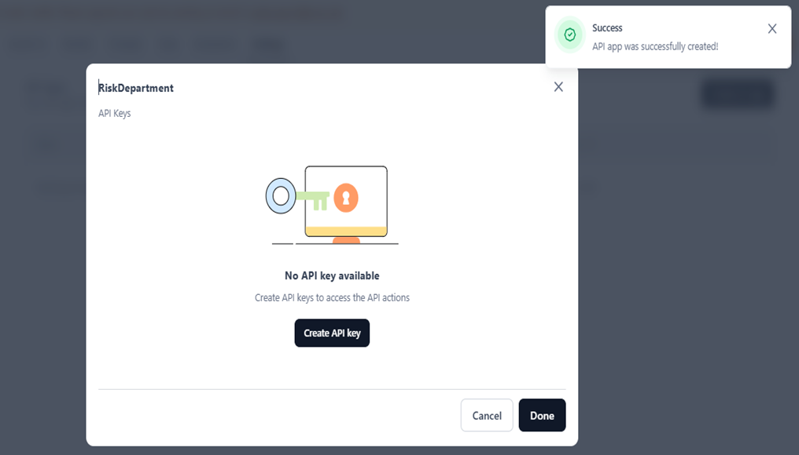

### Create an API Key

This step is necessary to complete the app creation process. To create an API Key, follow the steps below:

1. Click **Create API Key**.
2. In the **Create new API key** dialog, provide a name and click **Generate Key**.
    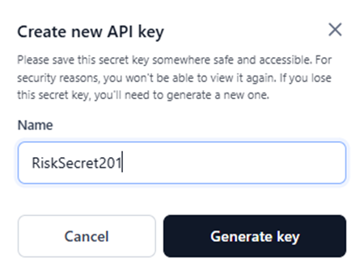

3. Once the key is successfully generated, click **Copy and Close** to copy the API key.
   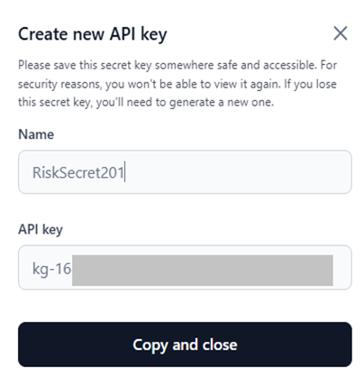

A success message is displayed once the key is copied.

Important information on API Keys

For security reasons, the API key is only shown once and is not stored or displayed again. Copy and save it in a secure location for future reference.

<b>What Happens If You Lose It?</b>

You’ll need to revoke the old key and <b>generate a new one</b>. This could disrupt services if the key is in use.

   
 
The API key is listed for the app, as shown below.
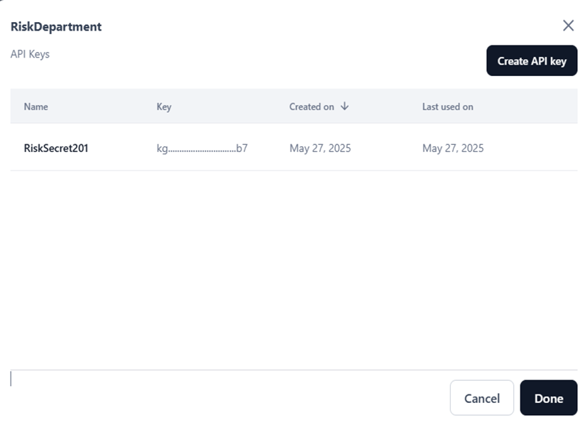

<ol start="4"><li>Click <b>Done</b></li>. 

The summary on the app displays the following information:

<ul><li><b>Name</b>: The API app name.</li>
<li><b>Scopes</b>: The selected API scopes.</li>
<li><b>Created by</b>: The name of the user who created the app.</li>
<li><b>Created on</b>: The date when the app was created.</li>
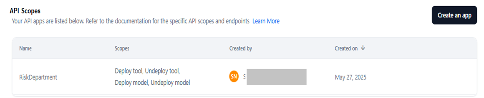</ul></ol> 

## Manage API App and Key

You can edit or delete an API app, including its name and scopes. However, you cannot edit an API key; you can only delete it.       

### Edit App and Delete API Key

To edit an API app, follow the steps below:

1. Hover over and click the **Edit** icon for the required app.
    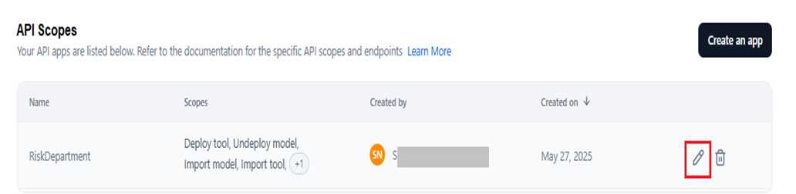

2. In the App’s configuration window, do the following:

    * To change the app name, click and modify the title.
    * To change the scopes, click the **API Scopes** tab and select/unselect the listed scopes.
        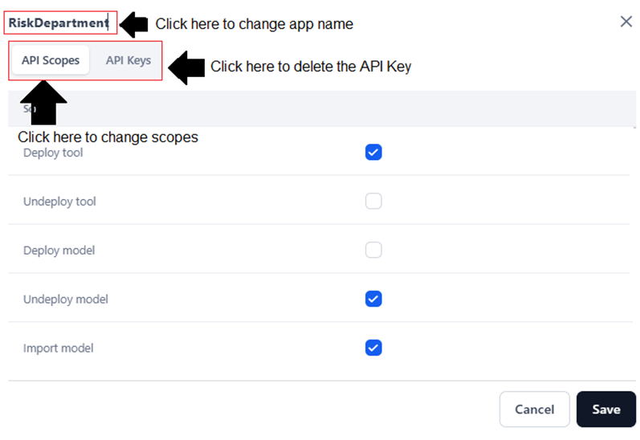
         
    * To delete an API key, follow the steps below:
         * Click the **API Keys** tab.
         * Hover over and click the **Delete** icon for the required key.
           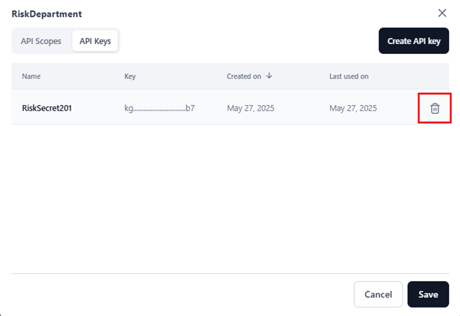

         * Click **Delete** in the confirmation window.
            
            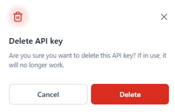
            
            

            
Caution

            
The key you are deleting will no longer function if it is in use. You must generate a new key.

             

            The deleted key is removed from the app in the **API Keys** section and is no longer associated with the app.  

<ol start="3"><li>Click <b>Save</b>.</li>

A success message is displayed once the app is edited. The changes are updated in the summary page.

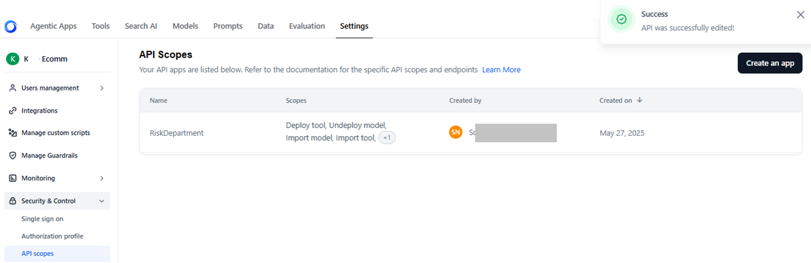</ol>

### Delete App

To delete an API app, follow the steps below:

1. Hover over and click the **Delete** icon for the required app.
   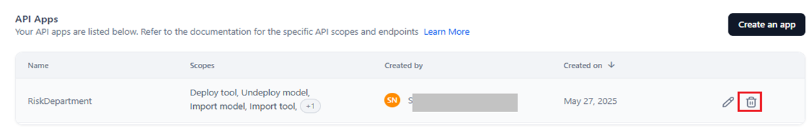

2. Click **Delete** in the confirmation window.

      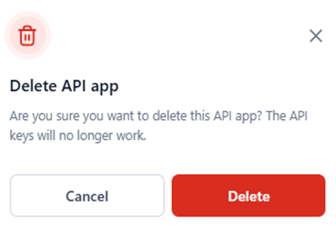

A success message is displayed, and the app is removed from the list.