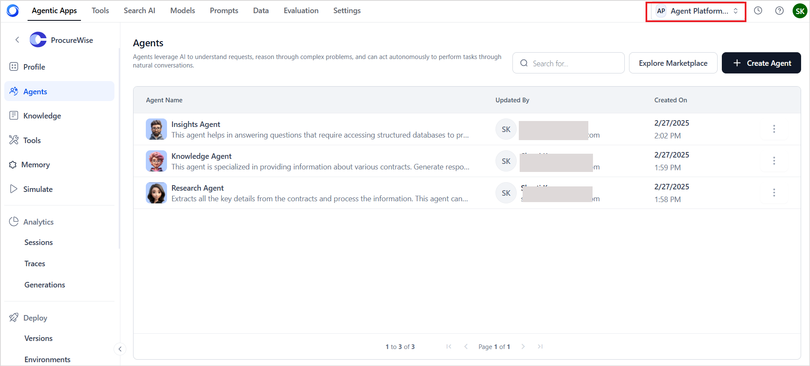
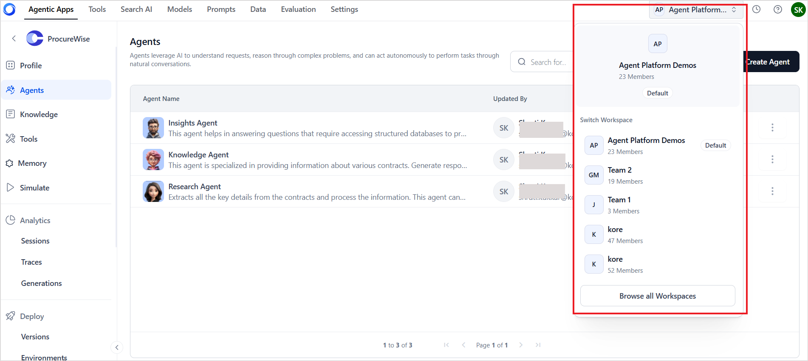

# Workspace 

{/* Merge into ai-for-process/admin-settings.mdx */}

A *workspace* represents a logical grouping of workflows, and configurations, typically organized by teams or projects. Workspaces bring organization and structure to how workflows are grouped and accessed. It determines **what workflows and data are accessible**, **what actions are allowed**, and **which configurations apply** based on the currently selected workspace.

By default, when a new account is created, a default workspace is created and assigned. When a new workflow is created, it's automatically associated with the workspace. 

## Points to Note

* Every workflow is tied to a specific workspace. It can't be moved or accessed across workspaces. Use import/export to move workflows across workspaces).
* All configurations, including AI Model configurations, settings, auth profiles, and permissions, are maintained separately for each workspace.

The current workspace is displayed at the top right corner in the platform UI. 

## Switching between Workspaces

Clicking the workspace name opens a drop-down list of all accessible workspaces.

Click on **Browse all Workspaces** to view the complete list of workspaces. On switching between workspaces, 

* The workflows are refreshed to show the ones from the new workspace. 
* Permissions are also based on the user's role in the new workspace. 
* Settings, models, prompts, inbox and data reflect workspace-specific configurations. 

**Features of Workspace Switcher**

* Default workspace: Users can mark any workspace as their default. This workspace will automatically load when logging into a new session.
* Search and Browse Workspaces: Easily locate workspaces using the search bar or browse through the full list using pagination controls. 
* Request access to inaccessible workspaces: My Workspaces tab lists the workspaces that the user has access to, and inaccessible ones are listed under Other Workspaces. Users can directly request access to a workspace from this list.
* User Role: The workspace switcher indicates the total number of members in the workspace and the user’s role in the workspace. In the workspace list view, each workspace entry indicates the owner, helping users understand workspace ownership clearly.
