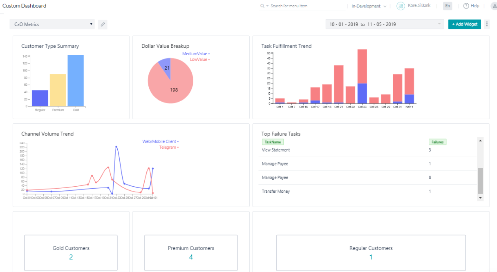
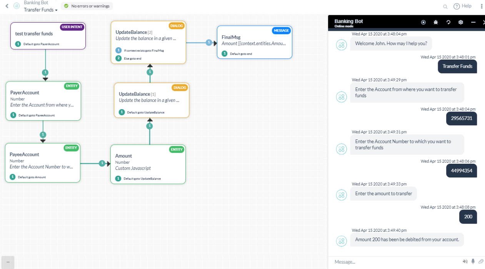
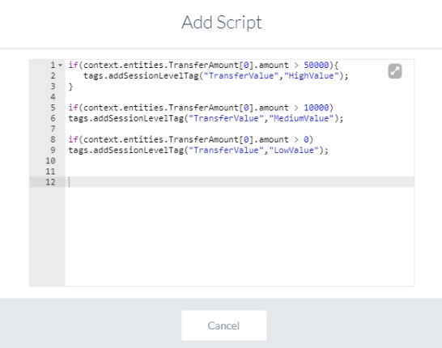
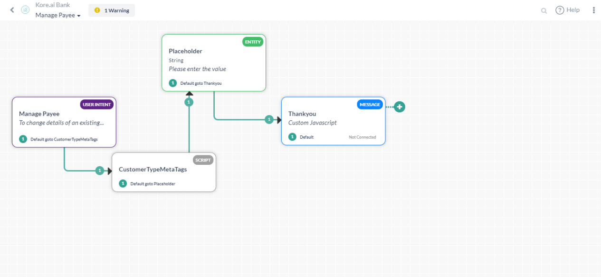
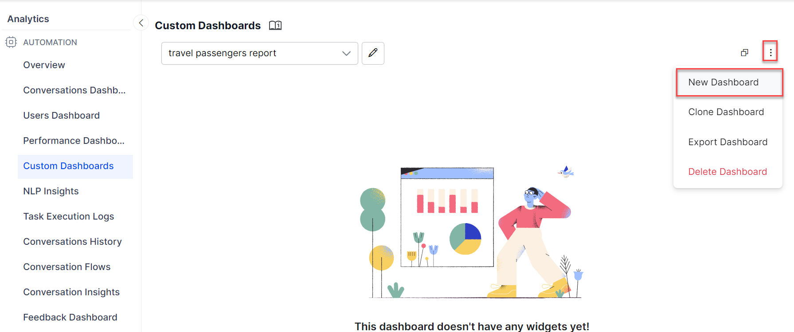
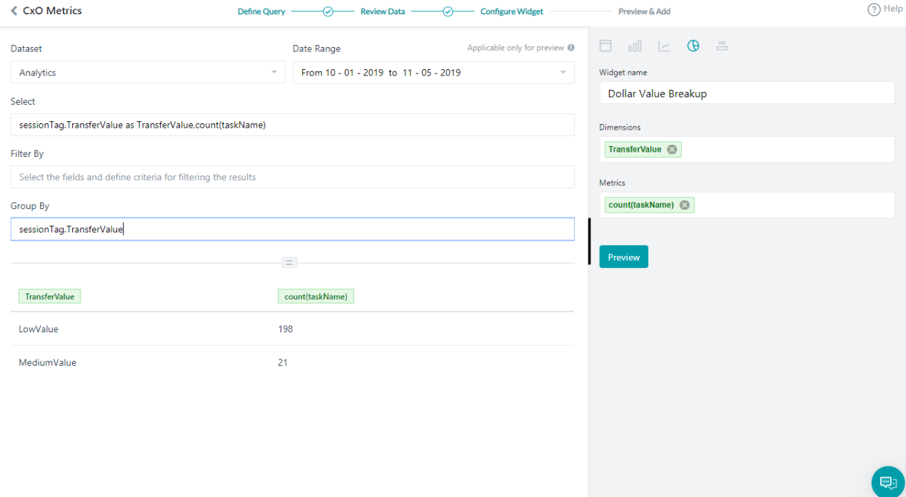
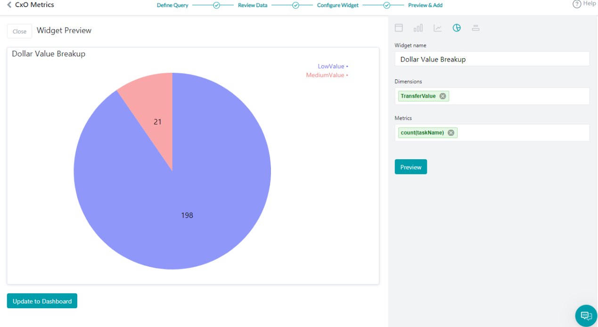
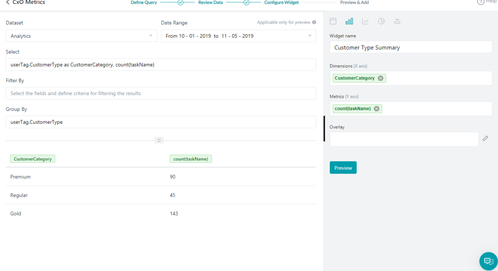
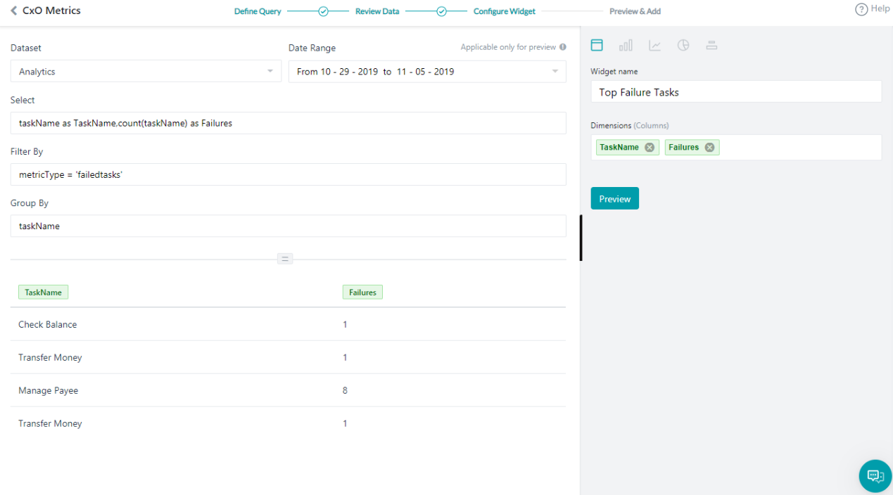
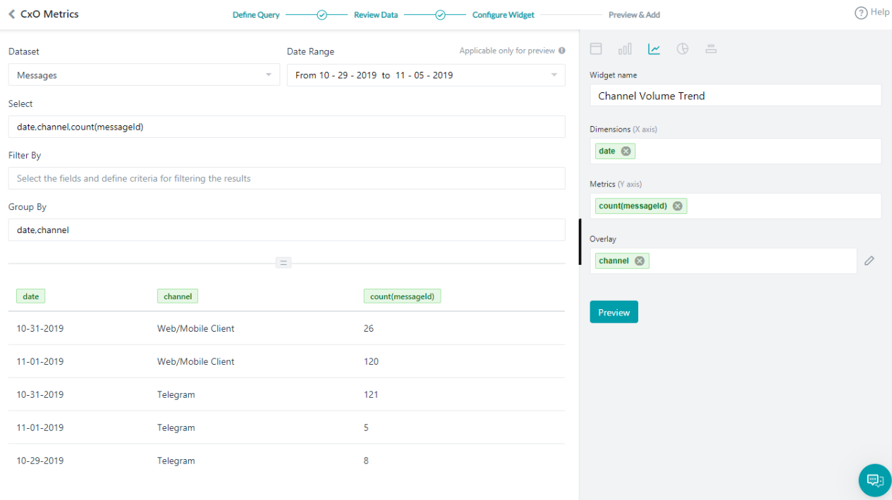

This page walks through creating a custom dashboard using a Banking AI Agent as an example to analyze performance metrics and identify trends.

## Problem Statement

As a Banking AI Agent client, you want to track the following metrics:

- Dollar Value Breakup
- Customer Type Summary
- Task Fulfillment Trend
- Top Failure Tasks
- Channel Volume Trend
- Filter the Messages using the Having clause

Once the dashboard is configured for all scenarios, it looks like the following:



---

## Pre-requisites

- AI Agent building knowledge.
- Custom Meta Tags usage. See Custom Meta Tags for more information.
- A Banking AI Agent with the following dialog tasks:

**Transfer Funds**: A dialog task that walks the user through the transfer steps.



This dialog includes a Script node to add the Custom Meta Tag `TransferValue` based on the amount transferred:

```javascript
if(context.entities.TransferAmount[0].amount > 50000){
   tags.addSessionLevelTag("TransferValue", "HighValue");
}

if(context.entities.TransferAmount[0].amount > 10000)
tags.addSessionLevelTag("TransferValue","MediumValue");

if(context.entities.TransferAmount[0].amount > 0)
tags.addSessionLevelTag("TransferValue","LowValue");
```



**Manage Payee**: A dialog task for the user to manage their payee list.



This dialog includes a Script that assigns a value to the `CustomerType` meta tag:

```javascript
if(context.custType == 3){
   tags.addUserLevelTag("CustomerType","Premium");
}
if(context.custType == 2){
   tags.addUserLevelTag("CustomerType","Gold");
};
if(context.custType == 1){
   tags.addUserLevelTag("CustomerType","Regular");
};
```

---

## Implementation

1. From the left navigation panel, under **Dashboard**, click **Custom Dashboard**.

2. Click **Create a New Dashboard**.

    

3. Use the **Add Widget** button to add widgets for each scenario. You can add up to 4 widgets per row and organize them by moving within or across rows. Widgets can also be manually resized.

The following sections explain the configuration for each widget.

---

### Dollar Value Breakup

1. Click **Add Widget**.

2. Query setup:
    - **Dataset**: Analytics
    - **Select**: `sessionTag.TransferValue as TransferValue, count(taskName)`
    - **Group By**: `sessionTag.TransferValue`
    - Click **Run** to see the results.

3. Widget setup:
    - Chart type: **Pie chart**
    - **Dimension**: `TransferValue`
    - **Metrics**: `count(taskName)`

    

4. Click **Preview**, then click **Update to Dashboard**.

    

---

### Customer Type Summary

This query provides usage statistics based on customer type.

1. Click **Add Widget**.

2. Query setup:
    - **Dataset**: Analytics
    - **Select**: `userTag.CustomerType as CustomerCategory, count(taskName)`
    - **Group By**: `userTag.CustomerType`
    - Click **Run** to see the results.

3. Widget setup:
    - Chart type: **Bar chart**
    - **Dimension**: `CustomerCategory`
    - **Metrics**: `count(taskName)`

    

4. Click **Preview**, then click **Update to Dashboard**.

---

### Task Fulfillment Trend

This query provides day-wise task success vs. failure trends.

1. Click **Add Widget**.

2. Query setup:
    - **Dataset**: Analytics
    - **Select**: `date, metricType, count(metricType) as TotalTasks`
    - **Filter By**: `metricType = 'successtasks' or metricType = 'failedtasks'`
    - **Group By**: `date, metricType`
    - Click **Run** to see the results.

3. Widget setup:
    - Chart type: **Bar chart**
    - **Dimension**: `date`
    - **Metrics**: `TotalTasks`
    - **Overlay**: `metricType`

    

4. Click **Preview**, then click **Update to Dashboard**.

---

### Top Failure Tasks

This query shows the top tasks that are failing.

1. Click **Add Widget**.

2. Query setup:
    - **Dataset**: Analytics
    - **Select**: `taskName as TaskName, count(taskName) as Failures`
    - **Filter By**: `metricType = 'failedtasks'`
    - **Group By**: `taskName`
    - Click **Run** to see the results.

3. Widget setup:
    - Chart type: **Table chart**
    - **Dimension**: `TaskName` and `Failures`

    

4. Click **Preview**, then click **Update to Dashboard**.

---

### Channel Volume Trend

This query provides channel-wise usage details.

1. Click **Add Widget**.

2. Query setup:
    - **Dataset**: Messages
    - **Select**: `date, channel, count(messageId)`
    - **Group By**: `date, channel`
    - Click **Run** to see the results.

3. Widget setup:
    - Chart type: **Line chart**
    - **Dimension**: `date`
    - **Metrics**: `count(messageId)`
    - **Overlay**: `channel`

    

4. Click **Preview**, then click **Update to Dashboard**.

Your custom dashboard is ready. Set the **Date Range** to view the required metrics for each scenario.

---

### Filter the Messages using the Having Clause

This query uses a **Having** clause to display the number of messages per userId where the user has interacted with the AI Agent more than 12 times.

1. Click **Add Widget**.

2. Query setup:
    - **Dataset**: Messages
    - **Select**: `count(messageId), userId`
    - **Group By**: `userId`
    - **Having**: `count(messageId) > 12`
    - Click **Run** to see the results.

3. Widget setup:
    - Chart type: **Table chart**
    - **Dimension**: `count(messageId)`, `userId`

4. The following shows results when retrieving the count of all messages grouped by userId (without the Having clause):

    

5. The following shows results when using the Having clause (only users with more than 12 messages):

    

6. Click **Preview**, then click **Add to Dashboard**.

    

7. The Having clause widget is added to the dashboard:

    
