Custom Dashboard lets you design dashboards tailored to business needs using a combination of built-in metrics and custom KPIs based on user demographic or context information.

Using Custom Dashboard, you can select the metrics most relevant to your needs and display them in an easy-to-understand format. This is particularly useful when you have large volumes of conversation data to track and monitor, allowing you to focus on the most important information.

Custom Dashboards are available alongside the other out-of-the-box dashboards in the AI Agents Builder.

To build Custom Dashboards:

1. Identify the data points needed to derive your metrics based on business requirements.
2. Define suitable Custom Meta Tags to emit these data points in the AI Agent definition.
3. Design widgets, preview, and update the dashboard with these widgets.

To view the Custom Dashboard:

1. Click **Analytics** on the left navigation pane. The Analytics panel opens with the list of reports.

    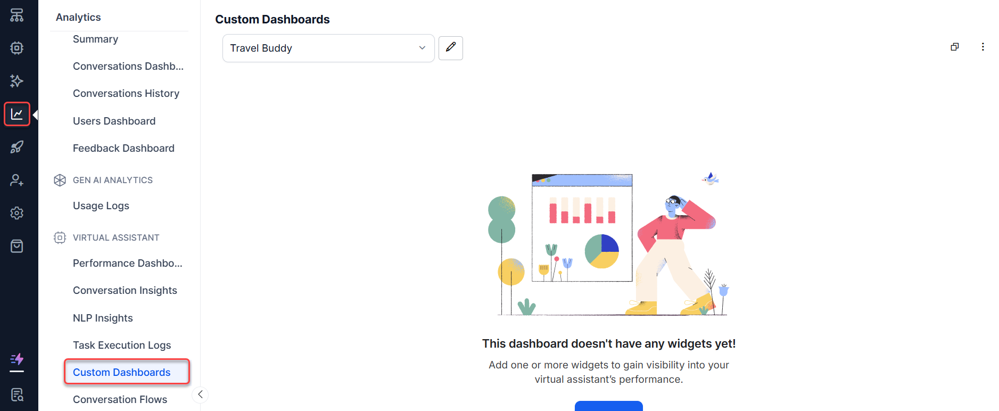

2. Click **Custom Dashboards** under the **Automation** section of the Analytics panel.

3. Select appropriate filters and click **Apply**.

Key concepts:

- Each dashboard can have one or more **widgets**.
- Each widget must be associated with a dataset.
- You need to define a query to extract the required data for each widget.

---

## Add Custom Dashboards

You can add one or more dashboards by providing basic details.

- To add a new dashboard, click the more icon (three dots) in the top right and select **New Dashboard**. Enter the name of the dashboard. You can edit the name at any time.
- By default, each custom dashboard includes a Date Filter to filter records for all widgets in the dashboard. Choose between 24 hours, 7 days, and a custom date range. You can also configure and add custom filters. See Create Custom Filters for Custom Dashboard for more information.
- Choose a **Color Theme** for your dashboard.
- Use **Add Widget** to add a widget to the dashboard.
- Reorder widgets using the **move cursor** (visible on hover) to drag and drop widgets anywhere on the dashboard.
- Using the Kebab menu (vertical ellipses) icon, you can:
    - **New Dashboard**: Create a new dashboard.
    - **Clone Dashboard**: Copy the dashboard configuration to a new dashboard.
    - **Export Dashboard**: Export the dashboard configuration as a JSON file.
    - **Delete Dashboard**: Delete the custom dashboard.

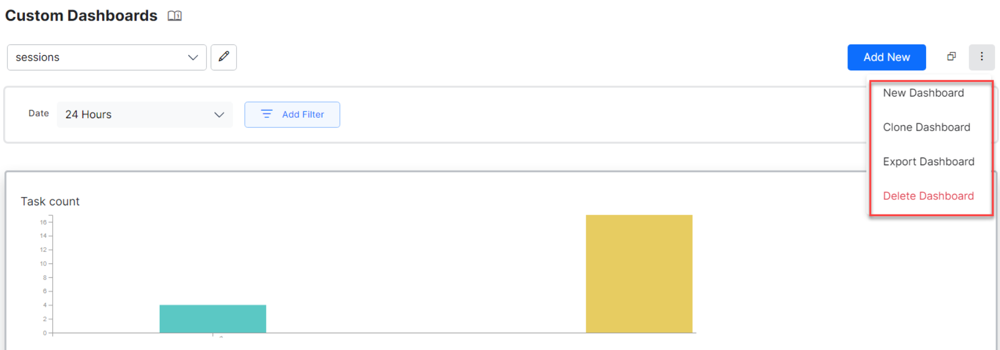

---

## Add Widgets

Use the **Add Widget** button to add one or more widgets to a dashboard. Widget configuration involves two steps:

- Data Definition
- Data Representation

### Data Definition

Every widget requires a query to retrieve and represent the required information. The following configurations are used to generate the query definition:

**Dataset** defines the data source:

- **Analytics**: Provides data about Success Intents, Failed Intents, Success Tasks, and Failed Tasks. Key fields include MetricType, Channel, UserId, and others.
- **Message**: Provides AI Agent and user messages. Key fields include UserId and Channel.
- **Sessions**: Lists conversation sessions. Key fields include UserId and Channel.

<Note>You can view the top 20 records for all dataset fields.</Note>

The platform allows you to choose between **Query Mode** and **Advanced Mode** while writing a query. See Widget Configuration Modes for more information.

**Date Range** defaults to the past 7 days and can be customized to a range of up to 90 days. This date range is used for preview purposes only.

**Select** specifies the fields to be displayed by the widget:

- Fields differ for each selected dataset. See the Dataset and Fields table for details.
- Apply aggregation functions such as `min`, `max`, `sum`, `count`, or `avg`. For example, `count(metricType) as total`.

**Aggregate Functions**: In the query **Select** drop-down, click the drop-down for each field to access relevant aggregate functions.

<Note>Aggregate functions are visible only in Advanced mode.</Note>

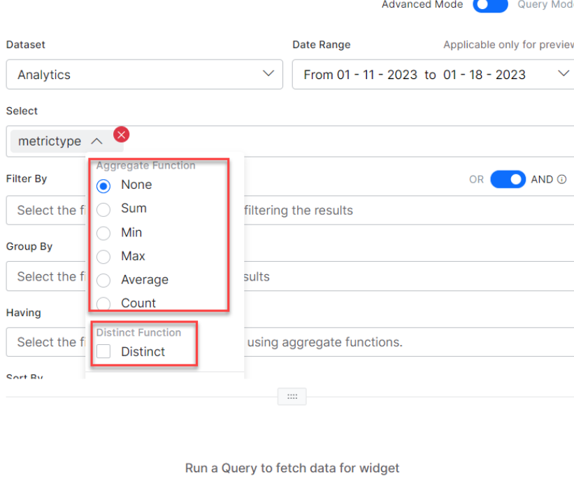

| Aggregate Function | Description |
|---|---|
| Sum | The arithmetic total of all values in the column. |
| Min | The smallest-value element in the column. |
| Max | The largest-value element in the column. |
| Average | The mean average of the elements in the column. |
| Count | The total number of elements in the column. |
| None | Use to remove an aggregate function added to a query. |

The Distinct function obtains the number of distinct values across the column. It is allowed with **Sum**, **Count**, and **Average**.

If you have defined Custom or Meta Tags for your AI Agent, use them with the notation `userTag.tagname = value`. For a Message-level custom tag, select the Message dataset and enter `messageTag.TagName`.

**Filter By** extracts only records that fulfill a specified condition. Supported operators: `=`, `>=`, `<=`, `>`, `<`, `in`, `not in`.

For example: `taskName = 'What account privileges does an authorized user have?' and metricType = successtasks`

When conjugating multiple conditions, they are evaluated left to right. This ordering cannot be changed using parentheses.

<Note>In the query setup for Filter By, individual AND and OR operators, and multiple ANDs or ORs, can be applied. A combination of AND/ORs is not supported.</Note>

**Group By** specifies fields for applying aggregation functions. For example, display the count of all messages grouped by userId.

**Having** filters results with aggregate functions (the `Where` keyword cannot be used here). For example, `count(messageid) > 10`. Works only with the **Group By** function.

<Note>In the Having clause, fields with aggregate values in the Select clause are automatically included.</Note>

**Sort By** orders results in ascending or descending order by field names (not aliases). For example, `metricType desc`.

<Note>In the Select clause, you can provide aliases to make column names more readable. For other fields, you cannot define aliases and must use actual column names.</Note>

Click **Run** to see results in tabular format.

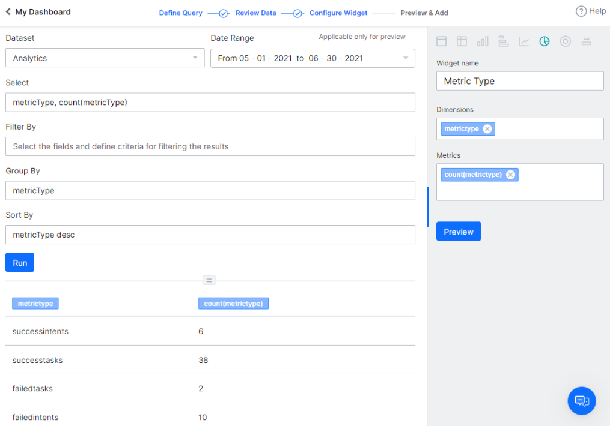

<Note>A tag added for Select, Filter By, Group By, Having, and so on can be deleted using the Delete icon, which appears on hover.</Note>

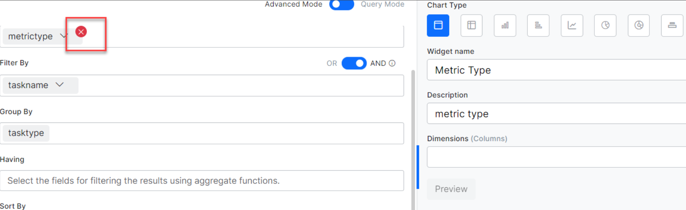

#### End-user vs. Developer Interactions

By default, end-user interactions are displayed for all datasets in Custom Dashboards. To include or display developer interactions, use the `isdeveloper` flag in the Filter By clause:

- To display only developer interactions: `isdeveloper = include`
- To display both developer and end-user interactions:
    - `isdeveloper = include or isdeveloper = exclude`
    - `isdeveloper = exclude or sessionid = "any developer session Id"`

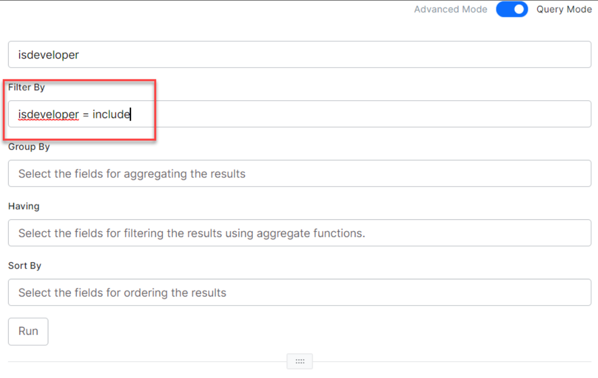

---

### Data Representation

The following options are available for rendering data:

- **Table**: Renders data in a simple row and column format. Specify columns and their order from the **Dimensions** option.
- **Pivot chart**: Summarizes data. Specify **Dimensions** (columns to display), **Metrics** (value against the column), and **Overlay** (column for data series representation).
- **Bar Chart**: Depicts data across X- and Y-axis. Split results into data series based on the **Overlay** field.
- **Horizontal Bar Chart**: A flipped version of the Bar Chart. Split results into data series based on the **Overlay** field.
- **Line Chart**: Depicts data across X- and Y-axis. Split results into data series based on the **Overlay** field.
- **Pie Chart**: Used for aggregation data to depict part-of-whole scenarios. Use **Dimensions** for fields and **Metrics** for the aggregation function.
- **Donut Chart**: Similar to a Pie chart with better visualization.
- **Label Chart**: Highlights a value or metric in its own space.

Click **Preview** to visualize the widget, then click **Add to Dashboard** to save.

<Note>You must successfully run the query before being able to preview it.</Note>

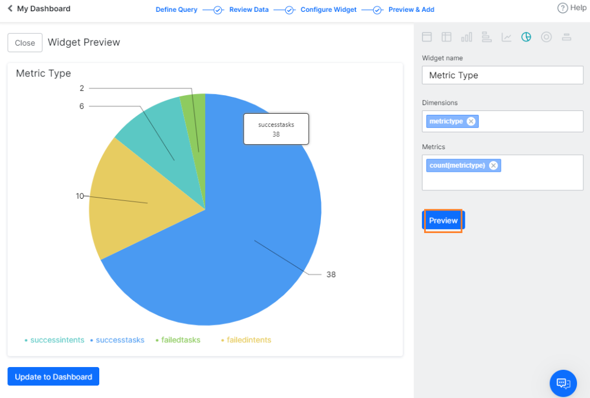

---

### Widget Actions

Use the **more icon** (vertical ellipses) on each widget to access the following options:

- **Edit Widget**: Opens the widget definition page to make changes to an existing widget.
- **Clone Widget**: Duplicates the widget definition for modification.
- **Export**: Exports the widget data in JSON format (final results displayed in the widget UI) or CSV format (results of the associated query before conversion to widget UI format).
- **Delete Widget**: Deletes the widget from the dashboard.

<Note>The final widget definitions of a custom dashboard can be exported in JSON format. Individual widget data can be exported in CSV format.</Note>

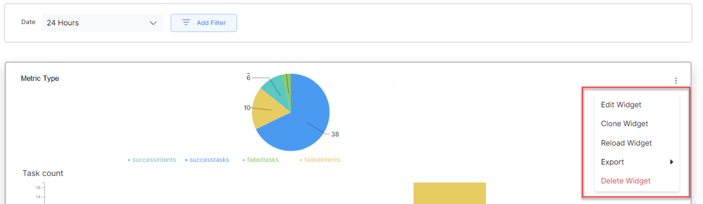

---

## Widget Configuration Modes

The platform provides two modes for extracting data from a selected dataset. These modes were introduced in the 10.0 release.

### Query Mode

Query Mode is for users and developers who can write queries to create a widget. This is recommended for advanced users who are familiar with the dataset fields.

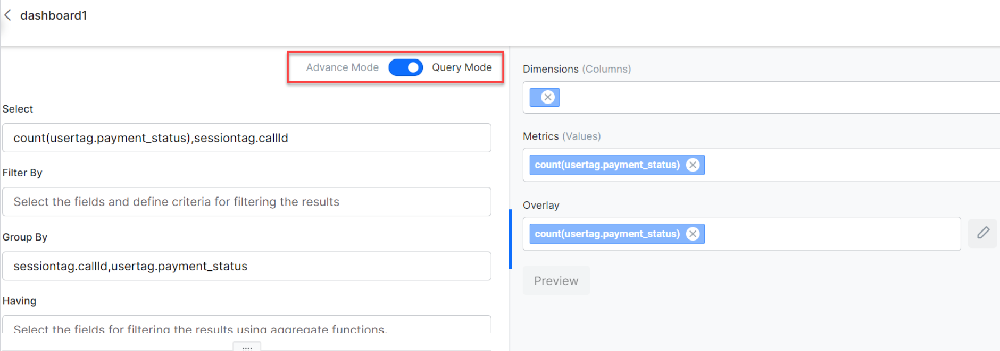

### Advanced Mode

Advanced Mode provides a user-friendly way to create custom dashboards without requiring technical knowledge of query syntax or dataset structure. The platform provides type-ahead suggestions for fields, aggregate functions, and aliases while writing a query.

<Note>The configured data remains intact when you toggle between Advanced and Query modes. You can modify widget configurations using either mode.</Note>

### Type-Ahead Suggestions

In Advanced Mode, type-ahead suggestions are available for **Select**, **Filter By**, **Group By**, **Having**, and **Sort By** clauses. The platform provides suggestions of fields present in the selected dataset, along with message tags, session tags, and user tags added to the AI Agent. It also allows you to add aggregate functions, filter criteria, conditional operators, alias names, and more.

<Note>You can add custom meta tags to the query that are not yet included in the AI Agent while configuring the widget. However, to get the correct data, you need to add the custom meta tag to the AI Agent configuration.</Note>

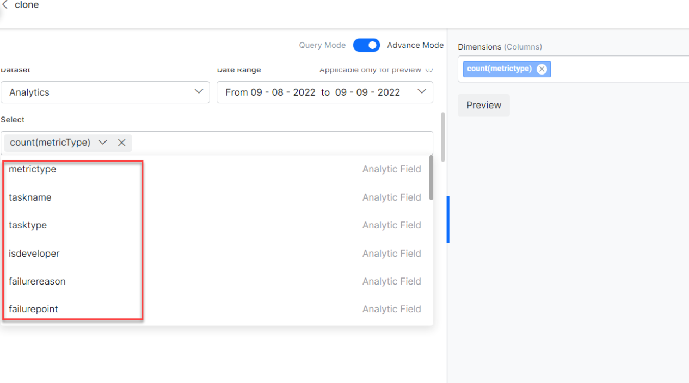

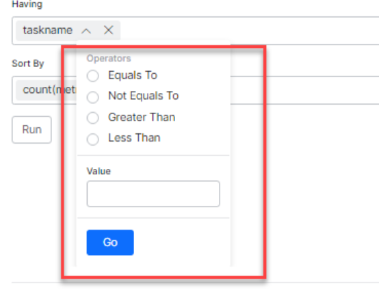

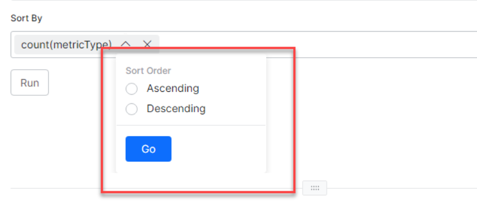

---

## Custom Dashboard Limitations

- A maximum of **100 custom dashboards** can be defined.
- Each dashboard can include a maximum of **100 widgets**.
- A maximum of **3 metrics** can be added to a chart.
- Each chart can render **1 dimension**.
- The custom date range can be set for up to **90 days**.

---

## Dataset and Fields

The dataset fields and values are listed in the following tables.

<Note>Field names are case-sensitive and must be used exactly as described here.</Note>

### Analytics

| Field Name | Data Type | Possible Values |
|---|---|---|
| metricType | Text | `successtasks`, `successintents`, `failedtasks`, `failedintents`, `unhandledutterances` |
| eventtype | string | `analyze`, `sentiment`, `tone`, `entityretry`, `confirmationretry`, `onconnect`, `endofconversation`, `debuglog`, `welcome`, `telegramwelcomeevent`, `facebookwelcomeevent`, `telephonywelcomeeven`, `standardresponseinterruption`, `messagenodeinterruption`, `optionalentity`, `scriptfailure`, `servicefailure`, `agenttransfer` |
| nodename | string | Name of the node being created. |
| nodetype | string | `confirmation`, `entity` |
| linkedbotname | string | Name of the linked AI Agent associated with the Universal AI Agent. |
| botname | string | AI Agent name or `entity`. |
| taskName | Text | Name of the task being executed. If `taskType` is `Answer from Document`, `taskName` includes the user query. |
| taskType | Text | `Dialog`, `Action` (includes information tasks), `Alert`, `FAQ`, `Small Talk`, `Answer from Document` |
| isDeveloper | Text | `exclude`, `include` |
| failurereason | Text | — |
| failurepoint | Text | — |
| language | Text | Over 100 languages are supported. See Supported AI Agent Languages. |
| channel | Text | A total of 37 channels are supported. See Channel Enablement — Available Channels. |
| sessionId *(not allowed as dimension)* | Text | Example: `5d8361063b790ae15727xxxx` |
| trainingStatus | Text | `true`, `false` |
| pinStatus | Text | `true`, `false` |
| matchType | Text | `true`, `false` |
| userId | Text | Email ID or enterprise-assigned user ID. |
| channeluserid *(not allowed as dimension)* | Text | — |
| timestampvalue | Number | — |
| date | Date | — |

### Messages

| Field Name | Data Type | Possible Values |
|---|---|---|
| messagetype | string | `incoming` (user messages), `outgoing` (AI Agent responses) |
| isDeveloper | number | `exclude`, `include` |
| messageId *(not allowed as dimension)* | string | Example: `ms-35bb7391-edc9-5a7a-859c-5682f787xxxx` |
| channel | string | A total of 37 channels are supported. See Channel Enablement — Available Channels. |
| sessionId *(not allowed as dimension)* | string | Example: `5daecb96e79dbaabb87fxxxx` |
| language | Text | Over 100 languages are supported. See Supported AI Agent Languages. |
| userId | Text | Email ID or enterprise-assigned user ID. |
| timestampvalue | Number | Timestamp of the message. |
| date | Date | Creation date of the message. |
| username | string | User name. |

### Sessions

| Field Name | Data Type | Possible Values |
|---|---|---|
| isdeveloper | string | `include`, `exclude` |
| sessionstatus | string | `active`, `closed` |
| streamid *(not allowed as dimension)* | string | AI Agent ID. |
| sessionid | string | Example: `5daecb96e79dbaabb87xxxxx` |
| userId | string | Email ID or enterprise-assigned user ID. |
| username | string | User name. |
| sessiontype | string | `Interactive`, `Non-interactive` |
| channel | string | A total of 37 channels are supported. See Channel Enablement — Available Channels. |
| language | Text | Over 100 languages are supported. See Supported AI Agent Languages. |
| timestampvalue | Number | Timestamp value. |
| date | Date | Format: `mm-dd-yyyy` |
| containment_type | string | `dropOff`, `selfService`, `agent` |
