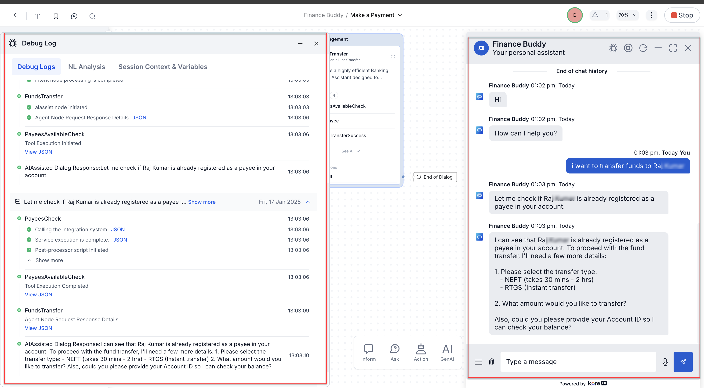

The **Agent Node** lets you build LLM-powered AI agents with tool calling, entity collection, and external system integration—directly inside dialog tasks. It handles complex, multi-turn conversations and produces dynamic, data-driven responses.

**Key capabilities:**

- **Entity collection** — LLM gathers entities conversationally, reducing the need for multiple entity nodes.
- **Tool calling** — LLM identifies when to call external functions, invokes them with correct parameters, and incorporates results into its response.
- **Streaming support** — Tool calling with streaming lets the model generate responses progressively (V2 prompts with OpenAI/Azure OpenAI format).
- **Rich UI** — Pass structured JSON from the LLM to channels for cards, lists, tables, and suggestion chips (requires "Parse Rich Templates").
- **Pre/Post-processor scripts** — Run custom JavaScript before and after each LLM interaction.
- **Multilingual** — Supports English and non-English languages.
- **IVR/Voice** — Configurable for voice channels (streaming prompts supported).

---

## Quick Start Tutorials

| Tutorial | Description |
|---|---|
| [Setting Up Agent Node](https://player.vimeo.com/video/1073131424) | Create and configure your first Agent Node |
| [Agent Node Components](https://player.vimeo.com/video/1065020838) | Overview of core elements |
| [Prompt Creation](https://player.vimeo.com/video/1065021185) | Craft effective prompts |
| [Model Configuration](https://player.vimeo.com/video/1065021538) | Integrate custom and system models |
| [Tools in Agent Node](https://player.vimeo.com/video/1065021843) | Create and configure code tools |
| [Custom Prompts](https://player.vimeo.com/video/1065022431) | Build V1 and V2 custom prompts |

---

## Prerequisites

The Agent Node is disabled by default. Enable it at **Generative AI Tools > GenAI Features**. See [Enable GenAI Feature](../../generative-ai-tools/genai-features.md#enable-feature).

---

## Setup

### Add Agent Node to a Dialog Task

1. Go to **Automation > Dialogs** and open the target task.
2. Add the **Agent Node** from the node list like any other node.


---

### Component Properties

Changes here apply to this node across **all** dialog tasks.

#### Model Configuration

| Setting | Description |
|---|---|
| **Model** | LLM to use. Supports OpenAI, Azure OpenAI, Amazon Bedrock, Custom LLM. See [Model and Supported Features](../../generative-ai-tools/genai-features.md#automation-ai-genai-features). |
| **Prompt/Instructions** | Feature-specific instructions or context for the model. |
| **Conversation History Length** | Number of recent messages sent as context. Default: 10. (Custom prompts only.) |
| **Temperature** | Controls output randomness. Higher = more creative; lower = more focused. |
| **Max Tokens** | Total tokens per API call. Affects cost and response time. |
| **Fallback Behavior** | Action on LLM failure or Guardrail violation: trigger Task Execution Failure Event, or skip node and jump to a specified node (default: End of Dialog). |

#### Pre-Processor Script

Executes once when the Agent Node is reached, before LLM orchestration starts. Use it to format input or extract data. Same properties as the Script Node—click **Define Script** to configure.

#### Entities

<Note>Entity collection via this section is applicable to **V1 Prompts only**.</Note>

Click **+ Add**, enter an **Entity Name**, and select the **Entity Type**. Most types are supported. Exceptions: custom, composite, list of items (enumerated/lookup), and attachment. See [Entity Types](../../automation/use-cases/dialogs/entity-types.md).

#### System Context

A brief description of the use case to guide the model.

#### Tools

Tools let the LLM interact with external services via Script, Service, or Search AI nodes. Maximum **5 tools per node**.

Click **+ Add** to open the **New Tool** window. See [Tool Configuration](#tool-configuration) for full details.

#### Rules

Business rules that govern entity collection. Click **+ Add** and enter a concise rule, for example:

- *Policy number must be exactly 10 digits.*
- *Claim type must be one of: auto, home, health, life.*

Limits: 250 characters per rule, maximum 5 rules.

#### Exit Scenarios

Conditions that stop LLM interaction and return control to the dialog flow. Click **Add Scenario** and enter a short, specific phrase, for example:

- *User wants to book more than 5 tickets—return "max limit reached".*
- *User requests a human agent.*

Limits: 250 characters per scenario, maximum 5 scenarios.

#### Post-Processor Script

Executes after every user input processed by the Agent Node, before the node exits. Use it to transform the LLM response stored in context variables. Same properties as the Script Node—click **Define Script** to configure.

<Note>If the Agent Node requires multiple user inputs, the post-processor runs for each one.</Note>

---

### Instance Properties

These settings apply only to this node instance in this task.

#### User Input

| Setting | Description |
|---|---|
| **Number of Iterations Allowed** | Maximum prompts for valid input. Range: 1–25. Default: 10. |
| **Behavior on Exceeding Retries** | End the Dialog, or transition to a specified node. |

#### Auto Correct

Toggle to enable/disable auto-correction for spelling and common errors.

#### Advanced Controls

**Intent Detection** (String and Description entities only):

- **Accept input as entity value and discard the detected intent** — captures the user entry as a string/description, ignores intent.
- **Prefer user input as intent and proceed with Hold & Resume settings** (default) — considers input for intent detection.

**Interruptions Behavior:**

- **Use task-level setting** — inherits the dialog task's Interruptions Behavior.
- **Customize for this node** — override with node-specific behavior. See [Interruption Handling](../../automation/intelligence/conversation-management/manage-interruptions.md).

**Analytics - Containment Type:**

- **Use task-level default** — inherits dialog-level Containment Type.
- **Customize for this node** — set Self Service or Drop-off for abandoned conversations.

**Custom Tags:** Attach meta tags to messages, users, and sessions for analytics. See [Custom Meta Tags](../../analytics/automation/custom-dashboard/custom-meta-tags.md).

---

### IVR Properties

Configure voice channel behavior: prompts, grammar, and call parameters. Agent Nodes with streaming LLM prompts support IVR Properties for voice only. See [Voice Call Settings Field Reference](../use-cases/dialogs/node-types/voice-call-properties.md).

---

### Connection Properties

Define transition conditions from this node (instance-specific). See [Adding IF-Else Conditions to Node Connections](../../automation/use-cases/dialogs/node-connections/nodes-conditions.md).

Default connection variants:

- **Not Connected** — no next node defined.
- **End of Dialog** — explicitly ends the dialog.
- **Return to Flow** — ends the Dialog Task and returns to Flow Builder at the next node.
  - **Deflect to Chat** — transitions from voice to chat. Types: Automation or Agent Transfer. Requires Kore Voice Gateway (Phone number or SIP Transfer).

---

## Prompt Setup

### V1 vs V2: Quick Comparison

| Feature | V1 (Legacy) | V2 (Tool-Calling) |
|---|---|---|
| Mode | JSON or JavaScript | JavaScript only |
| Tool calling | JavaScript mode only | Native (built-in) |
| Streaming + Tool calling | Not simultaneously | Supported (OpenAI/Azure OpenAI format) |
| Entity collection | Dedicated Entities section | Via tool parameters |
| Output keys required | Text Response, AI Agent Response, Exit Scenarios, Collected Entities, Tool Call Request | Text Response Path + Tool Call Request only |
| Best for | Legacy flows, JSON-only, full response key control | New development, structured responses, tool-heavy flows |

**Choose V1 when:**
- You need JSON mode (text generation only).
- You need full control over response parsing via response keys.
- You are maintaining an existing flow with explicit entity handling.

**Choose V2 when:**
- You need tool calling and streaming together.
- You want simplified configuration (no manual exit scenario/entity keys).
- Entity collection should be fully integrated into tool invocations.

---

### Prompt Design Principles

Apply prompt engineering to define:

**Context:**
- The agent's role (AI Agent, voice assistant) and communication channel.
- Expected response length, verbosity, and formality.
- The primary function (customer support, appointment scheduling, troubleshooting).
- The company or service represented.
- Whether the agent should proactively clarify ambiguous inputs.

**Personality** (using the [Conversations with Things](https://www.oreilly.com/library/view/conversations-with-things/9781492048749/) framework):
- Interaction goals, level of personification, power dynamics.
- Core character traits (professional, friendly, humorous).
- Tone and key behavioral traits.

---

### V1 Prompt — JSON Mode

Supports text generation only.

- Define dynamic input keys (platform populates at runtime).
- Provide test values to validate the prompt structure.
- Configure output keys:
  - **Text Response Path** — location of the AI response in the JSON payload.
  - **AI Agent Response** — the key to display to the user.
  - **Exit Scenarios** — when to end the interaction.
  - **Collected Entities** — key-value pairs of captured entities.
- Add a post-processor script if additional transformation is needed. The returned output must include the exact keys defined in the configuration.

---

### V1 Prompt — JavaScript Mode

Use when you need:
- Tool calling.
- Access to full conversation history as an array.
- Advanced prompt logic.

The prompt structure and output configuration follow the same pattern as JSON mode. Ensure your prompt and post-processor handle conversation history and tool interactions correctly.

**Sample V1 JavaScript Prompt:**

```javascript
let payloadFields = {
  model: "claude-3-5-sonnet-20241022",
  max_tokens: 8192,
  system: `${System_Context}.
    ${Required_Entities && Required_Entities.length ?
      `**Entities Required**: Collect from this list: ${Required_Entities}
       **Rules**: Do not prompt if entity is already captured.` : ''}
    **Business Rules**: ${Business_Rules}
    **Output Format**: Always respond in STRINGIFIED JSON with keys:
      - "bot": prompt or final response string
      - "entities": array of collected entity objects
      - "conv_status": "ongoing" or "ended"
      - Exit when: ${Exit_Scenarios}`,
  messages: []
};

if (Tools_Definition && Tools_Definition.length) {
  payloadFields.tools = Tools_Definition.map(tool_info => ({
    name: tool_info.name,
    description: tool_info.description,
    input_schema: tool_info.parameters
  }));
}

let contextChatHistory = [];
if (Conversation_History && Conversation_History.length) {
  contextChatHistory = Conversation_History.map(entry => ({
    role: entry.role === "tool" ? "user" : entry.role,
    content: (typeof entry.content === "string") ? entry.content :
      entry.content.map(content => {
        if (content.type === "tool-call") {
          return { type: "tool_use", id: content.toolCallId, name: content.toolName, input: content.args };
        } else {
          return { type: "tool_result", tool_use_id: content.toolCallId, content: content.result };
        }
      })
  }));
}

payloadFields.messages.push(...contextChatHistory);

let lastMessage = contextChatHistory[contextChatHistory.length - 1];
if (!lastMessage || lastMessage.role !== "tool") {
  payloadFields.messages.push({ role: "user", content: `${User_Input}` });
}

context.payloadFields = payloadFields;
```

---

### V2 Prompt — JavaScript Mode

V2 is built entirely around tool calling. The platform handles `end_orchestration` (exits the node) and custom tools automatically.

**Sample V2 JavaScript Prompt:**

```javascript
let payloadFields = {
  model: "gpt-4o",
  temperature: 0.73,
  max_tokens: 1068,
  top_p: 1,
  frequency_penalty: 0,
  presence_penalty: 0,
  messages: [{
    role: "system",
    content: `You are a professional AI Agent.
      ${System_Context}
      ${Business_Rules}
      COMMUNICATION: Use clear, professional language in ${language}.
      TOOL USAGE: Follow each tool's description and requirements.
      ERROR HANDLING:
        - Invalid inputs: provide clear error messages with examples.
        - Tool failures: notify user, offer retry, preserve collected data.
        - Business rule violations: explain clearly, guide toward compliance.
        - Exit requests: confirm intent, then call end_orchestration().`
  }]
};

if (Tools_Definition && Tools_Definition.length) {
  payloadFields.tools = Tools_Definition.map(tool_info => ({
    type: "function",
    function: tool_info
  }));
}

let contextChatHistory = [];
Conversation_History.forEach(entry => {
  if (entry.role === "tool") {
    entry.content.forEach(content => {
      contextChatHistory.push({ role: "tool", content: content.result, tool_call_id: content.toolCallId });
    });
  } else if (entry.role === "user") {
    contextChatHistory.push({ role: entry.role, content: entry.content });
  } else {
    if (typeof entry.content === "string") {
      contextChatHistory.push({ role: entry.role === "bot" ? "assistant" : entry.role, content: entry.content });
    } else {
      contextChatHistory.push({
        role: entry.role,
        tool_calls: entry.content.map(content => ({
          id: content.toolCallId,
          type: "function",
          function: { arguments: JSON.stringify(content.args), name: content.toolName }
        }))
      });
    }
  }
});

payloadFields.messages.push(...contextChatHistory);
context.payloadFields = payloadFields;
```

#### V2 Tool Types

| Type | Description |
|---|---|
| **System tool** | `end_orchestration` — built-in tool that ends the interaction. |
| **Custom tools** | Defined per your business requirements. |

#### V2 Response Format

Select the response payload format in the prompt configuration:

| Format | Behavior |
|---|---|
| **OpenAI / Azure OpenAI** | Platform auto-parses the response. No manual Text Response Path or Tool Call Request key needed. |
| **Custom** | Manually enter Text Response Path and Tool Call Request key. |

---

### Add a Custom Prompt

Custom prompts are required for tool-calling functionality. You write JavaScript that builds a JSON object sent to the LLM. See [Prompts Library](../../generative-ai-tools/prompts-library.md) for full reference.

Execution order when both node-level and prompt-level processors are configured:

```
Node Pre-processor → Prompt Pre-processor → Prompt Execution → Prompt Post-processor → Node Post-processor
```

<Warning>Configuring pre/post-processor scripts at both levels increases latency.</Warning>

<Note>Node-level scripts support [App Functions](../../app-settings/dev-tools/reusing-bot-functions-custom-script-file.md) in addition to context, content, and environment variables.</Note>

#### Add a V1 Custom Prompt

1. Go to **Generative AI Tools > Prompts Library** and click **+ New Prompt**.
2. Enter the prompt name. Set **Feature** to **Agent Node** and select the model.
3. In **Request > Advanced Configuration**, select **Prompt Version 1**.
4. Disable **Stream Response** (V1 does not support tool calling and streaming simultaneously).
5. Click **JavaScript**, then **Continue** on the Switch Mode dialog.
6. Write your JavaScript. Sample context values appear for reference. See [Dynamic Variables](#dynamic-variables).
7. Enter test values and click **Test** to preview the JSON sent to the LLM.
8. In the **Actual Response** panel, double-click the key for the text response path, then click **Save**.
9. (Optional) Toggle **Parse Rich Templates**, then configure the post-processor script per channel.
10. Set the **Exit Scenario Key-Value**, **Virtual Assistant Response Key**, **Collected Entities**, and **Tool Call Request** key.
11. Click **Test** → verify key mapping → click **Save**.
12. In the Agent Node dialog, select the model and this custom prompt.

<Note>If the default prompt is selected with tools configured, the platform shows a warning that tool calling requires a custom prompt with streaming disabled.</Note>

#### Add a V2 Custom Prompt

1. Go to **Generative AI Tools > Prompts Library** and click **+ New Prompt**.
2. Enter the prompt name. Set **Feature** to **Agent Node** and select the model.
3. In **Request > Advanced Configuration**, select **Prompt Version 2** → click **Proceed** on the Switch Version dialog.
4. Toggle streaming on or off as needed.
   - Enabling streaming disables: Exit Scenario, AI Agent Response, Collected Entities, Tool Call Request, and the post-processor script.
5. Click **Import from Prompts and Requests Library** to use a pre-built V2 template (includes auto-imported post-processor).
6. Select Feature, Model, and **Template - V2**. Preview if needed, then click **Confirm**.
7. Modify the imported prompt as required.
8. (Optional) Click **Configure** under Pre-Processor Script to add a pre-processor.
9. Enter sample context values and click **Test**. See [Dynamic Variables](#dynamic-variables).
10. In the **Actual Response** panel, select the **Response Format**:
    - Streaming enabled: select OpenAI or Azure OpenAI → **Save**.
    - Streaming disabled: select OpenAI/Azure OpenAI → **Save**; or select Custom → enter Text Response Path and Tool Call Request key → **Save**.
11. (Optional) Toggle **Parse Rich Templates** for rich UI support.
12. (Optional) Map **Request Tokens key** (`usage.input_tokens`) and **Response Tokens key** (`usage.output_tokens`) if using Token Usage Limits on a Custom Model.
13. Click **Test** → verify key mapping → click **Save**.
14. In the Agent Node dialog, select the model and this custom prompt.

---

### Parse Rich Templates

Enables the node to pass structured JSON responses to client channels for rich UI rendering (cards, lists, tables, suggestion chips).

Toggle **Parse Rich Templates** in the custom prompt settings. In the post-processor, select the channel type and enter the rendering script.

**Sample V1 post-processor with rich templates:**

```javascript
let scriptResponse = {};
let tools = [];
let Templates = {
  Modeofpayment: {
    rtm: function(content) {
      var info = ["UPI", "Cash", "Card"];
      var message = {
        type: "template",
        payload: {
          template_type: "button",
          text: content,
          subText: "Select the type of payment mode",
          buttons: info.map(item => ({ type: "postback", title: item, payload: item }))
        }
      };
      return JSON.stringify(message);
    }
  }
  // Add more entity/tool templates as needed
};

if (llmResponse.choices[0].message.content) {
  let content = JSON.parse(llmResponse.choices[0].message.content);
  let mode = content.mode;
  content = content.response;
  scriptResponse.bot = content.bot;
  scriptResponse.entities = content.entities;
  scriptResponse.conv_status = content.conv_status;
  if (mode === "entity" && Templates[content.entityName]?.[Channel_Type]) {
    scriptResponse.bot = Templates[content.entityName][Channel_Type](content.bot);
  } else if (mode === "tool") {
    let toolName = content.toolName.split(".");
    content.toolName = toolName.length > 1 ? toolName[1] : toolName[0];
    if (Templates[content.toolName]?.[content.toolParam]?.[Channel_Type]) {
      scriptResponse.bot = Templates[content.toolName][content.toolParam][Channel_Type](content.bot);
    }
  }
}

if (llmResponse.choices[0].message.tool_calls?.length) {
  tools = llmResponse.choices[0].message.tool_calls.map(tc => ({
    toolCallId: tc.id,
    toolName: tc.function.name,
    args: tc.function.arguments
  }));
}

scriptResponse.tools = tools;
return JSON.stringify(scriptResponse);
```

**Sample V2 post-processor with rich templates:**

```javascript
let scriptResponse = {};
let tools = [];
let Templates = {
  book_ticket: {
    type_of_transport: {
      rtm: function(content) {
        var info = ["Air", "Road", "Train"];
        return JSON.stringify({
          type: "template",
          payload: {
            template_type: "button",
            text: content,
            subText: "Select the type of transport.",
            buttons: info.map(item => ({ type: "postback", title: item, payload: item }))
          }
        });
      }
    }
  }
  // Add more tool/param templates as needed
};

let content = llmResponse.choices[0].message.content;
if (content) {
  scriptResponse.bot = content;
  try {
    let parsed = JSON.parse(content);
    if (parsed.toolName && parsed.toolParam && parsed.prompt) {
      let toolName = parsed.toolName.split(".");
      toolName = toolName.length > 1 ? toolName[1] : toolName[0];
      scriptResponse.bot = Templates[toolName]?.[parsed.toolParam]?.[Channel_Type]?.(parsed.prompt) ?? parsed.prompt;
    }
  } catch (e) {}
}

if (llmResponse.choices[0].message.tool_calls?.length) {
  tools = llmResponse.choices[0].message.tool_calls.map(tc => ({
    toolCallId: tc.id,
    toolName: tc.function.name,
    args: tc.function.arguments
  }));
}

scriptResponse.tools = tools;
return JSON.stringify(scriptResponse);
```

---

### Reference: Dynamic Variables

Available in pre-processor scripts, post-processor scripts, and custom prompts. See [Using Bot Variables](../../app-settings/variables/using-bot-variables.md).

| Variable | Required | Description |
|---|---|---|
| `{{User_Input}}` | Yes | Latest user input. |
| `{{Model}}` | Optional | LLM tagged to the Agent Node. |
| `{{System_Context}}` | Optional | Initial instructions from the Agent Node. |
| `{{Language}}` | Optional | Language for LLM responses. |
| `{{Business_Rules}}` | Optional | Rules from the Agent Node. |
| `{{Exit_Scenarios}}` | Optional | Exit conditions from the Agent Node. |
| `{{Conversation_History}}` | Optional | Array of past messages (role + content). JavaScript prompts only. |
| `{{Conversation_History_String}}` | Optional | String version of conversation history. JSON prompts only. |
| `{{Conversation_History_Length}}` | Optional | Maximum messages in conversation history. |
| `{{Required_Entities}}` | Optional | Comma-separated list of entities to collect. |
| `{{Collected_Entities}}` | Optional | V1 only. Object of entity name → collected value. |
| `{{Tools_Definition}}` | Optional | List of tool definitions for the LLM. |

---

### Reference: Output Keys

| Variable | Description |
|---|---|
| `LLM_Text_Response_Path` | Key in the LLM response payload that contains the text to display to the user. |
| `LLM_Tool_Response_Path` | Key in the LLM response payload that signals a tool call request. |

---

### Reference: Context Object

| Data | Path |
|---|---|
| Collected entity value | `{context.AI_Assisted_Dialogs.GenAINodeName.entities[x].{entityName}}` |
| Tool parameter value | `{context.AI_Assisted_Dialogs.GenAINodeName.active_tool_args.{parameterName}}` |
| AI Agent response | `{{context.AI_Assisted_Dialogs.bot_response.bot}}` |

---

### Reference: Expected Output Structure

#### V1 Prompt Output Formats

| Format | Example |
|---|---|
| Text Response | `{"bot": "Can I have your name?", "entities": [], "conv_status": "ongoing"}` |
| Conversation Ended | `{"bot": "...", "entities": [...], "conv_status": "ended"}` |
| Tool Response | `{"toolCallId": "call_xxx", "toolName": "get_delivery_date", "result": {"delivery_date": "2024-11-20"}}` |
| Post-Processor Output | `{"bot": "...", "entities": [...], "conv_status": "ongoing", "tools": [{"toolCallId": "...", "toolName": "...", "args": {...}}]}` |

#### V2 Prompt Output Formats

| Format | Example |
|---|---|
| Custom Tool Call | `{"toolCallId": "call_xxx", "toolName": "get_delivery_date", "args": {"order_id": "123456"}}` |
| End Orchestration | `{"toolCallId": "call_xxx", "toolName": "end_orchestration", "args": {"conv_status": "ended"}}` |
| Post-Processor Output | `{"bot": "...", "tools": [{"toolCallId": "...", "toolName": "...", "args": "..."}]}` |

**Sample V2 conversation history (with tools):**

```json
[
  {"role": "user", "content": "Schedule an appointment with Dr. Emily"},
  {"role": "assistant", "content": "Could you provide your name and phone number?"},
  {"role": "assistant", "content": [{"type": "tool-call", "toolCallId": "call_xxx", "toolName": "collect_entities", "args": {"name": "John", "phone number": "9xxxxxxxxx"}}]},
  {"role": "tool", "content": [{"type": "tool-result", "toolCallId": "call_xxx", "toolName": "collect_entities", "result": "{\"PatientName\":\"John\", \"phonenumber\":\"9xxxxxxxxx\"}", "status": "Success"}]},
  {"role": "assistant", "content": "I have collected: Patient Name: John, Phone: 9xxxxxxxxx. What date and time works for you?"}
]
```

---

## Tool Configuration

Tools allow the LLM to call external services (Script, Service, or Search AI nodes). Max 5 tools per Agent Node.

Navigate to **Agent Node > Component Properties > Tools** and click **+ Add**.

### Tool Fields

| Field | Description |
|---|---|
| **Name** | Meaningful name that helps the LLM identify the tool. |
| **Description** | Detailed explanation of what the tool does and when to use it. The LLM reads this to decide when to call the tool—be specific. |

### Parameters

Define up to 10 parameters per tool.

| Field | Description |
|---|---|
| **Name** | Parameter name. |
| **Description** | What the parameter represents and expected format. |
| **Type** | `String`, `Boolean`, or `Integer`. |
| **Required** | Mark as mandatory only if truly essential. |

### Actions

Actions are nodes executed when the LLM calls the tool. Up to 5 actions per tool, chained sequentially—the output of one becomes the input of the next.

| Field | Description |
|---|---|
| **Node Type** | `Service Node`, `Script Node`, or `Search AI Node`. |
| **Node Name** | Select an existing or new node. |
| **Response Path** | The key or path in the final action output where the actual response is located. Required for Default transition. |

### Transitions

Define what happens after tool execution:

| Transition | Behavior |
|---|---|
| **Default** | Send the tool response back to the LLM. Response Path is mandatory. |
| **Exit Node** | Exit the Agent Node and follow its defined connection transitions. |
| **Jump to Node** | Navigate to any specified node in the dialog. Supports orphan nodes and sub-dialogs. Full session-level conversation history is preserved. |

**Jump to Node** is useful for complex workflows where tool results need to route to specific dialog branches.

---

## Execution Flow

At runtime, the Agent Node orchestrates a loop between the platform, LLM, and external tools:

1. **Input Processing** — User input passes through the Pre-Processor script (runs once per orchestration start).
2. **Entity Collection** — The platform invokes the LLM to identify and collect required entities using the configured business rules. Conversation continues until all entities are captured.
3. **Contextual Intents** — Dialog or FAQ intents recognized in user input are handled per Interruption Settings. Flow returns to the Agent Node after completion.
4. **LLM Decision** — The LLM decides whether to:
   - **Respond with text** — sends the response to the platform, which renders it to the user.
   - **Call a tool** — sends a tool request; the platform executes the linked action nodes (Script/Service/Search AI), retrieves output.
5. **Output Handling** — Based on the selected transition, the platform either exits the node or appends the tool output to the prompt and sends it back to the LLM.
6. **Post-Processing** — The Post-Processor script runs on every LLM response before it's shown to the user.
7. **Exit Conditions** — The node exits when:
   - A defined exit condition is met.
   - The user exceeds maximum retry volleys.
8. **Repeat** — Steps 1–7 repeat for each conversation turn.

---

## Debugging

Use the **Talk to Bot** panel with debug logs enabled to trace execution.

Debug logs capture:
- Full conversation history array.
- Tool calls made and their results.
- Request/response JSON for each LLM call.

**Example debug flow for a funds transfer scenario:**

1. User: "Transfer funds to John."
2. Agent Node initiates.
3. LLM request/response JSON logged.
4. `PayeesAvailableCheck` tool called → result logged (John is a registered payee).
5. LLM asks for transfer type, amount, and account ID.
6. User provides details.
7. `FundsTransfer` tool called → result logged.
8. Conversation history updated → Agent Node exits.



---

## Best Practices

### Model Selection

| Concern | Recommendation |
|---|---|
| Task complexity | Match model capability to task. Complex multi-turn flows benefit from advanced models (e.g., GPT-4o). |
| Response time | More powerful models have longer processing times—balance capability with performance requirements. |
| Getting started | Use pre-configured system models first before setting up custom models. |
| Specialized tasks | Use XO GPT models for DialogGPT and Answer Generation features. |
| Custom models | Use clear, descriptive names; validate thoroughly before production; secure API credentials; monitor costs. |

### Prompt Engineering

- **Be specific** — vague instructions produce inconsistent responses.
- **Include examples** — show the LLM example inputs and expected outputs.
- **Layer instructions** — general guidance first, then specific constraints.
- **Choose V2 for new projects** — it offers better tool integration and simplified configuration.
- **Use JavaScript mode for complex scenarios** — more flexible than JSON mode for tool-based workflows.
- **Start from templates** — especially for V2; they include pre-configured post-processors.
- **Test with diverse inputs** — cover edge cases, not just the happy path.
- **A/B test critical prompts** — compare versions for high-volume interactions.

### Tool Design

- **Name tools clearly** — the LLM reads the name to decide when to call it.
- **Write comprehensive descriptions** — the description is the primary signal for tool selection; be detailed.
- **Keep tools focused** — one tool, one function. Avoid combining multiple capabilities.
- **Limit parameters** — only include parameters that are truly necessary.
- **Match data types** — use `string`, `integer`, `boolean` appropriately.
- **Test action nodes independently** — verify each node works before integrating it into a tool.
- **Choose transitions intentionally**:
  - Default: conversation continues naturally.
  - Exit Node: tool marks end of LLM's work.
  - Jump to Node: complex routing based on tool results.

### Agent Node Design

**System Context:**
- Define the agent's role precisely.
- Set tone, style, and behavioral boundaries.
- Include domain-specific background knowledge.
- Keep it complete but concise—avoid overwhelming the model.

**Business Rules:**
- Define scope: what the agent should and should not do.
- Include data validation requirements (formats, ranges, constraints).
- Enforce compliance requirements explicitly.

**Entity Collection:**
- In V2, use tool parameters for entity collection—no separate entity section needed.
- Frame entity collection within the interaction's purpose for better accuracy.
- Group related entities to create a natural conversation flow.
- Validate immediately where possible.

**Exit Scenarios:**
- Define precise exit conditions.
- Always include a frustration-detection scenario (prevent negative UX loops).
- Set retry limits that balance task completion with user patience.
- Define clear post-exit routes (human handoff, alternate process).

### Conversation Flow

- **Minimize volleys** — collect information efficiently; avoid unnecessary back-and-forth.
- **Handle context switching** — allow the agent to recognize topic changes gracefully.
- **Support multi-intent utterances** — configure to handle multiple requests in one message.
- **Design for ambiguity** — prepare natural fallback responses for unclear inputs.
- **Use confirmation strategically** — confirm critical information without making the conversation tedious.

### Testing and Monitoring

| Area | Practice |
|---|---|
| Test inputs | Use realistic user utterances, including edge cases. |
| Entity collection | Verify all required entities are correctly identified and captured. |
| Business rules | Test boundary conditions to confirm rules are enforced. |
| Tool integration | Test both success and failure scenarios for each tool. |
| Performance | Track completion rates, response times, and exit scenario frequency. |
| Conversation logs | Regularly review real conversations to identify patterns and improvement areas. |
| Iteration | Focus on high-impact improvements; schedule periodic review cycles. |

---

## Related Links

- [Model and Supported Features](../../generative-ai-tools/genai-features.md#automation-ai-genai-features)
- [Prompts Library](../../generative-ai-tools/prompts-library.md)
- [Regular vs. Streaming Prompts](../../generative-ai-tools/prompts-library.md#regular-vs-streaming-prompts)
- [Entity Types](../../automation/use-cases/dialogs/entity-types.md)
- [Interruption Handling and Context Switching](../../automation/intelligence/conversation-management/manage-interruptions.md)
- [Custom Meta Tags](../../analytics/automation/custom-dashboard/custom-meta-tags.md)
- [Voice Call Settings Field Reference](../use-cases/dialogs/node-types/voice-call-properties.md)
- [App Functions](../../app-settings/dev-tools/reusing-bot-functions-custom-script-file.md)
- [Using Bot Variables](../../app-settings/variables/using-bot-variables.md)
- [Use Agent Node and Search AI to Generate Answers](../../how-tos/use-agentnode-and-searchai-to-generate-answers.md)
