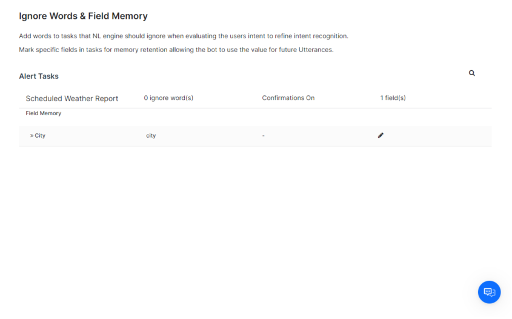

<Badge icon="arrow-left" color="gray">[Back to NLP Topics](/ai-for-service/automation/natural-language/nlp-topics)</Badge>

Ignore words help the NLP engine filter out words that don't contribute to task recognition, improving response speed and accuracy. Field Memory lets you persist entity values from one task and pre-populate them in a related task.

The Platform includes a built-in set of generic ignore words. You can extend this with task-specific words.

<Note>This feature is only available when an Alert, Action, or Information task is configured for the assistant. [Learn more](/ai-for-service/automation/intelligence/conversation-management#alert-tasks)</Note>

Go to **Conversation Intelligence > Conversation Management > Ignore Words & Field Memory**.

---

## Manage Ignore Words for a Task

1. Go to **Conversation Intelligence > Conversation Management > Ignore Words & Field Memory**.
2. Hover over the task name and click **Edit**. The **Edit Task** window opens.
3. Configure the following:
   - **Turn Off Confirmation Messages** — Select **Yes** to skip execution confirmation when using NLP. Select **No** to prompt the user before running the task.
   - **Ignore Words** — Enter words to exclude from task interpretation. For example, for a *7-Day Weather Forecast* task, you might add days of the week since all days are always included.
4. Click **Save**.

> **Example:** For the input *"I want to get the weather forecast for today"*, the NLP engine only needs to recognize *weather*, *forecast*, and *today*. Common words like *I*, *want*, and *get* are already handled by the built-in ignore words list.

---

## Manage Field Memory for a Task

Field Memory persists entity values from a completed task so they can be pre-populated in a related task.

> **Example:** In a travel assistant, *Get Wait Times for Boarding* can pre-populate fields in *Book a FastPass*.

1. Click the **Task Name** to expand its task fields.
2. Click the **Edit** icon next to a field to open the **Field Memory** window.
3. Configure the following:
   - **Entity Type** — Select the expected input type to improve NLP recognition. [Learn more](/ai-for-service/automation/dialogs/node-types/entity-node#entity-types)
   - **Memory User-Provided Value** — Choose one of:
     - **No, do not memorize** — Value is not persisted after the task completes.
     - **Yes, memorize this value** — Value is persisted for the specified duration (in minutes).
4. Click **Save**.
