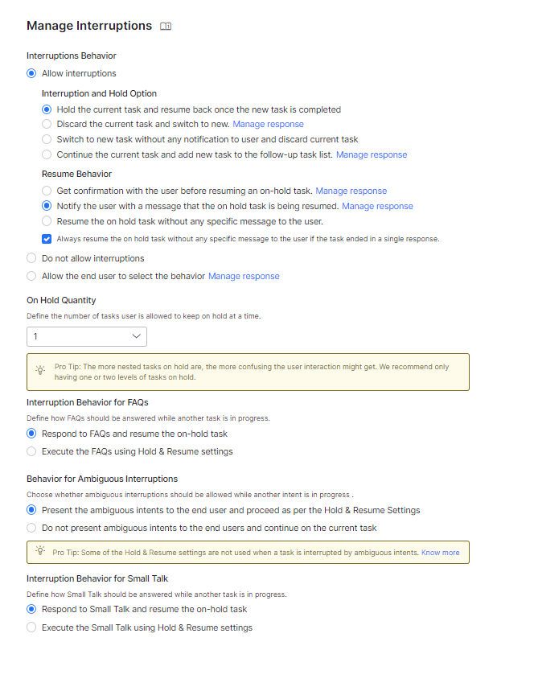
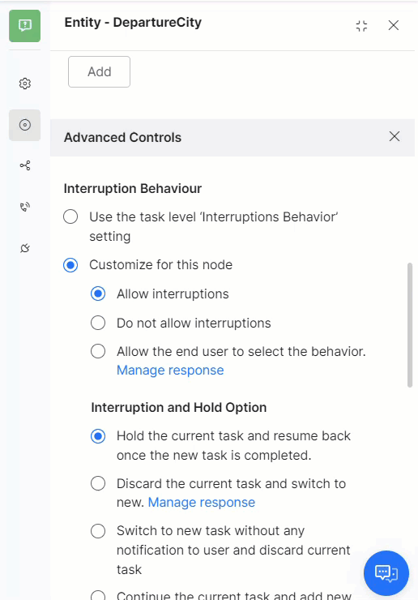
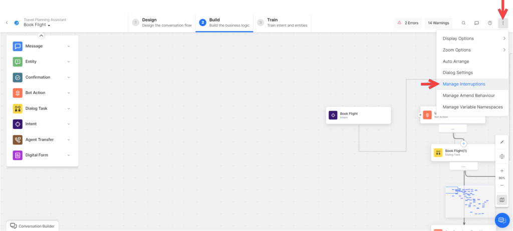
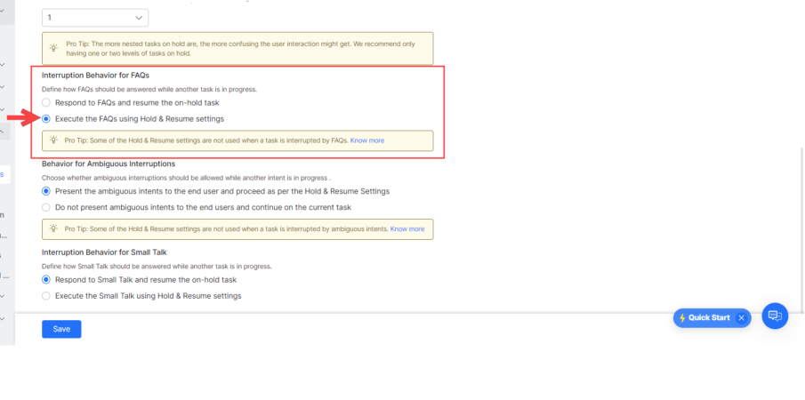
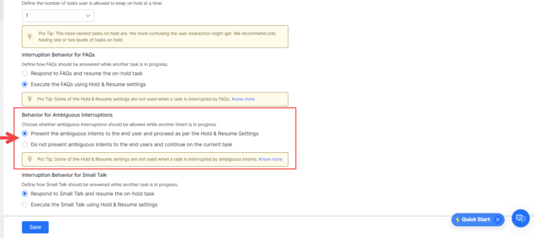
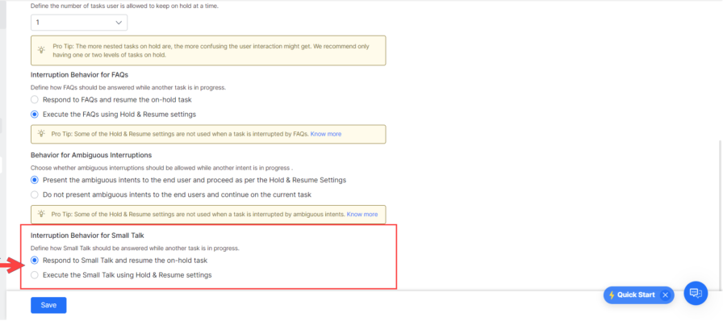

<Badge icon="arrow-left" color="gray">[Back to NLP Topics](/ai-for-service/automation/natural-language/nlp-topics)</Badge>

Users rarely follow a linear conversation path. They may ask an unrelated question mid-task, provide a new intent before finishing the current one, or switch topics entirely. The **Manage Interruptions** feature gives you granular control over how your AI Agent handles these situations.

You can configure interruption behavior at three levels, with the more specific level taking precedence.

---

## Interruptions Hierarchy

| Level | Precedence | Where to Configure |
|---|---|---|
| **Node** | Highest | Node **Instance** tab > **Advanced Controls** > **Interruptions Behavior** |
| **Dialog Task** | Middle | Dialog Builder > **more options** icon > **Manage Interruptions** |
| **App** | Lowest (default) | **Conversation Intelligence > Conversation Management > Manage Interruptions** |

> If no node or task-level settings exist, the app-level settings apply.

---

## App-Level Interruption Settings

Go to **Conversation Intelligence > Conversation Management > Manage Interruptions**.



<Note>When a user provides input after 15+ minutes of inactivity and the input is within the previous session context, it is treated as an interruption. If the user starts a new utterance, the old context is discarded.</Note>

### Allow Interruptions

| Option | Behavior |
|---|---|
| **Hold the current task and resume after the new task completes** | Switches to the new intent immediately. Requires a Resume Option (see below). |
| **Discard the current task and switch to new** | Discards the current task and switches. Sends the user a notification message. Customizable via **Manage Response**. |
| **Switch to new task without notification and discard current** | Silently discards the current task and switches. No user notification. |
| **Continue the current task and add new task to follow-up list** | Stays on the current task and adds the new intent to the `FollowupIntents` array. Customizable via **Manage Response**. |

### Do Not Allow Interruptions

Turns off interruptions at the app level. Can still be overridden at the task or node level.

### Allow the End User to Select the Behavior

Prompts the user to confirm whether to switch tasks. Customize the confirmation message via **Manage Response**. Requires a Resume Option.

---

## Resume Options

Resume options define what happens to the on-hold task after the interrupting task completes.

| Option | Behavior |
|---|---|
| **Get confirmation before resuming** | AI Agent asks the user (Yes/No) whether to resume the on-hold task. Customizable message. |
| **Notify the user and resume** | Resumes the on-hold task automatically and notifies the user. No confirmation required. Customizable message. |
| **Resume without any message** | Directly resumes the on-hold task with no notification to the user. |
| **Always resume without message if the task ended in a single response** | If the interrupting task completed in a single response, resumes the on-hold task silently regardless of other resume options. |

**Example (Get confirmation before resuming):**

```
User: Can you book me a flight for tomorrow?
AI Agent: From which city are you flying?
User: Los Angeles
AI Agent: Where to?
User: By the way, what's the weather forecast for tomorrow?
AI Agent: Please enter the city for the forecast.
User: Los Angeles
AI Agent: Weather Forecast for Los Angeles — March 15, 25°C, Mostly Sunny
AI Agent: Should I continue with the task 'Book Flight'?
User: Yes
AI Agent: Enter the name of the destination airport.
```

---

## On Hold Quantity

Set the maximum number of tasks that can be held at once. Default: **1**. Range: 1–N.

When the limit is reached, new tasks are ignored regardless of interruption settings.

<Note>Tasks resume in reverse chronological order (most recent first). Limit on-hold tasks to 1–2 to avoid confusion.</Note>

---

## Node-Level Customization

1. Open the dialog task and select the node.
2. Go to the **Instance** tab > **Advanced Controls**.
3. Under **Interruptions Behavior**, select **Customize for this node** and configure settings.



---

## Dialog-Level Customization

1. Open the dialog task.
2. Click the **more options** icon (top-right of Dialog Builder) > **Manage Interruptions**.
3. Under **Interruptions Behavior**, select **Customize for this task** and configure settings.



---

## Behavior for FAQs

| Option | Behavior |
|---|---|
| **Respond to FAQs and resume the on-hold task** (default) | AI Agent answers the FAQ and then resumes the on-hold task. |
| **Execute the FAQs using Hold & Resume Settings** | Treats FAQ intents like any other intent and applies configured Hold & Resume settings. |



---

## Behavior for Ambiguous Intents

| Option | Behavior |
|---|---|
| **Present ambiguous intents to the end-user and proceed as per Hold and Resume settings** | User selects a task; interruption settings are applied based on the selection. |
| **Do not present ambiguous intents and continue on the current task** (default) | AI Agent ignores ambiguous intents and continues the current task. |



---

## Behavior for Small Talk

| Option | Behavior |
|---|---|
| **Respond to Small Talk and resume the on-hold task** (default) | AI Agent responds to Small Talk by putting the current task on hold, then resumes it. |
| **Execute Small Talk using Hold & Resume settings** | Applies configured Hold & Resume settings to Small Talk. |



---

## Behavior for User Authorization

When a user provides unexpected input at an authorization prompt:

1. If **Small Talk** is detected: Small Talk response is shown, and the authorization prompt is repeated.
2. The Platform checks for any intents regardless of interruption settings:
   - **Single intent detected** — Asks the user to confirm discarding the current task and triggering the new one.
   - **Multiple intents detected** — Shows an ambiguity dialog with an option to ignore and continue the current task.
3. If **no intent** is found — User is re-prompted with the authorization link.
