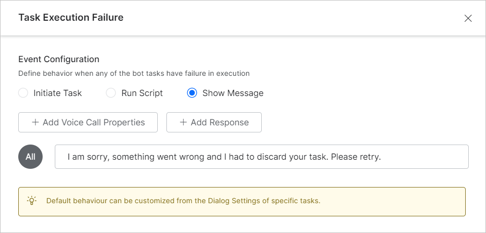
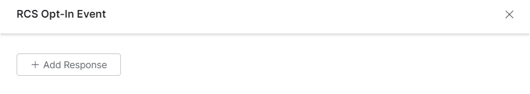
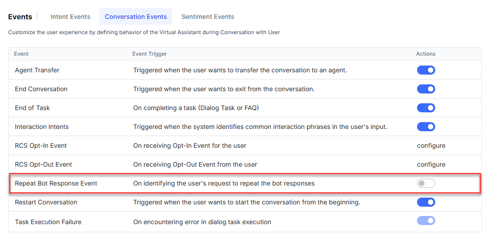
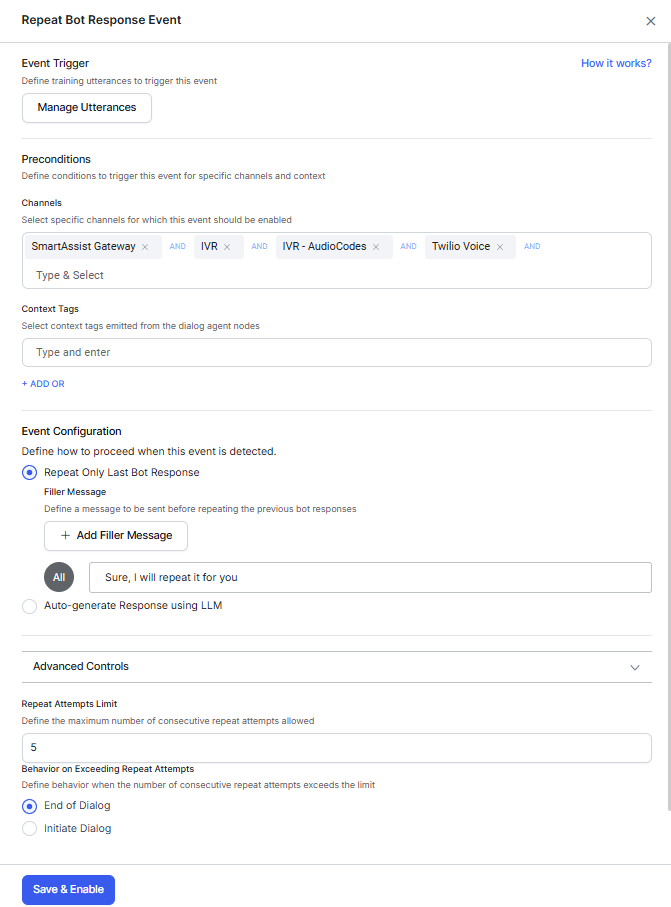
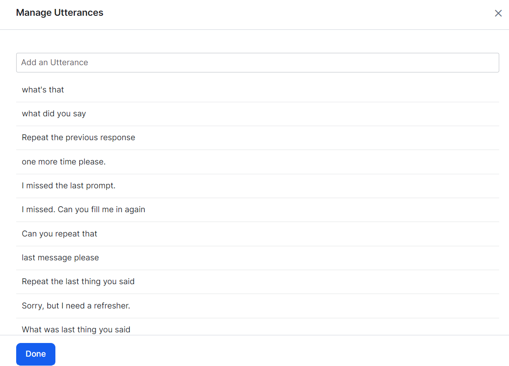
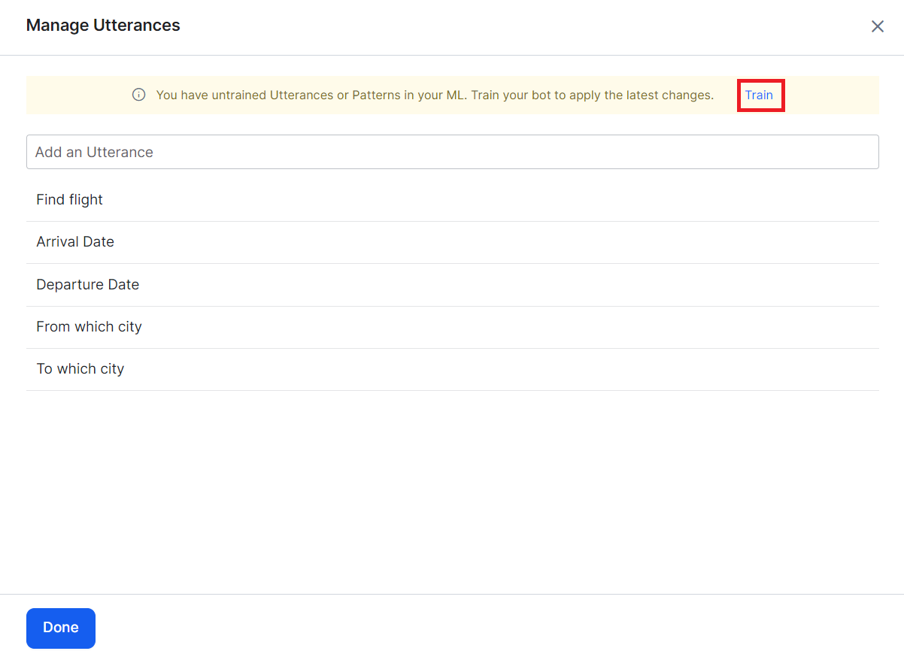
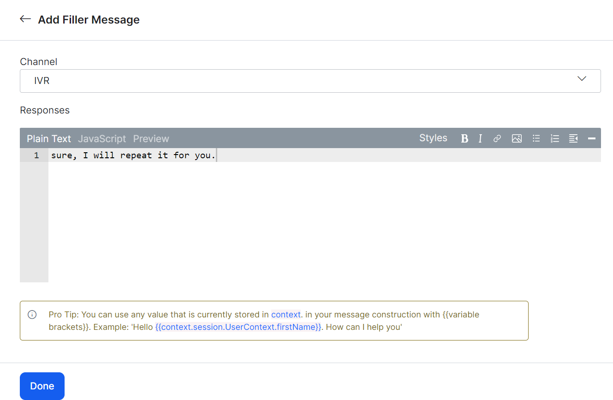
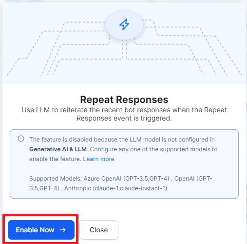
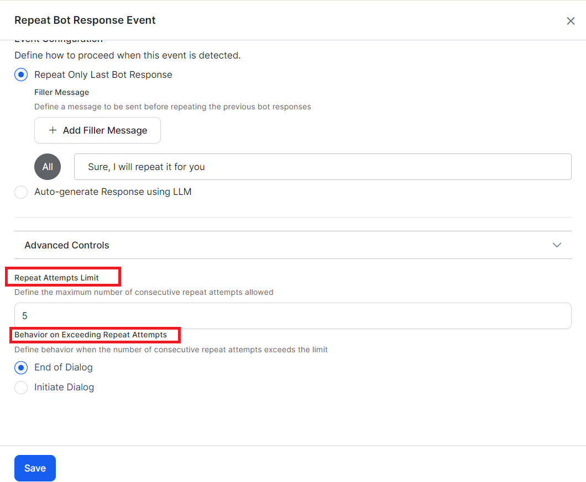

Conversation events define AI Agent behavior at key moments in a conversation lifecycle — such as task completion, failures, channel opt-in/out, and repeated responses.

---

## End of Task

Triggered when the AI Agent is no longer expected to send or receive messages. When fired, the context is updated with:
- The reason the task ended (see table below).
- The name of the completed task. For FAQs, the task name is set to `FAQ`.

Client-side implementations (BotKits, RTM, Webhook channels) can use the end-of-task reason flag to determine appropriate follow-up actions.

| Scenario | End of Task Flag |
|---|---|
| Reached the last node of the dialog | `Fulfilled` |
| Task canceled by the user | `Canceled` |
| Error in task or FAQ execution (no Task Failure Event, no hold tasks) | `Failed` |
| Linked dialog completed without returning to the parent dialog | `Fulfilled_LinkedDialog` |
| FAQ answered successfully | `Fulfilled` |
| Event executed via Run Script or Show Message (no tasks on hold) | `Fulfilled_Event` |
| Error in executing an event via Run Script or Show Message (no tasks on hold) | `Failed_Event` |
| User declines to resume an on-hold task (no other task on hold) | `Canceled` |

---

## Task Execution Failure

Triggered when an error occurs during dialog task execution, including:
- AI Agent execution errors
- Service call failures or unreachable servers
- Agent transfer node errors
- Knowledge Graph task failures
- Webhook node failures
- Unavailable sub-dialog
- Errors parsing the AI Agent message

**Defaults:** Always enabled with the **Show Message** action. Cannot be disabled.

This app-level behavior can be overridden per task from the dialog task settings. [Learn more](../../use-cases/dialogs/navigating-dialog-tasks.md#dialog-settings)

---

## RCS Opt-In / Opt-Out Events

Triggered when a user opts in to or opts out of the **RCS Messaging** channel. Configure a follow-up response to confirm the user's action.

---

## Repeat Bot Response Event

Triggered when specific utterances (predefined or custom-trained) are detected on voice channels — IVR, Audiocodes, Twilio Voice, and SmartAssist Gateway — requesting the AI Agent to repeat its last response.

<Note>The Repeat Bot Response event uses the NLU multilingual model for non-English languages.</Note>

### Priority Behavior

| Conflict Scenario | Behavior |
|---|---|
| Intent vs. Repeat event | Intent takes priority. |
| Sub-intent vs. Repeat event | Sub-intent takes priority. |
| FAQ vs. Repeat event | FAQ takes priority. |
| Group node sub-intent vs. Repeat event | Group node sub-intent takes priority. |
| Mid-conversation (no conflict) | Repeat event is triggered. |

### Use Case

**Scenario:** In a Flight Booking AI Agent, a user on IVR says: *"Sorry, I can't hear you. Can you please repeat it again?"* after the dialog has ended with a booking confirmation message.

**Result:** If the session is still active and the End of Task event has a follow-up message (e.g., *"Is there anything else I can help you with?"*), the Repeat Bot Response event repeats both the booking confirmation and the follow-up message together.

### Enable the Event

1. Go to **Conversation Intelligence > Events**.

   

2. Click **Repeat Bot Response Event** to configure it.

   

3. Click **Manage Utterance** to review or add pre-trained utterances.

   

4. Add more utterances as needed, then click **Train**.

   

5. After training, configure preconditions:
   - **Channels** — Add voice channels (IVR, IVR Audiocodes, Twilio Voice, SmartAssist Gateway).
   - **Context Tags** — Add context objects to scope the event to specific dialog tasks. [Learn more](../../intelligence/context-object.md)

6. Set the **Event Configuration**:
   - **Repeat Only Last Bot Response** (default) — Plays a filler message before repeating. Default filler: *"Sure, I will repeat it for you."*

     Click **+ Add Filler Message**, select the **IVR** channel, enter the filler text, and click **Done**.

     

   - **Auto-generate Response** — Uses the LLM and Generative AI model to generate the repeated response. Requires the Advanced NLU model to be enabled. Click **Enable Now** to activate.

     

     <Note>When Auto-generate is enabled, filler messages defined in step 6 are not used.</Note>

7. Expand **Advanced Settings** and configure:
   - **Repeat Attempts Limit** — Number of retry attempts (1-10, default: 5).
   - **Behavior on Exceeding Repeat Attempts** — Choose **End of Dialog** or **Initiate Dialog** (select which task to redirect to).

   

8. Click **Save & Enable**.
