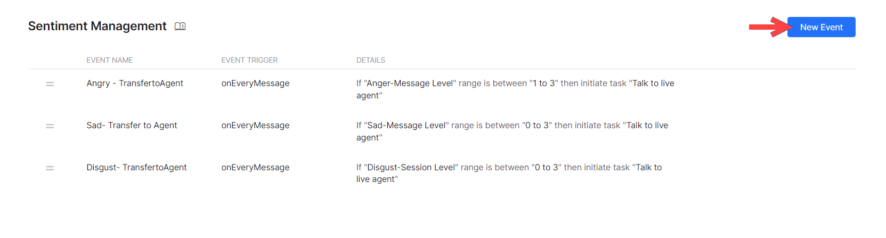
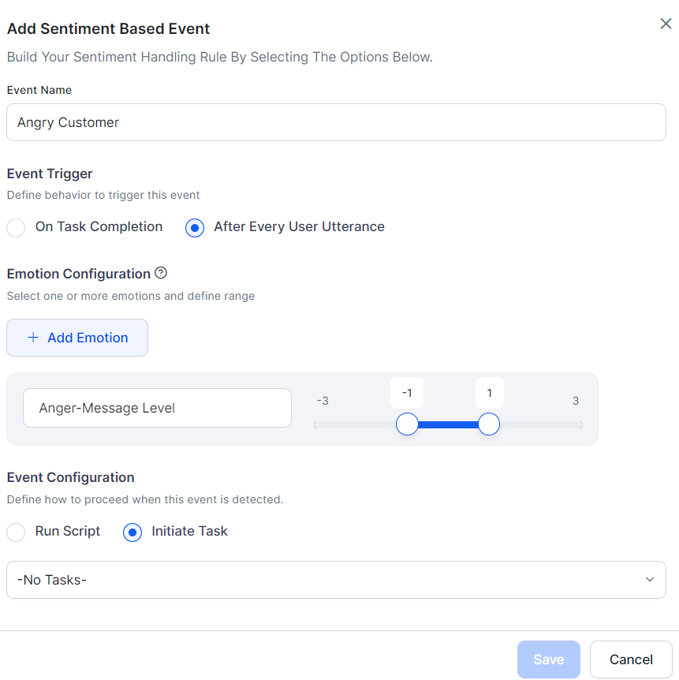

Sentiment Events let you detect a user's emotional state and trigger specific behaviors in response — such as transferring to a live agent when a user is angry or frustrated.

The NLP interpreter analyzes user utterances for tone and stores scores in the context object. You can use these scores to drive dialog flow through conditional transition statements.

<Note>This feature was introduced in v7.0 and is not supported in all languages. [Learn more](../../../app-settings/language-management/multi-lingual-bot-behavior.md)</Note>

---

## Configure a Sentiment Event

Go to **Conversation Intelligence > Events > Sentiment Events**. Click **+ New Event** to create an event.

| Parameter | Description |
|---|---|
| **Event Name** | A unique name for the sentiment event. |
| **Event Trigger** | When to check sentiment: **On Task Completion** or **After Every User Utterance**. |
| **Emotion Configurations** | Select one or more emotions to track: *anger*, *disgust*, *fear*, *sadness*, *joy*, *positive*. For each, choose **Session** or **Message** level and define a score range (-3 to +3). |

- **Session-level tone** — Aggregated across all messages in a conversation session.
- **Message-level tone** — Calculated for each individual user message.
- When **multiple emotions** are selected, all rules must be met for the event to trigger. To trigger on any one emotion, create separate events.

---

## Event Flow

Tone scores are updated with every user message, and sentiment events are continuously evaluated. When an event's conditions are met:

- **Initiate a Task** — The current task is discarded and the AI Agent switches to the configured dialog.
  - Other implicitly paused tasks are also discarded.
  - Tasks on hold via Hold and Resume settings are resumed per those settings.
  - If the dialog is unavailable, a standard response is shown (*Dialog task required for conversation is not available*). [Learn more](./standard-responses.md)
- **Run a Script** — The Platform executes the script and continues task execution. Script errors display a standard response (*Error in continuing the conversation due to incorrect bot definition*). [Learn more](./standard-responses.md)

**Priority rules:**
- Sentiment events take precedence over direct intent invocation.
- When multiple sentiment events match simultaneously, the one with the **highest precedence** (defined order) wins.

### Behavior When Running a Script

| Scenario | Behavior |
|---|---|
| Small Talk detected | Sentiment executes first, then small talk. |
| Dialog detected | Sentiment executes first, then dialog. |
| Fallback flow | Sentiment executes first, then fallback logic. |
| Entity Node | Sentiment executes first, then error prompt is shown. |
| Confirmation Node | Sentiment executes first, then confirmation prompt. |
| On-Intent Message Node | Sentiment executes first, then moves to the else condition. |

### Behavior When Initiating a Task

| Scenario | Behavior |
|---|---|
| Small Talk detected | Sentiment executes first, then small talk. |
| Dialog detected | Sentiment executes first, then the configured dialog runs to completion. |
| Fallback flow | Sentiment executes first, then configured dialog runs. |
| Entity Node | Sentiment executes first, then the connected dialog runs, ending both dialogs. |
| Confirmation Node | Sentiment executes first, then connected dialog runs, ending both dialogs. |
| On-Intent Message Node | Sentiment executes first, then connected dialog runs, ending both dialogs. |

---

## Reset Tone

Sentiment values (tone scores) are reset at two points:

1. **Start of every user conversation session** (default behavior).
2. **After a sentiment event is triggered:**
   - If a **script** ran: values reset after successful script execution.
   - If a **dialog task** was triggered: values are transferred to the new dialog's context and reset in the original global context.
