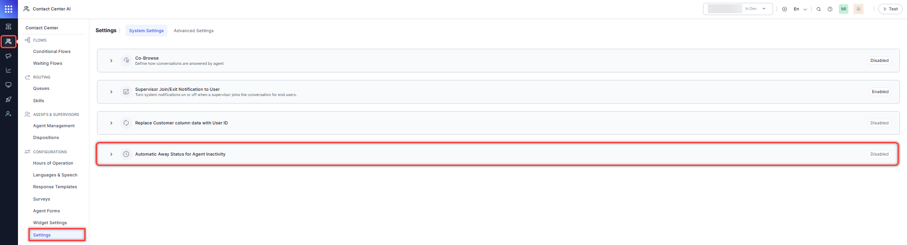

# Automatic Away Status for Agent Inactivity

## Overview

This feature adds a configurable option to automatically set an agent’s status to `Away` when the configured `Agent Inactivity Wait Time` is breached after a conversation becomes overdue. This prevents inactive agents from receiving new interactions and ensures accurate routing.

## Functionality

When enabled, the system will:

* Automatically set the agent’s status to `Away` if the `Agent Inactivity Wait Time` is breached after a conversation becomes overdue.
* Prevent the agent from receiving new interactions.
* Display the updated `Away` status in the Supervisor dashboard.
* Apply existing routing rules for agents with `Away` status.

When disabled, the system will maintain current behavior, leaving the agent’s status unchanged when the inactivity timer is breached.

## Configuration

1. Go to Contact Center AI > Settings > System Settings > Automatic Away Status for Agent Inactivity.  
    

2. Turn on the toggle to enable Automatic Away Status for Agent Inactivity.  
    