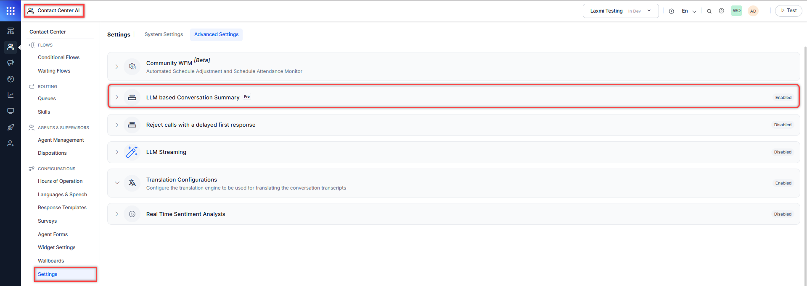
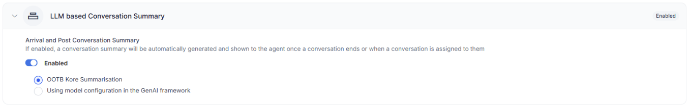

# LLM Based Conversation Summary

## Overview

Contact center administrators can integrate external Gen AI models to enhance conversation summarization capabilities. This feature enables you to:

* Use custom models for conversation summarization
* Support additional languages not natively available in Contact Center AI (CCAI)
* Create customized summarization prompts

## Prerequisites

Before configuring external Gen AI models, ensure you have:

* Access to AI for Service (XO Platform)
* Administrative privileges
* Gen AI connector provided by the platform team
* A configured external Gen AI model

## Enabling Gen AI-Based Summarization

1. Go to **Contact Center AI** > **CONFIGURATIONS** > **Settings** > **Advanced settings** > **LLM based Conversation Summary**.  
    

2. Turn on the LLM based Conversation Summary toggle.
3. Select your preferred summarization method:
    * OOTB (Out-of-the-box) Kore Summarization (Default)
    * Using the model configured in the GenAI framework  

        

    !!! Note

        The GenAI framework option remains disabled until you configure a valid model.

## Configuring a Custom Model

To set up a custom summarization model:

1. Access the GenAI & LLM on AI for Service .
2. Configure your external Gen AI model. [Learn more](../../../generative-ai-tools/introduction.md).
3. Define custom prompts for your specific summarization needs.

    !!! Note

        If you try to use the GenAI framework without a configured model, you'll receive the message: "A custom model and an appropriate prompt need to be built from inside the Gen AI tools."

## How Summarization Works

Once configured, the summarization process:

1. Captures the conversation transcript.
2. Sends the transcript to your configured Gen AI model.
3. Applies your custom prompt.
4. Displays the summarized conversation to your agents.

## Benefits

Contact Center Administrators can:

* Configure external models and custom prompts.
* Monitor summarization across additional languages.
* Extend language support beyond native capabilities.

Agents gain:

* Enhanced summarization flexibility.
* Broader language support.
* Customized summary outputs based on defined prompts.