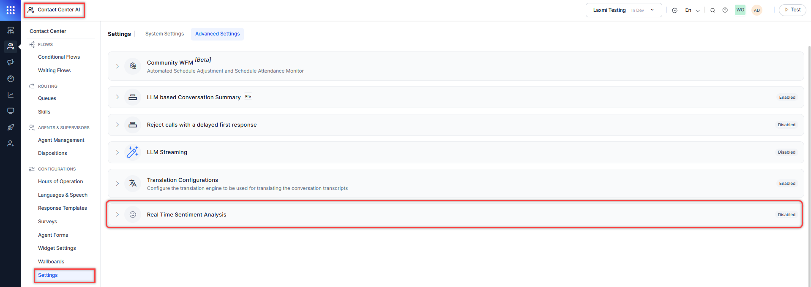

# Real Time Sentiment Analysis

The **Real-Time Sentiment Analysis** feature enables agents to monitor customer sentiment dynamically during active chat conversations. When enabled, this feature displays a sentiment indicator that updates in real-time based on ongoing conversation analysis.

!!! Note

    * Sentiment data appears only for interactions after deployment of release v3.13.0, provided the Real Time Sentiment Analysis setting is enabled.
    * Sentiment capture is unavailable for messages sent during any configuration disruption.

Steps to enable Real Time Sentiment Analysis:

1. Go to **Contact Center AI** > **CONFIGURATIONS** > **Settings** > **Advanced Settings** > **Real Time sentiment Analysis**.  
    

2. Turn on the toggle to enable Real Time Sentiment Analysis. This feature is disabled by default.

    **_To use this feature, you must configure a custom model and enable the appropriate prompt in GenAI Tools_**. [Learn more](../../../generative-ai-tools/models-library.md).  

    

## Benefits of Real-Time Sentiment Analysis

* Provides real-time visibility into customer sentiment during conversations.
* Enables agents to respond with greater empathy and emotional awareness.
* Enhances issue resolution by helping agents tailor responses based on sentiment changes.
* Improves customer experience through timely and appropriate agent interventions.
* Offers interactive visual analysis of emotional trends over time.
* Allows agents to customize views for targeted sentiment review.

### Related Links

* [Customer Sentiment](../../../console/conversation-tray.md#customer-sentiment)
* [Real Time Sentiment Capture](../../../console/interacting-with-customers.md#real-time-sentiment-capture)