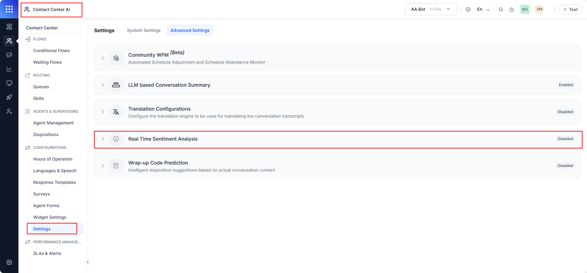
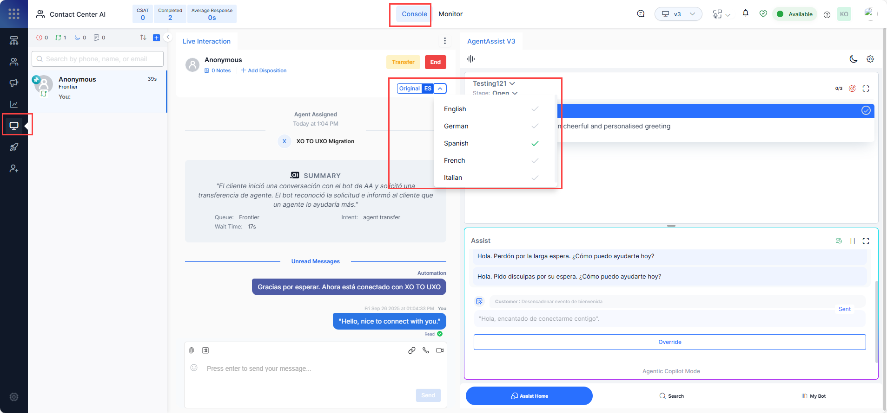
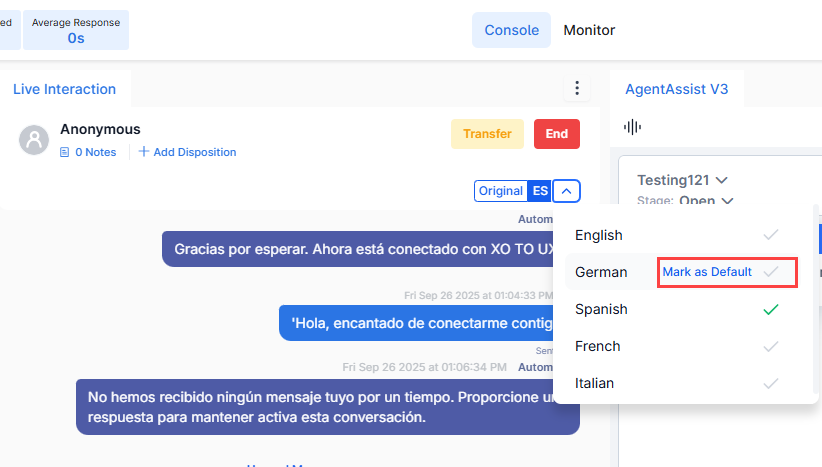
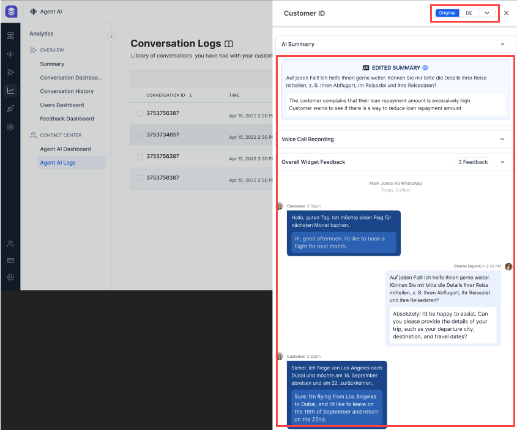

# Translation Configurations

The **Translation Configuration** feature leverages CCAI’s real-time translation to help agents engage with customers in their preferred language, improving comprehension, accuracy, and global collaboration. [Learn more](../../../console/additional-tools.md#translate-internal-chats){:target="_blank"}.

Steps to configure translation:

1. Go to **Contact Center AI** > **CONFIGURATIONS** > **Settings** > **Advanced Settings** > **Translation Configurations**.  
    

2. Enable translations by turning on the toggle (if disabled). Administrators can then select one of the following options:

    * Google Translator  
    * Microsoft Translator  
    * Custom  

    If **Google** or **Microsoft Translator** is selected, enter the **access key**. If **Custom** is selected, click the dropdown list, and select **Add Custom Engine** to configure the endpoint.  
      

    The Configure Translation Engine pop-up appears. Refer to [Manage Translation Services](../../../app-settings/language-management/managing-translation-services.md){:target="_blank"} for steps to configure the translation engine.  
     

3. Click **Save**. Translation is enabled in the dashboard interactions.  
    

    !!! note

        Template messages are not translated in the conversation transcripts. 

## Runtime / Real-time Translation

At runtime, this configuration translates agent content—including search responses, Dialog Tasks, text-only templates, and conversation transcripts—into the selected language from the list. Agents can switch languages in the CCAI console, which updates the widget content and overrides other language settings. In Conversation Logs, this feature adds options such as a language dropdown list and a dual view of original and translated text.

### Language Selection on the CCAI Console

1. Go to **Contact Center AI** > **Console**, and select a language from the **language** dropdown list.  
      

2. Select **Mark as Default** for a language to set it as the default. The translation function continues to use this language unless you select another language.  
      

3. The chat messages in the console and the text-only content in the **Assist**, **Search**, and **My Bot** tabs get translated into the selected language.  
    

!!! note "Preferred Language Setting"

    During automation, the system can detect the user’s language and set it as the preferred translation language. To implement this behavior, refer to [Utils](../../../flows/node-types/utils.md#set-preferred-language-for-translation).

### Conversation Logs Language

The Conversation Logs section also provides a language dropdown list. You can view content in the original language, translated language, or both side by side. You can also translate the content in another available language, if **Agent AI Conversation Logs** is enabled in the **Contact Center AI** > **CONFIGURATIONS** > **Settings** > **Advanced Settings** > **Translation Configurations** section.

1. Go to **Contact Center AI** > **Analytics** > **Agent AI Logs**.
2. Click a **Conversation ID**.
3. Click **Original** to view content in both the original and translated languages.  
      

4. Click the **abbreviated language name** to view content only in the translated language.  
      

5. Select any other language from the dropdown list to translate the content into that language.