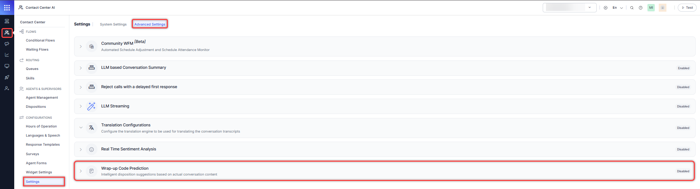

# Wrap-up Code Prediction

This feature introduces GenAI-based disposition prediction to assist agents during conversation wrap-up. By leveraging LLM (Large Language Model) capabilities through the [GenAI tools](../../../generative-ai-tools/genai-features.md#contact-center-ai-genai-features), the system automatically suggests disposition codes based on conversation transcripts and predefined disposition metadata. This reduces manual effort, improves tagging consistency, and enhances reporting accuracy.

Administrators can access Wrap-up Code Prediction by navigating to Contact Center AI > Configurations > Settings > Advanced Settings > Wrap-up Code Prediction.  

Enable the toggle to activate Wrap-up Code Prediction.  

This generates intelligent disposition suggestions based on the actual content of the conversation.

### Related Link

* [Intelligent Disposition Code Suggestions](../../../console/interacting-with-customers.md#intelligent-disposition-code-suggestions)